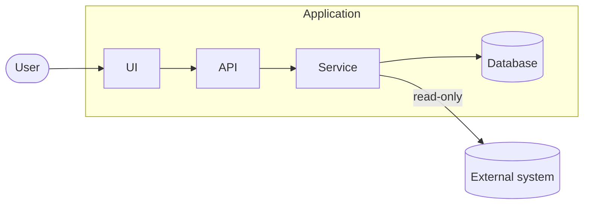
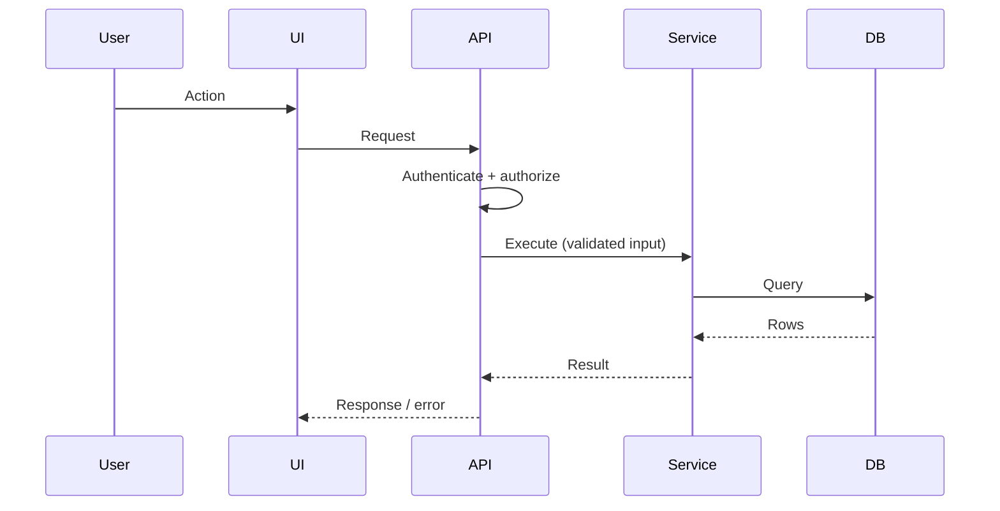
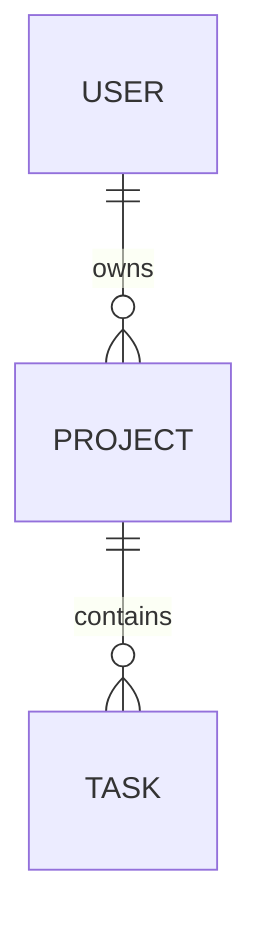
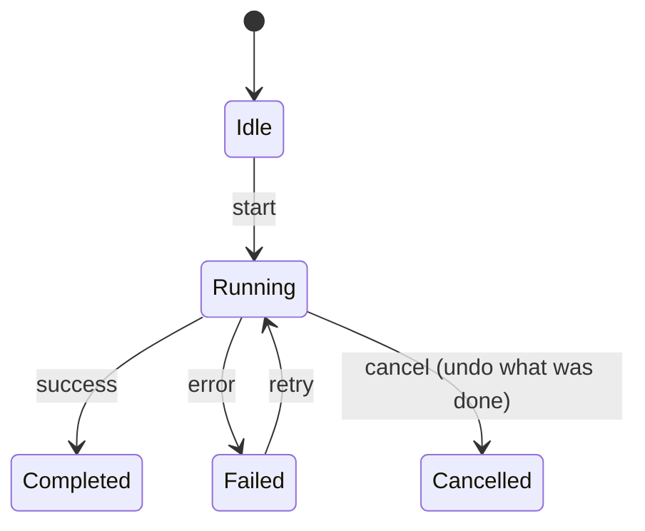

# Mermaid diagrams

Use Mermaid where a picture genuinely improves understanding. It lives with the code: versioned, reviewable in
diffs, editable as text, and rendered by GitHub, GitLab, Azure DevOps and most doc tools.

## When to draw

| Purpose | Diagram type |
|---|---|
| System architecture, components, module dependencies, deployment, integrations | `flowchart` (LR or TD), with `subgraph` for boundaries |
| A request, authentication or authorization flow over time | `sequenceDiagram` |
| Lifecycles and state transitions (jobs, orders, operations) | `stateDiagram-v2` |
| Database tables and relationships | `erDiagram` |
| Class or type relationships (only when the structure matters) | `classDiagram` |
| Release timelines or plans | `gantt` / `timeline` (rarely needed) |

Don't draw what a sentence explains as well. Don't use a diagram instead of the written explanation - use both.

## Rules

- **One purpose per diagram.** Split a big system into focused diagrams (context, then one per subsystem or flow)
  instead of one enormous graph. Aim for roughly 5-15 nodes.
- **Real names only**: use the project's actual component, class, table and route names and its terminology. Never
  invent nodes.
- **Surround it with text**: a sentence before saying what it shows and why it matters, and after it the important
  boundaries, rules or exceptions.
- **Keep it in sync**: when architecture or data flow changes, update or delete the diagram in the same change. A
  wrong diagram is worse than none.
- **Show boundaries** that matter: process/network boundaries, trust boundaries (where authorization happens),
  application-owned vs external systems, read-only vs read/write (label the edges).
- Keep labels short; put detail in the text. Quote labels with special characters: `A["web.config (SiteSqlServer)"]`.
- Check it renders (GitHub preview, mermaid.live) before finishing.

## Templates

Component overview with a boundary and an external system:

Request flow showing where validation and authorization happen:

Data model:

Lifecycle:

