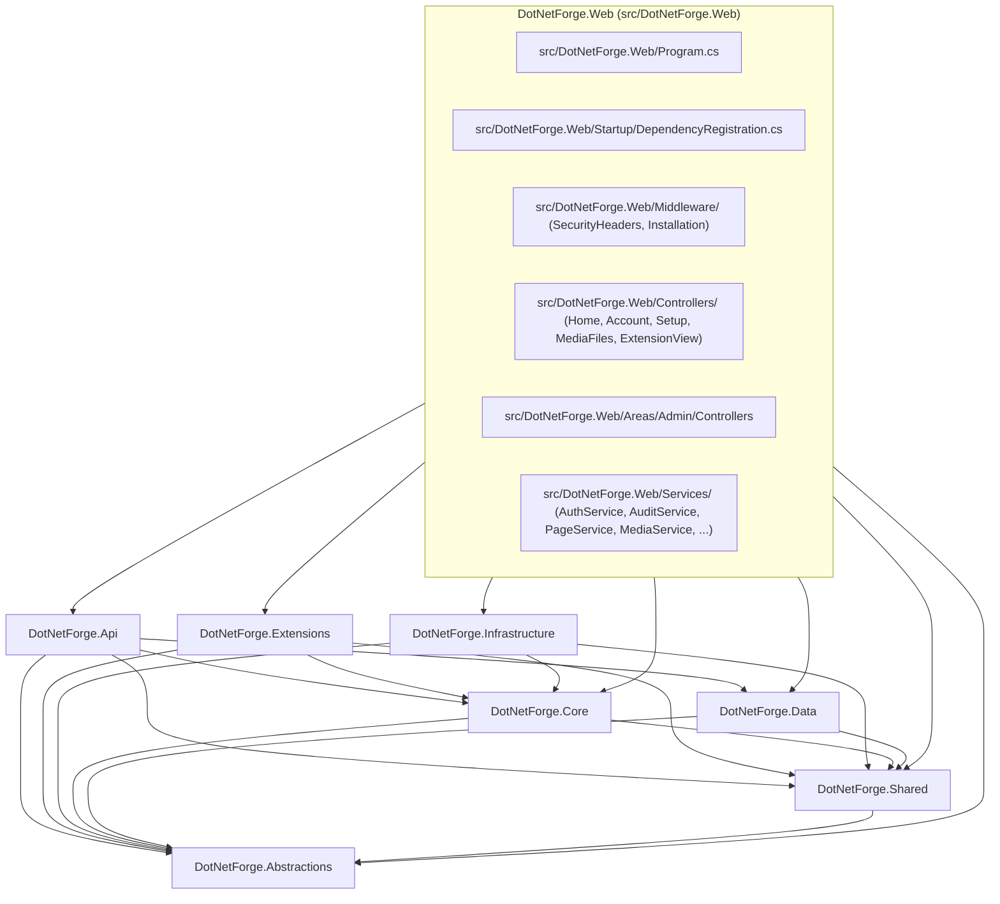
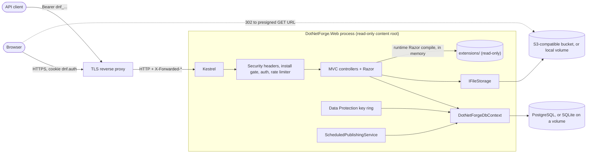

# Codebase architecture

The authoritative technical map of DotNetForge CMS: what each project and folder is for, how the layers talk, and
where a change belongs. Every name below matches the code. For request-level flows see
[data-flow.md](data-flow.md); for the UI layer see [pages.md](pages.md); for references and packages see
[dependencies.md](dependencies.md); for tables see [database.md](database.md); for running it in production see the
[deployment guide](../guides/deployment.md).

## What the application is responsible for

DotNetForge CMS is a server-rendered ASP.NET Core MVC content-management system on .NET 10. In its current state it:

- gates the whole site behind a one-time **setup wizard** that creates the first Super Admin
  ([installation](../features/installation.md));
- serves an **admin area** at `/admin` (cookie sign-in, role-gated) to manage a **page tree**, upload and delete
  **media**, view users, roles, audit entries and extensions, edit key/value settings and issue **API tokens**;
- serves a **public site** that resolves any URL to a *live* content page by walking the page tree
  ([content pages and routing](../features/content-pages-and-routing.md)), and serves media files at
  `/media/{id}/{fileName}` ([media storage](../features/media-storage.md));
- exposes a token-secured, rate-limited **headless API** under `/api` ([headless API](../features/headless-api.md));
- discovers and validates **extensions** on disk and renders **admin extensions** as admin tabs
  ([extensions](../features/extensions.md));
- runs one background job that finalizes **publish schedules** ([scheduled publishing](../features/scheduled-publishing.md));
- runs from a **read-only deployment directory**: database rows, uploaded files and the Data Protection key ring all
  live outside it ([deployment](../guides/deployment.md#read-only-deployment-requirements)).

Much of the target product ([product overview](../product.md): webhook delivery, email, i18n, tenant resolution,
themes, page builder) has data models or contracts in place but no behaviour. Each feature document lists its target
behaviour under **Planned (not implemented)**; the gap is tracked in
[implementation-status.md](../implementation-status.md). The target architecture is in
[Planned](#planned-not-implemented) below.

## Technologies

| Concern | Technology | Where |
| --- | --- | --- |
| Runtime | .NET 10 (`net10.0`), SDK pinned to `10.0.100` with `rollForward: latestFeature` | `Directory.Build.props`, `global.json` |
| Web framework | ASP.NET Core MVC: controllers + Razor views, one MVC **Area** (`Admin`), view components, tag helpers | `src/DotNetForge.Web` |
| Runtime view compilation | `Microsoft.AspNetCore.Mvc.Razor.RuntimeCompilation` (always on) - compiles extension views from `extensions/` **in memory** | `DependencyRegistration` |
| ORM | EF Core 10 with SQLite (default) or Npgsql/PostgreSQL; one migration set per provider | `src/DotNetForge.Data` |
| Auth | ASP.NET Core cookie authentication + a custom `ApiToken` bearer scheme; Data Protection key ring persisted to the database | `DependencyRegistration`, `ApiTokenAuthenticationHandler` |
| File storage | `IFileStorage`: local directory or any S3-compatible service (`AWSSDK.S3`) | `src/DotNetForge.Infrastructure/Storage` |
| Request hardening | `SecurityHeadersMiddleware` (CSP and friends), built-in rate limiter (`AddRateLimiter`) | `src/DotNetForge.Web/Middleware/`, `DependencyRegistration` |
| Crypto | BCL only: PBKDF2-SHA256 (`Rfc2898DeriveBytes.Pbkdf2`), HMAC-SHA256, SHA-256, `RandomNumberGenerator` | `src/DotNetForge.Infrastructure/Security`, `ApiTokenAuthenticationHandler` |
| Configuration | In-house `.env` parser + environment variables, typed as `AppEnvironment` | `src/DotNetForge.Infrastructure/Configuration` |
| Frontend | Hand-written CSS (`src/DotNetForge.Web/wwwroot/css`) and two vanilla JS files (`site.js` on every admin screen, `admin-content.js` on the Content Manager). No inline script or style. No bundler, no Node build. | `src/DotNetForge.Web/wwwroot/` |
| Container | `docker/Dockerfile` (`sdk:10.0` build → `aspnet:10.0`, non-root `$APP_UID`, port 8080); `docker/compose.dev.yml` for local PostgreSQL + S3 | `docker/` |
| Tests | xUnit 2.9, `Microsoft.AspNetCore.Mvc.Testing` (`WebApplicationFactory<Program>`) | `tests/` |
| CI | GitHub Actions: build + tests on Ubuntu/Windows/macOS, `dotnet format` check, PostgreSQL + S3 job, read-only container job; Dependabot | `.github/` |

## Solution shape at a glance



Arrows are `ProjectReference`s. `Core` and `Data` are deliberate siblings: neither references the other. When domain
logic needs persistence, the contract goes in `Shared` and `Data` implements it (the `IInstallationStore` pattern).
When the API needs a web-host service, the contract also goes in `Shared` and the host implements it
(`IPageService`, `IAuditService`): `Api` resolves them from DI without referencing the host. `Api` → `Data` is a
documented shortcut: API controllers query `DotNetForgeDbContext` directly.

## Application entry points

| Entry point | What starts there |
| --- | --- |
| `src/DotNetForge.Web/Program.cs` | The only process entry point. Loads `.env` with `EnvConfigurationLoader.Load(ContentRootPath, IsDevelopment())`, registers services (`AddDotNetForge(env, builder.Environment)`), migrates + seeds the database, builds the middleware pipeline, maps routes, runs Kestrel. Exits with code `1` on a `ConfigurationException`. |
| `public partial class Program` (end of `Program.cs`) | Exposed so `WebApplicationFactory<Program>` can host the app in integration tests. |
| `src/DotNetForge.Web/Services/ScheduledPublishingService` | `BackgroundService` started by the host; the only background process. |
| `src/DotNetForge.Data/DesignTimeDbContextFactory.cs` | `DesignTimeDbContextFactory` (SQLite) and `PostgreSqlDesignTimeDbContextFactory` - entry points for `dotnet ef` design-time tooling (do not boot the web host or connect). |
| `docker/Dockerfile` | `ENTRYPOINT ["dotnet", "DotNetForge.Web.dll"]` with `ASPNETCORE_ENVIRONMENT=Production`, `ASPNETCORE_HTTP_PORTS=8080`. |

Startup order is detailed in [data-flow.md → Application startup](data-flow.md#application-startup).

## Project structure

```text
DotNetForge/                         repository root
├── DotNetForge.slnx                 solution: every project below (dotnet build / dotnet test)
├── src/
│   ├── DotNetForge.Web/             web host (ASP.NET Core MVC) = content root when running
│   │   ├── DotNetForge.Web.csproj   links ../../extensions/** into the publish output
│   │   ├── Program.cs               composition + pipeline + route map
│   │   ├── Startup/
│   │   │   └── DependencyRegistration.cs  every DI registration, auth schemes, session validation, policies, rate limits
│   │   ├── Middleware/
│   │   │   ├── SecurityHeadersMiddleware.cs  CSP, nosniff, X-Frame-Options, Referrer-Policy, Permissions-Policy
│   │   │   └── InstallationMiddleware.cs     redirects to /setup until installed; blocks /setup after
│   │   ├── Services/                web-host application services (need HttpContext or the DbContext)
│   │   ├── Controllers/             non-area controllers: public site, media files, account, setup, extension renderer
│   │   ├── Areas/Admin/
│   │   │   ├── Controllers/         one controller per admin screen (+ AdminControllerBase)
│   │   │   ├── Components/          view components (sidebar extension tabs)
│   │   │   ├── Models/AdminViewModels.cs  every admin view model
│   │   │   └── Views/               admin Razor views, _AdminLayout, _Sidebar
│   │   ├── Views/                   public, auth and setup Razor views + _Layout/_AuthLayout
│   │   ├── wwwroot/                 static CSS/JS served by UseStaticFiles
│   │   ├── Properties/launchSettings.json  http / https profiles
│   │   └── appsettings*.json        logging levels and AllowedHosts
│   ├── DotNetForge.Abstractions/    contracts only (no implementation, no dependencies)
│   ├── DotNetForge.Shared/          entities, enums, constants, DTOs, results, manifest model, store/service contracts
│   ├── DotNetForge.Core/            pure domain logic: installation, permission evaluation, validators
│   ├── DotNetForge.Data/            EF Core contexts (SQLite + PostgreSQL), two migration sets, seeding, stores
│   ├── DotNetForge.Infrastructure/  hashing, tokens, signing, .env loading, AppPaths, file storage (local, S3)
│   ├── DotNetForge.Extensions/      manifest validation + cached on-disk discovery
│   └── DotNetForge.Api/             headless API controllers, token auth handler, permission filter
├── tests/
│   ├── DotNetForge.Tests/           unit tests (no host, no real DB; live S3 tests opt-in)
│   └── DotNetForge.IntegrationTests/ real host over a throwaway SQLite file (or PostgreSQL via DNF_TEST_POSTGRES)
├── extensions/<type>/<name>/        user extensions, one folder per manifest; copied to the publish output
├── docker/
│   ├── Dockerfile                   production image (read-only root filesystem capable); build context = repository root
│   ├── Dockerfile.dockerignore      keeps the build context to what `dotnet publish` needs
│   └── compose.dev.yml              development only: postgres:17-alpine (5432) + SeaweedFS S3 (8333, bucket dotnetforge)
├── .docs/                           this documentation (current behaviour + planned sections)
├── .github/                         CI workflow, Dependabot, AI-agent quick references (agents/)
├── .claude/skills/                  project skills for Claude Code
├── .vscode/                         build/run/test/migration tasks and F5 launch config
├── Directory.Build.props            net10.0, nullable, implicit usings, central package management
├── Directory.Packages.props         every NuGet version
├── global.json                      SDK pin
└── .env.example                     configuration template (copy to .env)
```

`storage/` is **not in the repository** (`.gitignore` ignores `storage/`). It appears only in Development, as the
default location of the SQLite database and local media - see [`storage/`](#storage-development-only).

### Folder responsibilities

#### `src/DotNetForge.Web/` (the web host)

The composition root and everything that needs `HttpContext`: controllers, views, middleware, web-host services,
static files. It is the **content root** when the app runs, from a checkout or published. Repository-level folders
(`.env`, `extensions/`, the Development `storage/`) are located by `AppPaths`
(`src/DotNetForge.Infrastructure/Configuration/AppPaths.cs`): next to the app first, then the repository root (the
folder containing `DotNetForge.slnx`) - see [where the app finds its files](../guides/development.md#where-the-app-finds-its-files).
The csproj adds `../../extensions/**` as `None` items with `CopyToPublishDirectory="PreserveNewest"`, so published
output carries the extensions as plain files (the Razor SDK does not precompile them).

#### `src/DotNetForge.Web/Startup/`

- **Belongs here:** service registration (`AddDotNetForge(env, hostEnv)`), persistence and storage provider
  selection, Data Protection, authentication schemes and cookie session validation (`ValidateSessionAsync`),
  authorization policies, rate-limit policies (`AddRateLimits`), antiforgery options, MVC/Razor configuration.
- **Does not belong:** request-time logic, configuration parsing (that is `EnvConfigurationLoader`).
- **Depends on:** every project. **Used by:** `Program.cs`; controllers reference
  `DependencyRegistration.AdminAreaPolicy`.

#### `src/DotNetForge.Web/Middleware/`

- **Belongs here:** cross-cutting request gates that run for every request.
- `SecurityHeadersMiddleware` runs right after the exception handler/HSTS (outside Development) and before
  `UseStaticFiles`, so every response - static files and re-executed error pages included - carries the headers.
  The CSP is enforced outside Development and `Content-Security-Policy-Report-Only` in Development
  ([security](../features/security.md)).
- `InstallationMiddleware` ([installation](../features/installation.md)) runs after `UseRouting` and before
  `UseAuthentication`, so an uninstalled CMS redirects even API calls to `/setup`.

#### `src/DotNetForge.Web/Services/` (web host)

Application services that need `HttpContext`, the cookie scheme or the DbContext, so they cannot live in `Core`.

| Class | Registered as | Lifetime | Responsibility | Used by |
| --- | --- | --- | --- | --- |
| `AuthService` | self | scoped | Email/password validation with lockout; builds the cookie `ClaimsPrincipal` (roles + `dnf:tenant`); `GetDefaultTenantIdAsync` (oldest tenant); `IsActiveAsync` (user exists and is `Enabled`). Defines `SignInStatus`, `SignInResult`, `TenantClaimType`. | `AccountController`, `SetupController`, `DependencyRegistration.ValidateSessionAsync` |
| `AuditService` | `IAuditService` | scoped | Appends an `AuditLogEntry` with the acting user (or `API token {id}` with `UserId = null`), tenant, IP and user agent; truncates snapshots to the column lengths. | `AccountController`, `SetupController`, `ContentController`, `SettingsController`, `ApiTokensController`, `MediaService`, `ContentApiController` |
| `PageService` | `IPageService` | scoped | Every content-page rule: `ApplyAsync`, `ReorderAsync`, `DeleteAsync` (validate and mutate, **never save**); static `Slugify`, `ToUtc`, `IsDynamic`. | `ContentController`, `ContentApiController` |
| `MediaService` | self | scoped | Upload rules (`AllowedTypes`, `MaxUploadBytes` 25 MB, `MaxFilesPerUpload` 10), generated storage keys, `MediaFile` rows, delete, audit; static `IsInline`, `UrlFor`. | `MediaController`; statics also by `MediaFilesController` and `Media/Index.cshtml` |
| `InstallationStatusCache` | self | singleton | Caches the one-way "installed" flag so the middleware stops querying the DB after install. | `InstallationMiddleware`, `SetupController`, integration tests |
| `ScheduledPublishingService` | hosted | singleton | Every 15 s finalizes due publish/unpublish schedules. | host |

- **Belongs here:** logic shared by several admin/public controllers that touches EF, storage or HTTP.
- **Does not belong:** pure rules with no I/O (put them in `Core/Validation` or similar), contracts for extensions
  (`Abstractions`).
- When the headless API needs a service, put its contract in `Shared`
  (`src/DotNetForge.Shared/Content/IPageService.cs`, `src/DotNetForge.Shared/Auditing/IAuditService.cs`) and
  register the host class against it. Inject the interface, never the
  concrete class.

#### `src/DotNetForge.Web/Controllers/` (non-area)

| Controller | Routes | Purpose |
| --- | --- | --- |
| `HomeController` | `GET /`, fallback `{*path:nonfile}` → `RenderPage`, `/error` (any HTTP method) | Public site and the error screen |
| `MediaFilesController` | `GET /media/{id:guid}/{fileName?}` | Media downloads: redirect to a presigned URL (S3) or stream (local). Private files only for admin-capable users of the file's tenant, else 404. |
| `AccountController` | `/account/login` (GET/POST, POST rate-limited), `/account/logout` (POST), `/account/denied` | Cookie sign-in/out |
| `SetupController` | `/setup` (GET/POST, POST rate-limited) | Setup wizard; writes `cms.installed` |
| `ExtensionViewController` | `/admin/ext/{id}/raw`, `/admin/ext/{id}/resources/{**path}` | Renders an admin extension's own Razor document and assets. Lives outside the area so its views resolve from `extensions/` with no admin layout. Protected by the `AdminArea` policy. |

#### `src/DotNetForge.Web/Areas/Admin/`

The admin UI. Every controller derives from `AdminControllerBase` (`[Area("Admin")]`,
`[Authorize(Policy = "AdminArea")]`), which exposes `TenantId` and `CurrentUserId` from claims and the permission
checks `Can(area, action)` and `CanModify(area, anyAction, ownAction, createdById)` (via `IPermissionService`). Each
controller declares an attribute `[Route("admin/...")]`. Views use `_AdminLayout` via
`src/DotNetForge.Web/Areas/Admin/Views/_ViewStart.cshtml`. All view models are in one file, `src/DotNetForge.Web/Areas/Admin/Models/AdminViewModels.cs`,
except `RoleListItem` and `UserListItem`, which are nested records inside their controllers; the Content Manager
form binds `PageInput` from `Shared/Content`. See [pages.md](pages.md) for the screen architecture.

- **Belongs here:** admin screens, their view models, admin-only view components.
- **Does not belong:** business rules (put them in a `src/DotNetForge.Web/Services/` class like `PageService` or `MediaService`), API
  endpoints (`DotNetForge.Api`).

#### `Views/` and `src/DotNetForge.Web/wwwroot/`

`Views/` holds the public site, setup, login and denied screens with two layouts: `_Layout` (public) and
`_AuthLayout` (setup/login/denied). `src/DotNetForge.Web/Views/Home/Page.cshtml` sets `Layout = null` and renders its own document.

| File | Loaded by |
| --- | --- |
| `src/DotNetForge.Web/wwwroot/css/site.css` | every layout |
| `src/DotNetForge.Web/wwwroot/css/admin.css` | `_AdminLayout` |
| `src/DotNetForge.Web/wwwroot/css/page.css` | `src/DotNetForge.Web/Views/Home/Page.cshtml` (public content page) |
| `src/DotNetForge.Web/wwwroot/js/site.js` | `_AdminLayout` (`defer`) - handles `data-confirm` on forms |
| `src/DotNetForge.Web/wwwroot/js/admin-content.js` | Content Manager only |

No view contains inline `<script>`, `<style>`, `style=` or `on*=` handlers: the CSP (`script-src 'self'; style-src
'self'`) would block them.

#### `src/DotNetForge.Abstractions`

Interfaces with no implementation and no project references - the surface extensions are meant to compile against.

| File | Contents |
| --- | --- |
| `Authorization/IPermissionService.cs` | `Has(role, area, action)`, `HasAny(roles, area, action)` |
| `Security/ISecurityContracts.cs` | `IDateTimeProvider`, `IPasswordHasher`, `IApiTokenFactory` + `GeneratedApiToken`, `IWebhookSigner` |
| `Messaging/IMessagingContracts.cs` | `EmailMessage`, `IEmailSender` (no implementation exists) |
| `Storage/IFileStorage.cs` | `IFileStorage` (`SaveAsync`, `OpenReadAsync` → `StoredFile?`, `DeleteAsync`, `GetDownloadUrlAsync` → `Uri?`), `StoredFile`, `StorageKey` (key validation) |
| `Extensions/IExtensionPoints.cs` | `IExtension` and the nine typed extension-point interfaces |

**Rule:** no entities here. A contract that needs an entity goes in `Shared` (see `Shared/Stores`, `Shared/Content`).

#### `src/DotNetForge.Shared`

The shared kernel referenced by everything above `Abstractions`.

| Folder | Contents |
| --- | --- |
| `Entities/` | `Tenant`, `User`, `Role`, `RolePermission`, `UserRole`, `Page`, `MediaFile`, `ApiToken`, `Webhook`, `WebhookDelivery`, `AuditLogEntry`, `InstalledExtension`, `SystemState`, `Setting`, `AuthProvider` |
| `Enums/Enums.cs` | `DatabaseProvider`, `StorageProvider`, `UserStatus`, `TenantStatus`, `ExtensionType`, `ExtensionStatus`, `TokenDuration`, `PageType`, `WebhookOutcome` |
| `Constants/` | `Roles`, `PermissionAreas`, `PermissionActions`, `PermissionKeys`, `AuditActions`, `WebhookEvents`, `RateLimitPolicies` |
| `Authorization/PermissionMatrix.cs` | Default `(role, area, action)` grants - consumed by `PermissionService` and `DataSeeder` |
| `Configuration/AppEnvironment.cs` | Typed `.env` values, `StorageSettings`, `ResolveConnectionString()` |
| `Configuration/SqliteConnectionStrings.cs` | `GetDataSource`, `IsInMemory` - shared by the loader and `DbProviderConfigurator` |
| `Content/IPageService.cs` | `IPageService`, `PagePosition`, `PageInput` (+ `PageInput.From(page)`) |
| `Auditing/IAuditService.cs` | `IAuditService.LogAsync` |
| `Dtos/SetupRequest.cs` | Setup-wizard form model |
| `Manifests/` | `ExtensionManifest`, `ValidationResult`, `ValidationError` |
| `Results/Result.cs` | `Result` success-or-error type (used by `InstallationService`) |
| `Stores/IInstallationStore.cs` | Persistence contract implemented by `Data` |

**Rule:** declarative data and contracts only - no EF Core, no HTTP.

#### `src/DotNetForge.Core`

Pure domain logic with no EF Core.

| File | Contents | Called from |
| --- | --- | --- |
| `Installation/InstallationService.cs` | Validates `SetupRequest` (email ≤ 256, names ≤ 100, `PasswordPolicy`, confirm match), hashes the password, delegates to `IInstallationStore` | `SetupController` |
| `Authorization/PermissionService.cs` | Evaluates the built-in `PermissionMatrix` (not stored `RolePermission` rows) | `AdminControllerBase.Can` / `CanModify` |
| `Validation/InputValidation.cs` | `EmailValidator` | `InstallationService` |
| `Validation/PasswordPolicy.cs` | Min 8 chars, ≥1 letter, ≥1 digit, not in a 12-entry common list | `InstallationService` |
| `Extensions/IExtensionContracts.cs` | `IManifestValidator`, `IExtensionLoader` (`Discover()`, `FindAdminExtension(id)`), `DiscoveredExtension` | `DotNetForge.Extensions`, admin controllers |

#### `src/DotNetForge.Data`

| File | Responsibility |
| --- | --- |
| `DotNetForgeDbContext.cs` | The EF Core model: 16 `DbSet`s (incl. `DataProtectionKeys`) and all fluent configuration. Implements `IDataProtectionKeyContext`. Owns the SQLite migrations. Not sealed. |
| `PostgreSqlDbContext.cs` | Same model as a distinct type so PostgreSQL has its own migration set (`Migrations/PostgreSql/`). Registered as `DotNetForgeDbContext`; application code never names it. |
| `DbProviderConfigurator.cs` | `UseSqlite`/`UseNpgsql` from `AppEnvironment`; creates the SQLite file's directory (skips in-memory databases). Used by the host and both design-time factories. |
| `DatabaseInitializer.cs` | Startup: `Database.MigrateAsync()` for **both** providers, then `DataSeeder.SeedAsync`. |
| `DataSeeder.cs` | Idempotent seed: default tenant, six built-in roles + grants, starter page tree, auth-provider catalog, `SystemState` row. |
| `InstallationStore.cs` | Transactional create-first-admin + installed flag. |
| `DesignTimeDbContextFactory.cs` | `DesignTimeDbContextFactory` (SQLite) and `PostgreSqlDesignTimeDbContextFactory`; read `DATABASE_CONNECTION_STRING` from the process environment only. |
| `Migrations/` | SQLite: `InitialCreate`, `AddPageSeoAndScheduling`, `AddDataProtectionKeys`. `Migrations/PostgreSql/`: `InitialCreate`. |

Details: [database.md](database.md).

#### `src/DotNetForge.Infrastructure`

Implementations of `Abstractions` contracts plus configuration loading. BCL only, except `AWSSDK.S3`.

| File | Implements | Used at runtime? |
| --- | --- | --- |
| `Configuration/DotEnvParser.cs`, `EnvConfigurationLoader.cs` | `.env` → `AppEnvironment`, `ConfigurationException`; outside Development refuses defaults inside the deployment directory | yes (`Program.cs`) |
| `Security/Pbkdf2PasswordHasher.cs` | `IPasswordHasher` (`pbkdf2-sha256$120000$salt$hash`) | yes |
| `Security/ApiTokenFactory.cs` | `IApiTokenFactory` (`dnf_<hex>_<secret>`, hash `60000$salt$hash`) | yes |
| `Security/SystemClock.cs` | `IDateTimeProvider` | yes |
| `Security/HmacWebhookSigner.cs` | `IWebhookSigner` | no - not registered (kept, with tests, for planned webhooks) |
| `Storage/LocalFileStorage.cs` | `IFileStorage` on a directory: atomic writes (temp sibling + move), path containment, no download URLs | when `STORAGE_PROVIDER=local` |
| `Storage/S3FileStorage.cs` | `IFileStorage` on any S3-compatible service: private objects, presigned GET URLs with `response-content-disposition` | when `STORAGE_PROVIDER=s3` |

Exactly one `IFileStorage` is registered, chosen from `AppEnvironment.Storage.Provider`. There is no `IEmailSender`
implementation (the former `FileSystemEmailSender` was removed). Provider choice and setup:
[media storage → provider choice](../features/media-storage.md#provider-choice).

#### `src/DotNetForge.Extensions`

`ManifestValidator` (required fields, type, semver, permission-key shape) and `ExtensionLoader` (recursive search for
`dotnetforge.extension.json` under the root given at construction, `AppEnvironment.ExtensionsPath`). Results are cached and
invalidated by a `FileSystemWatcher` (a version counter discards scans that overlapped a change); if the watcher
cannot be created, every call rescans. No assembly loading, no lifecycle. See [extensions](../features/extensions.md).

#### `src/DotNetForge.Api`

`ApiControllerBase` (`[ApiController]`, `[Authorize(AuthenticationSchemes = "ApiToken")]`,
`[EnableRateLimiting("api")]`, `TenantId` from the token), `ContentApiController` (creates pages through
`IPageService`, audits through `IAuditService`), five resource controllers in `ResourceApiControllers.cs`,
`ApiTokenAuthenticationHandler` + `ApiTokenDefaults`, and `RequireApiPermissionAttribute`. Mounted into the host with
`AddApplicationPart(typeof(ContentApiController).Assembly)`. See [headless API](../features/headless-api.md).

#### `tests/`

`DotNetForge.Tests` references the `src/` libraries (not the host or `Api`). `DotNetForge.IntegrationTests`
references the host. See [testing guide](../guides/testing.md).

#### `extensions/`

One folder per extension type (`admin`, `authentication`, `connectors`, `libraries`, `modules`, `plugins`,
`providers`, `themes`, `widgets`), each with sample extensions. Only `extensions/admin/audit-dashboard` has
renderable content; the rest are manifest-only samples. The folder name is not used by the loader - only the
manifest `type` matters. The folder is read-only at runtime.

#### `storage/` (Development only)

Not in the repository and never written outside Development. In Development, `EnvConfigurationLoader` defaults the
SQLite database to `<contentRoot>/storage/dotnetforge.db` and local media to `<contentRoot>/storage/media` (anchored
to the content root, not the process working directory); both folders are created on first use. Outside Development
`DATABASE_CONNECTION_STRING` (absolute SQLite `Data Source`, or PostgreSQL) and, for local storage, an absolute
`STORAGE_LOCAL_PATH` are required - see [deployment](../guides/deployment.md#environment-variables).

## Domain boundaries

| Domain | Entities | Owning code | Screens / endpoints |
| --- | --- | --- | --- |
| Installation | `SystemState` | `InstallationService`, `InstallationStore`, `InstallationMiddleware`, `InstallationStatusCache` | [Setup](../pages/setup.md) |
| Identity & access | `User`, `Role`, `RolePermission`, `UserRole`, `AuthProvider` | `AuthService`, `AccountController`, `PermissionMatrix`, `PermissionService`, `AdminControllerBase.Can`/`CanModify` | [Login](../pages/login.md), [Users](../pages/users.md), [Roles](../pages/roles.md) |
| Content | `Page` | `IPageService`/`PageService`, `ContentController`, `ContentApiController`, `HomeController`, `ScheduledPublishingService` | [Content Manager](../pages/content-manager.md), [public site](../pages/public-home.md) |
| Media | `MediaFile` (+ objects in `IFileStorage`) | `MediaService`, `MediaController`, `MediaFilesController`, `MediaApiController` (read-only) | [Media](../pages/media.md), `/media/{id}/{fileName}` |
| Configuration | `Setting` | `SettingsController` | [Settings](../pages/settings.md) |
| Headless API | `ApiToken` | `ApiTokensController`, `src/DotNetForge.Api` | [API Tokens](../pages/api-tokens.md) |
| Audit | `AuditLogEntry` | `IAuditService`/`AuditService`, `AuditLogsController` | [Audit Logs](../pages/audit-logs.md) |
| Extensions | `InstalledExtension` (never written) | `ExtensionLoader`, `ManifestValidator`, `PluginsController`, `ExtensionsController`, `ExtensionViewController` | [Plugins](../pages/plugins.md), [Extension host](../pages/extension-host.md) |
| Webhooks | `Webhook`, `WebhookDelivery` | `HmacWebhookSigner` (not registered) | placeholder only |
| Tenancy | `Tenant` | `DataSeeder`; claim helpers in base controllers | none |
| Platform | `DataProtectionKey` | `AddDataProtection().PersistKeysToDbContext<DotNetForgeDbContext>()` | none |

## Layer-by-layer reference

### Controllers and endpoints

Full route table: [pages.md → Route map](pages.md#route-map) (screens) and
[headless API](../features/headless-api.md#endpoints) (JSON). Routing rules: [data-flow.md → Routing](data-flow.md#routing).

### Services

There is no generic service layer. Controllers either call one of the web-host services above or query
`DotNetForgeDbContext` directly (all list screens, Settings, API Tokens, most API controllers). This is the
established pattern; follow it for simple reads, and extract a `src/DotNetForge.Web/Services/` class when a rule is shared or non-trivial
(as `PageService` and `MediaService` do). Services validate and mutate; for content pages the caller saves and audits.

### Repositories

There are **no repositories**. `DotNetForgeDbContext` is the unit of work and the query API. The single
persistence abstraction is `IInstallationStore` (exists so `Core` can stay EF-free). Do not add repositories for
their own sake; add a `Shared` store interface only when `Core` logic needs persistence. File bytes are not
persistence of this kind: they go through `IFileStorage`, and the `MediaFile` row stores the opaque key.

### Database access

EF Core LINQ only - no raw SQL anywhere. Read queries use `AsNoTracking()` and project to view models with
`Select`. Writes load the tracked entity, mutate, `SaveChangesAsync()`. Tenant scoping is a manual
`Where(x => x.TenantId == TenantId)` in each query; there are no global query filters. Input is length-checked
before saving because PostgreSQL enforces column lengths. See [database.md](database.md).

### Models and DTOs

| Kind | Location |
| --- | --- |
| Entities | `src/DotNetForge.Shared/Entities` |
| Content-page input (Content Manager form, API create) | `src/DotNetForge.Shared/Content/IPageService.cs` (`PageInput`, `PagePosition`) |
| Admin view models | `src/DotNetForge.Web/Areas/Admin/Models/AdminViewModels.cs` (+ two nested records in `AdminListControllers.cs`) |
| Setup DTO | `src/DotNetForge.Shared/Dtos/SetupRequest.cs` |
| API request models | nested in the controller (`ContentApiController.CreatePageRequest`) |
| API responses | anonymous objects projected in each action |
| Extension manifest | `src/DotNetForge.Shared/Manifests/ExtensionManifest.cs` |

### State management

Server-rendered; there is no client state store. Request state lives in the model passed to the view, `ViewData`,
and `TempData["Success"]` (flash messages after redirect). Long-lived state is the database (rows and the Data
Protection key ring) and `IFileStorage` (media bytes). In-memory state is per process and disposable:
`InstallationStatusCache` (one `volatile bool`), `IMemoryCache` (session check 30 s, API token verification 10 min),
the `ExtensionLoader` cache and rate-limiter counters. See [pages.md → State](pages.md#state-management).

### Configuration

`.env` + environment variables → `AppEnvironment` (singleton), including `StorageSettings`. `appsettings*.json` only
configures logging and `AllowedHosts`. Details and every key: [configuration](../features/configuration.md);
production values: [deployment](../guides/deployment.md#environment-variables).

### Dependency injection

All registrations are in `src/DotNetForge.Web/Startup/DependencyRegistration.AddDotNetForge`. Lifetimes and consumers are listed in
[dependencies.md → DI registrations](dependencies.md#di-registrations). Rules:

- stateless primitives (hasher, clock, token factory, validators, loader) and the `IFileStorage` provider are
  **singletons**;
- anything touching `DotNetForgeDbContext` is **scoped**;
- background services create their own scope (`IServiceProvider.CreateScope()`).

### Authentication

Two schemes: the default **cookie** scheme (`dnf.auth`, 8 h sliding, `Secure` always outside Development) for the
admin, and **`ApiToken`** (bearer) selected only by `ApiControllerBase`. Every cookie request is re-validated
(`OnValidatePrincipal` → `AuthService.IsActiveAsync`, cached 30 s), so disabled or deleted users are signed out.
The Data Protection key ring that protects cookies, antiforgery tokens and TempData is stored in the
`DataProtectionKeys` table, so sessions survive restarts and work across instances. See
[authentication](../features/authentication.md).

### Authorization

Role-name checks: the `AdminArea` policy (`Roles.AdminCapable`) on every admin controller, plus
`[Authorize(Roles = ...)]` on Users, Roles, Audit Logs, API Tokens, Settings (Super Admin/Admin) and Plugins (Super
Admin). Content Manager and Media actions add `(area, action)` checks through `AdminControllerBase.Can`/`CanModify`
(areas `Collection types` and `Media`), returning `Forbid()`. The API uses per-endpoint permission keys via
`[RequireApiPermission]`. See [authorization](../features/authorization.md).

### Routing

Attribute routes on every controller, one conventional `default` route, `/health` minimal API, and a catch-all
fallback to `HomeController.RenderPage`. See [data-flow.md → Routing](data-flow.md#routing).

### Logging

Default ASP.NET Core console/debug providers configured by `appsettings*.json`. Application log entries come from
`ScheduledPublishingService`, `MediaService` (storage failure: error; orphaned object: warning),
`MediaFilesController` (row without stored object: warning) and `ApiTokenAuthenticationHandler` (`LastUsedDate`
write failure: warning). Data Protection logs a "No XML encryptor configured" warning when it creates a key (keys
are stored unencrypted). User-facing actions are recorded as audit entries instead. See
[logging and errors](../features/logging-and-error-handling.md).

### Error handling

Validation errors → `ModelState` + re-render; not-found → `NotFound()` (empty 404); permission denied → `Forbid()` →
`/account/denied`; rate limit → 429; unhandled exceptions → developer exception page (Development) or
`UseExceptionHandler("/error")` (other environments, any HTTP method). See
[logging and errors](../features/logging-and-error-handling.md).

### Background processes

Only `ScheduledPublishingService`, on every instance (idempotent). See
[scheduled publishing](../features/scheduled-publishing.md).

### External integrations

The database server (PostgreSQL, when selected) and, with `STORAGE_PROVIDER=s3`, an S3-compatible object store
(`S3FileStorage`; browsers download directly from it through presigned URLs). Webhook delivery, SMTP and OAuth
providers exist only as entities, contracts or sample manifests.

### Shared utilities

| Utility | Location |
| --- | --- |
| `Result` | `Shared/Results` |
| `PageService.Slugify`, `.ToUtc`, `.IsDynamic` | `src/DotNetForge.Web/Services/PageService.cs` (the slug rules actually used) |
| `MediaService.IsInline`, `.UrlFor`, `.AllowedTypes` | `src/DotNetForge.Web/Services/MediaService.cs` |
| `EmailValidator`, `PasswordPolicy` | `Core/Validation` |
| `StorageKey` | `Abstractions/Storage` |
| `SqliteConnectionStrings` | `Shared/Configuration` |
| `DotEnvParser` | `Infrastructure/Configuration` |
| Role/permission/audit/rate-limit constants | `Shared/Constants` - always use these, never string literals |

### UI architecture

Server-rendered Razor with progressive enhancement and no inline script or style. See [pages.md](pages.md).

### API architecture

Separate class library mounted as an application part, token-only, rate-limited per IP, tenant-scoped by claim,
anonymous-object JSON. See [headless API](../features/headless-api.md).

### Persistence architecture

One model, two context types (`DotNetForgeDbContext` for SQLite, `PostgreSqlDbContext` for PostgreSQL), one
migration set per provider, migrate + seed on every start. See [database.md](database.md).

### Build system

MSBuild with `Directory.Build.props` (target framework, nullable, `ManagePackageVersionsCentrally`,
`InvariantGlobalization`) and `Directory.Packages.props` (all versions, transitive pinning). Local tool `dotnet-ef`
10.0.12 pinned in `.config/dotnet-tools.json`. `Microsoft.EntityFrameworkCore.Design` is referenced only by `Data`
with `PrivateAssets="all"`, so it never reaches the published app. `DotNetForge.slnx` at the root lists every
project, so `dotnet build` and `dotnet test` work without arguments - see
[development guide](../guides/development.md#everyday-commands-repository-root).

### Development environment

`.vscode/tasks.json` (build, watch, run, tests, clean, restore tools, add migration) and `.vscode/launch.json`
(F5 debug of `src/DotNetForge.Web/bin/Debug/net10.0/DotNetForge.Web.dll`). `src/DotNetForge.Web/Properties/launchSettings.json` profiles `http`
(`http://localhost:5000`) and `https` (`https://localhost:5001`), both `Development`. `docker/compose.dev.yml` starts
PostgreSQL and an S3-compatible server for production-like local runs. See
[development guide](../guides/development.md).

### Production / runtime architecture

A single ASP.NET Core process (Kestrel); the Docker image runs it as non-root `$APP_UID` on port 8080 with
`ASPNETCORE_ENVIRONMENT=Production`. Outside Development the **deployment directory is read-only**: the app writes
nothing under the content root (verified by `ReadOnlyDeploymentTests` and the CI `read-only-container` job, which
runs `docker run --read-only --tmpfs /tmp` and asserts an empty `docker diff`). Requirements:
[deployment → read-only deployment requirements](../guides/deployment.md#read-only-deployment-requirements).

| Runtime state | Where it lives |
| --- | --- |
| Relational data | PostgreSQL (recommended), or a SQLite file at an absolute `Data Source` on a writable volume |
| Data Protection key ring (auth cookie, antiforgery, TempData) | `DataProtectionKeys` table - shared by all instances, survives restarts; unencrypted at rest, so database access = key access |
| Uploaded media | `IFileStorage`: private objects in an S3-compatible bucket, or an absolute `STORAGE_LOCAL_PATH` on a volume ([storage architecture](../features/media-storage.md#storage-architecture)) |
| Compiled extension views | memory (runtime Razor compilation reads `extensions/` from the publish output) |
| Multipart bodies over 64 KB | OS temp directory (`ASPNETCORE_TEMP` or `/tmp`) - must be writable (tmpfs in containers) |
| Session/token caches, rate-limit counters, extension cache | process memory, per instance |

Pipeline and hosting choices outside Development: `UseExceptionHandler("/error")` + `UseHsts()`;
`SecurityHeadersMiddleware` with an enforced CSP; cookie `SecurePolicy = Always`; `UseRateLimiter()` after
`UseAuthentication()`; no `UseHttpsRedirection` - TLS terminates at a reverse proxy, and
`ASPNETCORE_FORWARDEDHEADERS_ENABLED=true` makes the scheme and client IP (rate limits, audit) come from
`X-Forwarded-*` ([behind a reverse proxy](../guides/deployment.md#behind-a-reverse-proxy)). Migrations for the
configured provider run before Kestrel accepts traffic. `/health` returns `{ "status": "ok", "app": "<APP_NAME>" }`
and bypasses the install gate.



Multi-instance notes: rate limits and caches are per instance (N instances allow N times the limit);
`ScheduledPublishingService` runs on every instance (idempotent); a disabled user can keep a session for up to the
30 s session-check cache.

## Planned (not implemented)

Target behaviour from the original product specification. Nothing in this section exists in the code unless marked ✔.
Product goals and modes: [product overview](../product.md).

### Requirements

**Layout.** The specification's tree differs from the repository in two deliberate ways; keep the current layout
unless the architecture is changed on purpose (the web host in `src/DotNetForge.Web/` matches the specification):

| Spec | Repository |
| --- | --- |
| `agents/` at the root | `.github/agents/` |
| `docs/` (`developer-guide.md`, `extension-development.md`, `theme-development.md`, `module-development.md`, `api-guide.md`) | `.docs/` |

**Target responsibilities per project** (what each project should own beyond what it does today):

| Project | Target responsibility not yet present |
| --- | --- |
| `DotNetForge.Core` | content system, media, themes, settings, extension management, update/rollback orchestration (permission checks used at request time ✔ via `PermissionService`) |
| `DotNetForge.Data` | repository/data interfaces for `Core` (migrations for both providers ✔ - one model, two provider-specific sets) |
| `DotNetForge.Infrastructure` | SMTP email, webhook delivery, background jobs, logging, external connectors (today: file storage providers ✔ used; `HmacWebhookSigner` unregistered) |
| `DotNetForge.Extensions` | dependency resolution, lifecycle (install / enable / disable / update / remove), DI registration of each enabled extension's services |
| `DotNetForge.Api` | full surface: content, media, users, roles, settings, extensions, dynamic routes, custom extension permissions; no direct `Data` reference |
| `DotNetForge.Web` | theme engine, page builder, tenant resolution |

**Composition and subsystems:**

- **Tenant first:** resolve the tenant early in the pipeline (domain, subdomain or path prefix), then the content page
  or dynamic route inside that tenant ([multi-tenancy](../features/multi-tenancy.md)).
- **Extension points:** every extension type implements its `DotNetForge.Abstractions.Extensions` interface and is
  resolved through DI; marketplace installation through an external API ([extensions](../features/extensions.md)).
- **Database:** every schema change is an EF Core migration for both providers ✔ (`Migrations/` and
  `Migrations/PostgreSql/`, [database](database.md)); data scoped per tenant where applicable; provider-aware
  import/export ([transfer and updates](../features/transfer-and-updates.md)).
- **Authentication:** pluggable providers registered through DI and supplied by `authentication` extensions in
  `extensions/authentication/`; built-in Email provider ✔; external providers (Auth0, GitHub, Google, Microsoft, ...)
  with Name, Status and a Settings action; rate limiting ✔ (`credentials` policy on sign-in and setup); advanced user
  settings ([authentication](../features/authentication.md)).
- **Authorization:** a permission check on every admin and API action (✔ API keys; ✔ Content Manager and Media
  `(area, action)` checks; other admin screens use role checks); roles created, edited, duplicated, deleted and
  assigned; global Super Admins manage all tenants, tenant admins only their assigned tenants
  ([authorization](../features/authorization.md)).
- **Content:** page types (Standard, Existing page, URL redirect, File), per-page and per-role/user permissions,
  theme/layout selection, page builder with built-in and extension modules, preview, draft/published versions,
  history with rollback; dynamic routes resolve content, modules, controllers or extension handlers
  ([content pages and routing](../features/content-pages-and-routing.md)).
- **Media:** storage behind an interface ✔ (`IFileStorage`, local and S3 built in); external connectors from
  `extensions/connectors/`; type and size validation ✔ (fixed list and 25 MB in `MediaService`), configurable allowed
  types and max size; public/private with access control ✔ (`MediaFilesController`); unsafe-upload scanning;
  optional small/medium/large variants, optimisation, EXIF auto-orientation
  ([media storage](../features/media-storage.md)).
- **Themes:** `theme` extensions in `extensions/themes/` with layouts, page templates, assets, settings and preview;
  per-page theme, default site theme, tenant-specific themes ([themes](../features/themes.md)).
- **API:** tenant context from domain, path, header or token (token ✔); rate limiting ✔ (`api` policy) and input
  validation on every endpoint ([headless API](../features/headless-api.md)).
- **Update and rollback:** owned by [transfer and updates](../features/transfer-and-updates.md).
- **Security:** full control set in [security](../features/security.md).
- **Deployment:** ✔ built - see [Production / runtime architecture](#production--runtime-architecture) and the
  [deployment guide](../guides/deployment.md) (HTTPS with `Secure` cookies, migrations before traffic, no writes to
  the deployment directory, no secrets in the image).

### Rules and validation

- Public frontend themes never affect the admin area, the setup screen or (unless explicitly configured) the login
  screen.
- The core never writes user code into `extensions/`; extensions never modify `src/` ✔ (`extensions/` is read-only
  at runtime).
- Manifests are validated **before installation**; invalid, unsafe or incompatible extensions are never installed
  (validation exists in `ManifestValidator` ✔; there is no install step).
- Avoid unnecessary dependencies; document everything important.

### Acceptance criteria

Update/rollback and import/export criteria are tracked in [transfer and updates](../features/transfer-and-updates.md).

- [ ] The repository reproduces the specified tree exactly (`src/DotNetForge.Web`, root `agents/`, `docs/`) - see
  the layout table above.
- [ ] Each project has its specified responsibility and dependency direction, with `Abstractions` holding only
  contracts (`Abstractions` ✔; `Api` → `Data` shortcut and the responsibilities above are not).
- [x] `src/` and `extensions/` are separated and `extensions/` is partitioned by type (nine type folders).
- [ ] Extension points are interfaces in `DotNetForge.Abstractions` **resolved via DI** (interfaces exist in
  `IExtensionPoints.cs`; nothing resolves them).
- [ ] The extension host validates manifests before install and rejects invalid, unsafe or incompatible extensions.
- [x] The required manifest fields are exactly `id`, `name`, `description`, `version`, `type`, `author`,
  `entryPoint`, `permissions` (`ManifestValidator`).
- [x] EF Core migrations drive all schema changes for both SQLite and PostgreSQL - `DatabaseInitializer.InitializeAsync`
  calls `MigrateAsync` for both; `Migrations/` (`DotNetForgeDbContext`) and `Migrations/PostgreSql/`
  (`PostgreSqlDbContext`).
- [x] The database provider is selected from `.env` (`EnvConfigurationLoader`, `DbProviderConfigurator`).
- [ ] Authentication providers are pluggable via DI and extensions, with Email built in (Email only).
- [ ] RBAC enforces a permission check on every admin and API action with the six default roles (roles ✔ seeded;
  API ✔; Content Manager and Media ✔ via `Can`/`CanModify`; other admin screens use role checks).
- [x] Permission areas cover Collection types, Single types, Plugins, Settings, Extensions, Media, Users, Roles, API,
  Webhooks (`PermissionAreas.Canonical`).
- [ ] Content, media, theme and API systems are implemented in their specified layers.
- [ ] The admin area is never affected by public frontend themes (nothing loads themes yet, so this is untested).
- [ ] Tenant resolution happens first, then content-page/dynamic-route resolution inside that tenant.
- [ ] The security model is implemented per [security](../features/security.md) (partial).
- [x] Secrets live in `.env` and are never committed; `storage/`, build output, logs (`*.log`) and uploads are
  git-ignored (`.gitignore`); the Docker image takes configuration from environment variables only.
- [ ] Unit tests cover core services, permissions, content manager, media validation, API token generation, manifest
  validation, webhook signing and import/export; integration tests cover setup, authentication and API endpoints
  (see [testing → Planned](../guides/testing.md#planned-not-implemented)).
- [x] The app builds and runs on Windows, macOS and Linux and applies migrations before serving traffic - CI
  `build-and-test` matrix on all three; `Program.cs` runs `DatabaseInitializer.InitializeAsync` (both providers)
  before `app.Run()`.
- [ ] The architecture overview ([overview.md](overview.md); the spec's root `ARCHITECTURE.md`) documents
  structure, core, extension, database, authentication, authorization, content, media, theme, API, update/rollback,
  security, testing and deployment architecture (it is a short summary pointing here; update/rollback and themes
  have no architecture yet).

## Architectural rules for changes

These rules keep the codebase consistent; follow them unless you are deliberately changing the architecture (then
update this document in the same change).

1. **All DI goes in `src/DotNetForge.Web/Startup/DependencyRegistration.cs`.** Don't register services in `Program.cs` or extensions.
2. **`Abstractions` stays dependency-free and entity-free.** Contracts that need entities go in `Shared`.
3. **`Core` never references EF Core or `Data`.** Put a store interface in `Shared/Stores`, implement it in `Data`.
4. **Content-page rules belong in `IPageService`** (`PageService`). Controllers and API endpoints must not
   re-implement slug, parent-cycle, uniqueness, length or schedule rules; they call `ApplyAsync`/`ReorderAsync`/
   `DeleteAsync`, then save and audit. The public "live" rule belongs in `HomeController.Live`; if another caller
   needs it, move it to a shared place rather than copying it.
5. **Every admin controller derives from `AdminControllerBase`** and every API controller from `ApiControllerBase`.
   Never bypass them - they carry the auth attributes, the tenant id, the permission checks (admin) and the `api`
   rate limit (API).
6. **Every tenant-scoped query filters by `TenantId`** (`AdminControllerBase.TenantId` / `ApiControllerBase.TenantId`).
   There is no global filter to fall back on.
7. **Every mutating admin action is `[HttpPost]` + `[ValidateAntiForgeryToken]`** and writes an audit entry through
   `IAuditService` with a constant from `AuditActions`.
8. **Inject interfaces for shared services:** `IAuditService` and `IPageService`, never `AuditService` or
   `PageService`. (`MediaService` and `AuthService` have no interface and are injected directly.)
9. **Permission checks use `Can(area, action)` / `CanModify(area, any, own, createdById)`** with `PermissionAreas` /
   `PermissionActions` constants and return `Forbid()`; the view model exposes the same result (`CanUpload`,
   `CanDelete`) so the screen hides what the user cannot do. Hiding is never the gate.
10. **Every API action carries `[RequireApiPermission(PermissionKeys.X)]`.** Add new keys to `PermissionKeys.All`
    so they appear on the token-create screen.
11. **Use the constants** in `Shared/Constants` for role names, permission keys, audit actions, webhook events and
    rate-limit policies.
12. **No runtime writes under the content root.** Files the app creates go through `IFileStorage` (never `System.IO`
    on `ContentRootPath`/`WebRootPath`), state goes in the database. Storage keys are generated, never built from
    user input (`StorageKey` validates them). New configuration must not default to a path inside the deployment
    directory outside Development.
13. **No inline script or style in views** (the CSP forbids it). Add behaviour as a data attribute handled in
    `src/DotNetForge.Web/wwwroot/js` (e.g. `data-confirm` in `site.js`) and styles in `src/DotNetForge.Web/wwwroot/css`.
14. **Extension discovery goes through `IExtensionLoader`** (`Discover()`, `FindAdminExtension(id)`); never scan
    `extensions/` directly or build file paths from request input (see `ExtensionViewController.Resource` for the
    traversal guard).
15. **Schema changes go through migrations for BOTH providers** - one in `src/DotNetForge.Data/Migrations`
    (`--context DotNetForgeDbContext`) and one in `Migrations/PostgreSql` (`--context PostgreSqlDbContext`); strip the
    UTF-8 BOM EF writes into generated files (`.editorconfig` `charset = utf-8`) and check the PostgreSQL snapshot
    landed in `Migrations/PostgreSql/` ([database → migrations](database.md#migrations), the
    [database change skill](../../.claude/skills/database-change/SKILL.md)). Seed data goes in `DataSeeder` and must
    be idempotent.
16. **No new dependencies for things the platform does** (the hasher, token factory, signer and `.env` parser are
    deliberately in-house; rate limiting and Data Protection are ASP.NET Core's). `AWSSDK.S3` is the one exception,
    for S3 request signing.
