# Data flow

How a process starts and how a request travels through the code. Each diagram uses real class and route names.
Structure and folders are in [codebase.md](codebase.md); the UI side of a request is in [pages.md](pages.md).

## Application startup

`Program.cs` runs these steps in order. Anything that throws before `app.Run()` stops the process.

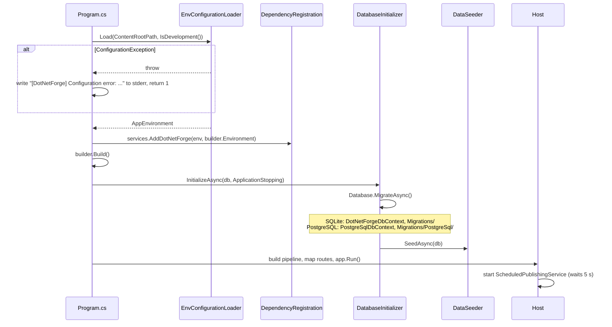

Notes:

- Configuration is loaded **before** the host's own configuration system is used; `.env` values never enter
  `IConfiguration`. Outside Development the loader refuses defaults inside the deployment directory: SQLite needs an
  explicit `DATABASE_CONNECTION_STRING` with an absolute `Data Source` (in-memory allowed), and
  `STORAGE_PROVIDER=local` needs an absolute `STORAGE_LOCAL_PATH`. In Development the defaults are
  `<contentRoot>/storage/dotnetforge.db` and `<contentRoot>/storage/media`. See
  [configuration](../features/configuration.md).
- The scoped `DotNetForgeDbContext` resolves to `PostgreSqlDbContext` when the provider is PostgreSQL, so
  `MigrateAsync` applies that provider's own migration set. `EnsureCreated` is no longer used
  ([database → providers](database.md#providers)).
- Migration and seeding run on **every** start, synchronously, before Kestrel accepts requests. Seeding is
  idempotent (each step checks for existing rows). Details: [database.md](database.md#seeding).
- The Data Protection key ring is read from the `DataProtectionKeys` table on first use; the first key is created
  (and stored) on the first request that needs one.
- A database failure here (bad PostgreSQL connection string, locked SQLite file, an old PostgreSQL database without
  migration history) throws an unhandled exception and the process exits.

## Request pipeline

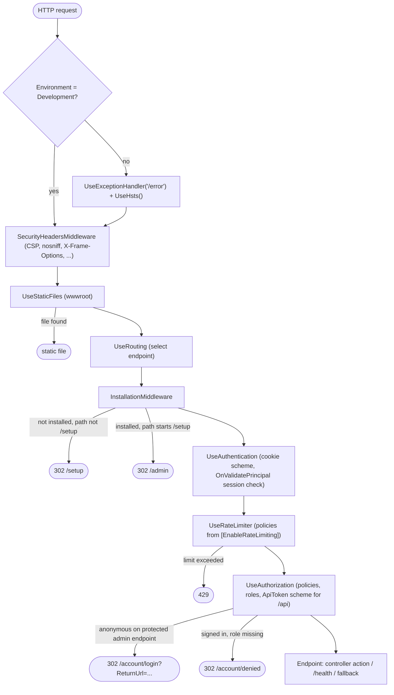

Key properties:

- With `ASPNETCORE_FORWARDEDHEADERS_ENABLED=true` (behind a TLS proxy) the host inserts the forwarded-headers
  middleware ahead of everything, so the scheme and `RemoteIpAddress` come from `X-Forwarded-*`
  ([deployment](../guides/deployment.md#behind-a-reverse-proxy)).
- **`SecurityHeadersMiddleware`** sets `Content-Security-Policy` (`Content-Security-Policy-Report-Only` in
  Development), `X-Content-Type-Options: nosniff`, `X-Frame-Options: SAMEORIGIN`,
  `Referrer-Policy: strict-origin-when-cross-origin` and `Permissions-Policy` on every response, including static
  files and re-executed error pages. Policy: [security](../features/security.md).
- **Static files** in `src/DotNetForge.Web/wwwroot/` are served before routing, so the install gate never blocks CSS/JS.
- `InstallationMiddleware` lets through, without a DB check, any path starting with `/css`, `/js`, `/lib`, `/images`,
  `/img`, `/fonts`, `/favicon`, `/health`, **and any path with a file extension** (`Path.HasExtension`).
  Everything else is redirected to `/setup` until installed - including `/api/*` (a `302`, not a `401`).
- The installed check is cached by `InstallationStatusCache`: once true it never queries the DB again in that
  process.
- **Authentication** uses the cookie scheme by default. API controllers request the `ApiToken` scheme explicitly
  via `[Authorize(AuthenticationSchemes = "ApiToken")]`, so a cookie never authenticates an API call and a bearer
  token never authenticates an admin screen. The token handler runs during authorization, i.e. **after** the rate
  limiter, so rejected requests never reach PBKDF2.
- **Rate limiting** applies only to endpoints with `[EnableRateLimiting]`: `credentials` (POST `/account/login`,
  POST `/setup`; 10 per minute per IP) and `api` (every `ApiControllerBase` action; 300 per minute per IP). Fixed
  windows, no queue, partitioned by `Connection.RemoteIpAddress`, per instance. Rejections get an empty `429`.

## Routing

Endpoints come from four sources, mapped in `Program.cs`:

| Source | Mapping | Matches |
| --- | --- | --- |
| Attribute routes | `[Route]`/`[HttpGet("...")]` on every controller | all admin, account, setup, extension and API routes, `/`, `/error` (any method), `/media/{id:guid}/{fileName?}` |
| Conventional route `default` | `{controller=Home}/{action=Index}/{id?}` | only actions **without** attribute routes - in practice `HomeController.RenderPage` at `/Home/RenderPage` (unused) |
| Minimal API | `app.MapGet("/health", ...)` | `/health` |
| Fallback | `app.MapFallbackToController("RenderPage", "Home")` | any path not matched above **and without a file extension** (`{*path:nonfile}`) |

Because the fallback has the lowest priority, real routes such as `/admin/...`, `/setup`, `/account/...`,
`/media/...` and `/api/...` always win over a content page with the same slug. A content page with slug `admin` is
therefore unreachable on the public site.

Full screen route list: [pages.md → Route map](pages.md#route-map).

### Public URL resolution

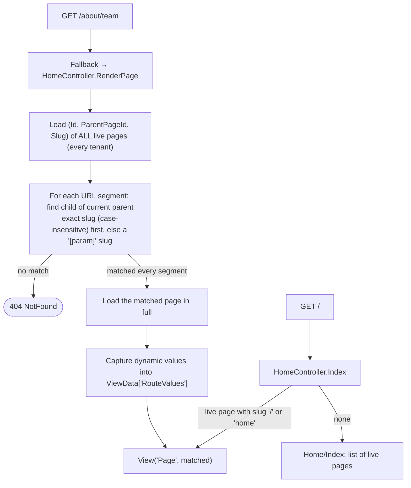

Rules and limitations are documented once in
[content pages and routing](../features/content-pages-and-routing.md#public-resolution).

## Navigation flow (admin)

All admin navigation is plain links in `_Sidebar.cshtml` and full-page loads. Mutations are form POSTs followed by
`RedirectToAction` (Post/Redirect/Get), except the Content Manager tree reorder, which is a `fetch` POST. See
[pages.md → Navigation](pages.md#navigation).

## Authentication flow (admin sign-in)

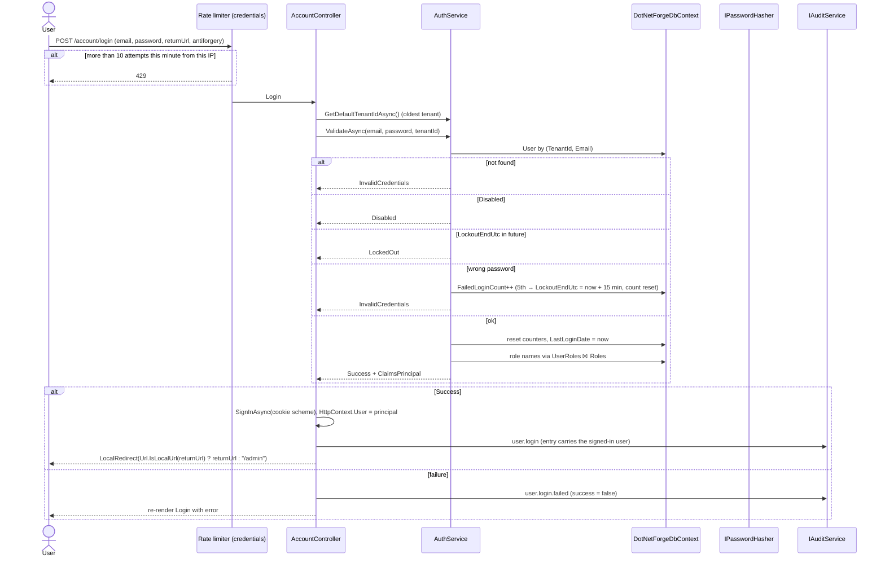

The cookie principal carries `NameIdentifier` (user id), `Name` (display name), `Email`, `dnf:tenant` and one
`Role` claim per role. Roles are read **only at sign-in**; changing a user's roles takes effect after they sign in
again. A non-local or missing `returnUrl` goes to `/admin`. `POST /setup` follows the same pattern (rate-limited,
signs the new Super Admin in, audits `cms.installed`). Full details: [authentication](../features/authentication.md).

### Session validation (every cookie request)

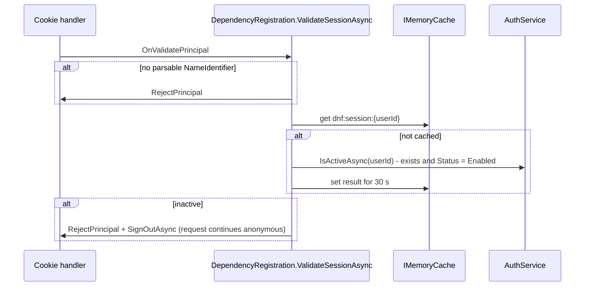

A disabled or deleted user therefore loses access within 30 seconds; their role claims are not re-read.

## Authorization flow (admin screen)

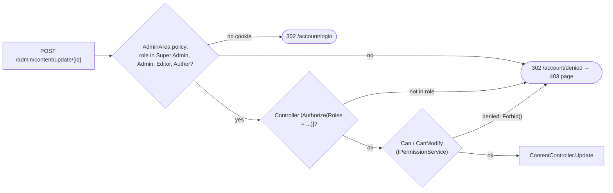

All `[Authorize]` attributes on a controller must pass (they are combined with AND). The `Can`/`CanModify` step exists
only in `ContentController` (area `Collection types`) and `MediaController` (area `Media`); other screens stop at
the role checks. `CanModify` grants the "any" action, or the `.own` action when `CreatedById`/`UploadedById` is the
current user. The sidebar renders every link for every admin-capable user; restricted ones lead to the denied
screen. See [authorization](../features/authorization.md).

## API request flow

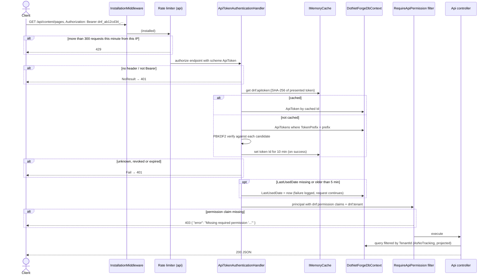

The token row is re-read on every request, so revocation and expiry take effect immediately even when the PBKDF2
result is cached. `POST /api/content/pages` goes through `IPageService.ApplyAsync` (400 `{ error }` on a rule
violation) and audits `content.created` as `API token {id}`. See [headless API](../features/headless-api.md).

## Database request flow (typical admin mutation)

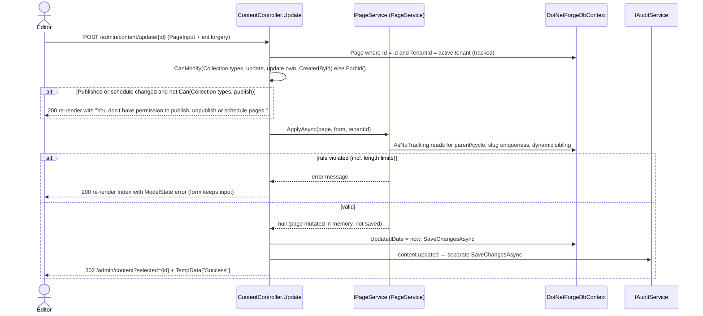

The entity save and the audit save are two separate `SaveChangesAsync` calls (no shared transaction). The other
content mutations follow the same shape:

| Action | Permission | Service call | On rule violation | Audit |
| --- | --- | --- | --- | --- |
| `POST /admin/content/create` | `create`; parent must exist in the tenant (else 404) | none (new page `new-page-<8 hex>`) | - | `content.created` |
| `POST /admin/content/update/{id}` | `update` or `update.own`; `publish` to change Published/schedule | `ApplyAsync` | re-render with error | `content.updated` |
| `POST /admin/content/delete/{id}` | `delete` or `delete.own` | `DeleteAsync` (re-parents children; refuses if they would clash) | re-render with error | `content.deleted` |
| `POST /admin/content/reorder` (`fetch`) | `update` | `ReorderAsync` (tenant ownership, no cycles, no duplicate slugs / second dynamic segment) | `400 { error }` → `alert(error)` | `content.reordered` |
| `POST /api/content/pages` | API key `content.create` | `ApplyAsync` | `400 { error }` | `content.created` |

## Media upload flow

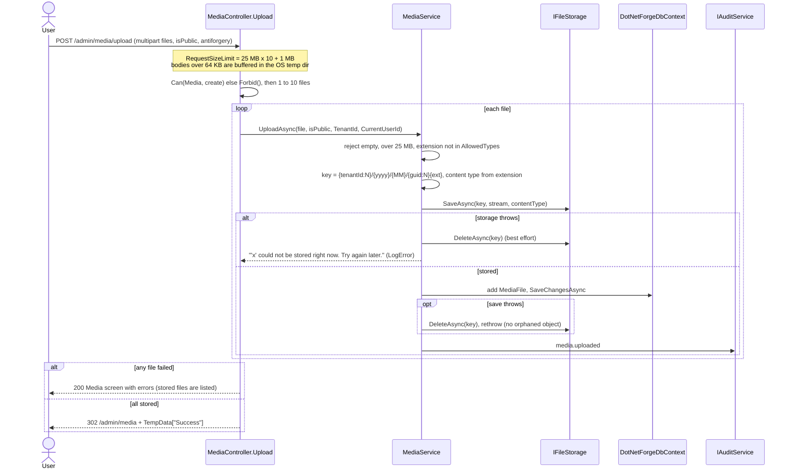

Delete (`POST /admin/media/delete/{id}`) needs `Can(Media, delete)` or `delete.own` on files the user uploaded;
`MediaService.DeleteAsync` removes the row first, then the object (a failed object delete is logged as an orphan
warning), then audits `media.deleted`. Rules and limits:
[media storage → upload flow](../features/media-storage.md#upload-flow).

## Media download flow

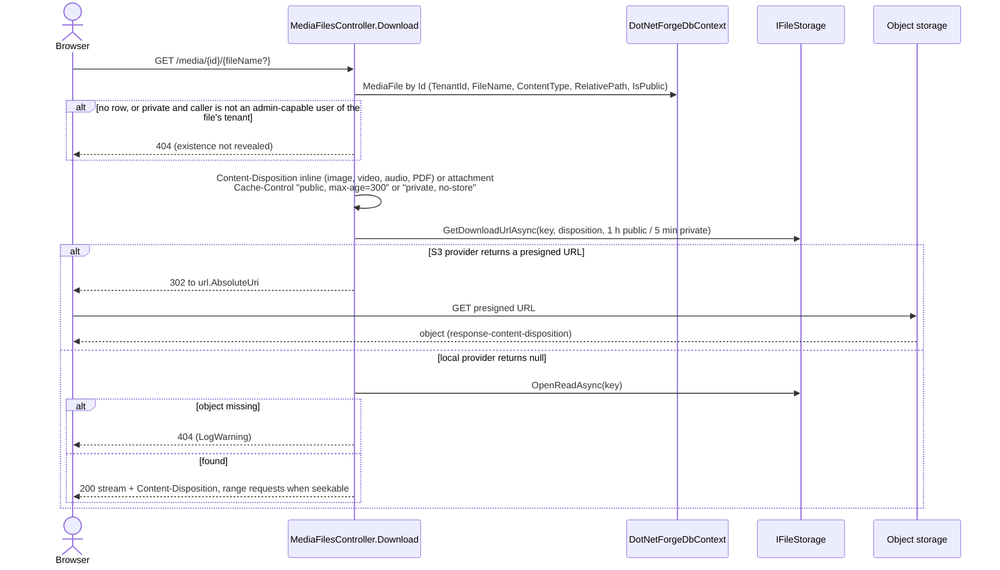

The trailing `fileName` is cosmetic; the id selects the file. The controller has no `[Authorize]`: the cookie (if
any) is read by `UseAuthentication`, and private access is decided by role and `dnf:tenant` claim. Details:
[media storage → download flow](../features/media-storage.md#download-flow).

## Background operation

`ScheduledPublishingService` (hosted) waits 5 s, then every 15 s opens a DI scope and finalizes due schedules across
**all tenants**. It runs on every instance; the work is idempotent. It does not decide public visibility -
`HomeController.Live` already hides/shows pages by comparing the schedule to `DateTime.UtcNow` on each request. See
[scheduled publishing](../features/scheduled-publishing.md).

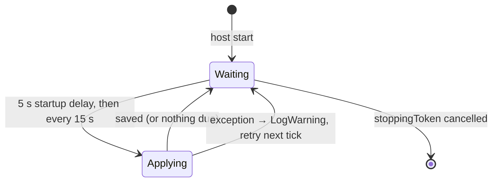

## Configuration loading

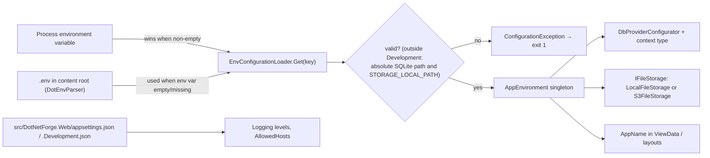

See [configuration](../features/configuration.md) and
[deployment → environment variables](../guides/deployment.md#environment-variables).

## Error handling flow

| Situation | Where detected | What the user gets |
| --- | --- | --- |
| Invalid `.env`, or a relative/missing path outside Development | `EnvConfigurationLoader` at startup | Process exits with code 1; message on stderr |
| Form validation failure (incl. length limits) | `PageService`, `MediaService`, `InstallationService`, controller checks (Settings, API Tokens) | Same screen re-rendered with a validation summary |
| Permission denied by `Can`/`CanModify` | `ContentController`, `MediaController` → `Forbid()` | 302 to `/account/denied` (renders with status 403) |
| Content delete would make children clash | `PageService.DeleteAsync` | Content Manager re-rendered with the error |
| Reorder rejected (cycle, clash, foreign id) | `PageService.ReorderAsync` | `400 { error }`; `admin-content.js` shows `alert(error)` and reloads |
| Entity not found in the active tenant | controller `FirstOrDefaultAsync` → `NotFound()` | Empty-body 404 |
| Public URL not resolving | `HomeController.RenderPage` | Empty-body 404 |
| Private media requested without access, or missing object | `MediaFilesController` | Empty-body 404 (missing object also logged) |
| Media storage unavailable during upload | `MediaService.UploadAsync` | Per-file message on the Media screen; error logged |
| Anonymous on admin | cookie challenge | 302 to `/account/login?ReturnUrl=...` |
| Wrong role | cookie forbid | 302 to `/account/denied` (renders with status 403) |
| Disabled/deleted user with a valid cookie | `ValidateSessionAsync` | Signed out within 30 s; next admin request → login |
| Too many requests | rate limiter (`credentials`, `api`) | Empty `429` |
| API auth failure / missing permission | `ApiTokenAuthenticationHandler` / `RequireApiPermissionAttribute` | 401 / 403 JSON |
| API rule violation | `ContentApiController` via `IPageService` | `400 { "error": "..." }` |
| Unhandled exception (Development) | developer exception page | Stack trace page |
| Unhandled exception (other environments) | `UseExceptionHandler("/error")` → `HomeController.Error` (`[Route("/error")]`, any method) | "Something went wrong" page, for GET and POST alike |
| Background job exception | `ScheduledPublishingService` catch | Log warning; retried next tick |

Details and gaps: [logging and errors](../features/logging-and-error-handling.md).

## External integrations

Out-of-process dependencies at runtime: the database (SQLite file or PostgreSQL server) and, with
`STORAGE_PROVIDER=s3`, an S3-compatible object store - the app uploads, reads and deletes objects through
`S3FileStorage`, and browsers download directly from presigned URLs. Planned integrations and their current state
are listed in [implementation-status.md](../implementation-status.md).
