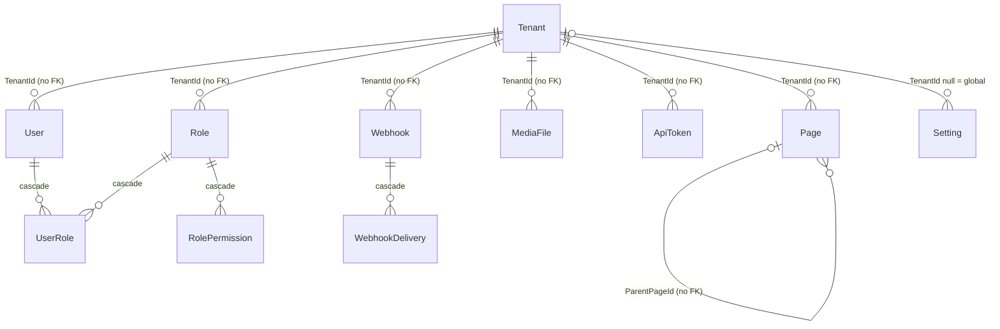

# Database

Tables, relationships, constraints, migrations and seeding. All persistence goes through
`src/DotNetForge.Data/DotNetForgeDbContext.cs`; entity classes are in `src/DotNetForge.Shared/Entities/`. Uploaded
file bytes are **not** in the database - they live in `IFileStorage`, and `MediaFiles` holds the metadata and the
storage key ([media storage](../features/media-storage.md#storage-architecture)).

## Providers

| `DATABASE_PROVIDER` | EF provider | Context type | Schema at startup | Default connection |
| --- | --- | --- | --- | --- |
| `sqlite` | `UseSqlite` | `DotNetForgeDbContext` | `Database.MigrateAsync()` - applies `Migrations/` | Development: `Data Source=<contentRoot>/storage/dotnetforge.db` (anchored to the content root). Elsewhere none: `DATABASE_CONNECTION_STRING` is required with an **absolute** `Data Source` (or in-memory). |
| `postgresql` / `postgres` | `UseNpgsql` | `PostgreSqlDbContext` | `Database.MigrateAsync()` - applies `Migrations/PostgreSql/` | none - `DATABASE_CONNECTION_STRING` is required |

Both providers are on real migrations; `EnsureCreated` is no longer used (`DatabaseInitializer.InitializeAsync`).
PostgreSQL is the recommended production database ([deployment → database](../guides/deployment.md#database)).

> **BREAKING for existing PostgreSQL databases.** A PostgreSQL database created by an earlier build (via
> `EnsureCreated`) has no `__EFMigrationsHistory` table, so `MigrateAsync` tries to create every table again and
> startup fails. Recreate the database, or baseline it: create the `DataProtectionKeys` table by hand (as in
> `Migrations/PostgreSql/20261005180055_InitialCreate.cs`), then insert the row `('20261005180055_InitialCreate',
> '<EF Core product version>')` into `__EFMigrationsHistory`. SQLite databases upgrade normally.

### Two context types, one model

EF Core binds a migration set to a context type, so each provider has its own type:

- `DotNetForgeDbContext` holds the whole model (all `DbSet`s and fluent configuration) and owns the SQLite
  migrations in `Migrations/` (namespace `DotNetForge.Data.Migrations`). It is not sealed and has a protected
  constructor for subclasses.
- `PostgreSqlDbContext : DotNetForgeDbContext` adds nothing to the model; it exists only to own
  `Migrations/PostgreSql/` (namespace `DotNetForge.Data.Migrations.PostgreSql`) with PostgreSQL column types.
- The host registers `AddDbContext<DotNetForgeDbContext, PostgreSqlDbContext>` when the provider is PostgreSQL and
  `AddDbContext<DotNetForgeDbContext>` otherwise, so application code always injects `DotNetForgeDbContext`.

Provider configuration happens in one place, `DbProviderConfigurator.Configure`, used by the host and both
design-time factories. For SQLite it also creates the directory in the `Data Source` path (skipped for in-memory
databases; parsing via `SqliteConnectionStrings`).

## Entity relationship diagram



Only the four "cascade" relationships are real foreign keys. `TenantId` and `ParentPageId` are plain columns with
no FK constraint - integrity is maintained by application code (e.g. `PageService.DeleteAsync` re-parents children).
`AuditLogEntry`, `InstalledExtension`, `SystemState`, `AuthProvider` and `DataProtectionKey` are standalone tables.

## Tables

| Table (`DbSet`) | Key | Important columns | Unique indexes / constraints | Written by |
| --- | --- | --- | --- | --- |
| `Tenants` | `Guid Id` | `Name`(200), `Slug`(100), `PrimaryDomain`, `Subdomains`, `PathPrefix`, `DefaultLocale`, `DefaultTheme`, `Status`, dates | `Slug` unique | `DataSeeder` only |
| `Users` | `Guid Id` | `Email`(256), `FirstName`(100), `LastName`(100), `PasswordHash`, `Status`, `EmailConfirmed`, `FailedLoginCount`, `LockoutEndUtc`, `LastLoginDate`, `TenantId` | (`TenantId`, `Email`) unique; `DisplayName` is computed, not stored | `InstallationStore`, `AuthService` (counters, last login) |
| `Roles` | `Guid Id` | `Name`(100), `Description`(500), `IsBuiltIn`, `TenantId` | (`TenantId`, `Name`) unique | `DataSeeder` |
| `RolePermissions` | `Guid Id` | `RoleId`, `Area`(100), `Action`(100) | (`RoleId`, `Area`, `Action`) unique | `DataSeeder` |
| `UserRoles` | (`UserId`, `RoleId`) | - | composite PK | `InstallationStore` |
| `Pages` | `Guid Id` | `Slug`(200), `Title`(300), `MetaTitle`, `MetaDescription`, `SeoKeywords`, `CanonicalUrl`, `Published`, `Disabled`, `DisplayInMenu`, `ParentPageId`, `SortOrder`, `PageType`, `TargetUrl`, `FileReference`, `ScheduledPublishDate`, `ScheduledUnpublishDate`, `CreatedById`, dates | (`TenantId`, `ParentPageId`, `Slug`) unique | `ContentController` and `ContentApiController` through `IPageService`, `ScheduledPublishingService`, `DataSeeder` |
| `MediaFiles` | `Guid Id` | `FileName`(400, sanitized display name ≤ 200), `OriginalName`(400), `ContentType`(200, from the extension), `SizeBytes`, `RelativePath`(1000, the `IFileStorage` key `{tenantId:N}/{yyyy}/{MM}/{guid:N}{ext}`), `FolderPath` (always `/`), `IsPublic`, `UploadedById`, `UploadedDate`, `TenantId` | index on `TenantId` | `MediaService` (upload adds, delete removes) |
| `ApiTokens` | `Guid Id` | `Name`(200), `Description`(1000), `Duration`, `ExpirationDate`, `PermissionsCsv`, `CreatedById`, `CreatedDate`, `LastUsedDate`, `Revoked`, `TokenHash`, `TokenPrefix`(64) | (`TenantId`, `Name`) unique; index on `TokenPrefix`; `Permissions` computed from CSV | `ApiTokensController`, `ApiTokenAuthenticationHandler` (`LastUsedDate`, at most every 5 min) |
| `Webhooks` | `Guid Id` | `Name`, `Url`, `HeadersJson`, `EventsCsv`, `Enabled`, `Secret`, `LastDelivery` | - | **nothing** |
| `WebhookDeliveries` | `Guid Id` | `WebhookId`, `TargetUrl`, `Event`, `ResponseStatusCode`, `ResponseTimeMs`, `AttemptNumber`, `Outcome`, `Detail` | index on `WebhookId` | **nothing** |
| `AuditLogs` | `long Id` (auto-increment) | `UserId` (null for API-token actions), `UserDisplaySnapshot`(256), `Action`(100), `EntityType`, `EntityId`(100), `EntityDisplaySnapshot`(400), `IpAddress`, `UserAgent`(512), `Timestamp`, `Details`, `Success`, `TenantId` | indexes on `Timestamp` and (`TenantId`, `Action`) | `AuditService` (`IAuditService`) only (append-only; snapshots truncated to the column lengths) |
| `InstalledExtensions` | `string Id` (manifest id, 200) | `Name`, `Description`, `Version`, `Type`, `Author`, `Status`, `InstalledDate`, `UpdateAvailable`, `PermissionsCsv`, `Website`, `License` | - | **nothing** |
| `SystemState` | `int Id` (always 1) | `Installed`, `InstalledAtUtc`, `CmsVersion` (default `"1.0.0"`) | single row | `DataSeeder`, `InstallationStore` |
| `Settings` | `Guid Id` | `TenantId` (nullable), `Key`(200), `Value`(4000) | (`TenantId`, `Key`) unique | `SettingsController` |
| `AuthProviders` | `Guid Id` | `Name`(100), `Enabled`, `IsBuiltIn`, `SettingsJson` | `Name` unique | `DataSeeder` |
| `DataProtectionKeys` | `int Id` (auto-increment) | `FriendlyName`, `Xml` | - | ASP.NET Core Data Protection (`PersistKeysToDbContext<DotNetForgeDbContext>`) |

Enums are stored as integers (`UserStatus`, `TenantStatus`, `PageType`, `TokenDuration`, `ExtensionType`,
`ExtensionStatus`, `WebhookOutcome` - values in `src/DotNetForge.Shared/Enums/Enums.cs`). CSV columns (`PermissionsCsv`,
`EventsCsv`) are split by computed properties ignored by EF (`ApiToken.Permissions`, `Webhook.Events`).

`DataProtectionKeys` holds the key ring for the auth cookie, antiforgery tokens and TempData, so every instance
shares it and sessions survive restarts on a read-only filesystem. The key XML is stored **unencrypted**: anyone who
can read this table can forge cookies. Deleting the rows signs everyone out.

### Column lengths

PostgreSQL enforces `HasMaxLength` (`character varying(n)`); SQLite does not. Input is therefore checked before
saving so an oversized value is a validation message, not a 500: `PageService` (Title 300, Slug 200, Meta title 300,
Meta description 1000, Keywords 500, Canonical/Target URL/File reference 2000), `SettingsController` (key 200, value
4000), `ApiTokensController` (name 200, description 1000), `InstallationService` (email 256, names 100), and
`AuditService` truncates its snapshots.

### Unique indexes and NULL

SQLite and PostgreSQL treat `NULL`s as distinct in unique indexes. The (`TenantId`, `ParentPageId`, `Slug`) index
therefore does **not** stop two root-level pages (`ParentPageId = NULL`) sharing a slug, and (`TenantId`, `Key`)
does not stop duplicate global settings. `PageService` checks slug uniqueness in code, including the root level, in
`ApplyAsync` (Content Manager edits and `POST /api/content/pages`), `ReorderAsync` and `DeleteAsync` (children moving
up a level).

## Migrations

| Migration | Context / folder | Adds |
| --- | --- | --- |
| `20260605120223_InitialCreate` | `DotNetForgeDbContext`, `Migrations/` | all 15 application tables and indexes |
| `20260605211609_AddPageSeoAndScheduling` | `DotNetForgeDbContext`, `Migrations/` | `Pages.SeoKeywords`, `CanonicalUrl`, `FileReference`, `ScheduledPublishDate`, `ScheduledUnpublishDate` |
| `20261005180052_AddDataProtectionKeys` | `DotNetForgeDbContext`, `Migrations/` | `DataProtectionKeys` |
| `20261005180055_InitialCreate` | `PostgreSqlDbContext`, `Migrations/PostgreSql/` | the current model in one step: all 16 tables and indexes |

Both sets are applied automatically at startup. **Every schema change needs a migration in both sets.** Use the
[database-change skill](../../.claude/skills/database-change/SKILL.md) or, from the repository root:

```bash
dotnet tool restore

# SQLite
dotnet ef migrations add <Name> --project src/DotNetForge.Data --startup-project src/DotNetForge.Data \
  --context DotNetForgeDbContext --output-dir Migrations

# PostgreSQL
dotnet ef migrations add <Name> --project src/DotNetForge.Data --startup-project src/DotNetForge.Data \
  --context PostgreSqlDbContext --output-dir Migrations/PostgreSql --namespace DotNetForge.Data.Migrations.PostgreSql
```

After generating:

- **Strip the UTF-8 BOM** EF writes into the new files; `.editorconfig` sets `charset = utf-8` (no BOM).
- **Check the PostgreSQL snapshot location.** EF derives the snapshot's folder from its namespace; make sure
  `PostgreSqlDbContextModelSnapshot.cs` ends up in `Migrations/PostgreSql/` (move it if EF wrote it elsewhere) and
  that no second snapshot was created.
- The design-time factories (`DesignTimeDbContextFactory`, `PostgreSqlDesignTimeDbContextFactory`) never connect.
  They read `DATABASE_CONNECTION_STRING` from the process environment only; without it the SQLite factory falls back
  to the relative `Data Source=storage/dotnetforge.db` and creates an empty, git-ignored `storage/` folder in the
  working directory.
- VS Code: the tasks **ef: add migration (SQLite)** and **ef: add migration (PostgreSQL)** run the two commands above
  (run both with the same name).

## Seeding

`DataSeeder.SeedAsync` runs after migration on every start. Each step is skipped when its data already exists:

| Step | Condition to run | Creates |
| --- | --- | --- |
| Default tenant | no tenant with slug `default` | `Tenant { Name = "Default", Slug = "default", DefaultLocale = "en", DefaultTheme = "dotnetforge.theme.default" }` |
| Built-in roles | per role name missing in the tenant | the six roles (`IsBuiltIn = true`) with `RolePermission` rows from `PermissionMatrix.GrantsFor(role)` |
| Starter pages | the tenant has no pages | `Home` (`/`, published), `About` (`about`, published), `News` (`news`, published), `Contact` (`contact`, not published), and under About: `Team` (`team`, published), `History` (`history`, not published) |
| Auth providers | table empty | `Email` (enabled, built-in) + 16 disabled OAuth entries: Auth0, CAS, Cognito, Discord, Facebook, GitHub, Google, Instagram, Keycloak, LinkedIn, Microsoft, Patreon, Reddit, Twitch, Twitter/X, VK |
| System state | no row | `SystemState { Id = 1, Installed = false }` |

Deleting all pages therefore re-creates the starter tree on the next restart. Seeded pages have no `CreatedById`, so
Authors (who may only edit their own pages) cannot edit them. Nothing seeds `Settings`, `MediaFiles`, `Webhooks`,
`ApiTokens`, `InstalledExtensions` or `DataProtectionKeys`.

## Delete behaviour

| Action | Effect |
| --- | --- |
| Delete a content page (`PageService.DeleteAsync`) | children are re-parented to the deleted page's parent, then the page is removed; refused when that would create a duplicate slug or a second dynamic segment under the parent |
| Delete a media file (`MediaService.DeleteAsync`) | the `MediaFiles` row is removed first, then the stored object; a failed object delete leaves an orphaned object (logged as a warning) |
| Delete a role / user | not exposed in any UI; would cascade `UserRoles` (and `RolePermissions` for roles) |
| Revoke an API token | soft: `Revoked = true`, row kept |
| Audit entries | never updated or deleted by the application |

## Rules

- Query through `DotNetForgeDbContext`; no raw SQL. Never inject or name `PostgreSqlDbContext`.
- Filter tenant-scoped tables by `TenantId` in every query (no global query filters exist).
- Use `AsNoTracking()` + `Select` projection for reads that render a screen or API response.
- Validate lengths before saving (PostgreSQL enforces them).
- Schema changes: change the entity + `OnModelCreating`, add a migration **for both providers**, keep `DataSeeder`
  idempotent.
