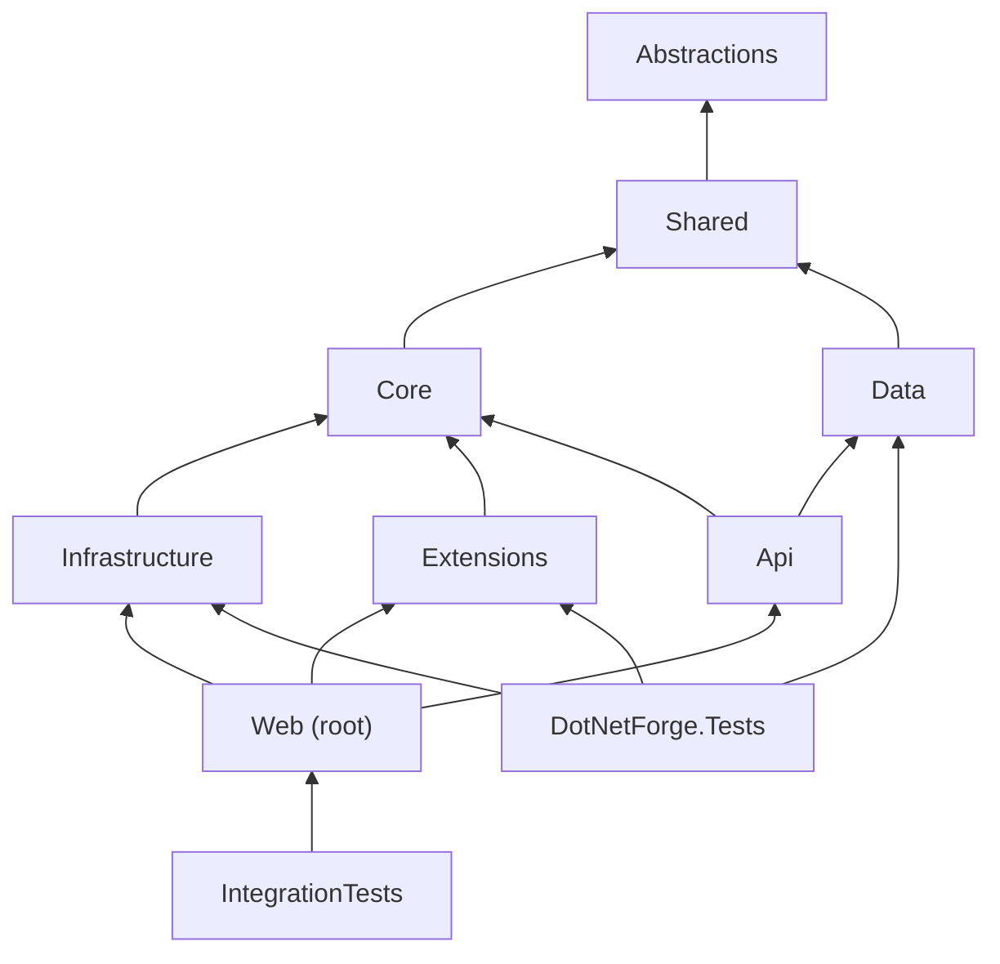

# Dependencies

Project references, NuGet packages and DI registrations - what depends on what, and which dependencies must not be
introduced. Layer responsibilities are in [codebase.md](codebase.md).

## Project references

| Project | References | Must never reference |
| --- | --- | --- |
| `DotNetForge.Abstractions` | - | anything |
| `DotNetForge.Shared` | Abstractions | Core, Data, Infrastructure, Api, EF Core |
| `DotNetForge.Core` | Abstractions, Shared | Data, Infrastructure, EF Core, ASP.NET Core |
| `DotNetForge.Data` | Abstractions, Shared (+ EF Core packages, `Microsoft.AspNetCore.DataProtection.EntityFrameworkCore`) | Core, Infrastructure, Api |
| `DotNetForge.Infrastructure` | Abstractions, Shared, Core (+ `AWSSDK.S3`) | Data, Api |
| `DotNetForge.Extensions` | Abstractions, Shared, Core | Data, Api |
| `DotNetForge.Api` | Abstractions, Shared, Core, Data; `FrameworkReference Microsoft.AspNetCore.App` | the web host |
| `DotNetForge.Web` (root) | all seven `src/` projects | test projects |
| `DotNetForge.Tests` | Abstractions, Shared, Core, Data, Infrastructure, Extensions | Web, Api |
| `DotNetForge.IntegrationTests` | `src/DotNetForge.Web/DotNetForge.Web.csproj` | - |

(Transitive edges omitted.) Why the unusual edges exist:

- **`Core` ⟂ `Data`** - kept as siblings so domain logic stays testable without EF Core. Bridge them with an
  interface in `Shared/Stores` implemented in `Data` (`IInstallationStore`).
- **`Api` → `Data`** - pragmatic shortcut (comment in `DotNetForge.Api.csproj`): API controllers query the
  DbContext directly. Don't add a repository layer just to remove it.
- **`Api` ⟂ Web host** - the API uses host services through contracts in `Shared` (`IPageService`,
  `IAuditService`) that the host registers; it never references the host project.
- **`PermissionMatrix` in `Shared`** - so `Data` (seeder) and `Core` (`PermissionService`) share it without `Data`
  depending on `Core`.

## NuGet packages

All versions are pinned centrally in `Directory.Packages.props` (`ManagePackageVersionsCentrally`,
`CentralPackageTransitivePinningEnabled`). `.csproj` files reference packages **without** a version.

| Package | Version | Referenced by | Purpose |
| --- | --- | --- | --- |
| `Microsoft.EntityFrameworkCore` | 10.0.12 | Data | ORM |
| `Microsoft.EntityFrameworkCore.Relational` | 10.0.12 | Data | relational APIs (transactions, migrations) |
| `Microsoft.EntityFrameworkCore.Sqlite` | 10.0.12 | Data | default provider |
| `Npgsql.EntityFrameworkCore.PostgreSQL` | 10.0.3 | Data | PostgreSQL provider |
| `Microsoft.EntityFrameworkCore.SqlServer` | 10.0.12 | Data | SQL Server provider (needs ICU: `InvariantGlobalization=false`) |
| `MySql.EntityFrameworkCore` | 10.0.9 | Data | MySQL provider (Oracle; Pomelo has no EF Core 10 release) |
| `MongoDB.EntityFrameworkCore` | `[10.0.4]` (pinned) | Data | MongoDB provider; brings `MongoDB.Driver`, used natively by `MongoExecutor` |
| `Microsoft.EntityFrameworkCore.Design` | 10.0.12 | Data only, `PrivateAssets="all"` | `dotnet ef` design-time support; does not flow into the web host or the publish output |
| `Microsoft.AspNetCore.DataProtection.EntityFrameworkCore` | 10.0.12 | Data | `IDataProtectionKeyContext`, `PersistKeysToDbContext` - Data Protection key ring in the database |
| `AWSSDK.S3` | 4.0.104.1 | Infrastructure | `S3FileStorage` (any S3-compatible service, presigned URLs) |
| `Microsoft.AspNetCore.Mvc.Razor.RuntimeCompilation` | 10.0.12 | Web | compiles extension views from `extensions/` at runtime, in memory |
| `Microsoft.NET.Test.Sdk` | 17.12.0 | tests | test host |
| `xunit` / `xunit.runner.visualstudio` | 2.9.2 / 2.8.2 | tests | test framework |
| `Microsoft.AspNetCore.Mvc.Testing` | 10.0.12 | IntegrationTests | `WebApplicationFactory<Program>` |

Local tool: `dotnet-ef` 10.0.12 (`.config/dotnet-tools.json`; `dotnet tool restore`).

The former **NU1903** advisory (transitive `SQLitePCLRaw.lib.e_sqlite3` 2.1.11) is resolved: the 10.0.12 EF Core
packages pull SQLitePCLRaw 2.1.12.

Rate limiting (`AddRateLimiter`), Data Protection, `IMemoryCache` and forwarded headers come from the shared
framework (`Microsoft.AspNetCore.App`) - no packages.

There are no frontend packages: no `package.json`, no ESLint config.

**Rule:** don't add a package for something the BCL or ASP.NET Core already does. Cryptography, `.env` parsing,
hashing and signing are deliberately in-house; `AWSSDK.S3` is the exception, for S3 request signing.

## DI registrations

All in `src/DotNetForge.Web/Startup/DependencyRegistration.AddDotNetForge(env, hostEnv)`.

| Service | Implementation | Lifetime | Injected by |
| --- | --- | --- | --- |
| `AppEnvironment` | instance from `EnvConfigurationLoader` | singleton | `AccountController`, `SetupController`, `HomeController`, `DashboardController`, `SettingsController` |
| `IMemoryCache` | `AddMemoryCache()` | singleton | cookie session check (`ValidateSessionAsync`, key `dnf:session:{userId}`), `ApiTokenAuthenticationHandler` (key `dnf:apitoken:{sha256}`) |
| `DotNetForgeDbContext` | `AddDbContext<DotNetForgeDbContext, TContext>` by the main database's provider (`IDatabaseProvider.AddDbContext`; `TContext` = the provider's context type) | scoped | almost every controller, all API controllers, `MediaFilesController`, `AuthService`, `AuditService`, `PageService`, `MediaService`, `InstallationStore`, `ApiTokenAuthenticationHandler`, the Data Protection key repository, admin extension views (`@inject`) |
| `DatabaseProviderRegistry`, `DatabaseCatalog` | `AddDotNetForgeDatabases` (built during registration from `AddDatabaseProvider<T>(name)` calls) | singleton | `QueryRouter`, `Program.cs` (schema initialization) |
| `QueryRouter` | `AddDotNetForgeDatabases` | singleton | `DatabaseService` |
| `IDatabaseService` → `DatabaseService` | `AddDotNetForgeDatabases` | singleton | not used by CMS code yet; for extensions and tooling ([database layer](../database/architecture.md)) |
| Data Protection | `AddDataProtection().SetApplicationName("DotNetForge").PersistKeysToDbContext<DotNetForgeDbContext>()` | framework | auth cookie, antiforgery, TempData |
| `IFileStorage` | `S3FileStorage(env.Storage)`; `LocalFileStorage(env.Storage.LocalPath)` only in Development without `STORAGE_S3_*` | singleton (factory) | `MediaService`, `MediaFilesController` |
| `IPasswordHasher` | `Pbkdf2PasswordHasher` | singleton | `AuthService`, `InstallationService` |
| `IDateTimeProvider` | `SystemClock` | singleton | `AuthService`, `ApiTokensController`, `ApiTokenAuthenticationHandler` |
| `IApiTokenFactory` | `ApiTokenFactory` | singleton | `ApiTokensController`, `ApiTokenAuthenticationHandler` |
| `IPermissionService` | `PermissionService` | singleton | `AdminControllerBase.Can` / `CanModify` (resolved from `RequestServices`) |
| `IManifestValidator` | `ManifestValidator` | singleton | `ExtensionLoader` |
| `IExtensionLoader` | `ExtensionLoader(validator, env.ExtensionsPath)` | singleton (factory) | `PluginsController`, `ExtensionsController`, `ExtensionViewController`, `AdminExtensionsNavViewComponent` |
| `IInstallationStore` | `InstallationStore` | scoped | `InstallationService`, `InstallationMiddleware`, integration tests |
| `IInstallationService` | `InstallationService` | scoped | `SetupController` |
| `InstallationStatusCache` | self | singleton | `InstallationMiddleware`, `SetupController` |
| `IHttpContextAccessor` | framework | singleton | `AuditService` |
| `AuthService` | self | scoped | `AccountController`, `SetupController`, `ValidateSessionAsync` |
| `IAuditService` | `AuditService` | scoped | `AccountController`, `SetupController`, `ContentController`, `SettingsController`, `ApiTokensController`, `MediaService`, `ContentApiController` |
| `IPageService` | `PageService` | scoped | `ContentController`, `ContentApiController` |
| `MediaService` | self | scoped | `MediaController` |
| `ScheduledPublishingService` | `AddHostedService` | singleton (hosted) | host |

Not registered (removed): `IEmailSender` (no implementation exists; `FileSystemEmailSender` was deleted) and
`IWebhookSigner` (`HmacWebhookSigner` and its tests are kept for planned webhooks).

Framework services also configured there:

- cookie authentication (`dnf.auth`, 8 h sliding, `HttpOnly`, `SameSite=Lax`, `SecurePolicy` `Always` outside
  Development / `SameAsRequest` in Development, `OnValidatePrincipal = ValidateSessionAsync`) and the `ApiToken`
  scheme;
- the `AdminArea` authorization policy (`RequireRole(Roles.AdminCapable)`);
- `AddRateLimiter` with fixed-window policies `RateLimitPolicies.Credentials` (10/min) and `RateLimitPolicies.Api`
  (300/min), partitioned by client IP, `RejectionStatusCode = 429`;
- antiforgery (`HeaderName = "X-CSRF-TOKEN"`);
- MVC controllers + views with the API application part and runtime Razor compilation over a
  `PhysicalFileProvider(contentRoot)`.

`InstallationMiddleware` receives its scoped/singleton dependencies through `InvokeAsync` parameters (the
middleware itself is constructed once). `SecurityHeadersMiddleware` takes `IWebHostEnvironment` in its constructor.

## Dependencies that must not be bypassed

| Instead of ... | Always use ... | Reason |
| --- | --- | --- |
| Hashing or comparing passwords yourself | `IPasswordHasher` | format `pbkdf2-sha256$iterations$salt$hash`, constant-time compare |
| Generating/validating tokens yourself | `IApiTokenFactory` | prefix lookup + salted hash contract used by the auth handler |
| `DateTime.UtcNow` in auth/token logic | `IDateTimeProvider` | testable time (the content code and scheduler still use `DateTime.UtcNow` directly) |
| Writing `AuditLogEntry` rows directly, or injecting `AuditService` | `IAuditService.LogAsync` | captures user or API token, tenant, IP, user agent consistently; truncates snapshots |
| Validating or mutating content pages in a controller, or injecting `PageService` | `IPageService` (`ApplyAsync`, `ReorderAsync`, `DeleteAsync`) | single rule set for the admin and the API |
| `System.IO` on the content root / `wwwroot` for runtime files | `IFileStorage` (via `MediaService` for media) | the deployment directory is read-only; works with S3 and multiple instances |
| Building storage keys from user input | generated keys validated by `StorageKey` | no traversal, no odd object names |
| Role-name checks for content/media actions in a controller | `AdminControllerBase.Can` / `CanModify` | evaluates the permission matrix incl. `.own` actions |
| Reading `.env` / `Environment` in feature code | inject `AppEnvironment` | validated once at startup |
| Scanning `extensions/` | `IExtensionLoader.Discover()` / `FindAdminExtension(id)` | manifest validation, cached results |
| Building your own sign-in principal | `AuthService.ValidateAsync` | lockout, claims shape (`dnf:tenant`, roles) |
| Hard-coding role names / permission keys / audit actions / rate-limit policy names | `Roles`, `PermissionKeys`, `PermissionAreas`, `PermissionActions`, `AuditActions`, `RateLimitPolicies` | one source of truth |
