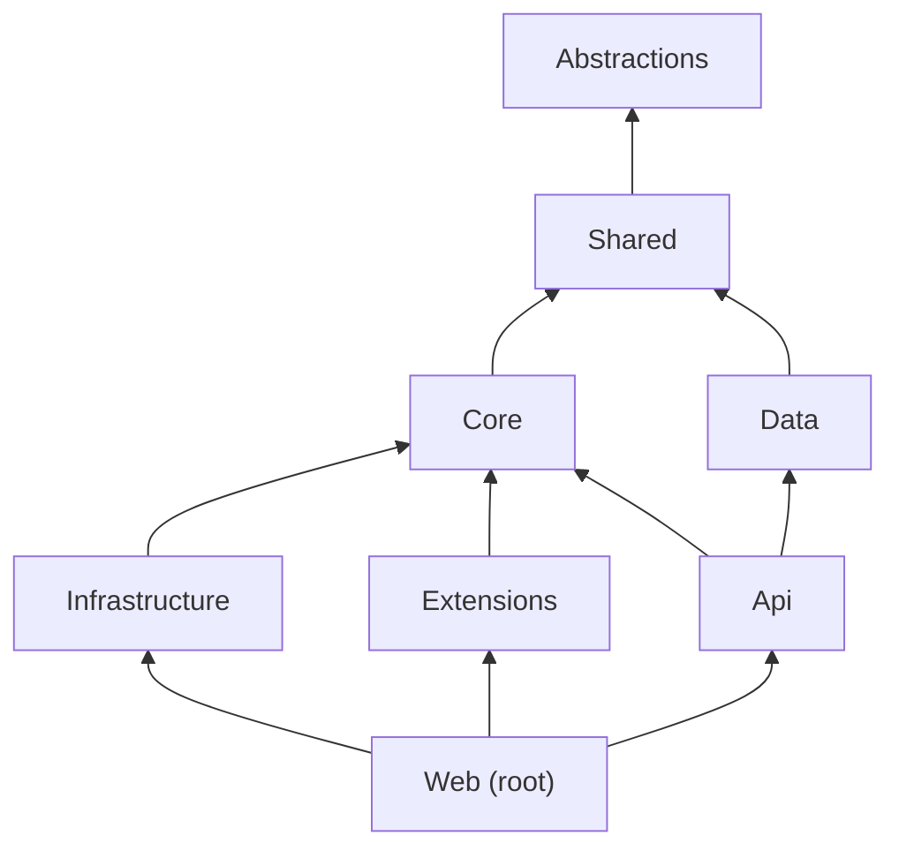

# DotNetForge CMS - Architecture

DotNetForge CMS is a server-rendered **ASP.NET Core MVC** CMS (C#, EF Core, Razor) on **.NET 10**, with **SQLite**
(default) or **PostgreSQL**, configured through `.env`. It serves a role-gated admin area, a public site resolved from
a page tree, and a token-secured headless API over the same data, and keeps the core (`src/`) separate from
user extensions (`extensions/`).

This file is the short overview. The detailed, code-verified architecture lives in `.docs/`:

| Topic | Document |
| --- | --- |
| Projects, folders, layers, DI, rules for changes | [.docs/architecture/codebase.md](.docs/architecture/codebase.md) |
| Startup, request pipeline, routing, auth/API/background flows | [.docs/architecture/data-flow.md](.docs/architecture/data-flow.md) |
| Screens, route map, layouts, navigation | [.docs/architecture/pages.md](.docs/architecture/pages.md) |
| Tables, migrations, seeding | [.docs/architecture/database.md](.docs/architecture/database.md) |
| Project references, packages, DI registrations | [.docs/architecture/dependencies.md](.docs/architecture/dependencies.md) |
| Built vs. specified | [.docs/implementation-status.md](.docs/implementation-status.md) |

## Layout

```text
DotNetForge.Web.csproj + Program.cs, Startup/, Middleware/, Services/, Controllers/, Areas/Admin/, Views/, wwwroot/   (repo root)
src/
  DotNetForge.Abstractions/    contracts only, no dependencies
  DotNetForge.Shared/          entities, enums, constants, DTOs, results, manifest model, store interfaces
  DotNetForge.Core/            installation, permission matrix evaluation, validators (no EF Core)
  DotNetForge.Data/            EF Core context, migrations, seeding, provider selection
  DotNetForge.Infrastructure/  BCL implementations: hashing, tokens, signing, .env, storage, email
  DotNetForge.Extensions/      manifest validation + discovery
  DotNetForge.Api/             headless API controllers, token auth, permission filter
tests/        DotNetForge.Tests (unit), DotNetForge.IntegrationTests (real host)
extensions/   extensions by type (one manifest per folder)
.docs/        technical documentation, incl. planned work per topic
Dockerfile, compose.dev.yml   production image (read-only friendly), local PostgreSQL + S3 for development
```

The only deviation from the spec's canonical tree is that the web host is the **repository root** project (not
`src/DotNetForge.Web/`), so `dotnet run`, `dotnet watch` and `dotnet build` work from the root with no arguments; the
host's `DefaultItemExcludes` keeps sibling folders out of its compilation. AI-agent quick references live in
`.github/agents/` instead of a root `agents/` folder.

## Layering



- `Core` and `Data` are siblings; `Core` needs persistence only through interfaces in `Shared/Stores`
  (`IInstallationStore`).
- `Api` queries `Data` directly - a documented shortcut.
- `PermissionMatrix` lives in `Shared` so the seeder and `PermissionService` share it.
- All DI is in `Startup/DependencyRegistration.cs`.

## Key decisions

- **Server-rendered admin**, no SPA or Node build; progressive enhancement only.
- **Two auth schemes:** cookie (`dnf.auth`) for the admin, `ApiToken` bearer for `/api`.
- **Role-based admin gating** (`AdminArea` policy + `[Authorize(Roles = ...)]`), plus `(area, action)` checks from the
  permission matrix for content and media actions; granular permission keys for API tokens.
- **Install gate** middleware until the first Super Admin exists.
- **Liveness of content pages is computed per request** from `Published`, `Disabled` and the schedule; a background
  job only tidies passed schedules.
- **Extensions are discovered from disk and validated**; only `admin` extensions are rendered (runtime Razor
  compilation, iframe). No extension assemblies are loaded.
- **BCL-only security primitives** (PBKDF2, HMAC, RNG) and an in-house `.env` parser - no extra dependencies.
- **Read-only deployment directory.** Runtime data goes to the database (incl. the Data Protection key ring) and to
  object storage behind `IFileStorage` (local directory in development, S3-compatible - Cloudflare R2 recommended - in
  production). Production configuration may not default into the app's folder ([deployment](.docs/guides/deployment.md)).
- **Both database providers use migrations** (`DotNetForgeDbContext` for SQLite, `PostgreSqlDbContext` for
  PostgreSQL), applied at startup.
- **Defence in depth on the web layer:** CSP and security headers, rate limiting, session re-validation, content and
  media permission checks from the role permission matrix.
