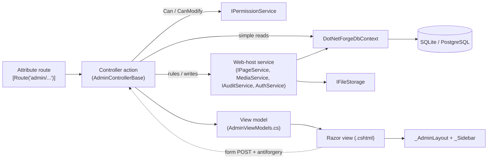
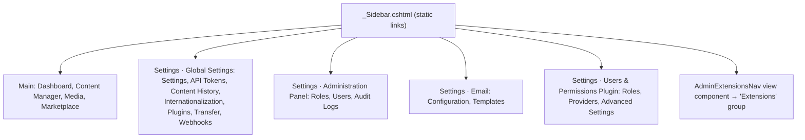
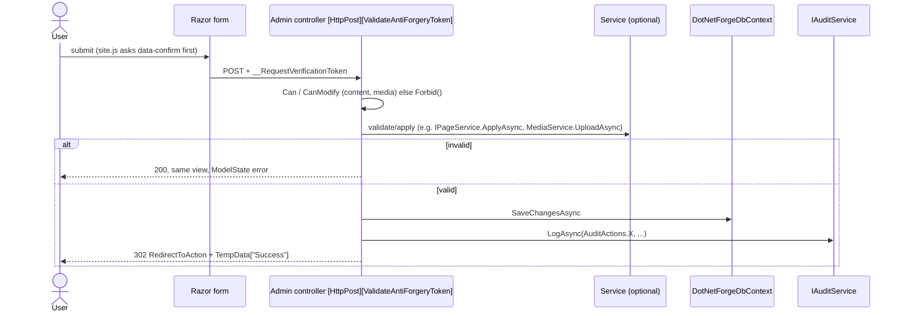

# Page (screen) architecture

How screens are built, routed, laid out, secured and wired to the backend. In this document "screen" means a UI
view; the content entity is always "content page" (see the [glossary](../glossary.md)). Each screen has its own
document in [`pages/`](../pages/).

## The pattern in one picture

There are no view models with behaviour, no client-side router and no SPA. A screen is a controller action that
queries the database (directly or through a web-host service) and renders a Razor view with a plain model.

## Route map

Every screen in the application. Auth column: **Anon** = anonymous; **AdminArea** = any admin-capable role
(`Super Admin`, `Admin`, `Editor`, `Author`); **SA/Admin** = `Super Admin` or `Admin`; **SA** = `Super Admin` only;
**+ perm** = individual actions also check `(area, action)` permissions through `Can`/`CanModify`. All routes except
`/setup`, `/health` and paths with a file extension additionally require the CMS to be installed.

| Screen | Route(s) | Controller → action | View | Auth | Doc |
| --- | --- | --- | --- | --- | --- |
| Setup wizard | `GET/POST /setup` (POST rate-limited) | `SetupController.Index` | `src/DotNetForge.Web/Views/Setup/Index.cshtml` | Anon, only before install | [setup](../pages/setup.md) |
| Sign in | `GET/POST /account/login` (POST rate-limited), `POST /account/logout` | `AccountController.Login`, `.Logout` | `src/DotNetForge.Web/Views/Account/Login.cshtml` | Anon | [login](../pages/login.md) |
| Access denied | `GET /account/denied` | `AccountController.Denied` | `src/DotNetForge.Web/Views/Account/Denied.cshtml` | Anon | [access-denied](../pages/access-denied.md) |
| Public home | `GET /` | `HomeController.Index` | `src/DotNetForge.Web/Views/Home/Page.cshtml` or `src/DotNetForge.Web/Views/Home/Index.cshtml` | Anon | [public-home](../pages/public-home.md) |
| Public content page | any other extension-less path (fallback) | `HomeController.RenderPage` | `src/DotNetForge.Web/Views/Home/Page.cshtml` | Anon | [public-page](../pages/public-page.md) |
| Media file | `GET /media/{id:guid}/{fileName?}` | `MediaFilesController.Download` | none - 302 to a presigned URL or a file stream | public file: Anon; private file: AdminArea user of the file's tenant, else 404 | [media storage](../features/media-storage.md#download-flow) |
| Error | `/error` (any HTTP method) | `HomeController.Error` | `src/DotNetForge.Web/Views/Home/Error.cshtml` | Anon | [error](../pages/error.md) |
| Dashboard | `GET /admin` | `DashboardController.Index` | `src/DotNetForge.Web/Areas/Admin/Views/Dashboard/Index.cshtml` | AdminArea | [dashboard](../pages/dashboard.md) |
| Content Manager | `GET /admin/content`, `POST /admin/content/{create,update/{id},delete/{id},reorder}` | `ContentController` | `src/DotNetForge.Web/Areas/Admin/Views/Content/Index.cshtml` (+ `_TreeNodes`, `_PageForm`) | AdminArea + perm (`Collection types`: `create`; `update`/`update.own`; `publish` to change Published or schedule; `delete`/`delete.own`; reorder needs `update`) | [content-manager](../pages/content-manager.md) |
| Media | `GET /admin/media`, `POST /admin/media/upload`, `POST /admin/media/delete/{id}` | `MediaController` | `src/DotNetForge.Web/Areas/Admin/Views/Media/Index.cshtml` | AdminArea + perm (`Media`: upload needs `create`; delete needs `delete`, or `delete.own` for files the user uploaded) | [media](../pages/media.md) |
| Settings | `GET /admin/settings`, `POST /admin/settings/save` | `SettingsController` | `src/DotNetForge.Web/Areas/Admin/Views/Settings/Index.cshtml` | SA/Admin | [settings](../pages/settings.md) |
| API Tokens | `GET /admin/api-tokens`, `GET/POST /admin/api-tokens/create`, `POST /admin/api-tokens/revoke/{id}` | `ApiTokensController` | `src/DotNetForge.Web/Areas/Admin/Views/ApiTokens/{Index,Create,Created}.cshtml` | SA/Admin | [api-tokens](../pages/api-tokens.md) |
| Roles | `GET /admin/roles` | `RolesController.Index` | `src/DotNetForge.Web/Areas/Admin/Views/Roles/Index.cshtml` | SA/Admin | [roles](../pages/roles.md) |
| Users | `GET /admin/users` | `UsersController.Index` | `src/DotNetForge.Web/Areas/Admin/Views/Users/Index.cshtml` | SA/Admin | [users](../pages/users.md) |
| Audit Logs | `GET /admin/audit-logs` | `AuditLogsController.Index` | `src/DotNetForge.Web/Areas/Admin/Views/AuditLogs/Index.cshtml` | SA/Admin | [audit-logs](../pages/audit-logs.md) |
| Plugins | `GET /admin/plugins` | `PluginsController.Index` | `src/DotNetForge.Web/Areas/Admin/Views/Plugins/Index.cshtml` | SA | [plugins](../pages/plugins.md) |
| Admin extension tab | `GET /admin/ext/{id}` (shell), `GET /admin/ext/{id}/raw`, `GET /admin/ext/{id}/resources/{**path}` | `ExtensionsController.Host`, `ExtensionViewController.Render` / `.Resource` | `src/DotNetForge.Web/Areas/Admin/Views/Extensions/Host.cshtml` + the extension's own views | AdminArea | [extension-host](../pages/extension-host.md) |
| Module placeholders | `/admin/marketplace`, `/admin/content-history`, `/admin/internationalization`, `/admin/transfer`, `/admin/webhooks`, `/admin/email/configuration`, `/admin/email/templates`, `/admin/providers`, `/admin/advanced-settings` | `ModulesController` | `src/DotNetForge.Web/Areas/Admin/Views/Modules/Placeholder.cshtml` | AdminArea | [module-placeholders](../pages/module-placeholders.md) |

Non-screen endpoints: `GET /health` (JSON, bypasses install gate) and `/api/*` ([headless API](../features/headless-api.md)).

The Settings screen was AdminArea before; Editors and Authors now get the denied screen there.

## How screens are registered

There is no registry. A screen exists when:

1. a controller action has an **attribute route** (every admin controller has `[Route("admin/...")]`;
   `ModulesController` uses absolute `[HttpGet("/admin/...")]` per action); and
2. a view is found by MVC's normal lookup: `src/DotNetForge.Web/Areas/Admin/Views/<Controller>/<Action>.cshtml`, then
   `src/DotNetForge.Web/Areas/Admin/Views/Shared/`, then `Views/Shared/` - or the action names the view explicitly (`View("Created", ...)`,
   `View(nameof(Index), ...)`, `View("Placeholder", ...)`, `View("Page", ...)`).

Admin extensions are the exception: their tabs come from manifests on disk (see
[Admin extension tabs](#admin-extension-tabs-dynamic-navigation)).

## Layouts

| Layout | Set by | Used by | What it renders |
| --- | --- | --- | --- |
| `src/DotNetForge.Web/Areas/Admin/Views/Shared/_AdminLayout.cshtml` | `src/DotNetForge.Web/Areas/Admin/Views/_ViewStart.cshtml` | every admin screen | `<title>{Title} · DotNetForge Admin</title>`, `site.css` + `admin.css`, `site.js` (`defer`), sidebar (logo, a hard-coded "Tenant: Default" block, `_Sidebar` partial), top bar with `ViewData["Title"]` as `<h1>`, the user's name and a **Sign out** POST form |
| `src/DotNetForge.Web/Views/Shared/_Layout.cshtml` | `src/DotNetForge.Web/Views/_ViewStart.cshtml` | public home list, error | `site.css`, header with app name (link `/`) and an **Admin** link, `<main class="container">`, footer |
| `src/DotNetForge.Web/Views/Shared/_AuthLayout.cshtml` | `Layout = "_AuthLayout"` in the view | setup, login, denied | `site.css`, centered card with the app name |
| none (`Layout = null`) | `src/DotNetForge.Web/Views/Home/Page.cshtml` | public content page | its own `<!doctype html>` with SEO meta tags and `page.css` |
| extension's own `src/DotNetForge.Web/Views/Shared/_Layout.cshtml` | the extension's `_ViewStart.cshtml` | admin extension `raw` documents | whatever the extension ships (same CSP applies) |

Layouts read `ViewData["Title"]` and `ViewData["AppName"]` (the public/auth layouts fall back to
`"DotNetForge CMS"` when `AppName` is not set). Admin views set `ViewData["Title"]` at the top of the view; the admin
layout does not use `AppName`.

**Rule:** the admin and auth layouts must never be affected by a public theme. There is no theme system today,
but keep admin styling in `admin.css`/`_AdminLayout` only.

## Content Security Policy and screens

`SecurityHeadersMiddleware` sends `script-src 'self'; style-src 'self'` (plus `img-src 'self' data: https:`,
`media-src 'self' https:`, `frame-src 'self'`, `frame-ancestors 'self'`, `form-action 'self'`, `object-src 'none'`)
on every response. For screens this means:

- **No inline script or style**: no `<script>` blocks, `<style>` blocks, `style="..."` attributes or `on*="..."`
  handlers. Scripts go in `src/DotNetForge.Web/wwwroot/js` and are referenced with `<script src="~/js/..." defer>`; styles go in
  `src/DotNetForge.Web/wwwroot/css`. This applies to admin extension documents too.
- Behaviour hooks are data attributes handled by `site.js` (today `data-confirm`).
- Forms may only post to this origin; images may also come from `data:` and HTTPS origins (media redirects to
  presigned object-storage URLs).
- The admin extension host embeds `/admin/ext/{id}/raw` in a same-origin `<iframe>`, allowed by `frame-src 'self'`
  and `X-Frame-Options: SAMEORIGIN`.
- In Development the policy is **report-only**: violations appear only as browser console warnings, so check the
  console when adding UI.

## Navigation

- `_Sidebar.cshtml` is a static list of `<a>` elements. The active item is the one whose `href` equals the request
  path exactly (case-insensitive) - so `/admin/api-tokens/create` highlights nothing, and the two **Roles** entries
  highlight together.
- Links are **not filtered by role**. An Editor sees **Users**, **Settings**, **Plugins** etc.; clicking them
  redirects to `/account/denied`. A role-aware sidebar is [planned](#role-rules-for-navigation).
- Items with no built screen route to `ModulesController` placeholders, so the navigation has no dead links.
- Navigation is full page loads; there is no client router. Deep links are ordinary URLs, e.g.
  `/admin/content?selected={pageId}`.

### Admin extension tabs (dynamic navigation)

`Shared/_Sidebar.cshtml` ends with `@await Component.InvokeAsync("AdminExtensionsNav")`.
`AdminExtensionsNavViewComponent` calls `IExtensionLoader.Discover()` on every admin request (served from the
loader's cache, which a `FileSystemWatcher` invalidates when a manifest changes), keeps valid manifests with
`type == "admin"`, orders by name and renders an **Extensions** group with one link per extension to
`/admin/ext/{manifest id}`. See [extension host](../pages/extension-host.md).

## How screens load data

- **Synchronously on the server, before the response is sent.** There is no client-side fetching on any screen;
  every screen arrives fully rendered. There are therefore no skeletons, spinners or loading states anywhere in the
  UI.
- Reads use `AsNoTracking()` and project into a view model (`Select(...)`), scoped by `AdminControllerBase.TenantId`.
  Audit Logs and the Dashboard audit count also include entries with no tenant (`TenantId == null`, e.g. failed
  sign-ins); extension data and global settings are not tenant-specific - documented per screen.
- Lists are unpaged except Audit Logs (`Take(100)`).
- A screen that also handles validation errors builds its model in a private helper (`ContentController.BuildIndexAsync`,
  `MediaController.BuildIndexAsync`, `SettingsController.BuildAsync`) so GET and the failed POST render the same
  model.
- Permission-aware screens compute their flags in the same helper (`MediaIndexViewModel.CanUpload`,
  `MediaRowViewModel.CanDelete`).

## How actions reach the backend

Conventions every mutating screen follows:

- `<form method="post">` with `@Html.AntiForgeryToken()`; the action has `[HttpPost]` and
  `[ValidateAntiForgeryToken]`. Antiforgery is configured with `HeaderName = "X-CSRF-TOKEN"` so the only `fetch`
  call (Content Manager reorder) can send the token in a header. File uploads use `enctype="multipart/form-data"`
  and declare `[RequestSizeLimit]`/`[RequestFormLimits]` on the action (Media: 25 MB × 10 + 1 MB).
- Success → Post/Redirect/Get with an optional `TempData["Success"]` message, shown as `
` by the
  target view (Content Manager, Media, Settings).
- Failure → `ModelState.AddModelError(string.Empty, message)` and re-render; views show it with
  `
`. Input lengths are checked before saving.
- Permission denied → `Forbid()` → `/account/denied` (status 403).
- Exceptions (e.g. a unique-index violation) are not caught and surface through the global error handling.
- Successful writes are audited via `IAuditService` (Content create/update/delete/reorder, Media upload/delete,
  Settings save, API token create/revoke, login/logout, setup). The service does the audit for media
  (`MediaService`); controllers do it for the rest.

## State management

| State | Mechanism | Lifetime | Example |
| --- | --- | --- | --- |
| Selected item | query string | URL | `/admin/content?selected={id}` |
| View data | view model / `ViewData` / `ViewBag` | one request | `ViewData["ParentOptions"]`, `ViewBag.Permissions` |
| Flash message | `TempData["Success"]` (cookie TempData provider, Data Protection) | until read on the next request | "Saved 'About'." |
| Form input after a failed POST | the bound model is passed back to the view | one request | `PageInput` keeps unsaved edits |
| Signed-in user | auth cookie `dnf.auth` (keys in `DataProtectionKeys`) | 8 h sliding; account re-checked every request (30 s cache) | name in the top bar |
| Client UI state | DOM only (`admin-content.js`) | until reload | conditional fields, drag state |
| Persistent | database (+ `IFileStorage` for media bytes) | permanent | everything else |

There is no client-side persistence (`localStorage` etc.) and no global client state.

## Loading states

None. Screens are server-rendered in one response; the browser's own page-load indicator is the only feedback. The
one asynchronous action (tree reorder) gives no in-progress indicator and reloads the page when it finishes.

## Error handling on screens

- Validation and business-rule errors: validation summary on the same screen (see above).
- Not found: `NotFound()` produces an empty 404 (no custom 404 page, no status-code pages middleware).
- Authorization: redirects to login or the denied screen (role checks and `Forbid()` alike).
- Unhandled: [error screen](../pages/error.md) outside Development, for GET and POST requests.

## Permissions on screens

Two layers, both enforced on the server:

1. **Screen access** - controller attributes (`AdminArea` policy, `[Authorize(Roles = ...)]`); see the route map.
2. **Action permissions** - `AdminControllerBase.Can(area, action)` and
   `CanModify(area, anyAction, ownAction, createdById)` evaluate the role permission matrix
   ([authorization](../features/authorization.md)). Used by the Content Manager (area `Collection types`) and Media
   (area `Media`); a denied action returns `Forbid()`.

Only Media is permission-aware in the view: `CanUpload` hides the upload panel and `CanDelete` hides a row's
**Delete** button. The Content Manager shows every button to every admin-capable user: an Author who saves or
deletes another user's page gets the denied screen, a reorder gets the generic `alert`, and changing Published or
the schedule without `publish` re-renders the form with "You don't have permission to publish, unpublish or schedule
pages.". Other screens have no per-button logic - if a user can open them, every action on them is available.

## Dialogs and modals

There is no modal component. The only dialogs are native browser dialogs:

- `confirm(...)` from the `data-confirm` attribute, handled by `site.js` (loaded by `_AdminLayout`): the Content
  Manager delete form (`_PageForm`: "Delete this page? Its children are re-parented, not deleted.") and the Media
  row delete ("Delete this file? Links to it will stop working.");
- `alert(...)` when a reorder fails, showing the server's `{ error }` message or "Could not save the new order.".

There are no inline `onsubmit`/`onclick` handlers (the CSP blocks them). To add a confirmation, put
`data-confirm="<question>"` on the `<form>`. The denied screen's **Sign out** is a plain POST button.

## Component organization

| Kind | Location | Examples |
| --- | --- | --- |
| Layouts | `Views/Shared/`, `src/DotNetForge.Web/Areas/Admin/Views/Shared/` | `_Layout`, `_AuthLayout`, `_AdminLayout` |
| Partials | next to the screen that owns them, prefixed `_` | `Content/_TreeNodes.cshtml` (recursive), `Content/_PageForm.cshtml`, `Shared/_Sidebar.cshtml` |
| View components | class in `src/DotNetForge.Web/Areas/Admin/Components/`, view in `src/DotNetForge.Web/Areas/Admin/Views/Shared/Components/<Name>/Default.cshtml` | `AdminExtensionsNavViewComponent` |
| Tag helpers | built-in only (`@addTagHelper *, Microsoft.AspNetCore.Mvc.TagHelpers` in each `_ViewImports`) | `asp-for`, `asp-action`, `asp-validation-summary` |
| Styles | `src/DotNetForge.Web/wwwroot/css/site.css` (shared tokens, forms, buttons), `src/DotNetForge.Web/wwwroot/css/admin.css` (shell, tables, tree, badges), `src/DotNetForge.Web/wwwroot/css/page.css` (public content page) | `.btn.primary`, `.panel`, `table.data`, `.badge.ok/.warn` |
| Scripts | `src/DotNetForge.Web/wwwroot/js/site.js` (every admin screen: `data-confirm`), `src/DotNetForge.Web/wwwroot/js/admin-content.js` (Content Manager only) | confirmations, conditional fields, drag-and-drop |

Reusable UI is shared through **CSS classes**, not components: build a new list screen with
`<table class="data">`, status with ``, a card with `
`, a form with
`.form-narrow` + `.form-row` (+ `.two` for two columns), and buttons with `.btn`, `.btn.primary`, `.btn.small`,
`.btn.danger`.

## Planned (not implemented)

Target behaviour from the original product specification. Nothing in this section exists in the code unless marked ✔.

### Requirements

| Area | Target |
| --- | --- |
| Admin shell | One built-in admin layout for every admin screen ✔ (`_AdminLayout`). Public [themes](../features/themes.md) never affect the admin area, the setup wizard or (unless login theming is explicitly configured) the sign-in screen; applying a public theme to an admin route is rejected. |
| Tenant context | The shell shows the active tenant on every admin screen and offers a tenant switcher to users authorized for more than one tenant. Behaviour, gating and scoping: [multi-tenancy → admin tenant switcher](../features/multi-tenancy.md#admin-tenant-switcher). Today the shell shows a static "Tenant: **Default**" block. |
| Role-aware sidebar | Items the current role cannot open are **hidden** (not disabled). Items whose module is disabled for the active tenant or role are hidden too. |
| Active state | The current section is highlighted (including its child routes, e.g. `/admin/api-tokens/create`) and the group containing it is expanded. Today: exact-path highlight only, groups are not collapsible. |
| Owning module | Every sidebar leaf routes to exactly one owning module; built screens are in the [route map](#route-map), unbuilt ones in [module placeholders](../pages/module-placeholders.md). |

### Canonical sidebar tree vs `_Sidebar.cshtml`

The spec fixes the tree: **Main** (Dashboard, Content Manager, File Manager, Marketplace) and one **Settings** group
with four nested sub-groups - Global Settings (Overview, API Tokens, Content History, Internationalization, File
Manager, Plugins, Transfer, Webhooks), Administration Panel (Roles, Users, Audit Logs), Email (Configuration,
Templates), Users & Permissions Plugin (Roles, Providers, Advanced Settings) - in that order. Entries must not be
added, removed or reordered without a spec change. Differences from today's sidebar:

| Spec | `_Sidebar.cshtml` today |
| --- | --- |
| Main → **File Manager** | labelled **Media** (`/admin/media`) |
| Global Settings → **Overview** | labelled **Settings** (`/admin/settings`, the key/value editor); the Overview screen is [planned](../pages/settings.md#planned-not-implemented) |
| Global Settings → **File Manager** (between Internationalization and Plugins) | missing; file manager settings: [media storage](../features/media-storage.md) |
| one Settings group with four collapsible sub-groups | four flat groups titled `Settings · <sub-group>`, always expanded |
| no Extensions group | `AdminExtensionsNav` appends an **Extensions** group (admin extension tabs) - an addition the spec tree does not list |

All other entries and their order already match. Both **Roles** entries must resolve to the same role store ✔
(both link `/admin/roles`).

### Role rules for navigation

Default visibility; actual visibility follows the role's granted permissions ([authorization](../features/authorization.md)).

| Role | Enters admin area | Sidebar shows |
| --- | --- | --- |
| `Super Admin` | yes | full tree, all tenants |
| `Admin` | yes | full tree within assigned tenant(s) |
| `Editor` | yes | items permitted by role (typically Content Manager, File Manager, Content History); Settings sub-groups hidden unless granted |
| `Author` | yes | limited (typically Content Manager and File Manager, own content); no Administration Panel, Email or Users & Permissions Plugin unless granted |
| `Authenticated` | no | none |
| `Public` | no | none |

- The entry column is enforced ✔: non-admin-capable roles are denied before any module loads (`AdminArea` policy).
- Hiding an item is never the gate: each module enforces its own check on every request ✔ (controller
  `[Authorize]` attributes; `Can`/`CanModify` for content and media actions).
- Authors are limited to their own content ✔ in the Content Manager and Media (`update.own`/`delete.own` via
  `CanModify`); the sidebar still shows them every item.
- Tenant scoping further restricts what a non-global admin sees (only assigned tenants and their data).

### User flows

**Open the admin area**

1. ✔ Not installed → `/setup`; not signed in → `/account/login`; not admin-capable → `/account/denied`.
2. Resolve the active tenant ([multi-tenancy](../features/multi-tenancy.md#planned-not-implemented)); if it cannot be
   resolved, fall back to the default tenant or deny.
3. Render the built-in admin layout and a sidebar filtered by role, permissions and module availability.

**Navigate to a module:** select a Main item or a leaf inside a Settings sub-group → the owning module opens scoped
to the active tenant → the leaf is marked active and its parent group stays expanded.

**Switch tenant:** see [multi-tenancy → admin tenant switcher](../features/multi-tenancy.md#admin-tenant-switcher).

### Rules and validation

- The sidebar matches the canonical tree exactly (groups, items, order).
- Every leaf resolves to exactly one owning module route; no dead links ✔ (placeholders via `ModulesController`).
- Admin routes always render with the built-in admin layout ✔; a public theme can never be applied to them.
- The active tenant is present and valid on every admin request; otherwise default-tenant fallback or deny. Today
  `AdminControllerBase.TenantId` silently returns `Guid.Empty` when the claim is missing.
- Unauthenticated → 401 (API-style requests) or redirect to sign-in ✔; authenticated without an admin-capable role →
  403 ✔ (via `302 /account/denied`, which responds 403).

### Edge cases

| Case | Target behaviour |
| --- | --- |
| Role or permissions change mid-session | Re-evaluated on the next request; hidden items stay unreachable by URL. Today roles are cookie claims fixed at sign-in (8 h sliding), so a change takes effect only after signing in again; a disabled or deleted account is signed out within 30 s ✔ (`ValidateSessionAsync`). |
| Authenticated/Public user hits an admin route | 403, no sidebar ✔ (denied screen uses `_AuthLayout`). |
| Public theme tries to style the admin | No effect on admin, setup or sign-in (unless login theming is configured). |
| Non-global admin with no assigned tenant | Default-tenant fallback or deny entry. |
| Tenant switched during an edit | Current screen reloads in the new scope; edits made in one tenant's context are never applied to another. |
| Module disabled for the active tenant or role | Item hidden, not shown as a broken link. |

### Acceptance criteria

- [ ] The sidebar renders the exact canonical tree (see differences above).
- [ ] Every sidebar leaf routes to its owning module and no leaf is a dead link - no dead links today, but nine
  leaves are placeholders and Global Settings → File Manager is missing.
- [x] The admin area is never restyled by a public theme and always uses the built-in admin layout -
  `src/DotNetForge.Web/Areas/Admin/Views/_ViewStart.cshtml` sets `_AdminLayout`; no theme system exists yet (re-verify when themes land).
- [x] The setup and sign-in screens are unaffected by public themes - both set `Layout = "_AuthLayout"`.
- [x] Only `Super Admin`, `Admin`, `Editor`, `Author` enter the admin area; others get 403 - `AdminArea` policy on
  `AdminControllerBase`, forbid → `AccountController.Denied` (status 403).
- [x] Unauthenticated requests to admin routes are redirected to sign-in - cookie `LoginPath` in
  `DependencyRegistration`.
- [ ] Sidebar items the role cannot open are hidden, and direct-URL access stays blocked - blocking ✔ by controller
  attributes and `Can`/`CanModify`, hiding ✘.
- [ ] The tenant switcher is in the admin chrome and shows the active tenant on every screen - static "Default" label.
- [ ] The switcher lists all tenants for global Super Admins and only assigned tenants for tenant admins.
- [ ] Switching tenant reloads the current module filtered to the selected tenant.
- [x] Both "Roles" entries resolve to the same module without divergent role data - both link `/admin/roles`
  (`RolesController`) in `_Sidebar.cshtml`.
- [ ] The selected sidebar item is highlighted and its parent group expanded - exact-path highlight only.

## Adding a new admin screen

Use the [admin-page skill](../../.claude/skills/admin-page/SKILL.md). In short:

1. Controller in `src/DotNetForge.Web/Areas/Admin/Controllers/` deriving `AdminControllerBase`, with `[Route("admin/<slug>")]` and a
   role restriction if needed.
2. View model in `src/DotNetForge.Web/Areas/Admin/Models/AdminViewModels.cs`; view in `src/DotNetForge.Web/Areas/Admin/Views/<Controller>/Index.cshtml`
   setting `ViewData["Title"]`.
3. Business rules in a `src/DotNetForge.Web/Services/` class registered in `DependencyRegistration`, not in the controller. Runtime
   files go through `IFileStorage`, never the content root.
4. Mutations: POST + antiforgery + `IAuditService.LogAsync` with a constant from `AuditActions`; validate input
   lengths before saving.
5. Per-action permissions: check `Can(area, action)` / `CanModify(area, any, own, createdById)` and return
   `Forbid()`; expose the result on the view model (`CanX`) and hide what the user cannot do.
6. No inline script or style: use classes from `site.css`/`admin.css`, `data-confirm` for destructive forms, and a
   file in `src/DotNetForge.Web/wwwroot/js` for anything else.
7. Link it in `_Sidebar.cshtml` (replace the matching placeholder action in `ModulesController` if one exists).
8. Add `.docs/pages/<screen>.md` and update the route map above.
