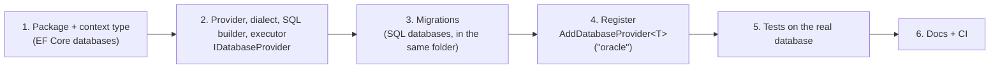

# Adding a database provider

Adding a database means three things: **create a provider, implement the interface, register it**. The router,
the service, the configuration loader and the CMS code don't change. This page walks through Oracle as an example;
the same steps apply to MariaDB, CockroachDB, CosmosDB or anything else with a .NET driver.



## 1. Package and context type

Add the EF Core provider to `Directory.Packages.props`, and a `PackageReference` in
`src/DotNetForge.Data/DotNetForge.Data.csproj`:

```xml
<PackageVersion Include="Oracle.EntityFrameworkCore" Version="10.x" />
```

Everything for the new database goes in its own folder, `src/DotNetForge.Data/Database/Providers/Oracle/` (namespace
`DotNetForge.Data.Database.Providers.Oracle`), including its migrations. Nothing in that folder is shared with
another database ([providers → Isolation](providers.md#isolation-and-updates)). SQL databases get their own context
type, so they get their own migration set:

```csharp
// src/DotNetForge.Data/Database/Providers/Oracle/OracleDbContext.cs
public sealed class OracleDbContext : DotNetForgeDbContext
{
    public OracleDbContext(DbContextOptions<OracleDbContext> options) : base(options) { }

    // Database-specific model adjustments go here, never into DotNetForgeDbContext
    // (example: SqlServerDbContext makes SystemState.Id non-identity).
}
```

## 2. The provider

A SQL database is four files next to the context. **Start by copying a SQL folder whose syntax is closest** (for
Oracle, `SqlServer/`: `OFFSET … FETCH`), rename the `SqlServer` prefix to `Oracle`, then change what differs:

| File | Copied from | Change |
| --- | --- | --- |
| `OracleDialect.cs` | `SqlServerDialect.cs` | identifier quoting, parameter prefix (`:p0`), paging, LIKE escaping, aggregate casts |
| `OracleSqlBuilder.cs` | `SqlServerSqlBuilder.cs` | usually only the names; it calls `OracleDialect` for everything database-specific |
| `OracleExecutor.cs` | `SqlServerExecutor.cs` | the driver's factory (`OracleClientFactory.Instance`) |
| `OracleDatabaseProvider.cs` | `SqlServerDatabaseProvider.cs` | detection, settings validation, `Configure` (EF Core), error codes |

The provider implements `IDatabaseProvider` directly; there is no base class:

```csharp
// src/DotNetForge.Data/Database/Providers/Oracle/OracleDatabaseProvider.cs (excerpt)
public sealed class OracleDatabaseProvider : IDatabaseProvider
{
    private static readonly string MigrationsAssembly = typeof(OracleDatabaseProvider).Assembly.FullName!;

    public string DisplayName => "Oracle";

    // Return true only when the connection string can't belong to another database.
    public bool CanHandle(string? connectionString) => false;

    public void AddDbContext(IServiceCollection services, DatabaseSettings settings) =>
        services.AddDbContext<DotNetForgeDbContext, OracleDbContext>(options => Configure(options, settings.ConnectionString!));

    public Task InitializeSchemaAsync(DotNetForgeDbContext db, CancellationToken cancellationToken) =>
        db.Database.MigrateAsync(cancellationToken);

    public IDatabaseExecutor CreateExecutor(DatabaseSettings settings, IModel? model, ILoggerFactory loggerFactory) =>
        new OracleExecutor(settings, model is null ? DatabaseSchema.Unmapped : Schema(model));

    /// <summary>Also used by <c>DesignTimeDbContextFactory</c>.</summary>
    public static void Configure(DbContextOptionsBuilder options, string connectionString) =>
        options.UseOracle(connectionString, sql => sql.MigrationsAssembly(MigrationsAssembly));

    public DatabaseException? TranslateException(Exception exception) => exception switch
    {
        DatabaseException translated => translated,
        OracleException { Number: 1017 } => new DatabaseAuthenticationException("Oracle rejected the credentials.", exception),
        OracleException { Number: 1 } => new DatabaseConflictException("A record with the same unique value already exists.", exception),
        OracleException { Number: 942 } => new DatabaseNotFoundException("The table or column does not exist.", exception),
        OracleException { Number: 12170 or 12541 } => new DatabaseConnectionException("Oracle could not be reached.", exception),
        TimeoutException => new DatabaseTimeoutException("The database command timed out.", exception),
        DbException => new DatabaseQueryException("The database rejected the command.", exception),
        _ => null,
    };

    // Normalize, Describe, Schema and the connection-string helpers: as in the copied provider.
}
```

A database that is **not SQL** implements `IDatabaseProvider` the same way (see `MongoDbDatabaseProvider`):
- **`Normalize`**: validate the settings.
- **`AddDbContext`**: register `DotNetForgeDbContext` with its EF Core provider, or throw
  `DatabaseConfigurationException` if it can't host the CMS model.
- **`InitializeSchemaAsync`**: create its collections and indexes.
- **`CreateExecutor`**: return an `IDatabaseExecutor` that translates `DatabaseCommand`s with the native driver.
  - Use typed values, never strings.
  - Validate unmapped names with `DatabaseSchema.EnsureIdentifier`.
  - Convert values with `ValueCoercion`.
- **`TranslateException`**.

A provider that only serves **named databases** (no CMS model, e.g. a key-value store) can throw
`DatabaseConfigurationException` from `AddDbContext` and implement just the commands it supports. Unsupported
operations raise `DatabaseProviderException`.

## 3. Migrations (SQL databases)

Add a design-time factory next to the others in `src/DotNetForge.Data/DesignTimeDbContextFactory.cs`, then generate
the initial migration into the database's folder:

```bash
dotnet ef migrations add InitialCreate --project src/DotNetForge.Data --startup-project src/DotNetForge.Data \
  --context OracleDbContext --output-dir Database/Providers/Oracle/Migrations
```

Later migrations land in the same folder automatically (EF Core follows the existing snapshot), but the commands in
[database → Migrations](../architecture/database.md#migrations) pass `--output-dir` anyway. Add the context to that
loop and to `.vscode/tasks.json`: from then on, every schema change adds a migration for this context too. Check the
generated SQL for:
- **index key length limits**: every indexed text column in the model has a `HasMaxLength`;
- **identity columns** that receive explicit values;
- **date and Guid types.**

## 4. Register

```csharp
// src/DotNetForge.Data/Database/DatabaseServiceCollectionExtensions.cs → AddDefaultDatabaseProviders
.AddDatabaseProvider<OracleDatabaseProvider>("oracle")
```

Or, to keep it out of the defaults, add the line in `DependencyRegistration` (or an application's own startup)
after `AddDefaultDatabaseProviders()`. `DATABASE_PROVIDER=oracle` now selects it. Nothing else changes: no switch
statement, no enum, no edits to the router, the service or the loader.

## 5. Tests

1. Add the provider to `DatabaseProviderTests`:
   - name resolution;
   - validation messages;
   - a `Describe` case proving credentials are not shown;
   - detection, if `CanHandle` can ever return true.
2. Add the builder to `DatabaseTranslationTests` (a `SqlBuilder` entry, plus its exact SQL in `Selects`, `Pagings`
   and `Aggregates`); the shared expectations then run against it too.
3. Add an unreachable-server case to `DatabaseConnectionTests`.
4. Add the server to `TestDatabaseServer` (`DNF_TEST_ORACLE`) and run **the whole integration suite** on it:

   ```bash
   DNF_TEST_ORACLE="User Id=system;Password=…;Data Source=localhost:1521/FREEPDB1" dotnet test tests/DotNetForge.IntegrationTests
   ```

   Every test must pass; the contract tests (`DatabaseServiceContractTests`) cover CRUD, interoperability with EF
   Core, keys, text matching, conflicts and transactions.
5. Add a wrong-credentials case to `DatabaseCredentialTests`.

## 6. Docs and CI

- [providers.md](providers.md): a row in the provider table, plus provider notes.
- [configuration.md](configuration.md): an example connection string, and detection if any.
- `.env.example` and `docker/compose.dev.yml` (an opt-in profile).
- `.github/workflows/ci.yml`: a `database-providers` matrix entry that starts the server and sets the test variable.
