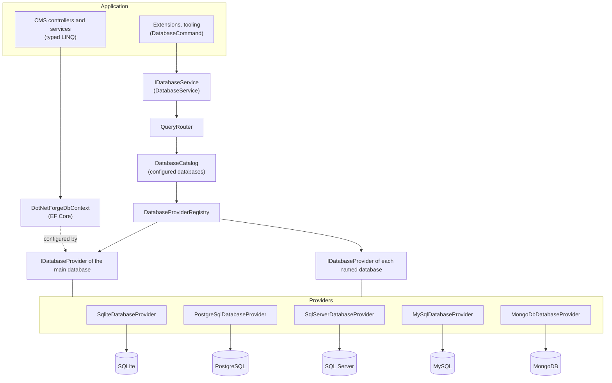
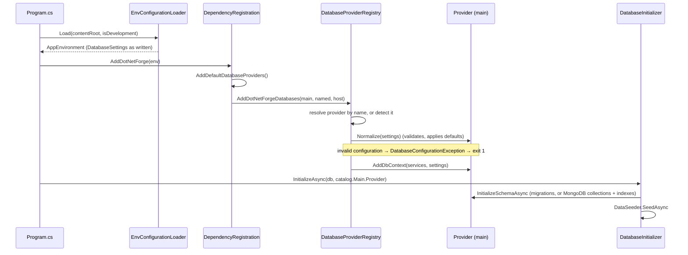
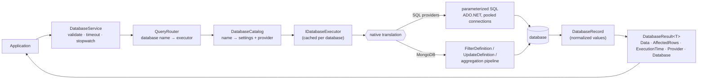

# Database architecture

DotNetForge runs on **SQLite, PostgreSQL, SQL Server, MySQL or MongoDB**, and new databases can be added without
changing application code. This page explains how the database layer is put together. The other pages cover:
[providers](providers.md), [query routing](query-routing.md), [configuration](configuration.md),
[MongoDB](mongodb.md), [security](security.md) and [adding a provider](adding-a-provider.md).

## Two ways to reach a database

| | EF Core (`DotNetForgeDbContext`) | `IDatabaseService` |
| --- | --- | --- |
| Used by | the CMS itself: every controller and service in `src/` | extensions, tooling, additional databases |
| Queries | typed LINQ, change tracking, migrations | structured [`DatabaseCommand`](query-routing.md)s |
| Databases | the **main** database only | the main database and any [named database](configuration.md#more-databases) |
| Provider-specific code | none in application code: the provider configures EF Core | none: the provider's executor translates commands |

Both paths go through the same provider, so the CMS and `IDatabaseService` always agree on the database, the schema
and the value formats. EF Core is itself a provider/adapter layer: LINQ is translated per database. The CMS keeps
it because typed queries, change tracking and migrations would otherwise have to be rebuilt by hand.
`IDatabaseService` adds what EF Core does not cover: one structured API for any configured database, MongoDB-native
execution, consistent results and errors.



## Components

| Component | File | Responsibility |
| --- | --- | --- |
| `IDatabaseService`, `DatabaseCommand`, `DatabaseFilter`, `DatabaseResult<T>`, `DatabaseRecord`, exceptions | `src/DotNetForge.Abstractions/Database/` | Provider-neutral contracts; no dependencies, so extensions can use them |
| `DatabaseSettings` | `src/DotNetForge.Shared/Configuration/DatabaseSettings.cs` | One configured database as read from the environment |
| `IDatabaseProvider`, `IDatabaseExecutor` | `src/DotNetForge.Data/Database/IDatabaseProvider.cs` | What a database technology must implement |
| `DatabaseProviderRegistry` | `src/DotNetForge.Data/Database/DatabaseProviderRegistry.cs` | Name → provider; detection from the connection string |
| `DatabaseCatalog` | same file | The resolved databases (main + named) |
| `QueryRouter` | `src/DotNetForge.Data/Database/QueryRouter.cs` | Database name → executor; one executor per database, created once |
| `DatabaseService` | `src/DotNetForge.Data/Database/DatabaseService.cs` | Validation, timeouts, timing, error translation, logging |
| `DatabaseCommandValidator` | `src/DotNetForge.Data/Database/DatabaseCommandValidator.cs` | Shape checks before any provider is involved |
| `DatabaseSchema`, `CollectionMap`, `FieldMap` | `src/DotNetForge.Data/Database/DatabaseSchema.cs` | Model names → table/column or collection/element names; name validation |
| `ValueCoercion` | `src/DotNetForge.Data/Database/ValueCoercion.cs` | Values to the model's types and back (Guid, enum, UTC dates) |
| SQL providers and executor | `src/DotNetForge.Data/Database/Relational/` | Dialects, parameterized SQL builder, ADO.NET executor, SQLite/PostgreSQL/SQL Server/MySQL |
| MongoDB provider and executor | `src/DotNetForge.Data/Database/MongoDb/` | EF Core MongoDB context, native driver executor, key generators |
| Registration | `src/DotNetForge.Data/Database/DatabaseServiceCollectionExtensions.cs` | `AddDatabaseProvider<T>(name)`, `AddDefaultDatabaseProviders()`, `AddDotNetForgeDatabases(...)` |

## Startup



Configuration problems stop the process before it serves anything: `Program.cs` prints
`[DotNetForge] Configuration error: <message>` and exits with code 1.

## Command flow



Details: [query routing](query-routing.md).

## Errors

Providers translate their driver's exceptions into a small, common set. Every one keeps the driver exception as
`InnerException`, and the service adds `Provider`, `Database`, `Operation` and `Collection`:

| Exception | Raised when |
| --- | --- |
| `DatabaseConnectionException` | the server can't be reached, or the connection broke |
| `DatabaseAuthenticationException` | wrong credentials or missing permission |
| `DatabaseTimeoutException` | the command exceeded its timeout (caller cancellation stays an `OperationCanceledException`) |
| `DatabaseQueryException` | the command is invalid, or the database rejected it |
| `DatabaseNotFoundException` | unknown database name, table/collection or field |
| `DatabaseConflictException` | a unique index or key was violated |
| `DatabaseProviderException` | the provider can't do it (e.g. `DeleteOne` without a key, MongoDB transactions without a replica set) |
| `DatabaseConfigurationException` | invalid configuration (startup) |

Exceptions that are not database errors (bugs such as `InvalidOperationException`) are **not** translated; they
surface unchanged.

Messages are written by DotNetForge, not copied from the driver, because driver messages can echo data (for
example a duplicate value). The `Try*` methods (`TryQueryAsync`, `TryExecuteAsync`) return
`DatabaseResult { Success = false, Error = ... }` instead of throwing. `TestConnectionAsync` never throws for
database errors.

## Results

`DatabaseResult<T>` has the same shape for every provider:

- `Data`
- `Success` / `Error`
- `AffectedRows`: records read, written or counted
- `ExecutionTime`
- `Provider`: display name
- `Database`: configured name

Records are `DatabaseRecord`s, case-insensitive dictionaries holding the model's property names and normalized
.NET values:
- `Guid`;
- UTC `DateTime`;
- enums as numbers;
- `long` / `double` / `decimal`;
- `string`.

`record.Get<T>("Field")` converts. No driver type (`BsonDocument`, `DbDataReader`) leaves the provider.

## Logging

`DatabaseService` logs with these fields:
- database
- provider
- operation
- collection
- elapsed milliseconds
- record count

```text
dbug: Database main (PostgreSQL) Find Users: 12 records in 23.4 ms
info: Slow database command: main (MongoDB) Aggregate AuditLogs: 40 records in 812.0 ms
warn: Database reports (MySQL) InsertOne events failed after 3.1 ms: DatabaseConflictException: A record with the same unique value already exists.
```

Successful commands log at Debug, commands slower than 500 ms at Information, and failures at Warning. Values,
connection strings and driver messages are never logged ([security](security.md#logging)).

## Performance

- **Clients and pools are reused.**
  - SQL executors open short-lived connections from the driver's pool.
  - MongoDB uses one `MongoClient` per connection string for the whole process, shared with EF Core.
  - Executors are created once per configured database (`QueryRouter`).
- **Everything is async and cancellable.**
  - Every operation takes a `CancellationToken`.
  - A per-command timeout (default 30 s, `DatabaseCommand.Timeout`) cancels the operation server-side as well:
    `CommandTimeout` for SQL, `MaxTime` for MongoDB.
- **Streaming.**
  - `StreamAsync` yields records straight from the data reader or server cursor without buffering.
  - `QueryAsync` buffers, so use paging (`Skip`/`Take`) or streaming for large results.
- **Efficient paging.** Paging happens in the database (`LIMIT/OFFSET`, `OFFSET … FETCH`, `$skip/$limit`), never in
  memory.
- **Minimal mapping.** Records are built once from the reader/cursor with the model's types; there is no
  intermediate serialization.

## Rules for code in this repository

- CMS code keeps using LINQ against `DotNetForgeDbContext`, and must stay portable:
  - one table per query;
  - no navigation properties crossing tables inside a query;
  - no joins.
  - Combine small, single-table queries in memory instead. MongoDB enforces this; see
    [MongoDB → Query rules](mongodb.md#query-rules).
- No database-specific code outside `src/DotNetForge.Data/Database/` and the per-provider context types.
- Schema changes need a migration for **every SQL context** (SQLite, PostgreSQL, SQL Server, MySQL); MongoDB picks up
  new collections and indexes at startup ([database.md → Migrations](../architecture/database.md#migrations)).
