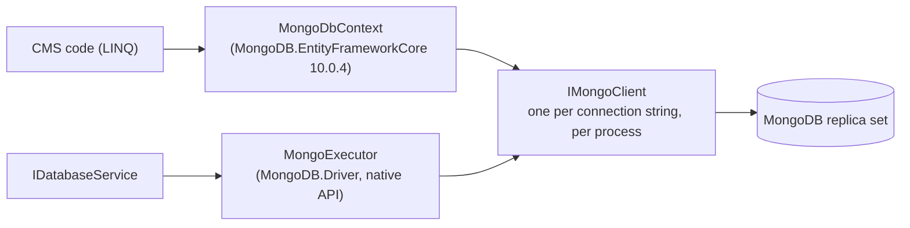

# MongoDB

MongoDB is a full provider: the whole CMS (setup, sign-in, pages, media, API) and `IDatabaseService` run on it.
The integration suite passes on MongoDB 8.0 exactly as on the SQL databases.

## Requirements

- **MongoDB 5.0 or later, as a replica set or sharded cluster.** Atlas is always one.
  - The CMS saves several documents at once (installation, seeding, role assignment), and the EF Core MongoDB
    provider wraps those saves in a transaction.
  - A standalone server rejects transactions, so multi-document saves fail.
  - For development, a single-node replica set is enough: `docker compose -f docker/compose.dev.yml --profile mongodb up -d`.
- **A database name in the URL path** (`mongodb://host:27017/dotnetforge`). MongoDB also authenticates against
  that database, so add `authSource=admin` for a user created in `admin` (such as the root user of the Docker image).

```env
DATABASE_PROVIDER=mongodb
DATABASE_CONNECTION_STRING=mongodb+srv://cms:<secret>@cluster0.example.mongodb.net/dotnetforge
# local single-node replica set:
# DATABASE_CONNECTION_STRING=mongodb://localhost:27017/dotnetforge?replicaSet=rs0&directConnection=true
```

## How it is built



- **One client.**
  - `MongoDbDatabaseProvider` creates one `MongoClient` per connection string for the whole process. The client is
    the connection pool and is thread-safe.
  - EF Core and the native executor share it, so there are never two pools for one database.
- **EF Core MongoDB provider for the CMS model** (`MongoDbContext`, `src/DotNetForge.Data/Database/Providers/MongoDb/`). Each
  entity is a collection named like its table (`Users`, `Pages`, …), and properties are document fields.
- **The native driver for `DatabaseCommand`s** (`MongoExecutor`):
  - `Find` with sort, skip, limit and projection;
  - `CountDocuments`;
  - `InsertOne`/`InsertMany`;
  - `UpdateOne`/`UpdateMany` with `$set`;
  - `DeleteOne`/`DeleteMany`;
  - aggregation pipelines (`$match` → `$group` → `$project` → `$sort/$skip/$limit`).
  - Filters use the driver's typed `FilterDefinitionBuilder`, never JSON strings.

## Schema without migrations

MongoDB has no migrations. At every start the provider calls `Database.EnsureCreatedAsync()`, which:
- creates missing collections;
- creates the model's indexes, including the **unique** ones (`Users (TenantId, Email)`, `Settings (TenantId, Key)`,
  page slugs, …). Uniqueness is therefore enforced by the database, as on SQL.

Limits:
- **Existing indexes are matched by name and never changed or dropped.** Changing an index definition in the model
  needs a manual `dropIndex` (or a new index name).
- **Renamed or removed properties stay in existing documents** until rewritten. Plan data changes as scripts.

## Keys

| Model key | Stored as |
| --- | --- |
| `Guid` (most entities) | `_id`, BSON binary subtype 4 (standard UUID) |
| Composite (`UserRoles`: UserId + RoleId) | `_id: { UserId: …, RoleId: … }` |
| `long` identity (`AuditLogs`) | `_id` from `MongoLongKeyGenerator`: milliseconds since 2020 in the high bits, 20 random bits below, so entries stay time-ordered |
| `int` identity (`DataProtectionKeys`) | `_id` from `MongoIntKeyGenerator`: random positive int (a few keys per year) |
| `int` constant (`SystemState`, always 1) | `_id: 1` |

MongoDB never generates integer keys, so `MongoDbContext` registers the two generators. `IDatabaseService` inserts
use them too.

Enums are stored as numbers, dates as BSON dates (UTC, millisecond precision), decimals as `Decimal128`.

## Query rules

The EF Core MongoDB provider translates single-collection LINQ well. Queries that cross collections are where it
stops:
- **joins:** supported only since 10.0.3 (August 2026), and recent releases fixed wrong results;
- **navigation properties inside a query**, e.g. `r.UserRoles.Count` in a `Select`: rejected;
- **correlated subqueries on another DbSet:** rejected;
- **`GroupBy`:** rejected.

CMS code therefore follows one rule on every provider: **one collection per query; combine in memory.** Examples:
- the role list counts users with a second query on `UserRoles`;
- sign-in reads role IDs, then role names.

See `src/DotNetForge.Web/Areas/Admin/Controllers/AdminListControllers.cs` and
`src/DotNetForge.Web/Services/AuthService.cs`. `GroupBy` over results already in memory is fine.

## Operations

- **Version pinning.**
  - `MongoDB.EntityFrameworkCore` is pinned exactly (`[10.0.4]` in `Directory.Packages.props`). Its versions follow
    EF Core, not semantic versioning, so patch releases have changed storage formats and behavior before.
  - Upgrade deliberately and run the MongoDB integration tests (`DNF_TEST_MONGODB`).
- **Timeouts.** Server selection fails after 30 s by default (`serverSelectionTimeoutMS` in the URL). Each command
  also gets `MaxTime` from its timeout.
- **Backups.** Use `mongodump` or Atlas backups, together with the media bucket ([deployment](../guides/deployment.md#backups)).
- **Errors.**
  - duplicate key → `DatabaseConflictException`;
  - authentication → `DatabaseAuthenticationException`;
  - no server reachable → `DatabaseConnectionException`;
  - `MaxTime` exceeded → `DatabaseTimeoutException`;
  - transactions on a standalone server → `DatabaseProviderException` ("MongoDB transactions need a replica set or
    sharded cluster").
- **Test quirk.** EF Core creates one internal service provider per MongoDB database name. Test runs with many
  databases exceed EF's limit of 20, so `MongoDbDatabaseProvider` logs `ManyServiceProvidersCreatedWarning` instead
  of throwing. A deployment uses one database and never reaches it.
