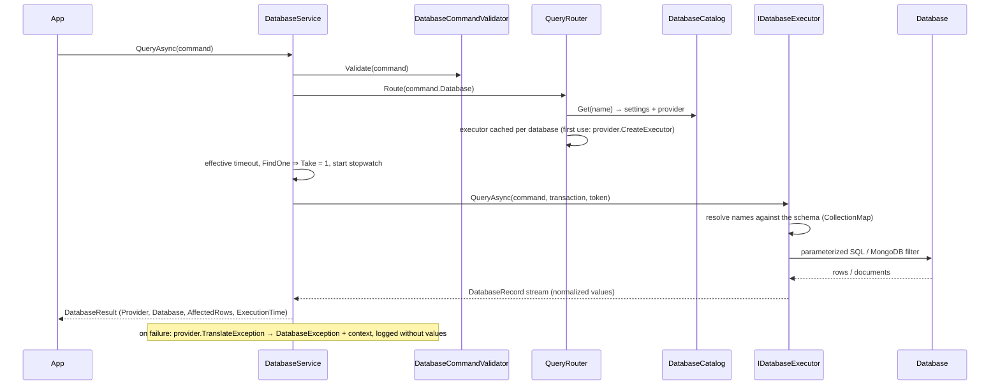

# Query routing

How a `DatabaseCommand` gets from application code to the right database. Architecture: [architecture](architecture.md).

## Using the service

Inject `IDatabaseService` (`DotNetForge.Abstractions.Database`):

```csharp
public sealed class ReportService(IDatabaseService db)
{
    public async Task<IReadOnlyList<DatabaseRecord>> RecentFailuresAsync(Guid tenantId, CancellationToken ct)
    {
        var result = await db.QueryAsync(
            DatabaseCommand.Find("AuditLogs",
                    DatabaseFilter.Eq("TenantId", tenantId) & DatabaseFilter.Eq("Success", false))
                .OrderByDescending("Timestamp")
                .Page(0, 50)
                .Select("Action", "Timestamp", "IpAddress"),
            cancellationToken: ct);

        return result.Data!;   // result.Provider, result.ExecutionTime, result.AffectedRows are filled in too
    }
}
```

The same code runs unchanged on SQLite, PostgreSQL, SQL Server, MySQL and MongoDB.

| Method | Operations | Returns |
| --- | --- | --- |
| `QueryAsync` | Find, FindOne, Aggregate | `DatabaseResult<IReadOnlyList<DatabaseRecord>>` |
| `ExecuteAsync` | Count, InsertOne, InsertMany, UpdateOne, UpdateMany, DeleteOne, DeleteMany | `DatabaseResult<long>`: count or affected records |
| `StreamAsync` | Find, Aggregate | `IAsyncEnumerable<DatabaseRecord>`, unbuffered |
| `TryQueryAsync`, `TryExecuteAsync` | as above | failures as `Success = false` instead of exceptions |
| `BeginTransactionAsync(database)` | | `IDatabaseTransaction`; pass it to the commands; dispose without commit = rollback |
| `TestConnectionAsync(database)` | | latency and a credential-free server description; never throws for database errors |
| `Databases` | | the configured databases (name, provider, server) |

## The command model

```text
DatabaseCommand
├── Operation      Find · FindOne · Count · InsertOne · InsertMany · UpdateOne · UpdateMany · DeleteOne · DeleteMany · Aggregate
├── Collection     "Users" (table or collection; for the main database also the entity name "User")
├── Database       null = main; "reports" = DATABASES_REPORTS_*
├── Filter         DatabaseFilter tree (below)
├── Fields         projection; null = all fields
├── Sort           DatabaseSort(Field, Descending)…
├── Skip / Take    paging, applied in the database
├── Documents      records to insert
├── Set            field values for updates
├── Aggregation    GroupBy fields + accumulators (Count, Sum, Min, Max, Average)
└── Timeout        per command; default 30 s
```

There is no separate "parameters" bag. Nothing is ever built from strings, so every value is a parameter
automatically.

**Filters:**
- `DatabaseFilter.Eq/Ne/Gt/Gte/Lt/Lte(field, value)`
- `In(field, values)`
- `Contains/StartsWith(field, text, ignoreCase)`
- `And/Or(...)`
- the `&`, `|` and `!` operators

`Eq(field, null)` is an IS NULL test. `In` with no values matches nothing.

**Text matching is literal.** `%`, `_`, `[` (SQL) and regex characters (MongoDB) are escaped. With
`ignoreCase: false` the database's own rules apply:
- case-sensitive: PostgreSQL, MongoDB;
- case-insensitive by default: SQL Server, MySQL, SQLite (ASCII).

`ignoreCase: true` is case-insensitive everywhere.

**Values are converted to the field's type** (`ValueCoercion`), so commands mean the same on every provider:
- `Eq("Status", 1)` and `Eq("Status", "Disabled")` both match the enum field.
- A Guid may be passed as text.
- Dates come back as UTC `DateTime`.
- SQL parameters use EF Core's type mapping for the field, so the service stores and compares values exactly as
  EF Core does (e.g. Guids as text on SQLite, binary UUIDs on MongoDB).

**Writes that could touch every record need an explicit filter.**
- `UpdateMany`, `DeleteMany`, `UpdateOne` and `DeleteOne` are rejected without one.
- Pass `DatabaseFilter.And()` (an empty AND, which matches everything) to really mean "all".
- `UpdateOne`/`DeleteOne` affect the first match in the command's sort order. SQL has no portable form of this, so
  the key of the first match is read and the write targets that key, inside a transaction. This needs a key, which
  model tables have; on a database without a model, use the `*Many` form with a filter that matches one record.
- Key fields can't be updated.

**Inserts** fill in a missing single `Guid` key. Database-generated keys are left to the database: identity columns
on SQL, and the time-ordered key generator on MongoDB. Required fields without a database default must be supplied,
because CLR property initializers don't run for commands.

## Routing



There is no `switch` over database types anywhere:
- the catalog maps names to providers;
- each provider returns its own executor;
- each executor knows only its own database.

## Names and schema

For the **main database**, names are checked against the CMS's EF Core model (`DatabaseSchema.FromModel`):
- **Collections** are found by table/collection name (`Users`) or entity name (`User`).
- **Fields** are the model's property names (`Email`). The provider maps them to native names:
  - column names for SQL;
  - element names for MongoDB, where the key is `_id` and parts of a composite key are `_id.<Part>`.
- **Unknown names** raise `DatabaseNotFoundException` before anything reaches the database.

For a **named database without a model**:
- Names are used as written, but must be plain identifiers (`^[A-Za-z_][A-Za-z0-9_]{0,127}$`). This rules out SQL
  syntax, MongoDB operators (`$`) and paths (`.`).
- A `Find` without `Fields` returns every column/field.

## Provider-specific operations

The command model covers the common operations without inventing a query language. When a feature exists in only
one database, use that database's own driver instead of stretching the command model. Examples are a PostgreSQL
full-text search, or a MongoDB `$lookup` across collections.

1. Inject `DatabaseCatalog` (`DotNetForge.Data.Database`).
2. Read `catalog.Get("reports").Settings` (provider name, normalized connection string, database name).
3. Create the driver's client once (as a singleton) and keep that code inside one class, so the rest of the
   application stays provider-neutral.

The CMS itself keeps using EF Core LINQ ([architecture](architecture.md)).

## Transactions

```csharp
await using var tx = await db.BeginTransactionAsync();            // main database
await db.ExecuteAsync(DatabaseCommand.InsertOne("Settings", a), tx);
await db.ExecuteAsync(DatabaseCommand.UpdateMany("Settings", f, set), tx);
await tx.CommitAsync();                                           // or dispose to roll back
```

- **SQL:** a database transaction on its own pooled connection.
- **MongoDB:** a client session. This needs a replica set; otherwise you get `DatabaseProviderException`.
- A transaction belongs to one database. Using it with another database is rejected.
