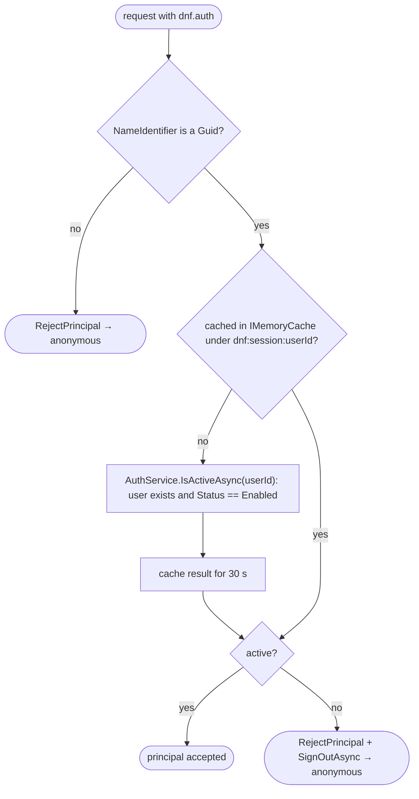

# Authentication

Two independent schemes, both registered in `src/DotNetForge.Web/Startup/DependencyRegistration.cs`:

| Scheme | Name | Used for | Credential | Selected by |
| --- | --- | --- | --- | --- |
| Cookie (default) | `CookieAuthenticationDefaults.AuthenticationScheme` ("Cookies") | admin area, extension views | email + password → cookie `dnf.auth` | default scheme |
| API token | `ApiTokenDefaults.Scheme` = `"ApiToken"` | `/api/*` | `Authorization: Bearer dnf_<prefix>_<secret>` | `[Authorize(AuthenticationSchemes = "ApiToken")]` on `ApiControllerBase` |

A cookie never authenticates an API call and a token never authenticates an admin screen. Authorization (who may do
what once authenticated) is in [authorization.md](authorization.md).

## Cookie sign-in

Screens: [Sign in](../pages/login.md), [Access denied](../pages/access-denied.md). Flow diagram:
[data-flow.md → Authentication flow](../architecture/data-flow.md#authentication-flow-admin-sign-in).

### Cookie options

| Option | Value |
| --- | --- |
| `LoginPath` | `/account/login` |
| `LogoutPath` | `/account/logout` |
| `AccessDeniedPath` | `/account/denied` |
| `ExpireTimeSpan` | 8 hours, `SlidingExpiration = true` |
| `Cookie.Name` | `dnf.auth` |
| `HttpOnly` | `true` |
| `SameSite` | `Lax` |
| `SecurePolicy` | `Always` outside Development; `SameAsRequest` in Development (Secure only over HTTPS) |
| `Events.OnValidatePrincipal` | `ValidateSessionAsync` - see [Session re-validation](#session-re-validation) |

`Always` means the browser never sends the cookie over plain HTTP, so production must be served over HTTPS (directly
or through a TLS-terminating proxy with forwarded headers - [deployment](../guides/deployment.md#behind-a-reverse-proxy)).

### Sign-in request (`POST /account/login`)

1. Rate limit `credentials` (10 per minute per client IP, `429` beyond) - see [Rate limiting](#rate-limiting).
2. Antiforgery check.
3. `AuthService.GetDefaultTenantIdAsync` → `AuthService.ValidateAsync(email, password, tenantId)` (below).
4. Success → `SignInAsync` (cookie), then `HttpContext.User` is set to the new principal so the `user.login` audit
   entry carries the user and tenant, then `LocalRedirect(Url.IsLocalUrl(returnUrl) ? returnUrl : "/admin")` - a
   missing or external `returnUrl` goes to the dashboard.
5. Failure → message per status, `user.login.failed` with the typed email ([audit logging](audit-logging.md)).

### `AuthService.ValidateAsync(email, password, tenantId)`

1. Trim the email and find the user by **exact** `(TenantId, Email)` - the comparison is whatever the database
   collation does (case-sensitive on SQLite's default `BINARY` and on PostgreSQL), so `Admin@x.com` ≠ `admin@x.com`.
2. Not found → `InvalidCredentials` (no counter change - neutral response against enumeration).
3. `Status == Disabled` → `Disabled`.
4. `LockoutEndUtc > now` → `LockedOut`.
5. Wrong password → `FailedLoginCount++`; at `MaxFailedAttempts` (5) set `LockoutEndUtc = now + LockoutWindow`
   (15 min) and reset the count to 0 → `InvalidCredentials`.
6. Success → reset counters, set `LastLoginDate`, load role names, build the principal.

The status order means a disabled or locked account reports so even when the password is wrong; the UI shows a
different message for each ([login screen](../pages/login.md#error-handling)).

### Principal claims

| Claim type | Value |
| --- | --- |
| `ClaimTypes.NameIdentifier` | `User.Id` |
| `ClaimTypes.Name` | `User.DisplayName` (first + last name, or email) |
| `ClaimTypes.Email` | `User.Email` |
| `dnf:tenant` (`AuthService.TenantClaimType`) | `User.TenantId` |
| `ClaimTypes.Role` | one per assigned role name |

Claims are fixed at sign-in. Role changes and a lockout do **not** affect an existing cookie until it expires or the
user signs out; disabling or deleting the user does (next section).

### Session re-validation

`DependencyRegistration.ValidateSessionAsync` runs as the cookie's `OnValidatePrincipal` on every request that
carries a `dnf.auth` cookie:



- Cost: at most one indexed query per user every 30 s (`SessionValidationCacheLifetime`), per instance.
- A disabled or deleted user loses access within 30 s; the next admin request redirects to the sign-in screen.
- Only existence and `Status` are checked. Role claims are **not** refreshed - role changes apply at the next sign-in.

### Tenant choice at sign-in

`AccountController` and `SetupController` call `AuthService.GetDefaultTenantIdAsync`, which returns the **oldest
tenant** (`Tenants.OrderBy(CreatedDate)`). There is no tenant selection; see [multi-tenancy](multi-tenancy.md).

### Sign-out

`POST /account/logout` (antiforgery-protected) writes `user.logout`, signs out and redirects to `/account/login`.
Triggered by the **Sign out** button in `_AdminLayout` and the **Sign out** button (a POST form) on the denied screen.

## Rate limiting

ASP.NET Core's built-in rate limiter (`AddRateLimiter` in `DependencyRegistration.AddRateLimits`, `UseRateLimiter()`
after `UseAuthentication()` in `Program.cs`). Policy names are constants in
`src/DotNetForge.Shared/Constants/RateLimitPolicies.cs`.

| Policy | Applied to | Limit | Partition |
| --- | --- | --- | --- |
| `credentials` | `POST /account/login`, `POST /setup` | 10 requests per 1-minute fixed window, no queue | `Connection.RemoteIpAddress` |
| `api` | every API controller (`ApiControllerBase`) | 300 requests per 1-minute fixed window, no queue | `Connection.RemoteIpAddress` |

A rejected request gets `429 Too Many Requests`. Counters are in memory per instance. Behind a reverse proxy enable
forwarded headers (`ASPNETCORE_FORWARDEDHEADERS_ENABLED=true`), otherwise every client shares the proxy's address
([deployment](../guides/deployment.md#behind-a-reverse-proxy)). The rate limit is independent of the per-account
lockout.

## Data Protection keys

The cookie and the antiforgery tokens are encrypted with the ASP.NET Core Data Protection key ring, which is persisted
to the database (`AddDataProtection().SetApplicationName("DotNetForge").PersistKeysToDbContext<DotNetForgeDbContext>()`,
table `DataProtectionKeys`, migration `20261005180052_AddDataProtectionKeys`). Sessions therefore survive restarts on a
read-only filesystem and are valid on every instance that shares the database. The keys are stored **unencrypted**
(ASP.NET Core logs "No XML encryptor configured"): whoever can read the database can forge cookies.

## API token authentication

`src/DotNetForge.Api/Authentication/ApiTokenAuthenticationHandler.cs`, full lifecycle in
[headless API](headless-api.md#tokens).

| Outcome | Result |
| --- | --- |
| No `Authorization` header, or not `Bearer ` | `NoResult` → 401 challenge |
| Empty token | `Fail("Empty token.")` → 401 |
| No candidate with the prefix verifies | `Fail("Unknown token.")` → 401 |
| `Revoked` | `Fail("Token has been revoked.")` → 401 |
| `ExpirationDate <= now` | `Fail("Token has expired.")` → 401 |
| Valid | `LastUsedDate` updated when older than 5 min; principal with `NameIdentifier` = token id, `dnf:token`, `dnf:tenant`, one `dnf:permission` per key |

Performance and resilience:

- **Verification cache:** PBKDF2 verification is deliberately slow, so a successful match is remembered in
  `IMemoryCache` for 10 min under `dnf:apitoken:` + SHA-256 (hex) of the presented token - never the token itself. A
  cache hit skips the prefix lookup and hash check but still re-reads the `ApiToken` row by id, so revocation and
  expiry take effect on the next request.
- **`LastUsedDate` throttle:** written at most every 5 min per token (`LastUsedResolution`). A failed write
  (`DbUpdateException`, cancellation) is logged as a warning and never fails the request.
- Rate limited by the `api` policy ([Rate limiting](#rate-limiting)).

## Password and token hashing

| Secret | Implementation | Stored format |
| --- | --- | --- |
| Password | `Pbkdf2PasswordHasher` (PBKDF2-HMAC-SHA256, 16-byte salt, 32-byte key, 120 000 iterations) | `pbkdf2-sha256$120000$<salt b64>$<hash b64>` |
| API token | `ApiTokenFactory` (PBKDF2-HMAC-SHA256, 16-byte salt, 32-byte key, 60 000 iterations) | `60000$<salt b64>$<hash b64>` |

Both verify with `CryptographicOperations.FixedTimeEquals` and read the iteration count from the stored value, so
iterations can be raised without invalidating existing hashes.

## Not implemented

Sign-up, password reset, email confirmation, OAuth/social providers and per-provider settings
([Planned](#planned-not-implemented)) are not built. `AuthProvider` rows are seeded (Email
enabled, 16 OAuth providers disabled) but nothing reads them; **Providers** and **Advanced Settings** are
[placeholders](../pages/module-placeholders.md). There is no way to create additional users in the UI.

## Planned (not implemented)

Target behaviour from the original product specification. Nothing in this section exists in the code unless marked ✔.

### Requirements

- Built-in **Email** provider (local email + password; ✔ the cookie sign-in above) plus social/OAuth providers, each
  with Name, Status (`Enabled`/`Disabled`) and a Settings/Edit action. ✔ seeded as `AuthProvider` rows (Email enabled
  and `IsBuiltIn`; the other 16 disabled) - nothing reads them.

  | Type | Providers |
  | --- | --- |
  | Local | Email |
  | OAuth/OIDC (needs an authority/issuer URL) | Auth0, Cognito (Amazon Cognito user pools), Google, Keycloak, LinkedIn, Microsoft (Entra ID) |
  | OAuth | Discord, Facebook, GitHub, Instagram, Patreon, Reddit, Twitch, Twitter/X, VK |
  | CAS (single sign-on) | CAS |

- More providers can be installed as `authentication` extensions; they appear in the providers list with the same
  controls ([extensions](extensions.md#planned-not-implemented)).
- Sign-in in all three CMS modes ([product](../product.md)): the login screen (Traditional/Hybrid) and a login API
  (Headless; today `/api` accepts only API tokens - [headless API](headless-api.md)).
- Self sign-up, password reset, email confirmation and social login, governed by the **Advanced User Settings**.
- New users get the configured default role (role model: [authorization](authorization.md#planned-not-implemented)).
- Security integration: lockout ✔ (`AuthService`), endpoint rate limiting ✔ ([Rate limiting](#rate-limiting)),
  `Account locked` email ([email](email.md#planned-not-implemented)), session cookie `Secure` in production ✔
  ([Cookie options](#cookie-options)).

### Providers screen

`/admin/providers` (sidebar **Settings · Users & Permissions Plugin**), today a
[placeholder](../pages/module-placeholders.md) open to every admin-capable role (`ModulesController` has no role
restriction).

```text
auth0      Disabled      Edit
github     Disabled      Edit
email      Enabled       Edit
```

- One row per provider (defaults + installed `authentication` extensions): **Name** · **Status** · **Edit**.
- **Edit** opens the provider's settings: OAuth client ID, client secret, scopes, callback/redirect URL; OIDC
  providers also an authority/issuer URL. Storage candidate: `AuthProvider.SettingsJson` ✔ (max 4000 chars).
  Secrets must be stored securely and never committed to Git; [security](security.md#planned-not-implemented) asks for
  provider client secrets in `.env` - decide which applies before building.
- Enable / disable a provider. A disabled provider is hidden from the login screen and blocks new logins through it;
  accounts created through it are kept.
- `AuthProvider` has no `TenantId`: providers are global today.

### Advanced settings screen

`/admin/advanced-settings` (sidebar **Settings · Users & Permissions Plugin**), today a
[placeholder](../pages/module-placeholders.md). No entity or setting keys exist for these values.

| Setting | Type | Rule |
| --- | --- | --- |
| Default role for authenticated users | role reference | required; must reference an existing role (`Authenticated` is described as the default end-user role) |
| One account per email address | bool | `true` → no second account with the same email through another provider |
| Enable sign-ups | bool | `false` → registration is forbidden for **all** providers |
| Reset password page URL | URL | frontend page where users reset their password; valid URL; required when password reset is used |
| Enable email confirmation | bool | `true` → new users get a confirmation email and cannot sign in until confirmed |
| Email confirmation redirection URL | URL | where users land after confirming; valid URL; required when email confirmation is on |

`User.EmailConfirmed` ✔ exists (set `true` by setup) but is never checked.

### User flows

| Flow | Steps |
| --- | --- |
| Email login (delta to today) | As [Cookie sign-in](#cookie-sign-in), plus: email confirmation on and account unconfirmed → reject with "confirm your email" and offer to resend; Headless mode uses a login API instead of the form. |
| Social / OAuth login | Pick an **Enabled** provider → redirect to its authorization endpoint (client credentials + callback URL) → user authenticates there → callback with code → exchange code, read profile incl. email, validate → existing account: sign in; none: registration sub-flow (subject to **Enable sign-ups** and **One account per email address**) → session/token → redirect to destination. |
| Registration | Start via email form or a provider → **Enable sign-ups** `false` → stop → validate input (email format; for email: `PasswordPolicy` + confirmation match) → **One account per email address** and email exists under any provider → reject → create account with the default role → confirmation on: send the *Email confirmation* template ([email](email.md#planned-not-implemented)), mark unconfirmed → tell the user the next step. |
| Password reset | Submit email → always a neutral response → if the account exists: single-use, time-limited token, *Password reset* email linking to the **Reset password page URL** → user submits new password + confirmation → validate token (unexpired, unused) and password → update hash, invalidate token → redirect to login. |
| Email confirmation | Single-use, time-limited link in the confirmation email → validate token → mark confirmed, invalidate token → redirect to the **Email confirmation redirection URL**. |

The first Super Admin is created by the setup wizard, not by registration ✔ ([installation](installation.md)).

### Rules and validation

| Action | Super Admin | Admin | Editor | Author | Authenticated | Public |
| --- | :-: | :-: | :-: | :-: | :-: | :-: |
| View providers list, enable/disable a provider, edit provider settings | ✔ | ✔ | ✘ | ✘ | ✘ | ✘ |
| Edit Advanced User Settings | ✔ | ✔ | ✘ | ✘ | ✘ | ✘ |
| Install provider extensions | ✔ | ✘ | ✘ | ✘ | ✘ | ✘ |
| Sign in (any enabled provider) | ✔ | ✔ | ✔ | ✔ | ✔ | n/a |
| Register (when sign-ups are enabled) | n/a | n/a | n/a | n/a | n/a | ✔ |
| Reset own password / confirm own email | ✔ | ✔ | ✔ | ✔ | ✔ | n/a |

These settings belong to the **Users** and **Settings** permission areas.

- A provider cannot be **Enabled** while its required credentials are missing or invalid (OAuth: client ID + secret;
  OIDC: also authority/issuer URL).
- Callback/redirect URLs: valid absolute URLs, matching the `APP_URL` scheme where applicable.
- Reset password page URL and Email confirmation redirection URL: well-formed URLs, required when their feature is in
  use.
- Default role must reference an existing role; saving a missing or deleted role is rejected.
- Email format is validated on registration, login and reset requests (today the login form relies on the browser).
- One account per email `true` → email unique across all providers.
- Reset and confirmation tokens are single-use and time-limited.
- Boolean settings accept only `true`/`false`.
- Every authentication form and endpoint: input validation, CSRF (✔ login/logout), rate limiting (✔ login and
  setup, `credentials` policy).

### Edge cases

- **Sign-ups disabled, OAuth user without an account:** no account is created; "registration is disabled" message.
  Existing accounts can still sign in through OAuth.
- **Same email from a second provider with one-account-per-email on:** no second account; reject (or, by platform
  policy, treat as the same identity) - never create divergent accounts silently.
- **Unconfirmed email:** sign-in blocked with instructions; re-sending the confirmation email is possible.
- **Provider disabled while in use:** hidden from login, new logins through it blocked, accounts kept; users recover
  through another enabled provider or email/password reset. Disabling the **Email** provider removes password login
  and password-based recovery - warn the admin.
- **Repeated failures:** lockout ✔ (5 → 15 min, `AuthService`); the *Account locked* email may be sent.
- **Login flooding:** endpoint rate limiting throttles attempts independently of account lockout ✔ (`credentials`:
  10/min per IP, per instance).
- **Default role deleted later:** new registrations fail validation until a valid role is configured.
- **Reset for an unknown email:** neutral response, no enumeration.
- **Expired or reused token:** rejected; the user restarts the flow.

### Acceptance criteria

- [ ] The Providers screen lists all default providers: Email, Auth0, CAS, Cognito, Discord, Facebook, GitHub, Google, Instagram, Keycloak, LinkedIn, Microsoft, Patreon, Reddit, Twitch, Twitter/X, VK (rows ✔ seeded by `DataSeeder`; no screen).
- [ ] Each provider row shows Name, Status (Enabled/Disabled) and a working Settings/Edit action.
- [ ] Provider statuses render as in the example (`auth0 Disabled Edit`, `github Disabled Edit`, `email Enabled Edit`).
- [ ] A provider installed as an `authentication` extension appears in the list with the same controls.
- [ ] Only Super Admin and Admin can view the providers list, enable/disable providers, edit provider settings and edit Advanced User Settings; only Super Admin can install provider extensions.
- [x] A user can sign in with email and a correct password; a wrong password is rejected and increments the lockout counter (`AuthService.ValidateAsync`).
- [ ] A user can sign in through each enabled social/OAuth provider via the full redirect/callback exchange.
- [ ] A new user can register via email when sign-ups are enabled and gets the configured default role.
- [ ] With **Enable sign-ups** `false`, registration is rejected for every provider, including OAuth-driven account creation.
- [ ] With **One account per email address** `true`, an email already in use never yields a second account.
- [ ] With **Enable email confirmation** `true`, registration sends a confirmation email and unconfirmed users cannot sign in.
- [ ] A valid confirmation link marks the account confirmed and redirects to the Email confirmation redirection URL.
- [ ] Password reset emails a single-use, time-limited link to the Reset password page URL and updates the password on valid submission.
- [ ] Password reset requests respond neutrally for unknown emails.
- [ ] Enabling a provider with missing/invalid required credentials is rejected.
- [ ] An invalid Reset password page URL or Email confirmation redirection URL is rejected; the redirection URL is required when email confirmation is on.
- [ ] Saving a default role that does not reference an existing role is rejected.
- [x] After the configured number of failed attempts the account is locked and sign-in is refused until the window elapses (`AuthService`: fixed `MaxFailedAttempts` 5, `LockoutWindow` 15 min).
- [x] Login attempts are rate limited at the endpoint level (`[EnableRateLimiting(RateLimitPolicies.Credentials)]` on `AccountController.Login`: 10/min per client IP → 429).
- [ ] Disabling a provider removes it from the login screen and blocks new logins through it without deleting accounts.
- [ ] All authentication forms and APIs enforce input validation and CSRF protection, and passwords are stored only as secure hashes (CSRF on login ✔ and PBKDF2 hashing ✔; no server-side email format check on login).

## Where to change things

- Credential rules, lockout constants, claims, the active-user check: `src/DotNetForge.Web/Services/AuthService.cs`.
- Cookie options, schemes, session re-validation (`ValidateSessionAsync`), rate-limit policies (`AddRateLimits`),
  Data Protection: `src/DotNetForge.Web/Startup/DependencyRegistration.cs`. Policy names: `RateLimitPolicies`.
- Token validation, verification cache, `LastUsedDate` throttle: `ApiTokenAuthenticationHandler`. Token format:
  `ApiTokenFactory`.
- Never build a `ClaimsPrincipal` for a user anywhere else - reuse `AuthService` so claims stay consistent.
