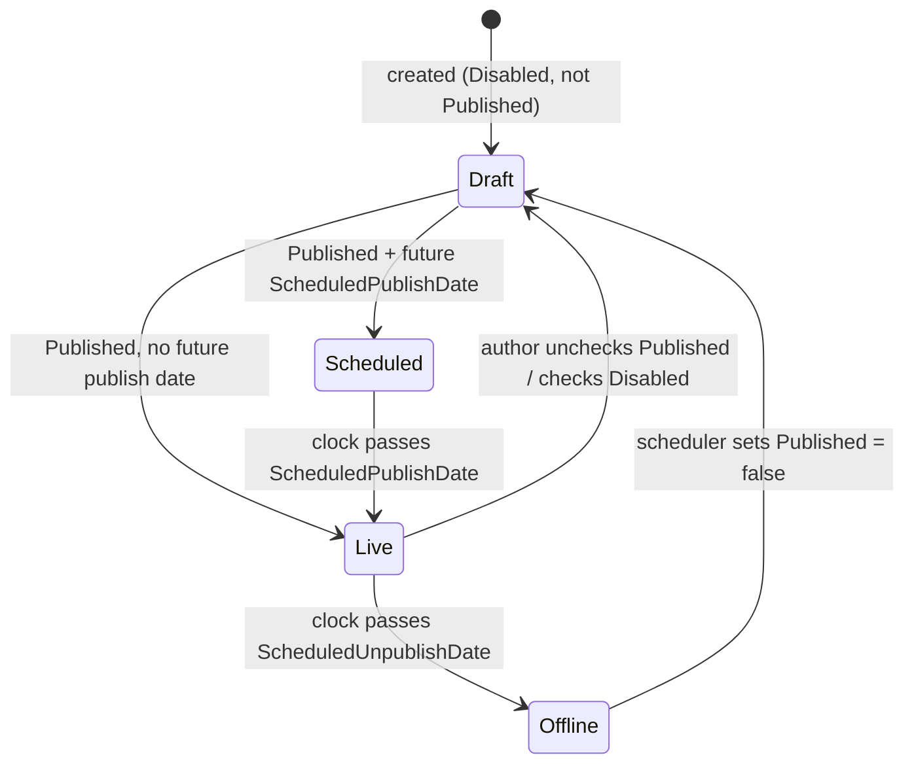
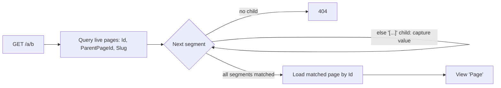
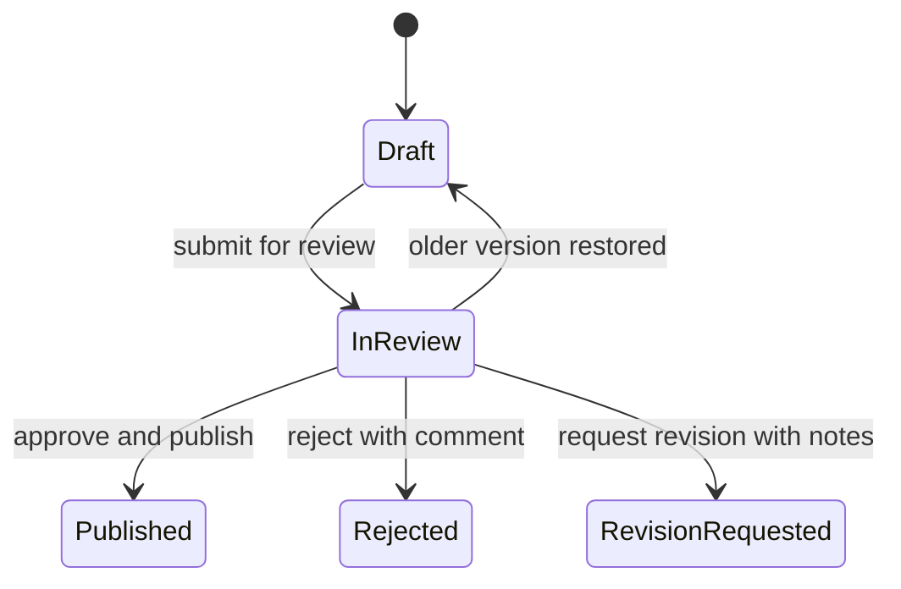
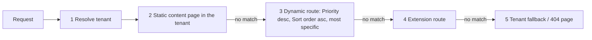

# Content pages and public routing

The authoritative description of the `Page` entity, the page tree rules, and how a public URL becomes a rendered
content page. The editing screen is [Content Manager](../pages/content-manager.md); the public screens are
[public home](../pages/public-home.md) and [public content page](../pages/public-page.md). The target content model
(collection/single types, page builder, history, review, tags, dynamic route records) is under
[Planned](#planned-not-implemented); public themes are in [themes](themes.md).

## The `Page` entity

`src/DotNetForge.Shared/Entities/Content.cs`

| Field | Meaning | Set by the Content Manager form? | Used at render? |
| --- | --- | :-: | :-: |
| `Id`, `TenantId` | identity, owning tenant | - | `TenantId` no (see [multi-tenancy](multi-tenancy.md)) |
| `Title` | display title, required (max 300) | ✔ | ✔ `<h1>`, fallback `<title>` |
| `Slug` | URL segment, unique per (tenant, parent) (max 200) | ✔ | ✔ resolution |
| `ParentPageId` | parent in the tree, `null` = root level | ✔ (dropdown, drag-and-drop) | ✔ resolution |
| `SortOrder` | position among siblings | ✔ (number, drag-and-drop) | ✔ home list order |
| `PageType` | `Standard`, `ExistingPage`, `UrlRedirect`, `File` | ✔ | ✘ every type renders the same view |
| `TargetUrl` | required when `UrlRedirect` | ✔ | ✘ |
| `FileReference` | required when `File` | ✔ | ✘ |
| `MetaTitle` | `<title>` override | ✔ | ✔ |
| `MetaDescription` | `<meta name="description">` | ✔ | ✔ |
| `CanonicalUrl` | `<link rel="canonical">` | ✔ | ✔ |
| `SeoKeywords` | comma-separated keywords | ✔ | ✘ |
| `Published` | author intent | ✔ | ✔ part of *live* |
| `Disabled` | hard off switch | ✔ | ✔ part of *live* |
| `DisplayInMenu` | menu flag | ✔ | ✘ there is no public menu |
| `ScheduledPublishDate` / `ScheduledUnpublishDate` | UTC schedule window | ✔ | ✔ part of *live* |
| `CreatedById`, `CreatedDate`, `UpdatedDate` | audit fields; `CreatedById` also decides "own page" [permissions](#permissions) (set by `ContentController.Create`, `null` for seeded and API-created pages) | - | ✘ |

There is no body/content field: the page builder is not implemented, so a live page renders only its title, slug,
dynamic route values and a fixed note.

## Page rules (`IPageService`)

Every content-page rule lives in one place: `IPageService` (`src/DotNetForge.Shared/Content/IPageService.cs`),
implemented by `src/DotNetForge.Web/Services/PageService.cs` (registered scoped). The Content Manager and the headless API call the same
methods. Each method returns the first user-facing error message or `null`, validates and mutates tracked entities,
and **never saves** - the caller saves and writes the audit entry.

| Method | Input | Callers | Audit written by the caller |
| --- | --- | --- | --- |
| `ApplyAsync(page, input, tenantId)` | `PageInput` | `ContentController.Update`, `ContentApiController.CreatePage` | `content.updated`, `content.created` |
| `ReorderAsync(positions, tenantId)` | `IReadOnlyList<PagePosition>` | `ContentController.Reorder` | `content.reordered` |
| `DeleteAsync(page)` | - | `ContentController.Delete` | `content.deleted` |

`PageInput` holds the editable fields as posted by the Content Manager form (`_PageForm.cshtml` is typed to it) or
built by the API; `PageInput.From(page)` fills it from a stored page. `PagePosition(Id, ParentPageId, SortOrder)` is
one tree position from drag-and-drop.

### `ApplyAsync` - save and create

Validates a `PageInput` against the target `Page` and, if valid, copies every field. The tenant's tree shape
(`Id`, `ParentPageId`, `Slug`) is loaded once for the parent, cycle and sibling checks. Rules in evaluation order:

| # | Rule | Error message |
| --- | --- | --- |
| 1 | `Title` not blank | `Title is required.` |
| 2 | trimmed lengths: Title 300, Slug 200 (before slugify), Meta title 300, Meta description 1000, Keywords 500, Canonical URL / Target URL / File reference 2000 (the column limits) | `<Label> must be at most <n> characters.` |
| 3 | `Slugify(input.Slug)` not empty | `A valid slug is required.` |
| 4 | `PageType` parses (case-insensitive) | `Invalid page type.` |
| 5 | parent (if any) exists in the tenant | `Parent page not found in this tenant.` |
| 6 | walking up from the new parent never reaches this page | `That parent would create a cycle in the page tree.` |
| 7 | no other page in (tenant, parent) has the slug - root level (`null` parent) included | `A page with the slug '<slug>' already exists under this parent.` |
| 8 | if the slug is `[...]`, no sibling is also `[...]` | `This parent already has a dynamic route ([…]); only one is allowed per parent.` |
| 9 | unpublish after publish when both set | `Scheduled unpublish must be after scheduled publish.` |
| 10 | `UrlRedirect` needs `TargetUrl` | `Target URL is required for a URL redirect page.` |
| 11 | `File` needs `FileReference` | `File reference is required for a File page.` |

Field mapping: `Title` trimmed; optional strings trimmed and blank → `null`; dates through `ToUtc`. Rule 2 keeps
over-long input from failing at save time (PostgreSQL enforces column lengths; SQLite does not).

### `ReorderAsync` - drag-and-drop

Validates the tree **after** all posted moves (current parents overlaid with the posted ones):

| # | Rule | Error message |
| --- | --- | --- |
| 1 | every moved page belongs to the tenant | `One of the moved pages does not exist in this tenant.` |
| 2 | every target parent belongs to the tenant | `One of the target parents does not exist in this tenant.` |
| 3 | no move creates a cycle | `That move would create a cycle in the page tree.` |
| 4 | no two siblings share a slug | `Two pages under the same parent would share the slug '<slug>'.` |
| 5 | at most one `[...]` page per parent | `A parent would get more than one dynamic route ([…]); only one is allowed per parent.` |

Only pages whose parent or sort order actually changed get a new `UpdatedDate`; an empty list is a no-op.
`ContentController.Reorder` returns `400 { error }` on failure and `admin-content.js` shows the message in an alert.

### `DeleteAsync` - delete

The page's children move up to the deleted page's parent. If that would put two equal slugs or two `[...]` pages
under one parent, the delete is refused with `Can't delete: its child pages would move up a level and clash.`
followed by the conflict message (rule 4 or 5 above); the Content Manager shows it as a form error.

### `PageService.Slugify`

1. Blank → `""`. Exactly `/` (after trim) → `/` (the reserved **root page** slug).
2. Lower-case; keep `a-z`, `0-9`, `[` and `]`; turn `-`, space and `_` into `-`; drop everything else (including
   `/`, `.` and non-ASCII letters).
3. Collapse `--` runs, trim leading/trailing `-`.

Examples: `"About Us"` → `about-us`; `"[Id]"` → `[id]`; `"news/2024"` → `news2024`; `"Ünïcode"` → `ncode`.

### `PageService.ToUtc`

The form's `datetime-local` inputs post zoneless values (`DateTimeKind.Unspecified`); they are **taken as UTC**
(the labels say "(UTC)"). `Local` kinds are converted; `Utc` kept.

### Rules that live outside `PageService`

| Behaviour | Where |
| --- | --- |
| New page defaults: title `Untitled page`, slug `new-page-<8 hex>`, `Published = false`, `Disabled = true`, `Standard`, last among siblings, `CreatedById` = current user. The parent (if any) must exist in the tenant, else 404. Does not call `ApplyAsync` | `ContentController.Create` |
| Who may create, edit, publish, delete and reorder ([Permissions](#permissions)) | `ContentController` via `AdminControllerBase.Can` / `CanModify` |
| `Published` and `Disabled` are mutually exclusive in the form | client-side only, `src/DotNetForge.Web/wwwroot/js/admin-content.js` |
| API create defaults: `Published = false`, `Disabled = false`, root level, `SortOrder = 0`, `Standard`, no `CreatedById` (fields then validated by `ApplyAsync`) | `ContentApiController.CreatePage` ([headless API](headless-api.md#create-a-page)) |

## Permissions

The Content Manager checks the signed-in user's roles against the permission area `Collection types`
(`PermissionAreas.CollectionTypes`) through `IPermissionService`. Matrix and role grants:
[authorization](authorization.md).

| Action | Needs | Refused with |
| --- | --- | --- |
| Create a page | `create` | `Forbid()` → `/account/denied` |
| Save a page | `update`, or `update.own` when `CreatedById` is the current user | `Forbid()` |
| Change `Published` or a schedule date while saving | additionally `publish` | form error `You don't have permission to publish, unpublish or schedule pages.` |
| Delete a page | `delete`, or `delete.own` on an own page | `Forbid()` |
| Reorder (drag-and-drop) | `update` | `Forbid()` |

With the built-in roles: Super Admin, Admin and Editor can do everything; an **Author** creates pages and edits or
deletes only pages they created, and cannot publish, schedule or reorder. Seeded pages have no `CreatedById`, so
Authors cannot edit them. Viewing the tree needs only the `AdminArea` policy. API tokens are checked against their
permission key instead (`content.create`, [headless API](headless-api.md)).

## Liveness

A page is **live** (publicly visible) when all of these hold at request time (`HomeController.Live`):

```text
Published && !Disabled
&& (ScheduledPublishDate   == null || ScheduledPublishDate   <= UtcNow)
&& (ScheduledUnpublishDate == null || ScheduledUnpublishDate >  UtcNow)
```



`ScheduledPublishingService` later tidies stored state (clears passed publish dates; sets `Published = false` and
clears passed unpublish dates) - it never makes a page live by itself. See
[scheduled publishing](scheduled-publishing.md).

## Public resolution

### `GET /` - `HomeController.Index`

1. Find a live page whose slug is `/` (preferred) or `home` - **any tenant, any parent**.
2. Found → render `src/DotNetForge.Web/Views/Home/Page.cshtml` with it.
3. Otherwise render `src/DotNetForge.Web/Views/Home/Index.cshtml` with every live page (title, slug) ordered by `SortOrder`.

### Any other path - `HomeController.RenderPage` (fallback)

Mapped by `app.MapFallbackToController("RenderPage", "Home")`, i.e. only paths with **no file extension** that no
other route matched.

1. Trim slashes; empty → redirect to `Index`.
2. Load only the tree shape (`Id`, `ParentPageId`, `Slug`) of **all live pages of all tenants** into memory.
3. Starting at `parent = null`, for each segment: pick the child of `parent` whose slug equals the segment
   (case-insensitive); if none, the child whose slug is `[...]`; if none → **404**.
4. When a dynamic child matched, store `routeValues[<name without brackets>] = segment`.
5. Load the matched page in full by `Id` (gone in between → 404) and render `Page` with `ViewData["RouteValues"]`.



Consequences worth knowing:

- A live page under a **non-live** parent is unreachable (the walk only sees live pages).
- The root page (`/`) is not an ancestor in URLs: its children are not reachable (a child `x` of `/` would need URL
  segment `/`, which can't occur). Top-level pages are siblings of the root page.
- Exact slugs win over a dynamic sibling. Only one dynamic sibling per parent is allowed by `PageService` on every
  write path (save, reorder, delete, API create); if older data still holds two, the first in load order wins.
- Slugs that collide with real routes (`admin`, `setup`, `account`, `api`, `error`, `health`) never reach
  `RenderPage`.
- `PageType`, `TargetUrl`, `FileReference`, `DisplayInMenu` and `SeoKeywords` have no effect on rendering.
- No caching: every public request runs a narrow tree query, walks the list, then loads the one matched page.

## Planned (not implemented)

Target behaviour from the original product specification. Nothing in this section exists in the code unless marked ✔.

Screen-level UI for these features: [Content Manager → Planned](../pages/content-manager.md#planned-not-implemented).
Public rendering: [public content page → Planned](../pages/public-page.md#planned-not-implemented). Cross-cutting
topics are owned elsewhere: roles and permissions → [authorization](authorization.md), tenant resolution →
[multi-tenancy](multi-tenancy.md), File Manager assets → [media storage](media-storage.md), themes →
[themes](themes.md), translations → [internationalization](internationalization.md), events →
[webhooks](webhooks.md), audit → [audit logging](audit-logging.md).

### Requirements

| Capability | Target | Today |
| --- | --- | --- |
| Structured content | collection types and single types with admin-defined schemas, edited in the Content Manager | ✘ only `Page` |
| Page tree | tree of the active tenant's content pages, create child, re-parent, reorder | ✔ (see above) |
| Page body | built visually with the page builder | ✘ no body field |
| Drafts and preview | edits accumulate in a draft; publish promotes the draft to the live version; preview renders the draft | ✘ one row per page, `Published` flag only |
| Content history | every change to a page or entry versioned; view, compare, restore | ✘ placeholder screen `/admin/content-history` only |
| Review workflow | submit, assign reviewers, approve and publish, reject, request revision, full review history | ✘ |
| Tags | tenant-scoped vocabulary on pages and tag-typed entry fields | ✘ |
| Per-page view permissions | view roles, view users, public vs private | ✘ every live page is anonymous |
| Per-page theme | theme, layout, page-specific layout settings ([themes](themes.md)) | ✘ |
| Page-type behaviour | `ExistingPage` aliases another page, `UrlRedirect` redirects, `File` serves/links an asset | ✘ stored only |
| Dynamic routes | pattern records with targets, SEO templates, priority, permissions ([below](#dynamic-routes)) | partial: `[name]` slugs in the tree |
| Tenant scope | tenant resolved first (domain, subdomain or path prefix); only the active tenant's content is shown, edited or rendered | admin ✔ filtered by `TenantId`; public site ✘ ([multi-tenancy](multi-tenancy.md)) |
| Concurrency | optimistic concurrency on every content item | ✘ last write wins |
| Audit | every content action recorded | ✔ admin and API actions (`content.created/updated/deleted/reordered`); scheduler changes are not audited |

### Collection and single types

- **Collection type**: many entries with one schema (e.g. News). **Single type**: exactly one entry (e.g. homepage
  hero, global footer).
- Collection entries: browse, search, filter (including by tag), create, edit, duplicate, delete, reorder. Single
  type: edit its one entry.
- Entries share the page lifecycle: draft/published, schedule, content history, review.
- Admins create custom collection and single types with arbitrary field sets; starter types are fully editable
  (add, remove, extend fields). The tenant's configured schema is authoritative.
- Field kinds implied by the starters: text, slug, body, number, boolean, choice (`severity`), datetime, list
  (`questions[]`), tags (shared vocabulary), media (reference to a File Manager asset, see
  [media storage](media-storage.md)).
- Authoring permissions use the areas `PermissionAreas.CollectionTypes` / `SingleTypes` (✔ `CollectionTypes` is
  enforced for content pages, see [Permissions](#permissions); `SingleTypes` is reference data only -
  [authorization](authorization.md)).

Starter collection types:

| Type | Purpose | Default fields |
| --- | --- | --- |
| News | news / blog articles | `title`, `slug`, `body`, `tags`, `cover image`, `publish date` |
| Events | scheduled events | `title`, `location`, `start datetime`, `end datetime`, `capacity` |
| Surveys | polls, questionnaires | `title`, `questions[]`, `open date`, `close date`, `responses` |
| Warnings | site notices / alerts | `title`, `severity`, `message`, `start`, `end`, `dismissible` |

### Page model additions

Every field the spec lists for a page already exists on `Page` and in the form (✔). What is missing:

| Item | Target | Today |
| --- | --- | --- |
| `PageType.Standard` | content from the page builder | renders title only |
| `PageType.ExistingPage` | pointer/alias to another page in the tree; needs a page reference | no reference column |
| `PageType.UrlRedirect` | redirects the visitor to `TargetUrl` | stored, not honoured |
| `PageType.File` | serves or links a File Manager asset via `FileReference` | free-text string, not honoured |
| `DisplayInMenu` | page appears in generated menus | no menu exists |
| `SeoKeywords` | rendered SEO keywords (string list or CSV) | CSV stored, not rendered |
| View roles / view users | per-page access (below) | ✘ |
| Theme, layout, layout settings | `themeId`, `layoutId`, per-page layout overrides ([themes](themes.md#planned-not-implemented)) | ✘ |
| Tags | references into the tenant tag vocabulary | ✘ |
| Defaults | spec: `Published`, `Disabled`, `DisplayInMenu` = `false`, `SortOrder` = `0` | `ContentController.Create` deliberately creates pages `Disabled = true` and last among siblings |
| Schedule effect | spec: the system sets `Published = true` at the publish time and `false` at the unpublish time | liveness is derived per request; the author must check **Published** (see [Liveness](#liveness)) |

Per-page permissions:

- **View roles**: any of the six roles (`Super Admin`, `Admin`, `Editor`, `Author`, `Authenticated`, `Public`).
  **View users**: specific users.
- A page is **public** when the `Public` role has view access; otherwise it is **private** and visible only to the
  assigned roles and users.
- Authoring (create/edit/publish) is governed by the permission areas, not by per-page settings
  ([authorization](authorization.md), enforcement in [security](security.md)).

### Page builder

- Place **built-in modules**, the built-in **Razor module** (raw Razor/markup) and **extension modules** (extension
  types `module` and `widget`) on a Standard page; each placed module has its own configuration. Contract:
  `IModuleExtension.Render(config)` (✔ interface exists, nothing calls it - [extensions](extensions.md)).
- **Preview**: renders the draft exactly as a visitor would see it; never resolvable by anonymous visitors.
- **Draft vs published**: saves go to the draft; publishing promotes the draft to the live version.
- Every save creates a content-history version.

### Content history and review

Content history record (one per saved version of a page, entry or single type):

| Field | Meaning |
| --- | --- |
| `Version` | incrementing number per content item |
| `Content type` | page, collection entry or single type |
| `Content id` | id of the versioned item (tenant-scoped) |
| `Author` | user who made the change |
| `Timestamp` | when |
| `Change summary` | optional note / diff metadata |
| `Snapshot` | serialized content state used for compare and restore |

- History lists every version with who and when; any two versions can be compared side by side.
- **Restore** creates a new version equal to the restored snapshot; the timeline is never rewritten.

Review record:

| Field | Meaning |
| --- | --- |
| `Review id` | identifier |
| `Content ref` | page/entry version under review |
| `Status` | `Draft`, `In review`, `Approved/Published`, `Rejected`, `Revision requested` |
| `Reviewer(s)` | assigned users |
| `Submitted by` / `Submitted at` | author, submission time |
| `Decision by` / `Decision at` | deciding reviewer, decision time |
| `Comments` | rejection reasons / revision notes |
| `History[]` | ordered log of every review action |



- On submission reviewers are assigned explicitly or taken from the default reviewer pool (per configuration) and
  notified ([email](email.md)); every action is appended to the review history with user, time and comments.
- Approve and publish promotes the draft to live; reject and request revision return the item to the author.
- Per tenant: review can be mandatory; direct publish (bypassing review) is a configurable permission.

### Tags

- Tenant-scoped vocabulary applied to pages and to tag-typed entry fields (e.g. News `tags`).
- Create-on-type, autocomplete, rename, merge, delete. Rename/merge update every reference in one transaction
  (roll back on failure). Delete removes the tag from all content but never deletes content.
- Tags drive filtering in the Content Manager and can feed dynamic listing routes.

### Role defaults for content

Typical defaults; the tenant's role configuration is authoritative ([authorization](authorization.md)). Today content
pages follow the built-in `Collection types` grants ([Permissions](#permissions): ✔ Author "own only" for edit and
delete, no publish); there are no entries, reviews, history or tags.

| Action | Super Admin | Admin | Editor | Author | Authenticated | Public |
| --- | :-: | :-: | :-: | :-: | :-: | :-: |
| Create collection/single type schemas | ✔ | ✔ | ✘ | ✘ | ✘ | ✘ |
| Create/edit any entry or page | ✔ | ✔ | ✔ | own only | ✘ | ✘ |
| Submit for review | ✔ | ✔ | ✔ | ✔ | ✘ | ✘ |
| Assign reviewers, approve/publish, reject, request revision | ✔ | ✔ | ✔ | ✘ | ✘ | ✘ |
| Publish directly (bypass review) | ✔ | ✔ | configurable | ✘ | ✘ | ✘ |
| Delete pages / entries | ✔ | ✔ | configurable | own only | ✘ | ✘ |
| View content history | ✔ | ✔ | ✔ | own only | ✘ | ✘ |
| Restore a previous version | ✔ | ✔ | ✔ | ✘ | ✘ | ✘ |
| Manage the tag vocabulary | ✔ | ✔ | ✔ | ✘ | ✘ | ✘ |
| View a private page | granted roles/users only | | | | | ✘ |
| View a public page | ✔ | ✔ | ✔ | ✔ | ✔ | ✔ |

### Dynamic routes

Today a page whose slug is `[name]` acts as a dynamic segment inside the page tree (✔, see
[Public resolution](#public-resolution)). The target is a separate **dynamic route** record, resolved after static
content pages and able to map to content, a module, a controller or an extension handler.

Pattern syntax: `[parameterName]` occupying a whole path segment. Examples: `/blog/[slug]`,
`/products/[category]/[productSlug]`, `/docs/[section]/[pageName]`, `/users/[username]`. `/blog/my-first-post`
against `/blog/[slug]` yields `{ "slug": "my-first-post" }`. In `/[tenantSlug]/[pageName]` the first segment is
consumed by tenant resolution before routing ([multi-tenancy](multi-tenancy.md)).

Route record (tenant-scoped; two tenants may register the same pattern):

| Field | Type | Required | Rule / default |
| --- | --- | :-: | --- |
| Route pattern | string | ✔ | starts with `/`; unique per tenant |
| Route name | string | ✔ | unique per tenant; used for reverse URL generation |
| Page title / meta title / meta description / SEO keywords / canonical URL template | string | | interpolates `{param}`, resolved content SEO fields, `{host}` |
| Target content type | string | conditional | content type to resolve against (e.g. `blogPost`) |
| Target module | string | conditional | module that renders the route |
| Target handler | string | conditional | controller action or extension-registered handler |
| Theme | string | | falls back to the tenant default theme; never affects the admin area |
| Layout | string | | falls back to the theme/page default |
| Enabled | bool | ✔ | `false` until configured; disabled routes are skipped |
| Published | bool | ✔ | `false` on create; unpublished routes resolve only in preview |
| Sort order | int | | `0`; listing order and tiebreaker |
| Priority | int | ✔ | `0`; higher is evaluated first |
| Access permissions | object | ✔ | `isPublic` (required; default private), `allowedRoles[]`, `allowedUsers[]` |

- **Target binding:** exactly one of target content type, target module, target handler.
- **Template precedence:** when the route resolves to an entry with its own SEO values, those override the template;
  otherwise the rendered template is used.
- **Extension handlers:** declared by a `module`, `plugin` or `provider` extension (manifest + `entryPoint`),
  registered when the extension is enabled, selectable as target handler, evaluated at the extension-route stage
  ([extensions](extensions.md)).
- **API:** create, update, delete and resolve routes with the same validation, conflict, permission and tenant rules
  as the admin UI. Resolve returns the matched route, extracted parameters, target binding and rendered SEO. Tokens
  need the `API` permission area and the tenant scope ([headless API](headless-api.md); no route permission key
  exists in `PermissionKeys` today).
- Preview, draft/published versions, content history and rollback apply to dynamic route pages as to content pages.

Routing order (target):



Today: no tenant step, the tree walk mixes steps 2 and 3 per segment, no extension routes, and a miss is an empty
`404`.

Role defaults for dynamic routes:

| Action | Super Admin | Admin | Editor | Author | Authenticated | Public |
| --- | :-: | :-: | :-: | :-: | :-: | :-: |
| Create/edit/delete routes, edit SEO templates and target binding | ✔ | ✔ | ✘ | ✘ | ✘ | ✘ |
| Register/select extension route handlers | ✔ | if granted | ✘ | ✘ | ✘ | ✘ |
| Publish/unpublish a route | ✔ | ✔ | own/assigned | ✘ | ✘ | ✘ |
| Edit draft content for a route | ✔ | ✔ | ✔ | own | ✘ | ✘ |
| Preview a draft route | ✔ | ✔ | ✔ | ✔ | if granted | ✘ |
| Roll back a route version | ✔ | ✔ | ✔ | ✘ | ✘ | ✘ |
| Manage routes via API | ✔ | token-scoped | ✘ | ✘ | ✘ | ✘ |
| View a published public route page | ✔ | ✔ | ✔ | ✔ | ✔ | if `isPublic` |
| View a published private route page | ✔ | ✔ | ✔ | ✔ | if in `allowedRoles`/`allowedUsers` | ✘ |

Tenant admins manage routes only in their tenants; global Super Admins in all tenants.

### User flows

UI steps for pages, entries, builder, history and review are in the
[Content Manager screen](../pages/content-manager.md#planned-not-implemented). Model-level flows:

**Save an entry or page.** Validate fields → store as draft → record a history version → optionally submit for
review or, with direct-publish permission, publish (promote draft to live, record a version).

**Schedule.** Set publish and/or unpublish date → validate order, future dates and conflicts → item goes live at the
publish time and stops at the unpublish time.

**Create a dynamic route.**

1. Enter pattern and unique route name (active tenant).
2. Validate the pattern; check conflicts with static pages and existing routes in the tenant.
3. Pick exactly one target; optionally templates, theme, layout, sort order, priority.
4. Set access permissions; save. `Enabled` and `Published` start `false`.
5. Audit the creation and record the first history version.

**Resolve a dynamic route.** Follow the routing order; on match extract parameters, check `Enabled` and
`Published`, evaluate access permissions for the current user, bind the target, render the templated title, meta,
canonical URL and keywords.

**Preview a route.** Render the draft ignoring `Published`, still applying access permissions; anonymous and
unauthorized visitors cannot resolve it.

**Publish / unpublish a route.** Publish makes the published version resolvable (subject to permissions), is audited
and records a history version. Unpublish leaves it resolvable only in preview.

**Roll back a route.** Open history → compare → restore a version as the current draft (optionally republish) →
audit the rollback.

### Rules and validation

Content (pages and entries):

| Rule | Today |
| --- | --- |
| Slug required; lower-case, URL-safe (letters, digits, hyphens); slugified on save | ✔ `PageService.Slugify` (also keeps `[` `]`) |
| Slug unique within its parent in the tenant; cross-tenant duplicates allowed | ✔ `PageService` on save, reorder, delete and API create (root level included) + unique index (`TenantId`, `ParentPageId`, `Slug`) |
| A page slug must not resolve to the same path as a dynamic route in the tenant | ✘ |
| Unpublish strictly after publish | ✔ `PageService.ApplyAsync` rule 9 |
| Schedules in the future at save (a past publish date is rejected or applied immediately, per configuration) | ✘ |
| No conflicting/overlapping schedules on the same item | ✘ |
| Enforced SEO (tenant option): `MetaTitle` and `MetaDescription` required before publish | ✘ |
| `CanonicalUrl` must be a valid absolute URL | ✘ free text |
| Parent must not create a cycle and must be in the same tenant | ✔ `ApplyAsync` rules 5-6, `ReorderAsync` rules 2-3, parent check in `ContentController.Create` (API create is root-level only) |
| `UrlRedirect` needs a valid `TargetUrl` | partial: non-blank only |
| `File` needs a `FileReference` to an existing File Manager asset | partial: non-blank only |
| `ExistingPage` needs a valid reference to another page | ✘ no field |
| Required fields of a collection/single type present before publish | ✘ |
| Datetime ranges on entries (Events start/end, Surveys open/close, Warnings start/end): end ≥ start | ✘ |
| Media fields reference assets the user may use; tag fields reference tenant tags (or create them with tag-management permission) | ✘ |
| Mandatory review + no direct-publish permission: a publish attempt becomes a review submission | ✘ |
| Reject and request-revision require a comment | ✘ |
| Every form and API validates server-side; client-side checks are advisory | partial: save, reorder, delete and `POST /api/content/pages` go through `IPageService`; `Create` writes fixed defaults; `Published`/`Disabled` exclusivity is client-side only |
| No reference to another tenant's parent, asset, user or tag | partial: parent ✔ (save, reorder, create) |

Dynamic routes (validated before saving):

- Pattern non-empty and starts with `/`.
- Brackets balanced, not nested, not empty (`[]`); a parameter fills a whole segment (no `a[b]c`).
- Parameter names: letters, digits, underscores, starting with a letter.
- No duplicate parameter names within one pattern (`/[slug]/[slug]`); the same name across routes is fine.
- Route name and route pattern unique per tenant.
- Must not shadow an existing static page path in the tenant (reject, or flag for explicit priority resolution).
- Exactly one target; the referenced content type, module or handler exists and is enabled (handler from an enabled
  extension).
- Reject ambiguous patterns (not deterministically matchable) and unsafe ones (path traversal, wildcards, anything
  that could capture reserved admin paths). The admin area is never reachable through a public route.
- `Priority` and `Sort order` are integers.
- `isPublic` required; referenced roles and users exist.
- Templates reference only known parameters, content fields or `{host}`; unknown placeholders are flagged; rendered
  output is XSS-safe.
- Every route belongs to a valid tenant.

### Edge cases

Content:

- **Page slug collides with a dynamic route:** save rejected with a conflict error; at runtime static pages win.
- **Delete a parent with children:** never orphan silently; the user chooses re-parent (to the deleted page's parent
  or root) or cascade delete (explicit confirmation); applied atomically and audited. `ExistingPage` pointers to
  deleted pages are flagged. Today `PageService.DeleteAsync` always re-parents without asking, and refuses the delete
  when the moved children would clash.
- **Scheduling conflict:** overlapping/contradictory windows rejected. A manual publish racing a scheduled one wins
  and the redundant schedule is cleared.
- **Publish without approval:** converted into a review submission; the live version is unchanged until approved.
- **Simultaneous edits:** optimistic concurrency; the second save is rejected with a version conflict, a diff
  against the latest version and merge / overwrite / discard options. Every accepted save is a distinct version.
- **Restore during an open review:** creates a new draft version, closes the review in history and resets the
  status to draft.
- **Circular parent:** rejected; the offending parent selection is cleared.
- **Delete a collection/single type that has entries:** blocked unless entries are removed first or the delete
  explicitly cascades (confirmation).
- **Tag rename/merge in use:** transactional; rolls back on failure.
- **Referenced file/media deleted:** the page or entry shows a broken-reference warning and cannot be published
  until fixed.
- **Reject without comment:** blocked.
- **Cross-tenant reference** (parent, asset, user, tag): rejected.

Dynamic routes:

- **Overlapping patterns** (`/blog/[slug]` vs `/blog/[category]/[post]`): higher priority, then lower sort order,
  then more specific (more literal segments, fewer parameters). Pairs still ambiguous are rejected at save.
- **Specific beats greedy:** `/blog/featured` (static page or more literal pattern) beats `/blog/[slug]`.
- **Static page created later over a dynamic pattern:** the static page wins at runtime; the admin UI shows a
  warning.
- **Disabled route:** skipped. **Unpublished route:** resolves only for authorized preview, otherwise continue to
  the extension route, then 404.
- **Missing/deleted target or disabled extension:** skip to the next stage / 404 without throwing; flag the route
  as broken in the admin UI.
- **Empty parameter value:** never matches.
- **No match anywhere:** tenant fallback / 404 page.
- **Cross-tenant:** a route never resolves outside its tenant; tokens never reach another tenant's routes unless
  explicitly granted.
- **Concurrent conflicting saves:** serialized so uniqueness and conflict checks stay authoritative; the second
  writer fails validation.
- **Template references a missing parameter:** flagged at save; at runtime renders empty/default without leaking
  errors.

### Acceptance criteria

Content:

- [x] The Content Manager shows the active tenant's pages as a navigable tree and never another tenant's content
  (`ContentController.BuildIndexAsync` filters by `TenantId`; the tenant comes from the claim, there is no tenant
  resolution).
- [ ] Starter collection types News, Events, Surveys, Warnings exist with their default fields and are fully
  editable.
- [ ] Admins can create custom collection and single types with arbitrary field sets.
- [x] All page fields are present and editable: slug, title, meta title, meta description, SEO keywords, canonical
  URL, display in menu, published, disabled, scheduled publish/unpublish, parent, sort order, page type, target URL,
  file reference (`PageInput`, `_PageForm.cshtml`).
- [ ] All four page types are selectable and enforce their conditional required fields (`ExistingPage` has no
  reference; redirect/file are only checked non-blank).
- [ ] Per-page permissions assign view roles and view users and distinguish public from private pages.
- [ ] Theme, layout and page-specific layout settings can be set per page and never affect the admin area.
- [ ] The page builder places built-in modules, the Razor module and extension modules, with preview and draft vs
  published versions.
- [ ] Slugs are validated for format and uniqueness in the tenant, and a slug colliding with a dynamic route is
  rejected (format and uniqueness ✔ in `PageService`; no route-collision check).
- [x] A schedule whose unpublish is not strictly after publish is rejected (`PageService.ApplyAsync`).
- [x] A parent that would create a cycle is rejected, on save and on drag-and-drop (`PageService.ApplyAsync`,
  `PageService.ReorderAsync`; tests `PageServiceTests.Rejects_a_parent_that_creates_a_cycle`,
  `SecurityTests.Reorder_rejects_a_cycle`).
- [ ] With enforced SEO, a page cannot be published without meta title and meta description.
- [ ] Tags can be created, applied, renamed, merged and deleted with consistent references.
- [ ] Content history records every version with who and when; versions can be viewed, compared and restored;
  restore creates a new version.
- [ ] The review workflow supports submission, reviewer assignment, approve/publish, reject with comments,
  revision requests and a complete review history.
- [ ] A user without direct-publish permission cannot bypass mandatory review; the publish attempt goes to review.
- [ ] Reject and revision-request require a comment.
- [ ] Deleting a parent page asks to re-parent or cascade-delete and never silently orphans children (children are
  re-parented without a choice; the delete is refused when they would clash - `PageService.DeleteAsync`).
- [ ] Simultaneous edits produce a version-conflict error with a diff and resolution options; no save silently
  overwrites a newer version.
- [ ] All inputs are validated server-side and every action is audited (✔ for pages: save, reorder, delete and API
  create go through `IPageService` and are audited; `Published`/`Disabled` exclusivity is still client-side only).

Dynamic routes:

- [ ] Routes accept `[parameterName]` syntax and store pattern, name, templates, target, theme, layout, enabled,
  published, sort order, priority and access permissions.
- [x] `/blog/my-first-post` against `/blog/[slug]` extracts `{ "slug": "my-first-post" }` (page `blog` with child
  `[slug]`, `HomeController.RenderPage`).
- [ ] Multi-segment patterns (`/products/[category]/[productSlug]`, `/docs/[section]/[pageName]`) extract every
  parameter correctly (nested `[param]` pages work, but `Slugify` lower-cases names: `productSlug` → `productslug`).
- [ ] Exactly one of target content type, target module or target handler is enforced.
- [ ] Title, meta title, meta description, keywords and canonical templates render with parameter values; entry-level
  SEO overrides templates.
- [ ] The tenant is resolved first and routes resolve only inside it, with no cross-tenant leakage.
- [ ] Resolution order is tenant → static page → dynamic route → extension route → 404 fallback.
- [x] Static pages take precedence over dynamic routes that would shadow them; `/blog/featured` beats
  `/blog/[slug]` (`RenderPage` tries the exact slug before the `[...]` sibling).
- [ ] Overlapping patterns resolve deterministically by priority, sort order, specificity.
- [ ] Patterns with duplicate parameter names (`/[slug]/[slug]`) are rejected (nested `[slug]` pages are accepted;
  the inner value overwrites the outer).
- [ ] Invalid, unsafe or ambiguous patterns (empty `[]`, mixed literal+parameter segments, traversal, admin-area
  capture) are rejected.
- [ ] Route name and route pattern are unique per tenant; conflicts are rejected at save (today only one `[...]`
  sibling per parent).
- [ ] Disabled routes are skipped; unpublished routes resolve only in authorized preview.
- [ ] Preview renders draft routes for authorized users without exposing them publicly.
- [ ] Draft and published versions exist, and publish/unpublish is audited.
- [ ] Content history and rollback (compare, restore) work for dynamic route pages.
- [ ] Access permissions (public/private, allowed roles, allowed users) are enforced on every resolved page.
- [ ] Role rules match the table: Editors and above publish; Admins and above create/edit/delete and manage via
  API; Public sees only public published pages.
- [ ] The API creates, updates, deletes and resolves routes with the same validation, conflict, permission and
  tenant rules as the admin UI.
- [ ] Extensions register route handlers selectable as target handler, evaluated at the extension-route stage.
- [ ] A route with a missing or disabled target fails gracefully (next stage / 404) and is flagged broken in the
  admin UI.
- [ ] Concurrent conflicting saves in a tenant are serialized so uniqueness/conflict checks stay authoritative.
- [ ] The admin area is never reachable through a public dynamic route and never affected by frontend themes (holds
  today only because the fallback endpoint has the lowest priority and no themes exist; there is no reserved-path
  validation).

## Where to change things

| Change | Place |
| --- | --- |
| New page field | `Page` entity → `DotNetForgeDbContext` config → migrations (every SQL provider, [database](../architecture/database.md)) → `PageInput` + `PageInput.From` → `PageService.ApplyAsync` mapping (+ `FindTooLong` if it has a column limit) → `_PageForm.cshtml` → (API) `CreatePageRequest` → (render) `Page.cshtml` |
| New validation rule | `PageService` only: `ApplyAsync` for one page; `FindConflict` for tree-wide rules (used by `ReorderAsync` and `DeleteAsync`). Never in controllers |
| Who may do what | `ContentController` (`Can` / `CanModify` in `Collection types`); default grants in `PermissionMatrix` ([authorization](authorization.md)) |
| Who sees what publicly | `HomeController.Live` (move it to a shared helper if a second caller appears) |
| URL matching | `HomeController.RenderPage` |
| Honour `PageType` (redirect/file) | `HomeController.RenderPage`/`Index` after a match - not in the view |
