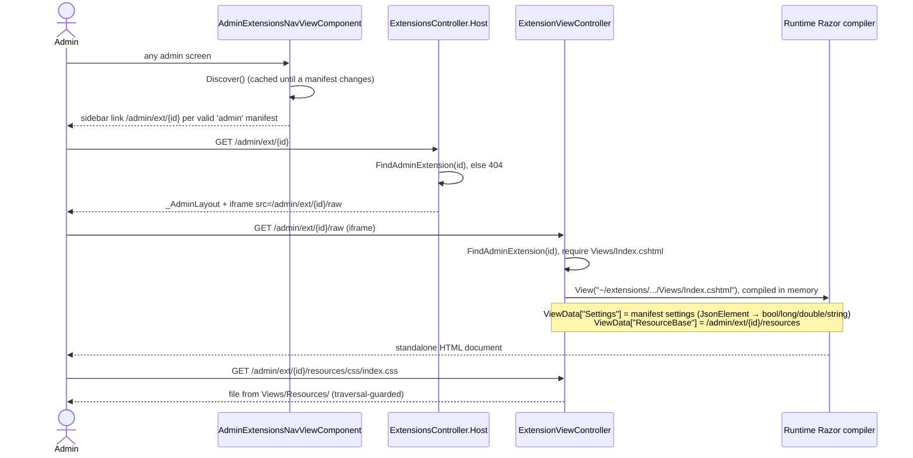

# Extensions

Extensions are folders under `extensions/` with a `dotnetforge.extension.json` manifest. Today the CMS **discovers
and validates** every manifest, lists them on the [Plugins screen](../pages/plugins.md), and **renders admin
extensions** as admin tabs ([extension host](../pages/extension-host.md)). No extension code is loaded: there is no
assembly loading, no DI registration of extensions, no enable/disable, and the `IExtension` interfaces are not
implemented anywhere. How to write one: [extension development guide](../guides/extension-development.md).

## Manifest

Model: `src/DotNetForge.Shared/Manifests/ExtensionManifest.cs` (camelCase JSON). File name constant:
`ExtensionManifest.FileName = "dotnetforge.extension.json"`.

| Field | Required | Validation (`ManifestValidator`) | Used at runtime |
| --- | :-: | --- | --- |
| `id` | ✔ | non-blank | admin tab URL `/admin/ext/{id}`; Plugins row |
| `name` | ✔ | non-blank | sidebar label, tab title, Plugins row |
| `description` | ✔ | non-blank | - |
| `version` | ✔ | `^\d+\.\d+\.\d+([-+].+)?$` | Plugins row |
| `type` | ✔ | one of `theme, authentication, connector, library, admin, widget, provider, plugin, module` (case-insensitive) | `admin` → rendered as a tab |
| `author` | ✔ | non-blank | Plugins row |
| `entryPoint` | ✔ | non-blank | - |
| `permissions` | ✔ | non-empty; each matches `^[a-z0-9]+(?:[._-][a-z0-9]+)*\.[a-z0-9]+(?:[._-][a-z0-9]+)*$` (dotted, lower-case) | - (not checked against `PermissionKeys`, not enforced) |
| `website`, `license` | | - | - |
| `dependencies` | | - | - |
| `routes` | | - | - (the sample's `/admin/ext/audit-dashboard` route is **not** its real URL) |
| `settings` | | - | passed to admin extension views as `ViewData["Settings"]` |

Validation errors carry the PascalCase field name (`Version`, `Permissions`, ...). Parse failures become a single
`Manifest` error (`Manifest could not be parsed.` / `Invalid JSON: ...`). The loader accepts comments and trailing
commas and is case-insensitive on property names.

## Discovery

`IExtensionLoader` (`src/DotNetForge.Core/Extensions/IExtensionContracts.cs`) is implemented by `ExtensionLoader`
(`src/DotNetForge.Extensions/`), registered as a singleton whose root, `<contentRoot>/extensions`, is fixed at
construction (`DependencyRegistration`).

| Member | Returns |
| --- | --- |
| `Discover()` | one `DiscoveredExtension { Path, Manifest, Validation, IsValid }` per `dotnetforge.extension.json` found **recursively** under the root, valid or not |
| `FindAdminExtension(id)` | the first valid manifest with `type` `admin` and that `id` (both case-insensitive), or `null` |

Callers:

| Caller | Member | When |
| --- | --- | --- |
| `AdminExtensionsNavViewComponent` | `Discover()` | every admin screen render (sidebar) |
| `ExtensionsController.Host` | `FindAdminExtension` | opening `/admin/ext/{id}` |
| `ExtensionViewController.Render` / `.Resource` | `FindAdminExtension` | the iframe document and every asset request |
| `PluginsController.Index` | `Discover()` | opening `/admin/plugins` |

**Caching.** The scan result is cached in memory. A `FileSystemWatcher` on the root (filter
`dotnetforge.extension.json`, subdirectories included) clears the cache on `Created`, `Changed`, `Deleted`,
`Renamed` and `Error` (buffer overflow) and increments a version counter; a scan is only cached when no change
arrived while it ran, so a stale list can never stick. If the root does not exist at startup or the watcher cannot
be created (`IOException`, `ArgumentException`, `PlatformNotSupportedException`, `UnauthorizedAccessException`),
every call rescans. Only manifests are watched: view changes are picked up by runtime Razor compilation and resources
are read per request. Tests: `tests/DotNetForge.Tests/ExtensionLoaderTests.cs`.

Folder layout below `extensions/` is a convention only; the type comes from the manifest. Duplicate ids are not
detected - the first match in file-system order wins.

## Deployment

`extensions/**` is excluded from the host's compilation (`DefaultItemExcludes`) but copied to the publish output as
plain files (`<None Include="extensions/**" CopyToPublishDirectory="PreserveNewest" />` in `DotNetForge.Web.csproj`),
so `dotnet publish` and the Docker image contain them at `<contentRoot>/extensions`. Admin extension views are
compiled **in memory** by runtime Razor compilation (`AddRazorRuntimeCompilation` with a `PhysicalFileProvider` on
the content root); nothing is written to disk, so they work on a read-only filesystem
([deployment](../guides/deployment.md#read-only-deployment-requirements)). Adding or changing an extension therefore
means a new publish or image.

## Admin extensions



Folder contract (from the `audit-dashboard` sample):

```text
extensions/admin/<name>/
├── dotnetforge.extension.json        type: "admin"
└── Views/
    ├── _ViewImports.cshtml           @using / @inject for the extension's views
    ├── _ViewStart.cshtml             Layout = "Shared/_Layout.cshtml"
    ├── Index.cshtml                  the page (required)
    ├── Shared/_Layout.cshtml         full HTML document; links @ViewData["ResourceBase"]/...
    └── Resources/                    static files served by /admin/ext/{id}/resources/{**path}
```

Security model - important:

- Extension views are compiled **into the host process** with full access to DI (the sample does
  `@inject DotNetForge.Data.DotNetForgeDbContext Db` and reads all tenants' audit entries). Manifest `permissions`
  are not enforced. Treat an admin extension as trusted code.
- The iframe isolates **styles** and the DOM from the admin shell, not privileges; it is same-origin.
- Endpoints are protected by the `AdminArea` policy only (Editors and Authors can open every admin extension).
- `Resource` resolves the path with `Path.GetFullPath` and refuses anything outside `Views/Resources/`; supported
  content types: css, js, json, svg, png, jpg/jpeg, gif, woff2, else `application/octet-stream`.

## Non-admin extension types

`theme`, `authentication`, `connector`, `library`, `widget`, `provider`, `plugin`, `module` manifests are only
validated and listed. The matching interfaces in `DotNetForge.Abstractions.Extensions` (`IThemeExtension`,
`IAuthenticationProviderExtension`, `IWidgetExtension`, `IModuleExtension`, ...) define the intended contracts; no
code discovers or calls them.

## Samples in the repository

| Folder | id | type | Renderable |
| --- | --- | --- | :-: |
| `extensions/admin/audit-dashboard` | `dotnetforge.admin.audit-dashboard` | admin | ✔ |
| `extensions/authentication/discord-login` | `dotnetforge.auth.discord` | authentication | |
| `extensions/connectors/s3-storage` | `dotnetforge.connector.s3` | connector | |
| `extensions/libraries/markdown-kit` | `dotnetforge.library.markdown-kit` | library | |
| `extensions/modules/contact-form` | `dotnetforge.module.contact-form` | module | |
| `extensions/plugins/seo-toolkit` | `dotnetforge.plugin.seo-toolkit` | plugin | |
| `extensions/providers/sms-notifications` | `dotnetforge.provider.sms` | provider | |
| `extensions/themes/default-theme` | `dotnetforge.theme.default` | theme | |
| `extensions/widgets/weather-widget` | `dotnetforge.widget.weather` | widget | |

## Planned (not implemented)

Target behaviour from the original product specification. Nothing in this section exists in the code unless marked ✔.

### Requirements

- **Lifecycle:** create, install (local package or [marketplace](#marketplace)), update, enable, disable, configure
  and remove extensions. The `InstalledExtensions` table ✔ (`InstalledExtension`, `Status` defaults to `Disabled`)
  becomes the record of installed extensions; today nothing writes it.
- **Loading:** enabling an extension loads it through its manifest `entryPoint` and registers what it contributes
  (routes, widgets, providers, handlers); disabling unloads it. A disabled extension contributes nothing.
- **Core separation:** extensions live only under `extensions/`; core updates must not break or overwrite them. Core
  updates, backups and rollback: [transfer and updates](transfer-and-updates.md).
- **Runtime permissions:** the manifest `permissions` are enforced at runtime through the role/permission model.
  Granting an extension's runtime permissions to roles is separate from the right to manage its lifecycle.
- **Audit:** every install, enable, disable, configure, update and remove writes an audit entry
  (`AuditActions.PluginInstalled` / `PluginDisabled` exist ✔ but are never written; the others must be added). See
  [audit logging](audit-logging.md).
- **Extension points per type** (contracts exist ✔ in `DotNetForge.Abstractions.Extensions`, none is called):

| Type | Integration point | Contract |
| --- | --- | --- |
| `theme` | Layouts, templates and static assets for the **public site only**; never affects the admin area. See [themes](themes.md). | `IThemeExtension` |
| `authentication` | Login/identity provider (e.g. OAuth/OIDC). | `IAuthenticationProviderExtension` |
| `connector` | External services, e.g. a storage backend for media ([media storage](media-storage.md)). | `IConnectorExtension` |
| `library` | Shared code reused by other extensions or the core. | `ILibraryExtension` |
| `admin` | Adds or changes admin functionality (rendering ✔, see [Admin extensions](#admin-extensions)). | `IAdminExtension` |
| `widget` | Dashboard or page widgets. | `IWidgetExtension` |
| `provider` | Pluggable services for the core or other extensions. | `IProviderExtension` |
| `plugin` | General-purpose feature, managed on the [Plugins screen](../pages/plugins.md). | `IPluginExtension` |
| `module` | Placeable content unit for the page builder. | `IModuleExtension` |

Further extension points named by the spec: dynamic route handlers (via manifest `routes`, see
[content pages and routing](content-pages-and-routing.md)).

Manifest changes the spec implies:

| Field | Target meaning | Today |
| --- | --- | --- |
| `dependencies` | other extension ids, each with an optional version constraint | `List<string>`, ignored |
| `routes` | routes the extension registers, including dynamic route handlers | ignored |
| `settings` | definition and defaults edited through **Configure**; saved values validated against it | passed to admin views only |
| core compatibility | the extension declares which CMS core versions it supports | no field exists - must be added to `ExtensionManifest` |

### User flows

| Flow | Steps |
| --- | --- |
| Create | Developer scaffolds a folder of the chosen type under `extensions/` → writes the manifest with all required fields → implements `entryPoint` and any `routes`, declares all `permissions` → packages it for local install or the marketplace. Guide: [extension development](../guides/extension-development.md). |
| Install (local) | Super Admin/Admin uploads or selects a package → CMS reads `dotnetforge.extension.json` → full validation (see below) → on failure reject with a clear reason, install nothing → on success copy into `extensions/`, write `InstalledExtension` with `InstalledDate`, leave **Disabled** → audit. |
| Install (marketplace) | See [Marketplace](#marketplace). |
| Enable | Check every dependency is installed **and enabled** and the core compatibility still holds → load via `entryPoint`, register routes/widgets/providers/handlers → `Status = Enabled` → audit. |
| Disable | Refuse while enabled extensions depend on it (or require explicit confirmation) → warn/block if in use (active theme, active provider) → unload → `Status = Disabled` → audit. |
| Configure | Edit the extension's `settings` → save only valid values; field-level error messages otherwise → audit. |
| Update | Update availability shown per extension (from the marketplace/update source) → **Update** → fetch package → full validation incl. compatibility with the running core → back up first, never overwrite unrelated extensions → refresh `Version` / `UpdateAvailable` → on failure keep or restore the previous version → audit. Backup/rollback mechanics: [transfer and updates](transfer-and-updates.md). |
| Remove | Check dependents and in-use status → block with an explanation while either applies → on confirmation disable, unload, delete from `extensions/` → audit. |

### Rules and validation

Validation runs **before** install, enable and update; any failure rejects the action.

| Rule | Today |
| --- | --- |
| Package contains a file named exactly `dotnetforge.extension.json` | ✔ discovery only reads that name (no packages/install exist) |
| Well-formed JSON that conforms to the manifest schema | ✔ JSON parse errors; no schema beyond typed deserialization |
| `id`, `name`, `description`, `version`, `type`, `author`, `entryPoint`, `permissions` present and non-empty | ✔ `ManifestValidator` |
| Exactly one `version` key, valid semver; duplicate `version` keys or a misspelled `vrsion` key rejected | ✘ semver ✔, but duplicate keys are accepted (System.Text.Json, last value wins) and unknown keys such as `vrsion` are ignored |
| `type` is one of the nine extension types | ✔ `ManifestValidator.ValidTypes` |
| `id` does not collide with an installed extension (except an update of the same `id`) | ✘ duplicates not detected |
| Every `permissions` entry is a known/declarable permission key | ✘ only the dotted format is checked |
| Every `dependencies` entry resolves to an installed (on enable: enabled) extension satisfying its version constraint | ✘ |
| Compatible with the running core version | ✘ |
| Extensions failing validation or safety checks are never loaded | partly ✔: invalid manifests are never rendered as admin tabs |
| Marketplace installs come from a trusted source; untrusted sources rejected before download | ✘ |
| **Configure** values validate against the extension's `settings` definition | ✘ |
| Concurrent enable/disable/update/remove on the same extension are serialized | ✘ |

Roles: only **Super Admin** and **Admin** may view the Plugins screen, install (local/marketplace), enable, disable,
configure, update, remove and create/develop extensions; Editor, Author, Authenticated and Public have no access.
Today the Plugins screen is Super Admin only, and `PermissionMatrix` (reference data) grants Admin only
`Extensions: read` with install/remove reserved to Super Admin - reconcile with the spec when building. See
[authorization](authorization.md).

### Edge cases

| Case | Required behaviour |
| --- | --- |
| Manifest missing, invalid JSON, schema failure, missing required field, duplicate/misspelled `version` | install/update rejected with a specific error; nothing loaded |
| Missing dependency | install/enable blocked; the missing dependency is named |
| Incompatible core version | install/update/enable rejected; required vs current version reported |
| Disabling an extension others depend on | refused until dependents are disabled (or explicit confirmation) |
| Removing the active theme (site, page or per-page selection) | blocked until another theme is selected; the admin area never uses frontend themes, so admin access is never lost ([themes](themes.md)) |
| Removing an active authentication provider or in-use storage connector | blocked until no longer in use (prevents lock-out / orphaned media) |
| Untrusted marketplace source | rejected before download; nothing fetched or executed |
| `id` collision on install (not an update) | rejected; the existing extension is not overwritten |
| Update fails mid-apply | previous working version preserved or restored where possible; failure reported |
| Disabled but installed | stays listed, contributes no routes/handlers, can still be configured, updated or removed (today every valid admin manifest renders regardless of status) |
| Concurrent lifecycle actions on one extension | serialized; never an inconsistent state |

### Marketplace

Today `/admin/marketplace` is a [placeholder](../pages/module-placeholders.md) (`ModulesController.Marketplace`,
sidebar **Main**, `AdminArea` policy). Planned:

- Admin entry point stays `/admin/marketplace`; restricted to Super Admin and Admin.
- Uses an external marketplace API whose endpoint is configured in Settings (no setting key exists yet).
- Flow: open → CMS queries the marketplace API for available extensions → user selects one → CMS verifies the source
  is **trusted** (untrusted → rejected before any download) → download package → read manifest → same full
  validation as a local install → install **Disabled**, record `InstalledDate` → audit. Failure → clear reason,
  nothing installed.
- The same source supplies update availability per installed extension (`InstalledExtension.UpdateAvailable` column
  exists ✔, never written).

### Acceptance criteria

- [ ] An extension cannot be installed without a valid `dotnetforge.extension.json` manifest (no install exists).
- [x] Manifest validation enforces all required fields: `id`, `name`, `description`, `version`, `type`, `author`,
  `entryPoint`, `permissions` (`ManifestValidator`).
- [ ] A manifest with duplicate `version` keys or a `vrsion` field is rejected; exactly one `version` field is required.
- [x] `type` is validated against the nine extension types (`ManifestValidator.ValidTypes`).
- [ ] Invalid, unsafe or incompatible extensions are never installed or loaded (only invalid manifests are excluded
  from rendering).
- [ ] Dependency resolution blocks installing/enabling an extension whose dependencies are missing, naming the
  missing dependency.
- [ ] A version/compatibility check against the current core version blocks incompatible extensions.
- [ ] Marketplace installs verify source trust before download; untrusted sources are rejected.
- [ ] Marketplace install is reachable from the admin Marketplace entry point and uses the external marketplace API
  configured in Settings.
- [ ] The full lifecycle works: create, install, update, enable, disable, remove.
- [ ] Disabling an extension that others depend on is prevented (or requires explicit confirmation) and does not
  break dependents.
- [ ] Removing an in-use theme is blocked until another theme is selected; the admin area remains unaffected by
  frontend themes.
- [ ] Removing an in-use authentication provider or connector is blocked until it is no longer in use.
- [ ] Updating an extension does not overwrite unrelated custom extensions and creates a backup beforehand.
- [ ] A failed update preserves or restores the previous working version where possible.
- [ ] The Plugins screen lists every installed extension with Name, Description, Version, Type, Status, Author,
  Installed date and Update availability.
- [ ] The Plugins screen exposes Enable, Disable, Configure, Update and Remove actions per extension.
- [ ] Only Super Admin and Admin can view the Plugins screen and manage extensions; all other roles are denied
  (Admin is denied today).
- [ ] Every install, enable, disable, configure, update and remove action is recorded in the audit log.
- [ ] Each installed extension declares its required permissions, which are enforced at runtime via the
  role/permission model.

## Where to change things

- Validation rules: `src/DotNetForge.Extensions/ManifestValidator.cs` + `tests/DotNetForge.Tests/ManifestValidationTests.cs`.
- Discovery and its cache: `ExtensionLoader` + `tests/DotNetForge.Tests/ExtensionLoaderTests.cs`. Callers never
  scan `extensions/` or build their own cache.
- Admin extension rendering: `ExtensionViewController` (document/assets) and `ExtensionsController` (shell).
- Lookup by id: `IExtensionLoader.FindAdminExtension` - use it instead of filtering `Discover()` in a caller.
- What ships with a deployment: the `extensions/**` `None` item in `DotNetForge.Web.csproj`.
- Never resolve a file under `extensions/` from request input without the `GetFullPath` + prefix check used in
  `Resource`.
