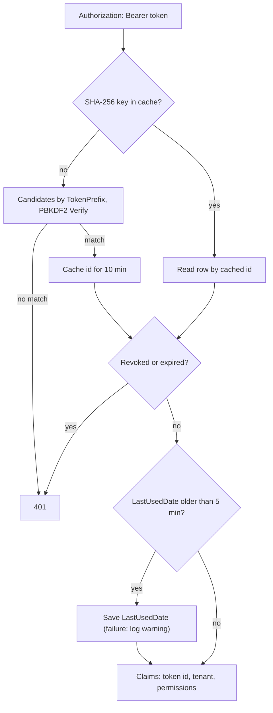

# Headless API

JSON endpoints under `/api`, authenticated only by API tokens, scoped to the token's tenant, gated per action by a
permission key, and rate-limited per client IP. Code: `src/DotNetForge.Api/`. Tokens are managed on the
[API Tokens screen](../pages/api-tokens.md). Request flow diagram:
[data-flow.md → API request flow](../architecture/data-flow.md#api-request-flow).

## Tokens

| Aspect | Implementation |
| --- | --- |
| Format | `dnf_<8 lowercase hex>_<43-char base64url secret>` (`ApiTokenFactory.Generate`: 4 random prefix bytes, 32 random secret bytes) |
| Stored | `ApiToken.TokenPrefix` = `dnf_<hex>` (clear), `TokenHash` = PBKDF2 of the **full** plaintext (`60000$salt$hash`) |
| Shown | plaintext once, on the `Created` view; never retrievable again |
| Lookup | `ExtractPrefix` (first two `_`-separated parts) → candidates by `TokenPrefix` (indexed) → `Verify` each |
| Verification cache | a successful PBKDF2 match is remembered in `IMemoryCache` for 10 min (`VerificationCacheLifetime`) under `dnf:apitoken:<SHA-256 hex of the presented token>` → token id; never the token itself. Per instance |
| Expiry | `Duration` 7 / 30 / 90 days or `Unlimited` (`ExpirationDate = null`); checked as `ExpirationDate <= now` |
| Revocation | `Revoked = true` (soft) via the admin screen. The token row is re-read on **every** request, cached or not, so revocation and expiry apply immediately |
| Usage tracking | `LastUsedDate` written at most every 5 min (`LastUsedResolution`). A `DbUpdateException` or cancellation while saving it is logged as a warning and the request continues |
| Scope | `PermissionsCsv` - any subset of `PermissionKeys.All`; becomes `dnf:permission` claims |
| Tenant | `TenantId` of the admin who created it; becomes the `dnf:tenant` claim |

`ApiTokenAuthenticationHandler.HandleAuthenticateAsync`:



## Endpoints

All responses are `application/json`. All require `Authorization: Bearer <token>`.

| Method | Route | Permission | Response | Controller |
| --- | --- | --- | --- | --- |
| GET | `/api/content/pages` | `content.read` | `[{ id, slug, title, published, displayInMenu, type, updatedDate }]` ordered by `SortOrder`, `Title` - **all** pages of the tenant, including unpublished | `ContentApiController.GetPages` |
| GET | `/api/content/{type}` | `content.read` | `type == "pages"` (case-insensitive) → same as above; anything else → `[]` | `ContentApiController.GetByType` |
| POST | `/api/content/pages` | `content.create` | `201` `{ id, slug, title }`, `Location` → `/api/content/pages?id=<id>`; `400 { error }` ([below](#create-a-page)) | `ContentApiController.CreatePage` |
| GET | `/api/media` | `media.read` | `[{ id, fileName, contentType, sizeBytes, isPublic, uploadedDate }]` newest first | `MediaApiController.Get` |
| GET | `/api/users` | `users.read` | `[{ id, email, firstName, lastName, status, lastLoginDate }]` | `UsersApiController.Get` |
| GET | `/api/roles` | `roles.read` | `[{ id, name, description, isBuiltIn, users }]` | `RolesApiController.Get` |
| GET | `/api/settings` | `settings.read` | `[{ key, value }]` - tenant **and global** settings | `SettingsApiController.Get` |
| GET | `/api/extensions` | `extensions.read` | `[{ id, name, version, type, status, author, installedDate, updateAvailable }]` from `InstalledExtensions` (always empty today) | `ExtensionsApiController.Get` |

Not under `/api`, unauthenticated and not rate-limited: `GET /health` → `{ "status": "ok", "app": "<APP_NAME>" }`.

### Create a page

`POST /api/content/pages` body:

```json
{ "title": "About", "slug": "about", "metaDescription": "About us" }
```

The body becomes a `PageInput` (only these three fields; the rest default) and goes through
`IPageService.ApplyAsync` - the same rules as the Content Manager
([page rules](content-pages-and-routing.md#applyasync---save-and-create)): slugified (`"Our Pricing!"` →
`our-pricing`), length limits, unique among the tenant's **root-level** pages, at most one `[...]` page at root.
The first broken rule returns `400` with the message, e.g.
`{ "error": "A page with the slug 'about' already exists under this parent." }`.

On success the page is saved `Published = false`, `Disabled = false`, root level, `SortOrder = 0`, `Standard`,
without `CreatedById`, and a `content.created` audit entry is written with `UserId = null` and the actor
`API token <token id>` ([audit logging](audit-logging.md)). Publishing needs the Content Manager; `content.publish`
is not used by any endpoint.

## Rate limiting

`ApiControllerBase` carries `[EnableRateLimiting(RateLimitPolicies.Api)]`, so every API controller shares the `api`
policy (`Startup/DependencyRegistration.cs`): a fixed window of **300 requests per minute per client IP**
(`Connection.RemoteIpAddress`), no queue. Excess requests get `429` with an empty body.

- The limiter runs before the API token is checked, so requests with bad tokens count too and a limited client sees
  `429`, not `401`.
- Behind a reverse proxy set `ASPNETCORE_FORWARDEDHEADERS_ENABLED=true`, otherwise every client shares the proxy's
  IP ([configuration](configuration.md#aspnet-core-variables)).
- Counters are in memory per instance; several instances multiply the effective limit.

The sign-in and setup limit (`credentials`) is described in [security](security.md).

## Status codes

| Code | When |
| --- | --- |
| 200 / 201 | success |
| 302 → `/setup` | CMS not installed (install gate runs before rate limiting and auth) |
| 400 | `[ApiController]` model-binding failure (ProblemDetails), or a content rule from `IPageService` (`{ error }`) |
| 401 | no/invalid/unknown/revoked/expired token |
| 403 | token lacks the action's permission key - JSON `{ "error": "Missing required permission '<key>'." }` |
| 404 | route not found |
| 429 | more than 300 API requests in the current minute from the client IP |
| 500 | unhandled exception (e.g. two concurrent creates racing past the slug check into the unique index) |

## Conventions for new endpoints

Use the [api-endpoint skill](../../.claude/skills/api-endpoint/SKILL.md). Summary:

1. Controller in `src/DotNetForge.Api/Controllers/` deriving `ApiControllerBase` (brings token auth and the `api`
   rate limit), with `[Route("api/<resource>")]`.
2. `[RequireApiPermission(PermissionKeys.X)]` on **every** action. New key → add to `PermissionKeys` and
   `PermissionKeys.All`.
3. Filter by `TenantId` from the base class; `AsNoTracking()` + projection to an anonymous object or a DTO - never
   return entities (they contain hashes and secrets).
4. Reuse domain rules instead of duplicating them: for pages, build a `PageInput`, call `IPageService`, return
   `BadRequest(new { error })` on a message, then save and write the audit entry with `IAuditService`.
5. Add the row to the table above and an integration test in `tests/DotNetForge.IntegrationTests`.

## Planned (not implemented)

Target behaviour from the original product specification. Nothing in this section exists in the code unless marked ✔.
Token screen flows (details, rotate, confirmation): [API Tokens → Planned](../pages/api-tokens.md#planned-not-implemented).

### Requirements

- The API serves the **Headless** and **Hybrid** modes ([product](../product.md)) and exposes content, media,
  users, roles, settings and extensions, every action gated by a permission key ✔.
- **Request checks**, in order, any failure → error response and no action: (1) valid, non-expired, non-revoked
  token ✔; (2) the token's tenant scope matches the resolved tenant ✘; (3) the action's permission key ✔.
- **Tenant resolution:** resolve the tenant first (from domain, path, header or token, in that order of
  specificity), then the resource inside it. Resolved tenant ≠ token scope → `403` unless cross-tenant access was
  explicitly granted. Today the token's `TenantId` is simply used. Rules: [multi-tenancy](multi-tenancy.md).
- **Endpoints to add:**

| Method | Route | Permission | Today |
| --- | --- | --- | --- |
| GET | `/api/content/{type}` for every content type | `content.read` | only `pages`; other types return `[]` |
| POST | `/api/content/{type}` | `content.create` | only `/api/content/pages` |
| PUT | `/api/content/{type}/{id}` | `content.update` | ✘ |
| DELETE | `/api/content/{type}/{id}` | `content.delete` | ✘ |
| POST | `/api/media` | `media.upload` | ✘ (upload exists only on the admin [Media screen](../pages/media.md)) |

- `content.publish`, `media.update|delete`, `users.create|update|delete`, `roles.create|update|delete`,
  `settings.update`, `extensions.manage`, `webhooks.read|manage` and `core.*` exist as keys ✔ but no endpoint uses
  them. Webhook management: [webhooks](webhooks.md).
- Not in the spec but also missing: pagination, filtering, dynamic-route endpoints, OpenAPI document. (Rate limiting
  ✔ exists, see [Rate limiting](#rate-limiting).)

#### Token fields (delta to [Tokens](#tokens))

| Field | Target | Today |
| --- | --- | --- |
| Token duration | `7 days`, `30 days`, `90 days`, `Unlimited` or `Custom` | `TokenDuration.Custom` exists but is not offered; unknown values fall back to 30 days |
| Expiration date | UTC; required and in the future for `Custom`; derived otherwise; `null` only for `Unlimited` | derived only |
| Permissions | non-empty subset of the **creator's effective permissions**; built-in keys plus custom keys declared by installed extension manifests | any subset of `PermissionKeys.All` |
| Tenant | the scope the token is bound to; a Super Admin token may be global / any tenant | creator's `TenantId` |
| Created by / Created date / Last used / Revoked / hash / prefix / tenant | system-managed, never settable from the form | ✔ (the form binds only name, description, duration, permissions) |

#### Permission model

- Selectable groups are the `PermissionKeys` ✔ (`core`, `content`, `media`, `users`, `roles`, `settings`,
  `extensions`, `webhooks`) **plus custom extension keys** (e.g. `myplugin.invoices.read`) taken from the
  `permissions` of installed extensions' manifests; they appear dynamically in the picker and pass `IsKnown`.
- Minting a token requires the `API` permission area (`PermissionAreas.Api`); today it is the role check
  Super Admin/Admin on `ApiTokensController`. A token can never grant more than its creator holds.

| Role | Create token | Keys a token may receive | Revoke / rotate | Scope |
| --- | --- | --- | --- | --- |
| Super Admin | yes | any, in any tenant | any token | all tenants |
| Admin | yes (with `API` permission) | subset of own permissions | tokens in their tenant(s) | assigned tenant(s) |
| Editor / Author | only if granted `API` permission | subset of own permissions | own tokens | their tenant |
| Authenticated | no (unless granted `API` permission) | - | - | - |
| Public | no | - | - | - |

Role vocabulary: [authorization](authorization.md).

### Rules and validation

- **Name:** required ✔, trimmed ✔, max 200 characters ✔, unique within the tenant reported as a validation error ✔
  (`A token named '<name>' already exists. Choose another name.`, `ApiTokensController.Create`; revoked tokens
  count).
- **Duration:** required, one of the five values; reject anything else.
- **Expiration date:** required for `Custom`, valid datetime, in the future at creation; empty only for `Unlimited`.
- **Permissions:** at least one valid key ✔; every key a known built-in key or a key of a currently installed
  extension; every key within the creator's effective permissions.
- **Tenant scope:** must be one the creator can access.
- **Last used date:** updated safely under concurrent requests and never blocks or fails the request. Partly ✔: a
  failed save (`DbUpdateException`, cancellation) is logged and ignored, and the write happens at most every
  5 minutes, but it is still awaited inside authentication.

### Edge cases

| Case | Required behaviour |
| --- | --- |
| Expired token | `401` ✔; record retained; listed as **Expired** |
| All of a token's keys later removed (e.g. extension uninstalled) | every gated request `403` until the token is changed or rotated |
| Leaked token | rotate: new secret, old one revoked at once; both audited (today: revoke ✔, takes effect on the next request even with a cached verification) |
| Creator disabled or deleted | token still valid by its own expiry/revocation, but flagged as **orphaned** for review; automatic-revoke policy SHOULD be supported; Super Admins can revoke/rotate it |
| Creator's permissions reduced after issuance | token keeps its keys; tokens exceeding their creator's current grant are surfaced for review |
| Token for tenant A used against tenant B | `403` unless cross-tenant access was granted |
| Domain, path, header and token imply different tenants | resolve in the documented order; reject when the token scope differs |
| Concurrent requests with one token | `LastUsedDate` update must not corrupt the row or fail a request (✔ save failures are logged and ignored) |

### Acceptance criteria

- [ ] A user with the `API` permission can create a token with Name, Description, Token duration, Expiration date
  and Permissions (role-gated today; no expiration date input).
- [x] The plaintext token is displayed exactly once at creation and is never retrievable again
  (`ApiTokensController.Create` → `Created` view; only the hash is stored).
- [x] The secret comes from a cryptographically secure source and is stored only as a salted hash; no plaintext is
  persisted or logged (`ApiTokenFactory`: `RandomNumberGenerator`, PBKDF2 with per-token salt; the verification
  cache keys on a SHA-256 of the token).
- [x] Creating a token with an empty permission set is rejected (`ApiTokensController.Create`).
- [ ] Creating a token whose permissions are not a subset of the creator's permissions is rejected.
- [x] Creating a token with a missing Name or a non-unique Name within the tenant is rejected
  (`ApiTokensController.Create`; test `SecurityTests.Duplicate_api_token_name_is_a_validation_error_not_a_crash`).
- [ ] Selecting `Custom` duration without a future Expiration date is rejected; a past expiration date is rejected.
- [ ] The permission picker lists all built-in keys plus custom keys declared by installed extension manifests.
- [x] `Authorization: Bearer <token>` succeeds for valid, non-expired, non-revoked tokens with the required
  permission (`ApiTokenAuthenticationHandler`, `RequireApiPermissionAttribute`).
- [x] A request whose required permission the token lacks returns `403` (`RequireApiPermissionAttribute`).
- [x] An expired token returns `401` and performs no action (`ApiToken.IsExpired` in the handler).
- [x] A revoked token returns `401` even if not yet expired (`Revoked` checked on the freshly read row, also on a
  cache hit).
- [x] `LastUsedDate` starts `null` and is updated by successful authenticated requests - throttled to at most once
  every 5 minutes (`ApiTokenAuthenticationHandler.TouchLastUsedAsync`).
- [x] Revoking is immediate and irreversible; subsequent requests fail (`ApiTokensController.Revoke`, no un-revoke
  path; the row is re-read on every request).
- [ ] Rotating a token issues a new secret (shown once) and immediately revokes the old one.
- [ ] A token scoped to one tenant cannot access another tenant unless explicitly granted, returning `403`
  otherwise.
- [ ] API requests resolve the tenant from domain, path, header or token and reject scope mismatches.
- [ ] Token creation, revocation and rotation are written to the audit log (create/revoke ✔, no rotation).
- [ ] Tokens whose creator account is disabled or deleted are flagged for review and can be revoked/rotated by a
  Super Admin.
- [x] No API response or log exposes a stored token hash or plaintext secret (API endpoints project fields, none
  returns `ApiToken`; no request/header logging; the `LastUsedDate` warning logs only the token id).
