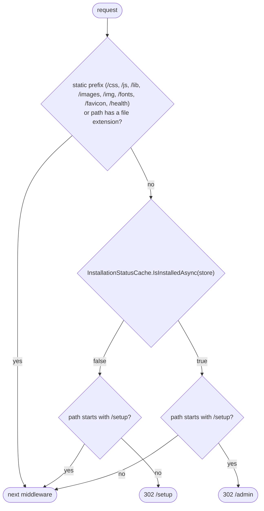
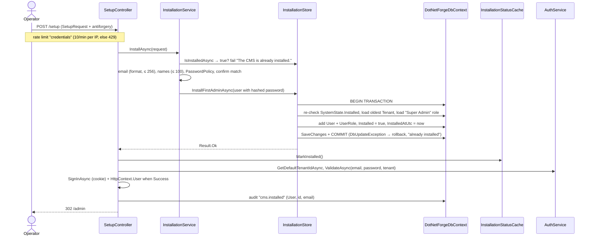

# Installation (install gate and first Super Admin)

The CMS starts **uninstalled**. Until the setup wizard succeeds, every request except static assets, `/health`
and `/setup` is redirected to `/setup`. Setup creates the first user with the `Super Admin` role and flips
`SystemState.Installed` to `true` - a one-way transition. The screen itself is documented in
[pages/setup.md](../pages/setup.md).

## Components

| Component | File | Responsibility |
| --- | --- | --- |
| `InstallationMiddleware` | `src/DotNetForge.Web/Middleware/InstallationMiddleware.cs` | Redirects to `/setup` while uninstalled; redirects `/setup*` to `/admin` once installed |
| `InstallationStatusCache` | `src/DotNetForge.Web/Services/InstallationStatusCache.cs` | Singleton `volatile bool`; once `true` the DB is never asked again |
| `IInstallationStore` | `src/DotNetForge.Shared/Stores/IInstallationStore.cs` | Contract: `IsInstalledAsync`, `InstallFirstAdminAsync(User)` |
| `InstallationStore` | `src/DotNetForge.Data/InstallationStore.cs` | Transactional EF implementation |
| `IInstallationService` / `InstallationService` | `src/DotNetForge.Core/Installation/` | Validates `SetupRequest`, hashes the password, calls the store |
| `SetupController` | `src/DotNetForge.Web/Controllers/SetupController.cs` | The wizard screen (`POST` rate limited by the `credentials` policy); marks the cache, signs the new admin in, writes `cms.installed` |
| `SystemState` | `src/DotNetForge.Shared/Entities/SystemState.cs` | Single row (`Id = 1`): `Installed`, `InstalledAtUtc`, `CmsVersion` |
| `DataSeeder.EnsureSystemStateAsync` | `src/DotNetForge.Data/DataSeeder.cs` | Creates the row with `Installed = false` on first start |

## Install gate

- The prefix check is case-insensitive `StartsWith`, so `/setupfoo` is also treated as a setup route.
- The cache only ever moves to `true`. If the database is replaced with an uninstalled one while the process runs,
  the gate will not re-engage until restart.
- Because the gate runs before authentication, an uninstalled CMS answers API calls with `302 /setup`.

## Setup sequence

Concurrency: two simultaneous submissions both pass the service's pre-check; the store re-reads `SystemState`
inside its transaction. On **SQLite** writes are serialized, so the second commit fails (`DbUpdateException` →
"The CMS is already installed.") and the first writer wins. On **PostgreSQL** (default `READ COMMITTED`) both
transactions can read `Installed = false` and both commit - two Super Admins - because `SystemState` has no
concurrency token; only identical emails collide on the `(TenantId, Email)` index. See the edge case under
[Planned](#planned-not-implemented).

## Validation (in order)

| Rule | Message |
| --- | --- |
| Already installed | `The CMS is already installed.` |
| `EmailValidator.IsValid` (`^[^@\s]+@[^@\s]+\.[^@\s]+$` on the trimmed value) and trimmed length ≤ 256 | `A valid email address is required.` |
| Trimmed `FirstName` and `LastName` ≤ 100 characters each | `First and last name must be at most 100 characters.` |
| `PasswordPolicy`: required | `Password is required.` |
| length ≥ 8 | `Password must be at least 8 characters long.` |
| contains a letter | `Password must contain at least one letter.` |
| contains a digit | `Password must contain at least one number.` |
| not in the common list (`password`, `password1`, `12345678`, ... 12 entries, case-insensitive) | `Password is too common. Choose a stronger password.` |
| `Password == ConfirmPassword` (ordinal) | `Password and confirmation do not match.` |
| Store: no tenant seeded | `The default tenant has not been seeded.` |
| Store: no `Super Admin` role | `The Super Admin role has not been seeded.` |

The created user: trimmed `Email`, optional trimmed `FirstName`/`LastName`, `Status = Enabled`,
`EmailConfirmed = true`, `CreatedDate = UtcNow`, `TenantId` = the oldest tenant. The length limits match the `User`
columns, so an over-long value is a validation message instead of a database error on PostgreSQL.

## Audit and rate limiting

- `cms.installed` is written to the audit log with the new user (`User`, id, email) -
  [audit logging](audit-logging.md#what-is-logged-today).
- `POST /setup` shares the `credentials` rate limit with sign-in: 10 requests per minute per client IP, then `429`
  ([authentication](authentication.md#rate-limiting)).

## Before the first start

Configuration is validated at process start, before the wizard can run ([configuration](configuration.md)). Outside
Development the defaults inside the deployment directory are refused: SQLite needs an explicit
`DATABASE_CONNECTION_STRING` with an absolute `Data Source` (in-memory allowed), and media needs S3 storage
(`STORAGE_S3_*`) - otherwise the process exits with a configuration error. See [deployment](../guides/deployment.md#read-only-deployment-requirements) and
[environment variables](../guides/deployment.md#environment-variables).

## Not implemented

- No database-connectivity check or `.env` editing in the wizard (configuration is validated at process start
  instead - see [configuration](configuration.md)).
- No database-level guard against concurrent installs on PostgreSQL ([Setup sequence](#setup-sequence)).

## Planned (not implemented)

Target behaviour from the original product specification. Nothing in this section exists in the code unless marked ✔.
The `.env` part of the same specification is in [configuration → Planned](configuration.md#planned-not-implemented).

### Requirements

- **Database failure at startup:** if the database is unreachable or migrations fail, abort (or show a maintenance
  error) with a clear message; never present the setup wizard against a non-functional database. Today
  `DatabaseInitializer.InitializeAsync` (`MigrateAsync` + seed) throws an unhandled exception and the process dies
  with a stack trace.
- **Field-level errors:** on a failed submission the wizard re-renders with errors on the offending field. Today every
  `InstallationService` failure is one `ModelState` error with an empty key (validation summary only).

### Rules and validation

| Field | Spec constraint | Gap |
| --- | --- | --- |
| First name, Last name (optional) | trimmed; reasonable max length | ✔ trimmed, ≤ 100 each (`InstallationService.MaxNameLength`); email ≤ 256 |
| Password | strength policy; also reject breached passwords where feasible | only the 12-entry common list |

- The installed flag needs a **database-level guard**, not only the in-transaction re-check: a uniqueness or
  concurrency guard on `SystemState.Installed` (e.g. a concurrency token or a conditional `UPDATE ... WHERE
  Installed = false`). The unique `(TenantId, Email)` index on `Users` already exists.

### Edge cases

| Case | Target | Today |
| --- | --- | --- |
| Concurrent submissions | Exactly one Super Admin; the loser gets "already installed" | `InstallationStore` re-reads `SystemState` inside the transaction. SQLite serialises writers; under PostgreSQL's default `READ COMMITTED` two transactions that both read `Installed = false` can both commit (no concurrency token on `SystemState`). No test covers it. |
| Duplicate email on create | Fail with a clear error, stay uninstalled | Rolled back, but the `DbUpdateException` is reported as `The CMS is already installed.` |
| Database unreachable at startup | Clear error, no wizard | unhandled exception (see Requirements) |

### Acceptance criteria

- [x] On first run with no installation, all non-setup requests are redirected to the setup screen
  (`InstallationMiddleware`; static assets and `/health` bypass).
- [x] The setup screen presents First name (optional), Last name (optional), Email, Password and Confirm password
  (`src/DotNetForge.Web/Views/Setup/Index.cshtml`, `SetupRequest`).
- [x] Mismatched Password and Confirm password is rejected without creating a user (`InstallationService`).
- [x] A weak password is rejected without creating a user (`InstallationService`, `PasswordPolicy`).
- [x] A valid submission creates the first user with the `Super Admin` role and stores the password only as a hash
  (`InstallationService`, `InstallationStore`, `Pbkdf2PasswordHasher`).
- [x] After success the CMS is marked installed and the user is redirected to the admin dashboard
  (`InstallationStore`, `SetupController` → `/admin`).
- [x] After installation every setup route is blocked and redirects to the dashboard or login (`InstallationMiddleware`).
- [ ] Two concurrent valid submissions result in exactly one Super Admin and one installed CMS (no DB-level guard on
  PostgreSQL, no test).
- [ ] A database connection failure at startup prevents the wizard from being shown **and reports a clear error**.

## Where to change things

- Gate rules (which paths bypass): `InstallationMiddleware.StaticPrefixes` / `IsStaticAsset`.
- Setup validation: `InstallationService` (and `PasswordPolicy` / `EmailValidator` in `Core/Validation`) - never in the
  controller.
- What gets created on install: `InstallationStore.InstallFirstAdminAsync` (keep it inside the transaction).
- Tests: `tests/DotNetForge.Tests/InstallationServiceTests.cs` (fake store) and
  `tests/DotNetForge.IntegrationTests/CmsIntegrationTests.cs` (gate behaviour). `DotNetForgeWebFactory.InstallAsync`
  installs programmatically for tests that need an installed CMS.
