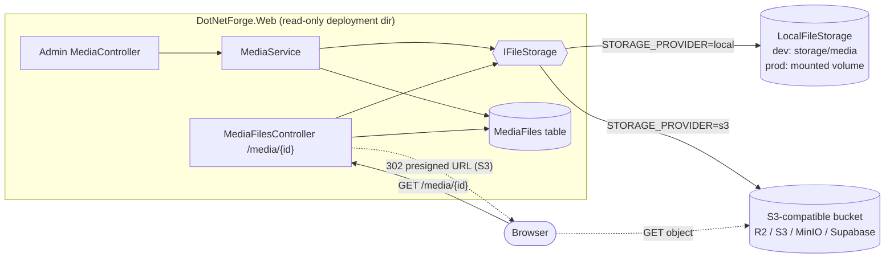
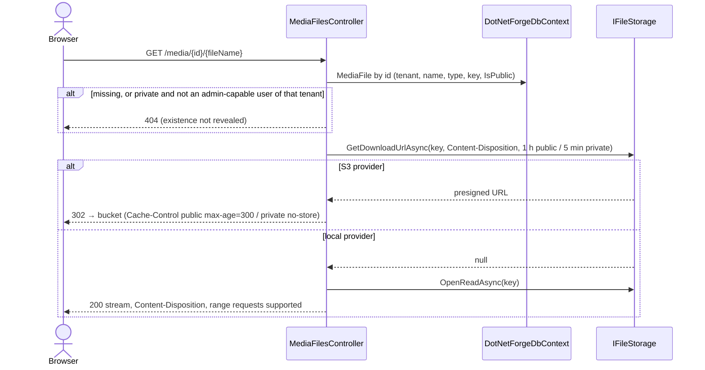

# Media storage

Uploaded media - the only files the application creates at runtime - live in **object storage** behind the
`IFileStorage` abstraction, never in the deployment directory (which is read-only in production, see
[deployment](../guides/deployment.md#read-only-deployment-requirements)). Metadata lives in the `MediaFiles` table.
Screen: [Media](../pages/media.md). Still-unbuilt File Manager features: [Planned](#planned-not-implemented).

## What exists

| Piece | Location | Responsibility |
| --- | --- | --- |
| `IFileStorage`, `StoredFile`, `StorageKey` | `src/DotNetForge.Abstractions/Storage/IFileStorage.cs` | Provider-neutral contract and key validation |
| `LocalFileStorage` | `src/DotNetForge.Infrastructure/Storage/LocalFileStorage.cs` | Directory provider: development default, or a mounted volume |
| `S3FileStorage` | `src/DotNetForge.Infrastructure/Storage/S3FileStorage.cs` | Any S3-compatible service (Cloudflare R2, AWS S3, MinIO, Supabase Storage) |
| `MediaService` | `Services/MediaService.cs` | Upload/delete rules: allowed types, size cap, generated keys, audit, failure handling |
| Admin screen | `Areas/Admin/Controllers/MediaController.cs` | `GET /admin/media`, `POST /admin/media/upload`, `POST /admin/media/delete/{id}` |
| Download endpoint | `Controllers/MediaFilesController.cs` | `GET /media/{id}/{fileName?}`: authorization, then presigned redirect or stream |
| `MediaFile` entity | `src/DotNetForge.Shared/Entities/Content.cs` | Metadata row (`RelativePath` holds the storage key) |
| API list | `GET /api/media` (`media.read`) | Lists the token tenant's media ([headless API](headless-api.md)) |
| Configuration | `StorageSettings` on `AppEnvironment`; `STORAGE_*` keys | Provider selection and credentials ([configuration](configuration.md)) |

## Storage architecture



Design decisions:

- **One small contract.** `SaveAsync`, `OpenReadAsync` (returns the stream and its length, or `null` when missing),
  `DeleteAsync` (idempotent) and `GetDownloadUrlAsync` (a short-lived signed URL, or `null` when the provider can't
  sign). These are the operations the application actually uses. There are no separate exists/metadata calls:
  `OpenReadAsync` covers both, and content type, size and name are stored in `MediaFiles`.
- **Keys never contain user input.** `MediaService` generates `{tenantId:N}/{yyyy}/{MM}/{random:N}{ext}`;
  `StorageKey.IsValid` (1-512 characters, `/`-separated segments of `[A-Za-z0-9._-]`, no `.`, `..` or empty
  segments) is enforced by every provider, so traversal or odd object names are impossible.
- **Objects stay private in the bucket.** Access control is decided by the application, then the browser gets a
  presigned URL that expires (public files: 1 hour, private files: 5 minutes). No public bucket and no CDN rules to
  keep in sync.
- **Provider code stays behind the interface.** Only `Startup/DependencyRegistration.cs` decides which implementation
  is used; controllers and services depend on `IFileStorage`.

## Provider choice

**Recommendation: Cloudflare R2** for production, through the S3 API (`STORAGE_PROVIDER=s3`). Use `local` for
development, and `compose.dev.yml` (an S3-compatible server) to test the S3 path locally.

Prices researched October 2026 (check the providers' pages before committing; they change):

| | Cloudflare R2 | Supabase Storage | AWS S3 | Azure Blob Storage |
| --- | --- | --- | --- | --- |
| Storage | $0.015 / GB-month | Pro: 100 GB included, then $0.0213 / GB | $0.023 / GB-month (Standard, us-east-1) | ~$0.018-0.021 / GB-month (Hot LRS, region-dependent) |
| Egress | **free** | Free: 5 GB; Pro: 250 GB, then $0.09 / GB | first 100 GB/month free, then $0.09 / GB | billed beyond a free allowance (~$0.087 / GB) |
| Requests | $4.50 / M writes, $0.36 / M reads | included | $0.005 / 1k PUT, $0.0004 / 1k GET | per 10k operations |
| Free tier | 10 GB + 1 M writes + 10 M reads / month, permanently | 1 GB, 50 MB max file; free projects pause after 1 week inactive | credits for new accounts (time-limited) | credits for new accounts |
| Paid entry | pay as you go | $25 / month (Pro plan) | pay as you go | pay as you go |
| API | S3-compatible | own API + S3-compatible endpoint | S3 (reference) | own API/SDK (not S3) |
| Presigned URLs | ✔ | ✔ (signed URLs; S3 presign via the S3 endpoint) | ✔ | ✔ (SAS tokens) |
| Fit with this code | `S3FileStorage` as-is | `S3FileStorage` via S3 endpoint | `S3FileStorage` as-is | needs a second provider implementation |

Why R2:

- **Cost profile of a CMS.** Media is read far more often than written; R2's free egress removes the cost line that
  grows with traffic on S3, Azure and Supabase.
- **No lock-in.** It speaks the S3 API, so the same `S3FileStorage` works with AWS S3, MinIO, Backblaze B2 or
  Supabase. Moving providers is a configuration change plus an object copy (`rclone`, `aws s3 sync`).
- **Permanent free tier** that covers small sites, unlike time-limited cloud credits or Supabase's pausing free
  projects.
- **Mature SDK.** The official AWS SDK (`AWSSDK.S3`) is well-maintained and handles signing, retries and multipart.
- **Reliability and security.** Durable object storage, private buckets by default, scoped API tokens per bucket.

When to choose differently: already on AWS (S3, IAM roles, same-region compute → no egress inside AWS); already using
Supabase for the database (its S3 endpoint works with this code); Azure-only organisations (Blob Storage would need an
`AzureBlobFileStorage` behind the same interface - not implemented).

### Provider setup

| Provider | `STORAGE_S3_SERVICE_URL` | `STORAGE_S3_REGION` | `STORAGE_S3_FORCE_PATH_STYLE` |
| --- | --- | --- | --- |
| Cloudflare R2 | `https://<account-id>.r2.cloudflarestorage.com` | `auto` (default) | `false` |
| AWS S3 | *(empty)* | the bucket's region, e.g. `eu-central-1` (required) | `false` |
| Supabase Storage | `https://<project-ref>.supabase.co/storage/v1/s3` | the project's region | `true` |
| MinIO / SeaweedFS (dev) | `http://localhost:8333` (or the server's URL) | `auto` | `true` |

All need `STORAGE_S3_BUCKET`, `STORAGE_S3_ACCESS_KEY_ID`, `STORAGE_S3_SECRET_ACCESS_KEY` (a key scoped to the one bucket,
read/write objects). Full key reference: [configuration](configuration.md).
`S3FileStorage` disables the SDK's optional checksums and `aws-chunked` uploads (several S3-compatible services reject
them) and signs URLs with the endpoint's scheme.

## Upload flow

```mermaid
sequenceDiagram
    actor U as Admin user
    participant C as Admin MediaController.Upload
    participant M as MediaService
    participant S as IFileStorage
    participant DB as DotNetForgeDbContext
    participant A as IAuditService
    U->>C: POST /admin/media/upload (multipart, antiforgery, ≤ 10 files)
    C->>C: Media/create permission; file count; request size limit
    loop each file
        C->>M: UploadAsync(file, isPublic, tenant, user)
        M->>M: size ≤ 25 MB; extension in AllowedTypes → content type; sanitize display name
        M->>S: SaveAsync("{tenant}/{yyyy}/{MM}/{random}{ext}", stream, contentType)
        alt storage fails
            M-->>C: "'x' could not be stored right now. Try again later." (error logged)
        else stored
            M->>DB: add MediaFile, SaveChanges (on failure: delete the object, rethrow)
            M->>A: media.uploaded
        end
    end
    C-->>U: redirect + "Uploaded N files." or the same screen with per-file errors
```

Upload rules (`MediaService`):

| Rule | Value |
| --- | --- |
| Max size per file | `MaxUploadBytes` = 25 MB |
| Files per request | `MaxFilesPerUpload` = 10; request limit 25 MB × 10 + 1 MB |
| Allowed types (extension → stored content type) | `.jpg .jpeg .png .gif .webp .avif .pdf .txt .csv .mp3 .mp4 .zip .docx .xlsx .pptx` |
| Never allowed | HTML, SVG, scripts, anything unlisted - they could run script from the site's origin |
| Content type | from the extension map, never the client's `Content-Type` |
| Stored names | display name sanitized (no path, quotes or control characters; ≤ 200), `OriginalName` ≤ 400 |
| Temporary buffering | ASP.NET Core buffers multipart bodies over 64 KB in the OS temp directory (`ASPNETCORE_TEMP` or `/tmp`) - must be writable (tmpfs in containers); never used as storage |

## Download flow



Images, video, audio and PDF are served `inline`; everything else as `attachment`. Every response carries
`X-Content-Type-Options: nosniff` (security headers middleware).

## Delete flow

`POST /admin/media/delete/{id}` needs `Media/delete`, or `Media/delete.own` for files the user uploaded
(`UploadedById`) - Authors can delete only their own uploads. `MediaService.DeleteAsync` removes the row first (so
nothing ever points at a missing object), then the object; if the object delete fails it is logged as orphaned. Audit:
`media.deleted`.

## Local development

- Default: `STORAGE_PROVIDER=local` with no path → `<contentRoot>/storage/media` (Development only; `storage/` is
  git-ignored).
- S3 path locally: `docker compose -f compose.dev.yml up -d` starts PostgreSQL and an S3-compatible server on
  `http://localhost:8333` with bucket `dotnetforge`; the settings to put in `.env` are in the compose file header.
- Live S3 contract tests: set `DNF_TEST_S3_*` ([testing](../guides/testing.md)).

## Backups

The bucket (or volume) and the database must be backed up together: rows reference keys, keys hold the bytes.
R2/S3: enable bucket versioning or replicate with `rclone sync` / `aws s3 sync` on a schedule; local volume:
snapshot the volume. See [deployment → Backups](../guides/deployment.md#backups).

## Planned (not implemented)

Target behaviour from the original product specification. Nothing in this section exists in the code unless marked ✔.

### Requirements

- File Manager: folders with arbitrary nesting, rename and move files and folders, breadcrumbs, drag-and-drop
  upload, delete with in-use protection (pages of type `File`, `Page.FileReference`).
- Private files with explicit role/user **access grants** (today private = admin-capable users of the tenant).
- Search, filter and sort by name, type/MIME, tag, folder, date and size; tags on files.
- Configurable allowed types and maximum size per tenant (today fixed in `MediaService`); content sniffing or
  malware scanning of uploads.
- Duplicate strategy (reject, auto-rename or replace) based on checksum or name.
- Image processing toggles: responsive variants (small/medium/large), size optimization, EXIF auto-orientation;
  stable variant URLs.
- Toggle public/private after upload; update metadata (`media.update`).
- API upload/update/delete with `media.upload`, `media.update`, `media.delete` permission keys.
- Webhook events `media.create`, `media.update`, `media.delete` ([webhooks](webhooks.md)).
- The screen is **File Manager** under *Main* with settings under *Settings → Global Settings → File Manager*
  ([Media screen → Planned](../pages/media.md#planned-not-implemented)).

### Data model additions

| Target field | Today | Notes |
| --- | --- | --- |
| `extension` | derived from `RelativePath` | |
| `folderId` | `FolderPath` (always `/`) | new `MediaFolder` entity: `id`, `tenantId`, `name`, `parentId`, materialized `path`, `isPublic`, `createdBy`, `createdDate` |
| `storageProvider` | - | only needed if several providers must coexist; today one provider per deployment |
| `tags`, `width`, `height`, `variants`, `checksum`, `updatedDate` | - | |

Access grant entity: `targetId`, `targetType` (`file` / `folder`), `roleId?`, `userId?` (at least one).

### Roles

| Capability | Super Admin | Admin | Editor | Author | Authenticated | Public |
| --- | :-: | :-: | :-: | :-: | :-: | :-: |
| Upload ✔ | ✔ | ✔ | ✔ | ✔ | ✘ | ✘ |
| Delete ✔ | ✔ | ✔ | ✔ | own only | ✘ | ✘ |
| Folders; rename / move files | ✔ | ✔ | ✔ | own only | ✘ | ✘ |
| Mark public / private after upload | ✔ | ✔ | ✔ | ✘ | ✘ | ✘ |
| Manage access grants, media settings | ✔ | ✔ | ✘ | ✘ | ✘ | ✘ |
| Download public files ✔ | ✔ | ✔ | ✔ | ✔ | ✔ | ✔ |
| Download private files | ✔ | ✔ | if granted (today ✔) | if granted (today ✔) | if granted | ✘ |

### Edge cases

- Duplicate name/content: resolved by the configured strategy and reported to the user.
- Deleting a file in use or a non-empty folder: references listed; blocked or explicit confirmation.
- Unsafe upload: blocked or quarantined, never served, audited.
- Corrupt image or invalid EXIF: keep the original, skip variants, record a warning.
- Concurrent rename/move/delete: optimistic concurrency with a conflict message.

### Acceptance criteria

- [ ] Upload via drag/drop and file picker, including multiple files at once (picker with multiple files ✔ `Media/Index.cshtml`; no drag/drop).
- [x] Uploads over the maximum size are rejected (`MediaService.MaxUploadBytes`, fixed 25 MB - not configurable yet).
- [ ] Uploads whose MIME type/extension is not allowlisted are rejected; detection does not rely only on the client extension (allowlist ✔ `MediaService.AllowedTypes`; type comes from the extension, no content sniffing).
- [ ] Unsafe uploads are scanned or blocked and never served (active formats are not allowlisted; no scanning).
- [x] Filenames are sanitized and directory-traversal attempts are neutralized (keys are generated, `StorageKey` validation in every provider; display names sanitized in `MediaService`).
- [ ] Duplicate names/content follow the configured strategy and the result is shown to the user.
- [ ] Folders can be created, renamed, moved and deleted, with arbitrary nesting.
- [ ] Breadcrumbs reflect the folder hierarchy and every segment is clickable.
- [ ] A folder cannot be moved into itself or a descendant.
- [ ] Files and folders can be marked public or private (files at upload time ✔; no later toggle, no folders).
- [ ] Private files enforce role/user access grants; unauthorized download → `403`, missing → `404`, no metadata leakage (private files return `404` to anyone but admin-capable users of the tenant - `MediaFilesController`; no grants).
- [x] Public files are directly downloadable, including anonymously (`MediaFilesController`).
- [ ] Stable URLs exist for every file and every responsive variant (files ✔ `/media/{id}/{name}`; no variants).
- [ ] Search by name, type, tag, folder and date, with ascending/descending sort.
- [ ] Responsive friendly upload generates small/medium/large variants when on.
- [ ] Size optimization reduces image size when on.
- [ ] Auto orientation rotates images using EXIF when on.
- [x] Local storage is the default and an external provider can be selected and used (`STORAGE_PROVIDER=local|s3`; via configuration rather than a connector extension).
- [x] A broken storage provider fails gracefully and the failure is logged (`MediaService.UploadAsync` returns a message and logs; existing local files are unaffected).
- [ ] Deleting a file referenced by a page/content is blocked or needs explicit confirmation, with dependents listed.
- [x] All media operations are tenant-scoped with no cross-tenant access (admin list/upload/delete filter by tenant; private downloads check the tenant; public downloads are public by design).
- [ ] `media.create`, `media.update` and `media.delete` webhook events fire.
- [ ] Media settings (allowed types, max size, image toggles, default provider) are configurable by Super Admin and Admin only.
- [x] Storage secrets come from `.env` / the environment and are never committed (`STORAGE_S3_SECRET_ACCESS_KEY`, `.gitignore`).

## Where to change things

- **New provider** (e.g. Azure Blob): implement `IFileStorage` in `src/DotNetForge.Infrastructure/Storage/`, add a
  `StorageProvider` value, its keys in `EnvConfigurationLoader`, the registration branch in
  `Startup/DependencyRegistration.cs`, and run the shared contract tests in `tests/DotNetForge.Tests/FileStorageTests.cs`
  against it. Never call a provider SDK outside its `IFileStorage` implementation.
- **Upload rules** (types, size, naming, duplicates, image processing): `MediaService` only - the admin controller and
  a future API upload must share it.
- **Who may do what**: `MediaController` via `Can`/`CanModify` on the `Media` permission area; download access in
  `MediaFilesController.CanReadPrivate`.
- **Entities** (folders, grants, variants): `src/DotNetForge.Shared/Entities`, `DotNetForgeDbContext`, and a migration
  for **both** providers (`database-change` skill).
- **Webhooks**: raise `WebhookEvents.MediaCreate/MediaUpdate/MediaDelete` from `MediaService` once a dispatcher exists.
- **Rule**: no code may write runtime files under the content root; use `IFileStorage` (or the OS temp directory for
  transient processing). `ReadOnlyDeploymentTests` fails if anything does.
- Update this document, [pages/media.md](../pages/media.md) and [implementation-status.md](../implementation-status.md)
  in the same change.
