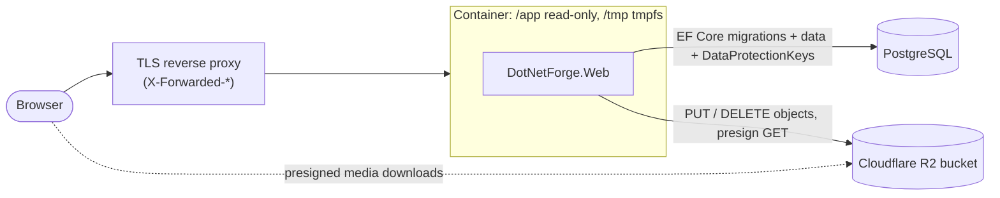

# Deployment

How to run DotNetForge CMS in production. The application is designed for a **read-only deployment directory**:
everything it writes at runtime goes to the database or to object storage, never into its own folder.

## Read-only deployment requirements

| Runtime data | Where it goes | Never |
| --- | --- | --- |
| Content, users, settings, audit log | the database (PostgreSQL recommended, or SQLite on a mounted volume) | `storage/` next to the app |
| Uploaded media | S3-compatible object storage via `IFileStorage` (`STORAGE_S3_*`, required) | the content root |
| Data Protection key ring (auth cookies, antiforgery tokens) | the `DataProtectionKeys` table | the default `~/.aspnet/DataProtection-Keys` folder |
| Upload buffering (multipart bodies over 64 KB) | the OS temp directory: `ASPNETCORE_TEMP`, else `/tmp` | - must be writable (tmpfs), is not storage |
| Logs | stdout/stderr (console logger) | log files |
| Admin extension views | compiled **in memory** from `extensions/` (read only) | - |

What enforces this:

- Outside Development, `EnvConfigurationLoader` refuses any default that points inside the deployment directory: a
  SQLite database needs an explicit **absolute** `Data Source`, and media needs S3 settings. The process exits with
  code 1 and a clear message otherwise ([configuration](../features/configuration.md)).
- `ReadOnlyDeploymentTests` runs setup, sign-in, admin screens, uploads, downloads and deletes, and fails if any file
  under the content root changed. CI also boots the Docker image with `--read-only` (job `read-only-container`).
- Verified manually (October 2026): the image with `--read-only --tmpfs /tmp` against PostgreSQL 17 and an
  S3-compatible server passed 19 end-to-end checks with an empty `docker diff`, and sessions survived a container
  restart.



## Environment variables

All configuration comes from environment variables (or a `.env` file next to the app, read-only). Secrets belong in
your platform's secret store, never in the image or the repository.

| Variable | Production value | Secret | Notes |
| --- | --- | :-: | --- |
| `ASPNETCORE_ENVIRONMENT` | `Production` (image default) | | Enables the production rules, HSTS, enforced CSP, Secure cookies |
| `DATABASE_CONNECTION_STRING` | `Host=…;Database=dotnetforge;Username=…;Password=…;GSS Encryption Mode=Disable` | ✔ | decides the database: `Host=…` is PostgreSQL; SQLite: `Data Source=/data/dotnetforge.db` on a volume |
| `APP_NAME` | display name | | |
| `APP_URL` | public base URL | | validated, not used for links yet |
| `STORAGE_S3_SERVICE_URL` | `https://<account-id>.r2.cloudflarestorage.com` | | empty = AWS S3 |
| `STORAGE_S3_BUCKET` | bucket name | | |
| `STORAGE_S3_ACCESS_KEY_ID` | bucket-scoped key id | ✔ | |
| `STORAGE_S3_SECRET_ACCESS_KEY` | bucket-scoped secret | ✔ | |
| `STORAGE_S3_REGION` | `auto` (R2) / AWS region | | required for AWS S3 |
| `STORAGE_S3_FORCE_PATH_STYLE` | `false` (R2, AWS); `true` (MinIO, Supabase) | | |
| `ASPNETCORE_FORWARDEDHEADERS_ENABLED` | `true` behind a proxy | | see [Behind a reverse proxy](#behind-a-reverse-proxy) |
| `ASPNETCORE_HTTP_PORTS` | `8080` (image default) | | |
| `ASPNETCORE_TEMP` | optional | | upload buffer directory (default `/tmp`) |

Provider-specific storage values: [media storage → Provider setup](../features/media-storage.md#provider-setup).
Full key reference with validation messages: [configuration](../features/configuration.md).

## Docker

`docker/Dockerfile` builds a framework-dependent image (`mcr.microsoft.com/dotnet/aspnet:10.0`, non-root
`$APP_UID`, port 8080, `ASPNETCORE_ENVIRONMENT=Production`). `dotnet publish` includes `wwwroot/` and `extensions/`. Build from the repository root (the build context):

```bash
docker build -f docker/Dockerfile -t dotnetforge .

docker run -d --name dotnetforge \
  --read-only --tmpfs /tmp \
  -p 8080:8080 \
  -e "DATABASE_CONNECTION_STRING=Host=db;Database=dotnetforge;Username=dotnetforge;Password=<secret>;GSS Encryption Mode=Disable" \
  -e STORAGE_S3_SERVICE_URL=https://<account-id>.r2.cloudflarestorage.com \
  -e STORAGE_S3_BUCKET=dotnetforge-media \
  -e STORAGE_S3_ACCESS_KEY_ID=<key-id> \
  -e STORAGE_S3_SECRET_ACCESS_KEY=<secret> \
  -e ASPNETCORE_FORWARDEDHEADERS_ENABLED=true \
  dotnetforge
```

On first start the app applies the database migrations and seeds baseline data, then redirects every request to
`/setup` until the first Super Admin is created. `GET /health` returns `{ "status": "ok", "app": "<APP_NAME>" }` and
is not affected by the install gate - use it for liveness probes.

Without Docker: `dotnet publish src/DotNetForge.Web/DotNetForge.Web.csproj -c Release -o out`, deploy `out/` read-only, set the same
environment variables, run `dotnet DotNetForge.Web.dll`.

## Behind a reverse proxy

Terminate TLS at the proxy (nginx, Caddy, Traefik, a cloud load balancer) and forward to port 8080.

- Set `ASPNETCORE_FORWARDEDHEADERS_ENABLED=true` so ASP.NET Core takes the scheme and client IP from
  `X-Forwarded-Proto`/`X-Forwarded-For`. Without it the app sees `http` and the proxy's IP: the `Secure` auth cookie is
  still issued, but rate limits and audit entries would key on the proxy's address. This setting trusts the headers
  from any sender, so the app must only be reachable through the proxy.
- The app does not redirect HTTP to HTTPS itself (`UseHttpsRedirection` is not used); configure that on the proxy.
  HSTS is sent on HTTPS responses outside Development.
- Allow request bodies up to 251 MB on `/admin/media/upload` (10 × 25 MB + overhead), or lower both limits together.

## Database

- **PostgreSQL** (recommended for production): the app applies `Migrations/PostgreSql/` on start. Use a dedicated
  database and user. Add `GSS Encryption Mode=Disable` to the connection string; otherwise Npgsql probes for Kerberos
  (`libgssapi_krb5.so.2`), which the slim image doesn't include, and logs an error line on start.
- **SQLite**: only on a persistent volume with an absolute path, and only for a single instance.
- **Upgrading from a database created before PostgreSQL migrations existed** (created by `EnsureCreated`): it has no
  `__EFMigrationsHistory`, so migrating fails on existing tables. Recreate it, or create the `DataProtectionKeys`
  table by hand and insert the `20261005180055_InitialCreate` row into `__EFMigrationsHistory` before starting the new
  version ([database](../architecture/database.md)).
- Expected log lines on a fresh PostgreSQL database: one `fail: Microsoft.EntityFrameworkCore.Database.Command[20102]`
  for the not-yet-existing migrations history table (EF Core then creates it), and the Data Protection warning
  "No XML encryptor configured" (keys are stored unencrypted in the database - protect database access accordingly).

## Object storage

1. Create a private bucket (R2: *R2 → Create bucket*; leave public access off - the app hands out presigned URLs).
2. Create an API token scoped to that bucket with object read/write (R2: *Manage R2 API tokens*).
3. Set the `STORAGE_S3_*` variables. Nothing needs CORS: browsers follow a redirect to the presigned URL, they don't
   call the bucket from scripts.
4. Upload a file in **Media**, open its link, confirm the redirect to the bucket works.

Why R2 and how the alternatives compare: [media storage → Provider choice](../features/media-storage.md#provider-choice).

## Scaling to several instances

What already works across instances: Data Protection keys are shared through the database; media lives in object
storage; the scheduled-publishing job is idempotent (running on every instance is harmless).

What is per instance: rate limits (in memory, so N instances allow N× the limit), the API-token verification cache
and the session-validation cache (both short-lived and self-correcting), and the extension discovery cache.

## Backups

Back up the database and the media bucket together; rows reference object keys.

- PostgreSQL: managed backups / point-in-time recovery, or scheduled `pg_dump`.
- Media: enable bucket versioning or replicate to a second bucket (`rclone sync`, `aws s3 sync`) on a schedule.
- No backup data is written by the app itself.

## Verification

After deploying:

```bash
curl -fsS https://cms.example.com/health          # {"status":"ok",...}
curl -sI https://cms.example.com/account/login | grep -i content-security-policy
```

Then sign in, upload a file in **Media**, open it, and delete it. In Docker, `docker diff <container>` must show no
changes. Security behaviour you can expect: [security](../features/security.md).
