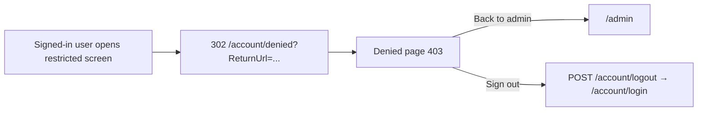

# Access denied

## Purpose

Shown when a signed-in user opens a screen their role does not allow (the cookie scheme's `AccessDeniedPath`).
Tells them so and offers a way back or to sign out as someone else.

## Route / Navigation

| Item | Value |
| --- | --- |
| Route | `GET /account/denied` (status code set to **403**) |
| Query parameter | `ReturnUrl` is appended by the cookie middleware but ignored |
| Reached from | any admin screen whose role check fails (e.g. an Editor opening **Users**, **Plugins** or **Settings**), and any `Forbid()` from a permission check (e.g. an Author editing, deleting or reordering a page they did not create in the [Content Manager](content-manager.md)) |

## Relevant source files

```text
src/DotNetForge.Web/Controllers/AccountController.cs     Denied()
src/DotNetForge.Web/Views/Account/Denied.cshtml          message, back link, sign-out form
src/DotNetForge.Web/Views/Shared/_AuthLayout.cshtml      layout
```

## Page layout

```text
Access denied (_AuthLayout)
└── Auth card
    ├── <APP_NAME>
    ├── "Access denied"
    ├── "Your account does not have permission to view this page."
    ├── [Back to admin] (/admin)
    └── form (POST /account/logout, antiforgery)
        └── [Sign out] (button.btn)
```

## Components and functionality

| Element | Behaviour |
| --- | --- |
| **Back to admin** | link to `/admin` (Dashboard). For a user without an admin-capable role (e.g. `Authenticated`) this leads straight back here. |
| **Sign out** | a real submit button in a POST form to `/account/logout` with an antiforgery token. Works without JavaScript (the previous inline `onclick` link was removed so the page complies with the CSP `script-src 'self'`). |

## Data, state, validation, loading, empty states

Only `AppEnvironment.AppName`. No state, no validation, no async work, no empty state.

## Permissions

Anonymous route; normally reached by signed-in users.

## Error handling

None.

## User interactions

One link and one button; no keyboard shortcuts.

## Dependencies

`AccountController` → `AppEnvironment`.

## Page flow



## Related pages

[Sign in](login.md), [Dashboard](dashboard.md). Which screens trigger it: [authorization](../features/authorization.md#admin-screen-matrix-enforced).

## Important implementation details / known limitations

- The sidebar shows links the user cannot open, so reaching this screen is common for Editors and Authors.
- A `fetch` that is forbidden (the Content Manager's reorder) also follows the redirect here and receives this 403
  page; the script then shows its generic alert.
- The page carries no inline script or style (CSP, see [security](../features/security.md)).

## Extension points

To avoid denied visits, filter sidebar links by role in `src/DotNetForge.Web/Areas/Admin/Views/Shared/_Sidebar.cshtml`
(`User.IsInRole(...)`) - keep the controller attributes as the real gate.
