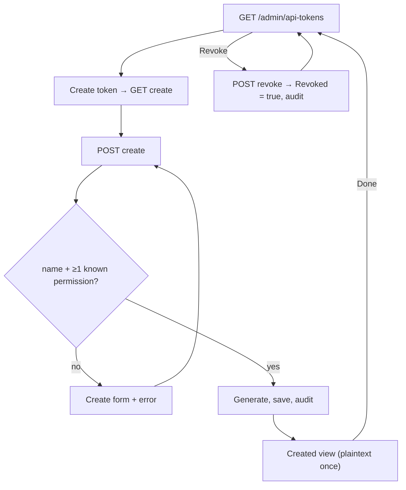

# API Tokens

## Purpose

Lets a Super Admin or Admin issue and revoke bearer tokens for the [headless API](../features/headless-api.md).
Each token is scoped to the creator's tenant and to a chosen set of permission keys. The secret is shown once on
creation and only a hash is kept.

## Route / Navigation

| Screen | Route | View |
| --- | --- | --- |
| Token list | `GET /admin/api-tokens` | `ApiTokens/Index.cshtml` |
| Create form | `GET /admin/api-tokens/create` | `ApiTokens/Create.cshtml` |
| Create submit | `POST /admin/api-tokens/create` | `Create.cshtml` (errors) or `Created.cshtml` (success, not a redirect) |
| Revoke | `POST /admin/api-tokens/revoke/{id:guid}` | redirects to the list |

Navigation entry: Sidebar → **Settings · Global Settings** → **API Tokens**. Child flow: list → **Create token** →
create form → created view → **Done** → list.

## Relevant source files

```text
src/DotNetForge.Web/Areas/Admin/Controllers/ApiTokensController.cs    Index, Create (GET/POST), Revoke, duration helpers
src/DotNetForge.Web/Areas/Admin/Views/ApiTokens/Index.cshtml          list + revoke buttons
src/DotNetForge.Web/Areas/Admin/Views/ApiTokens/Create.cshtml         form with permission checkboxes
src/DotNetForge.Web/Areas/Admin/Views/ApiTokens/Created.cshtml        one-time secret + usage example
src/DotNetForge.Web/Areas/Admin/Models/AdminViewModels.cs             CreatedTokenViewModel
src/DotNetForge.Shared/Entities/ApiToken.cs       entity
src/DotNetForge.Shared/Constants/Permissions.cs   PermissionKeys.All, IsKnown
src/DotNetForge.Infrastructure/Security/ApiTokenFactory.cs   Generate (plaintext, hash, prefix)
```

## Page layout

```text
API Tokens (list)
├── "Scoped tokens for the headless API. The secret is shown only once at creation."  [Create token]
└── table.data: Name · Prefix · Permissions ("N scope(s)") · Created · Last used · Expires · Status · [Revoke]

Create API token
├── Validation summary
└── Form: Name* · Description · Duration ▾ (7 days, 30 days [default], 90 days, Unlimited)
          Permissions* (checkbox grid of all 25 keys) · [Generate token] [Cancel]

Token created
├── panel.highlight "Copy your token now" + <pre> plaintext
├── panel "How to use it": API URL <origin>/api, curl example with the token against <origin>/api/content/pages
└── [Done] → list
```

## Components

| Component | Inputs | Behaviour |
| --- | --- | --- |
| Token table | `List<ApiToken>` for the tenant, newest first | Status badge: **revoked** (warn) or **active** (ok) - based only on `Revoked` |
| Revoke button | token id | inline POST form with antiforgery; shown only for non-revoked tokens; no confirmation |
| Create form | `ViewBag.Permissions` = `PermissionKeys.All` | posts `name`, `description`, `duration`, `permissions[]` |
| Created panel | `CreatedTokenViewModel { Name, Plaintext, Prefix }`; request scheme/host | shows the secret once; builds the example URL from the current request origin |

## Functionality

### Create a token

1. **Trigger:** **Generate token**.
2. **Validation (in this order, first failure wins):** name not blank (`Name is required.`); trimmed name ≤ 200 and
   trimmed description ≤ 1000 characters (`Name is limited to 200 characters and description to 1000.`); name not
   already used in the tenant, revoked tokens included (`A token named '<name>' already exists. Choose another
   name.`); at least one *known* permission key (`Select at least one permission.`) - unknown keys are silently
   dropped, duplicates removed.
3. **Service:** `IApiTokenFactory.Generate()`.
4. **Data:** `ApiToken { TenantId, Name (trimmed), Description (trimmed, blank → null), Duration, ExpirationDate,
   PermissionsCsv, CreatedById, CreatedDate, TokenHash, TokenPrefix }`. Duration mapping: `"7"` → 7 days, `"30"` → 30, `"90"` → 90,
   `"unlimited"` → no expiry, anything else → 30 days.
5. **Backend:** save, audit `apitoken.created`.
6. **UI:** renders `Created` directly (no redirect) with the plaintext. Refreshing re-posts the form and creates
   another token (browser warns).
7. **Errors:** validation → form re-rendered **empty** (inputs are not bound back). Covered by
   `SecurityTests.Duplicate_api_token_name_is_a_validation_error_not_a_crash`.

### Revoke a token

1. **Trigger:** **Revoke** (no confirmation).
2. **Backend:** token found in tenant and not already revoked → `Revoked = true`, save, audit `apitoken.revoked`.
   Otherwise nothing happens (no error).
3. **UI:** redirect to the list. Effect is immediate for the API: `ApiTokenAuthenticationHandler` caches only the
   successful hash verification (10 min) and re-reads the token row, including `Revoked` and expiry, on every
   request.

## Data used by the page

`ApiTokens` of the active tenant; `PermissionKeys.All`; `IDateTimeProvider.UtcNow`; current user id
(`CreatedById`, `Guid.Empty` if missing); request origin for the example.

## State

Plaintext exists only in the `Created` response. `ModelState` on failures. Persisted token rows.

## Permissions

`AdminArea` + `[Authorize(Roles = "Super Admin,Admin")]`. Editors/Authors get [Access denied](access-denied.md).
A creator can grant **any** permission key, regardless of their own role.

## Validation

| Rule | Where |
| --- | --- |
| Name required | browser + server |
| Name ≤ 200, description ≤ 1000 characters (after trimming) | server |
| Unique name per tenant (revoked tokens included) | server message + DB unique index |
| ≥ 1 known permission | server |

## Error handling

Validation messages in the summary; DB errors through global handling; revoke of an unknown id is a silent no-op.

## Loading behaviour

Server-rendered. Generation includes a PBKDF2 hash (60 000 iterations) - fast enough to be unnoticeable.

## Empty states

List: "No tokens yet." row spanning the table.

## User interactions

Buttons and form submit; no copy-to-clipboard button (select the `<pre>` text).

## Dependencies

```text
ApiTokensController
├── DotNetForgeDbContext
├── IApiTokenFactory → ApiTokenFactory
├── IDateTimeProvider → SystemClock
└── IAuditService → AuditService
```

## Page flow



## Related pages

[Dashboard](dashboard.md) (active token count), [Audit Logs](audit-logs.md) (create/revoke entries); consumers use the
[headless API](../features/headless-api.md).

## Important implementation details

- Expired tokens still show **active** in the list; only `Revoked` drives the badge.
- `TokenDuration.Custom` exists in the enum but is not offered.
- Permissions column shows a count, not the keys.
- **Last used** is written by `ApiTokenAuthenticationHandler` at most once every 5 minutes per token, so it can lag
  by up to 5 minutes; a failed write is logged and never fails the API request.
- The name check and the insert are not atomic: two simultaneous creates with the same name can still hit the
  unique index (global [error page](error.md)).

## Known limitations

- No rotation, regeneration, editing, deletion or usage statistics.
- No confirmation before revoke; created secret has no copy button.
- A revoked token's name stays taken (the unique index covers revoked rows).

## Planned (not implemented)

Target behaviour from the original product specification. Nothing in this section exists in the code unless marked ✔.
Token fields, permission model, role table, tenant rules and the full acceptance list:
[headless API → Planned](../features/headless-api.md#planned-not-implemented).

### Requirements

- **Access:** any user holding the `API` permission area, not a fixed role list; Admins act within their tenant(s),
  Editors/Authors (when granted) only on their own tokens, Super Admins across all tenants.
- **List:** Name ✔, prefix ✔, permissions summary ✔, Created ✔, Last used ✔, expiration ✔ and a status that
  distinguishes **active**, **revoked** and **Expired** (today expired tokens show **active**).
- **Review flags:** mark **orphaned** tokens (creator disabled or deleted) and tokens whose keys exceed their
  creator's current permissions.
- **Details view** per token: Created by, Description, full permission set, tenant scope.
- **Created view:** plaintext once ✔ with a **copy** action and the cannot-be-retrieved-again warning ✔.

### User flows

| Flow | Steps |
| --- | --- |
| Create (delta) | Form adds `Custom` to **Duration** with an **Expiration date** input (required for `Custom`); the permission picker offers only keys the creator holds, plus custom keys of installed extensions (a duplicate name is already a validation message ✔). |
| Inspect usage | List → select token → details; use **Last used** and [Audit Logs](audit-logs.md) to judge whether it is stale, then revoke or rotate. |
| Revoke (delta) | **Revoke** asks for confirmation (immediate and irreversible) before the POST. |
| Rotate | Select token → **Rotate** → new secret for an equivalent token (same name, description, permissions, duration, tenant) shown **once** → old token revoked immediately → both events audited. |

### Rules and validation

- Validation as listed in [headless API → Rules and validation](../features/headless-api.md#rules-and-validation).
- Rotation vs the `(TenantId, Name)` unique index: the index also covers revoked rows, so rotation must either
  re-key the existing row or the index must exclude revoked tokens.
- A non-Super Admin sees, revokes and rotates only tokens of tenants they are assigned to.

### Acceptance criteria

- [ ] A user with the `API` permission can create a token with Name, Description, Token duration, Expiration date
  and Permissions.
- [x] The plaintext token is displayed exactly once at creation (`Created.cshtml`) and never again.
- [ ] Creating a token whose permissions are not a subset of the creator's permissions is rejected.
- [x] A missing or non-unique Name within the tenant is rejected with a validation message
  (`ApiTokensController.Create`: `Name is required.`, `A token named '<name>' already exists. ...`).
- [ ] `Custom` duration without a future Expiration date is rejected.
- [ ] The permission picker lists built-in keys plus custom keys declared by installed extension manifests.
- [x] Revoking is immediate and irreversible (`ApiTokensController.Revoke`).
- [ ] Rotating issues a new secret (shown once) and immediately revokes the old one.
- [ ] Creation, revocation and rotation are audited (create/revoke ✔).
- [ ] Tokens whose creator account is disabled or deleted are flagged and can be revoked/rotated by a Super Admin.

## Extension points

- New permission key: add it to `PermissionKeys` and `PermissionKeys.All`; it appears in the checkbox grid
  automatically.
- Token format or hashing: `ApiTokenFactory` (keep `ExtractPrefix` compatible with stored prefixes).
- Restrict grantable keys by role: filter `ViewBag.Permissions` and `selected` in `ApiTokensController.Create`.
