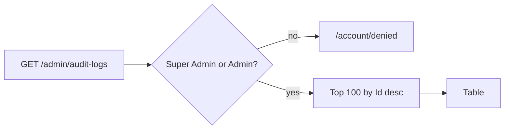

# Audit Logs

## Purpose

Shows the 100 most recent audit entries so Super Admins and Admins can see who did what, when and from where.
Read-only. What gets logged and how: [audit logging](../features/audit-logging.md).

## Route / Navigation

| Item | Value |
| --- | --- |
| Route | `GET /admin/audit-logs` |
| Navigation entry | Sidebar → **Settings · Administration Panel** → **Audit Logs** |
| Parameters | none (no paging, filter or search parameters) |

## Relevant source files

```text
src/DotNetForge.Web/Areas/Admin/Controllers/AdminListControllers.cs   AuditLogsController
src/DotNetForge.Web/Areas/Admin/Views/AuditLogs/Index.cshtml          table
src/DotNetForge.Shared/Entities/AuditLogEntry.cs  entity
src/DotNetForge.Web/Services/AuditService.cs                          writer (IAuditService, src/DotNetForge.Shared/Auditing/IAuditService.cs)
```

## Page layout

```text
Audit Logs (_AdminLayout, title "Audit Logs")
├── "The 100 most recent actions. Audit logs are append-only and cannot be edited or deleted."
└── table.data: When (UTC) · User · Action · Entity · Result · IP
```

## Components

| Column | Source |
| --- | --- |
| When (UTC) | `Timestamp` (`"u"`) |
| User | `UserDisplaySnapshot` or `-` |
| Action | `Action` in `<code>` (e.g. `content.updated`) |
| Entity | `-` when `EntityType` is null, else `EntityType EntityDisplaySnapshot` |
| Result | badge **ok** / **fail** from `Success` |
| IP | `IpAddress` |

`UserAgent`, `EntityId`, `Details` and `TenantId` are not shown.

## Functionality

Display only.

## Data used by the page

`AuditLogs` where `TenantId == active tenant || TenantId == null`, ordered by `Id` descending, `Take(100)`, as full
entities. Entries without a tenant are those written by an anonymous request - failed sign-ins
(`user.login.failed`), where no account was resolved - and stay visible; entries of other tenants never appear.

## State

None.

## Permissions

`AdminArea` + `[Authorize(Roles = "Super Admin,Admin")]`; others → [Access denied](access-denied.md).

## Validation / error handling / loading

Not applicable / global only / one server-side query.

## Empty states

"No audit entries yet." row - in practice the first sign-in already writes `user.login`.

## User interactions

None.

## Dependencies

`AuditLogsController` → `DotNetForgeDbContext`.

## Page flow



## Related pages

[Dashboard](dashboard.md) (count with the same tenant scope), the sample **Audit Dashboard** admin extension
([extension host](extension-host.md)) shows the latest 50 plus a failed-login count - it queries `AuditLogs`
itself and is **not** tenant-scoped.

## Important implementation details

- Tenant-scoped: active tenant plus tenant-less entries (see [multi-tenancy](../features/multi-tenancy.md)). A Super
  Admin also sees only the active tenant; there is no all-tenants view.
- Actors: a signed-in user's entries carry `UserId` and the email in `UserDisplaySnapshot` - including `user.login`
  (the sign-in request sets `HttpContext.User` before auditing) and `cms.installed`. Actions done with an API token
  have `UserId = null` and **User** `API token <id>`.
- Actions written today: `user.login`, `user.login.failed`, `user.logout`, `content.created`, `content.updated`,
  `content.deleted`, `content.reordered`, `media.uploaded`, `media.deleted`, `settings.changed`, `apitoken.created`,
  `apitoken.revoked`, `cms.installed` (`AuditActions`).
- `AuditService` truncates snapshots to the column lengths (user 256, entity id 100, entity display 400, user agent
  512), so an oversized input never fails the audited request.
- Ordering by `Id` gives stable insertion order even with identical timestamps.

## Known limitations

No filtering, search, paging, detail view or export (`audit.exported` is unused) - see
[Planned](#planned-not-implemented).

## Planned (not implemented)

Target behaviour from the original product specification. Nothing in this section exists in the code unless marked ✔.
What is recorded, redaction, retention and permissions: [audit logging](../features/audit-logging.md#planned-not-implemented).

### Requirements

- Spec navigation: **Administration Panel → Audit Logs** (✔ sidebar **Settings · Administration Panel → Audit Logs**).
- Paginated, sortable list; default order Timestamp descending, ties broken by `Id` (✔ ordered by `Id`, fixed top 100).
- Columns: User, Action, Entity type, Entity ID, IP address, Timestamp and a Details summary (today Entity ID and
  Details are not shown).
- Detail view per entry with the full, redacted Details payload.
- Entries scoped to the active tenant (✔ plus tenant-less entries); a Super Admin can view all tenants (✘).
- Timestamps rendered in the viewer's configured timezone (today UTC, `"u"` format).
- Filters: **user**, **action**, **entity type** and/or **entity ID**, **date range** (from/to).
- Search across user, action, entity type/ID, IP address and non-sensitive Details.
- **Export** of the current filtered/searched result set as CSV or JSON.
- Never any edit or delete control.

### User flows

| Flow | Steps |
| --- | --- |
| View | Open the screen → permission check (Super Admin, Admin; else [Access denied](access-denied.md)) ✔ → load entries of the active tenant, newest first → paginated list → select an entry for its full details. |
| Filter | Open the filter controls → choose any of user / action / entity type / entity ID / date range → validate → apply combined with AND, tenant-scoped → list and pagination update; active filters stay visible and removable. |
| Search | Enter a term → match across the indexed fields, tenant-scoped → paginated, newest first; combinable with filters. |
| Export | Apply filters/search → **Export** → pick CSV or JSON → permission check → generate from the current result set, tenant-scoped, redacted → streamed download; may write `audit.exported`. |

### Rules and validation

- Date range: "from" must not be after "to"; invalid filter input gives a clear error and never returns unfiltered
  data.
- Every view, filter, search and export request passes a permission check.

### Acceptance criteria

- [ ] The screen lists entries paginated and ordered by timestamp descending by default (newest first ✔ by `Id`; no pagination).
- [ ] Logs can be filtered by user, action, entity type/entity ID and date range, and the filters combine correctly.
- [ ] A date-range filter rejects invalid ranges (from after to) with a clear error.
- [ ] Logs can be searched across indexed fields, and search combines with filters.
- [ ] Filtered/searched logs can be exported (CSV or JSON) with sensitive fields redacted.

## Extension points

Add filters as query parameters on `AuditLogsController.Index` and keep the existing `TenantId` filter; keep the
table read-only - never add edit/delete actions.
