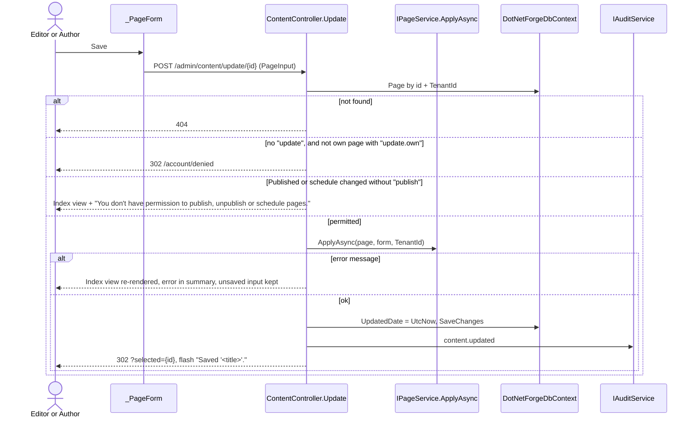
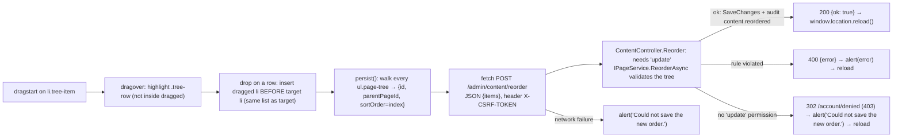
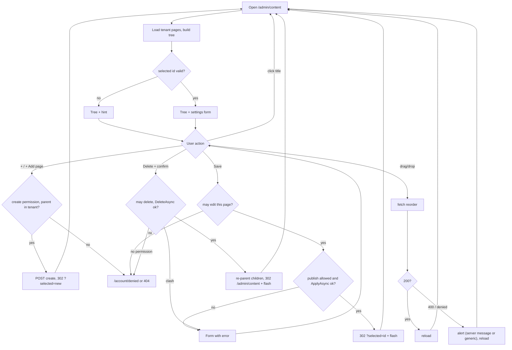
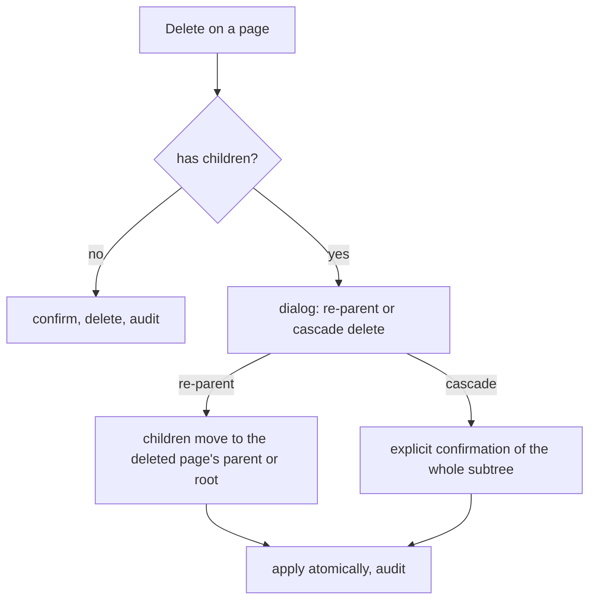

# Content Manager

## Purpose

The Content Manager is where editors build the site's **page tree**: create content pages, arrange them in a
hierarchy, and edit each page's slug, type, SEO metadata, publishing flags and schedule. It is the only admin screen
that changes content. Every admin-capable role (`Super Admin`, `Admin`, `Editor`, `Author`) can open it; what each
role may change differs (see [Permissions](#permissions)). Rules for content pages are documented once in
[content pages and routing](../features/content-pages-and-routing.md); this document describes the screen.

## Route / Navigation

| Item | Value |
| --- | --- |
| Route | `GET /admin/content` |
| Query parameter | `selected` (`Guid`, optional) - the content page shown in the form |
| Mutations | `POST /admin/content/create?parent={guid?}`, `POST /admin/content/update/{id:guid}`, `POST /admin/content/delete/{id:guid}`, `POST /admin/content/reorder` (JSON) |
| Navigation entry | Sidebar → **Main** → **Content Manager** |
| Parent | Admin area (no parent screen) |
| Child screens / tabs | none - one two-pane screen |
| Deep link | `/admin/content?selected=<pageId>` |
| Linked from | the public content page's note ("Manage this page in the Content Manager") |

## Relevant source files

```text
src/DotNetForge.Web/Areas/Admin/Controllers/ContentController.cs     actions, permission checks, tree building
src/DotNetForge.Web/Areas/Admin/Controllers/AdminControllerBase.cs   TenantId, CurrentUserId, Can(area, action), CanModify(area, any, own, createdById)
src/DotNetForge.Web/Areas/Admin/Models/AdminViewModels.cs            ContentIndexViewModel, PageTreeNode, ReorderRequest, ReorderItem
src/DotNetForge.Shared/Content/IPageService.cs   IPageService, PagePosition, PageInput (form model, PageInput.From)
src/DotNetForge.Web/Services/PageService.cs                          ApplyAsync, ReorderAsync, DeleteAsync, Slugify, ToUtc
src/DotNetForge.Shared/Auditing/IAuditService.cs IAuditService (implemented by src/DotNetForge.Web/Services/AuditService.cs)
src/DotNetForge.Shared/Authorization/PermissionMatrix.cs   role defaults for the "Collection types" area
src/DotNetForge.Web/Areas/Admin/Views/Content/Index.cshtml           two-pane layout, flash message, "+ Add page" form
src/DotNetForge.Web/Areas/Admin/Views/Content/_TreeNodes.cshtml      recursive tree partial
src/DotNetForge.Web/Areas/Admin/Views/Content/_PageForm.cshtml       settings form + delete form (data-confirm)
src/DotNetForge.Web/wwwroot/js/admin-content.js                      conditional fields, Published/Disabled exclusivity, drag-and-drop reorder
src/DotNetForge.Web/wwwroot/js/site.js                               data-confirm handler (loaded by _AdminLayout)
src/DotNetForge.Web/wwwroot/css/admin.css                            .content-layout, .tree-pane, .page-tree, .tree-row, .dot, .form-pane
src/DotNetForge.Shared/Entities/Content.cs       Page entity
```

## Page layout

```text
Content Manager (_AdminLayout, title "Content Manager")
├── Flash message (TempData["Success"])            only after a save/delete
└── .content-layout
    ├── Tree pane (aside.tree-pane.panel)
    │   ├── Header: "Pages" + [+ Add page]          form#treeActions (POST, antiforgery)
    │   └── Page tree (_TreeNodes, recursive)
    │       └── Tree item (li.tree-item, draggable)
    │           ├── ⠿ drag handle
    │           ├── status dot + title + /slug        link to ?selected={id}
    │           ├── [+] add child                     submits #treeActions with formaction ?parent={id}
    │           └── children (nested _TreeNodes)
    └── Form pane (section.form-pane.panel)
        ├── (nothing selected) hint text
        └── _PageForm
            ├── Validation summary                    also shows a refused delete
            ├── Title*, Slug* (+ hint)
            ├── Page type ▾ → Target URL (UrlRedirect) / File reference (File)
            ├── Parent ▾ · Sort order
            ├── SEO: Meta title, Keywords, Meta description, Canonical URL
            ├── Publishing: ☐ Published ☐ Disabled
            │   └── #publishOpts: ☐ Display in menu, Scheduled publish (UTC), Scheduled unpublish (UTC), hint
            ├── [Save]
            └── [Delete page]                         separate form, data-confirm
```

On narrow screens (`max-width: 900px`) the two panes stack (`admin.css`). Every button is shown to every role; the
server decides on submit (see [Permissions](#permissions)).

## Components

### Tree pane (`Index.cshtml` + `_TreeNodes.cshtml`)

- **Purpose:** show the whole tree for the active tenant and select a page.
- **Inputs:** `ContentIndexViewModel.Tree` (`IReadOnlyList<PageTreeNode>`), `ViewData["SelectedId"]`.
- **Rendering:** nodes ordered by `SortOrder` then `Title` (order of the query; children keep that order). The
  selected row gets `.active`. The dot is `off` when `Disabled`, else `on` when `Published`, else `draft` - stored
  flags only, so a published page with a future schedule shows `on` even though it isn't live.
- **Events:** clicking a title navigates to `?selected={id}`; **+** submits `#treeActions` to
  `/admin/content/create?parent={id}`; dragging calls the reorder flow.
- **Appears:** always; when the tree is empty it shows "No pages yet. Add your first page." Every role sees every page
  of the tenant.

### "+ Add page" form (`form#treeActions`)

One shared POST form with an antiforgery token. The header button posts to `/admin/content/create`; each row's **+**
button uses `form="treeActions"` and its own `formaction`, so all create actions stay POST + antiforgery.

### Page settings form (`_PageForm.cshtml`)

- **Purpose:** edit every editable field of the selected page.
- **Inputs:** `PageInput` (model), `ViewData["SelectedId"]` (posted to `update/{id}`),
  `ViewData["ParentOptions"]` (every page in the tenant except the selected one, labelled `Title (/slug)`).
- **Output:** `POST /admin/content/update/{id}` bound to `PageInput`.
- **Conditional UI (`admin-content.js`):** rows with `data-when-type` show only when the **Page type** matches;
  `#publishOpts` (menu flag + schedule) shows only while **Published** is checked; checking **Published** unchecks
  **Disabled** and vice versa. Without JavaScript every field is visible and both boxes can be checked.
- **Appears:** only when `Model.Selected` is not null (a valid `selected` id, a failed save or a refused delete).

### Delete form

Separate POST form to `/admin/content/delete/{id}` with
`data-confirm="Delete this page? Its children are re-parented, not deleted."`. `site.js` (loaded by `_AdminLayout`)
shows the native `confirm()` for any form with `data-confirm` and cancels the submit on **Cancel**. There is no inline
`onsubmit` (the CSP forbids inline script).

## Functionality

### Select a page

1. Click a title in the tree (`<a href="/admin/content?selected={id}">`).
2. `Index(selected)` → `BuildIndexAsync(selected, form: null)` loads all tenant pages, maps the selected page with
   `PageInput.From`. An unknown or foreign id simply shows no form (no error). Any admin-capable role can open any
   page's form; the permission check happens on **Save** / **Delete page**.

### Create a page

1. **Trigger:** **+ Add page** (root) or a row's **+** (child).
2. **Permission:** `create` in `Collection types` (every built-in admin-capable role) - else `Forbid()` →
   `/account/denied`.
3. **Validation:** antiforgery; when `parent` is given it must be a page of the tenant, else `404`.
4. **Call:** `ContentController.Create(Guid? parent)`.
5. **Data:** new `Page { TenantId, CreatedById = current user, Title = "Untitled page", Slug = "new-page-<8 hex>",
   Published = false, Disabled = true, PageType = Standard, ParentPageId = parent, SortOrder = <sibling count> }`.
   The suffix is the first 8 hex characters of a new GUID.
6. **Backend:** `SaveChangesAsync`, then audit `content.created`.
7. **Result / UI:** redirect to `?selected={newId}`; the new page is selected in the form (no flash message).
8. **Errors:** a slug collision with the random suffix is theoretically possible (unique index → global error page).

### Save page settings



1. **Trigger:** **Save**.
2. **Permission:** `update`, or `update.own` when `page.CreatedById` is the current user, else `Forbid()`. If the
   posted `Published`, `ScheduledPublishDate` or `ScheduledUnpublishDate` differs from the stored value (dates
   compared after `PageService.ToUtc`), `publish` is also required (`ContentController.ChangesPublishing`).
3. **Validation:** all rules of [`ApplyAsync`](../features/content-pages-and-routing.md#applyasync---save-and-create)
   (title, field lengths, slug, type, parent exists/no cycle, unique slug per parent, one dynamic segment per parent,
   schedule order, redirect/file requirements). `required` on Title is also enforced by the browser.
4. **Service:** `IPageService.ApplyAsync` (implemented by `PageService`).
5. **Data:** every `PageInput` field; slug normalized by `Slugify`; schedule dates treated as UTC.
6. **Backend:** `UpdatedDate` set, one save; audit entry in a second save.
7. **Result:** redirect with flash `Saved '<title>'.`.
8. **Errors:** validation or missing publish permission → same screen with the message and the posted input;
   missing page → 404; no edit permission → `/account/denied`; DB exceptions → global error page.

### Delete a page

1. **Trigger:** **Delete page** → `confirm()` from `site.js` (`data-confirm`).
2. **Validation:** page must exist in the tenant (else 404); `delete`, or `delete.own` on an own page (else
   `Forbid()` → `/account/denied`); `IPageService.DeleteAsync` refuses when re-parenting the children would put two
   equal slugs or two `[...]` pages under the new parent.
3. **Call:** `ContentController.Delete(id)` → `IPageService.DeleteAsync(page)`.
4. **Backend:** all direct children get `ParentPageId = <deleted page's parent>` and a new `UpdatedDate`; the page
   is removed; one save; audit `content.deleted`.
5. **Result:** redirect to `/admin/content` (nothing selected), flash `Deleted '<title>'.`.
6. **Errors:** a clash re-renders the screen (status 200) with the page still selected and
   `Can't delete: its child pages would move up a level and clash. <conflict>` in the form's validation summary;
   nothing is deleted (this used to be a `500`). Rules:
   [`DeleteAsync`](../features/content-pages-and-routing.md#deleteasync---delete).

### Reorder / re-parent by drag and drop



- A drop always makes the dragged page the **previous sibling** of the target; you cannot drop *into* a page that
  has no children, or after the last sibling. Use the **Parent** dropdown / **Sort order** for those cases.
- Drops on itself or inside its own subtree are ignored client-side.
- The client posts the position of **every** page in the tree. `ReorderAsync` checks that every id and parent
  belongs to the tenant, that no move creates a cycle, and that no parent ends up with duplicate slugs or a second
  `[...]` page ([rules](../features/content-pages-and-routing.md#reorderasync---drag-and-drop)); only pages whose
  parent or sort order changed get a new `UpdatedDate`.
- Success writes one audit entry `content.reordered` (entity type `Page`, display `<n> page(s)` = number of posted
  positions).
- On a `400` the script shows the server's `error` text (e.g. `That move would create a cycle in the page tree.`) and
  reloads, so the tree returns to its stored order. Every reload drops `selected`, so the form pane closes.

## Data used by the page

| Data | Origin |
| --- | --- |
| `Page` rows of the active tenant | `DotNetForgeDbContext.Pages` (`AsNoTracking`, ordered by `SortOrder`, `Title`) |
| `ContentIndexViewModel { Tree, Selected, SelectedId, ParentOptions }` | built by `BuildIndexAsync` |
| `PageInput` | `PageInput.From(page)` on GET and after a refused delete; the posted model after a failed save |
| Active tenant / user | `AdminControllerBase.TenantId`, `CurrentUserId` (claims) |
| Permissions | `AdminControllerBase.Can` / `CanModify` → `IPermissionService.HasAny(role claims, "Collection types", action)` |
| Antiforgery token | hidden fields from `@Html.AntiForgeryToken()`; JS reads the first `__RequestVerificationToken` input |

## State

| State | Kind | Changes when |
| --- | --- | --- |
| Selected page | URL `?selected=` | clicking a title, after create/update |
| Unsaved form input | DOM; posted model on validation failure | typing; failed save re-renders it |
| Conditional field visibility | DOM (`admin-content.js`) | changing Page type / Published / Disabled |
| Drag state | JS variable `dragged`, CSS `.dragging`, `.drop-target` | during a drag |
| Flash message | `TempData["Success"]` | after save/delete, consumed on the next render |
| Error state | `ModelState` | failed save, refused delete |
| Persisted tree | database | create, save, delete, reorder; scheduler |

No loading or global client state.

## Permissions

Opening the screen needs the `AdminArea` policy (any admin-capable role, inherited from `AdminControllerBase`). Each
mutation then checks the user's roles against the permission area **`Collection types`** through `IPermissionService`
(backed by the built-in `PermissionMatrix`; stored `RolePermission` rows are not read). Full rules:
[content pages and routing → Permissions](../features/content-pages-and-routing.md#permissions).

| Action | Needs | `Super Admin`, `Admin`, `Editor` | `Author` | Refused with |
| --- | --- | :-: | :-: | --- |
| View tree and forms | `AdminArea` | ✔ | ✔ | sign-in / [denied](access-denied.md) |
| Create a page | `create` | ✔ | ✔ | `Forbid()` → `/account/denied` |
| Save a page | `update`, or `update.own` on a page with `CreatedById` = self | ✔ | own pages only | `Forbid()` → `/account/denied` |
| Change Published / schedule dates | additionally `publish` | ✔ | ✘ | form error `You don't have permission to publish, unpublish or schedule pages.` |
| Delete a page | `delete`, or `delete.own` on an own page | ✔ | own pages only | `Forbid()` → `/account/denied` |
| Reorder (drag-and-drop) | `update` | ✔ | ✘ | `Forbid()` → `/account/denied` (the script shows its generic alert) |

Seeded pages have no `CreatedById`, so Authors cannot edit or delete them. Authors may toggle **Disabled** on their
own pages (not treated as publishing). Covered by
`SecurityTests.Authors_cannot_delete_or_publish_pages_they_did_not_create`.
See [authorization](../features/authorization.md).

## Validation

- Server: `IPageService.ApplyAsync` on **Save** (including length limits - Title 300, Slug 200, Meta title 300, Meta
  description 1000, Keywords 500, Canonical URL / Target URL / File reference 2000 - checked before saving, so
  PostgreSQL never rejects an over-long value); `IPageService.ReorderAsync` on reorder; `IPageService.DeleteAsync` on
  delete; parent existence on create.
- Browser: `required` on Title; `type="number"` on Sort order; `datetime-local` on schedule inputs.
- Duplicate prevention: slug uniqueness per (tenant, parent) in `PageService` + the DB unique index.
- Invalid state the UI still allows: Published + Disabled together (without JS).

## Error handling

| Failure | Detection | User sees | Recovery |
| --- | --- | --- | --- |
| Rule violation on save | `ApplyAsync` returns message | message in the validation summary, input preserved | fix and save again |
| Publishing change without `publish` | `ChangesPublishing` + `Can(..., "publish")` | `You don't have permission to publish, unpublish or schedule pages.` in the summary | leave Published and the schedule unchanged, or ask an Editor |
| No permission for the action | `Can` / `CanModify` false | `302 /account/denied` ([Access denied](access-denied.md), 403) | go back |
| Delete would clash slugs | `DeleteAsync` returns message | `Can't delete: its child pages would move up a level and clash. ...` in the summary | rename or move the children first |
| Page or parent id not in tenant | `FirstOrDefaultAsync` / `AnyAsync` | empty 404 | go back |
| Reorder rule violation | `ReorderAsync` returns message → `400 { error }` | `alert(<server message>)`, then reload | drop elsewhere, or use the Parent dropdown |
| Reorder forbidden (or another non-JSON failure) | `fetch` not ok, body not JSON | `alert("Could not save the new order.")`, then reload | - |
| Reorder network failure | `fetch` rejected | `alert("Could not save the new order.")`; DOM keeps the moved item until reload | reload the page |
| Unique-index violation (random create slug, concurrent edits) | `DbUpdateException` | [error page](error.md) (prod) / exception page (dev) | reload |

## Loading behaviour

Everything is rendered server-side in one response (tree + form). The reorder POST runs asynchronously with no
indicator, then reloads the whole page. No skeletons, no disabled buttons during submit.

## Empty states

- No pages: tree pane shows "No pages yet. Add your first page." (A fresh install has six seeded pages.)
- No selection: form pane shows "Select a page on the left to edit its settings, or add a new page."
- No parent options (only one page): the Parent dropdown contains only "(root)".

## User interactions

| Interaction | Effect |
| --- | --- |
| Click a page title | select (navigates) |
| Click **+ Add page** / row **+** | create root/child page (POST) |
| Drag a row by any part of the item (handle is visual) | reorder/re-parent, then reload |
| Change **Page type** | show Target URL / File reference row |
| Toggle **Published** / **Disabled** | mutually exclusive; publishing options shown only when Published |
| **Save** | validate + save |
| **Delete page** | native confirm dialog (`data-confirm`), then delete; without JavaScript the form submits without confirmation |

No keyboard shortcuts, context menus or modals.

## Dependencies

```text
ContentController
├── DotNetForgeDbContext
├── IPageService → PageService
│   └── DotNetForgeDbContext
├── IAuditService → AuditService
│   ├── DotNetForgeDbContext
│   └── IHttpContextAccessor
└── AdminControllerBase (TenantId, CurrentUserId, AdminArea policy, Can/CanModify → IPermissionService → PermissionMatrix)
admin-content.js (no server dependency besides /admin/content/reorder)
site.js (data-confirm on the delete form)
```

## Page flow



## Related pages

- Navigates to: itself; [Access denied](access-denied.md) when a permission check fails.
- Receives navigation from: sidebar; [public content page](public-page.md) note link.
- Shares functionality with: [public home](public-home.md) and [public content page](public-page.md) (they render
  what this screen edits); `POST /api/content/pages` ([headless API](../features/headless-api.md)) also creates pages
  and applies the same `IPageService.ApplyAsync` rules; the [Dashboard](dashboard.md) counts pages;
  [Audit Logs](audit-logs.md) lists the `content.*` entries.

## Important implementation details

- **Published ≠ live.** The screen edits intent; visibility is computed per request (schedule window, Disabled).
  New pages start **Disabled**.
- `IPageService` methods validate and mutate tracked entities but never save; `ContentController` saves, then audits
  through `IAuditService` (a second save).
- `BuildIndexAsync` loads **all** pages of the tenant on every render (tree + parent options); fine for small trees.
- On a failed save, `Selected` is the posted model but the tree is reloaded from the DB. On a refused delete the form
  shows the stored page.
- The parent dropdown excludes only the page itself; choosing a descendant is caught by the cycle check on save.
- Schedule inputs are formatted `yyyy-MM-ddTHH:mm`; seconds are dropped on the next save.
- `ScheduledPublishingService` may clear schedule dates or uncheck Published between two views of this screen. For a
  user without `publish`, the stale form then counts as a publishing change and the save is refused; reload first.
- Antiforgery for the `fetch` uses the `X-CSRF-TOKEN` header name configured in `DependencyRegistration`.
- `Create` uses `formaction` on buttons so one form serves every add button.
- The screen carries no inline script or style; behaviour comes from `admin-content.js` and `site.js` (CSP
  `script-src 'self'`, see [security](../features/security.md)).

## Known limitations

- No content body/page builder, drafts, preview, history, review, tags, collection/single types or per-page
  permissions (see [Planned](#planned-not-implemented)).
- Drag-and-drop can only insert before an existing sibling; no "drop into" or "drop at end".
- Buttons are not hidden by permission: an Author sees **Save**, **Delete page**, the Published checkbox and the drag
  handles on every page and learns about a restriction only on submit.
- Authors cannot edit seeded pages or pages created through the API (no `CreatedById`).
- A forbidden reorder shows the generic alert, not a permission message (the `fetch` follows the redirect to the
  403 denied page).
- No search/filter; whole tree always expanded.
- The status dot reflects stored flags, not liveness.
- `PageType` values other than `Standard` are stored but have no public effect.

## Planned (not implemented)

Target behaviour from the original product specification. Nothing in this section exists in the code unless marked ✔.

The content model, rules, role defaults and the full acceptance criteria are in
[content pages and routing → Planned](../features/content-pages-and-routing.md#planned-not-implemented); this
section covers only the screen.

### Requirements

| Area | Target UI |
| --- | --- |
| Navigation | the screen lists the active tenant's collection types, single types and the page tree (✔ page tree only) |
| Collection entries | per type: list with search and filters (status, tags); create, edit, duplicate, delete, reorder entries |
| Single type | one form for its only entry |
| Type schemas | Admins create/edit collection and single types and their fields |
| Page form | adds a target-page picker (`ExistingPage`), a File Manager asset picker for `FileReference` ([media storage](../features/media-storage.md)), tags (create-on-type, autocomplete), view roles and view users, theme, layout and layout settings ([themes](../features/themes.md#planned-not-implemented)) |
| Save actions | **Save draft**, **Publish** (when allowed), **Submit for review**, **Preview** |
| Page builder | a builder mode for Standard pages: place built-in modules, the Razor module and extension modules, configure each |
| History | per page/entry: version list with author and time, pick two to compare side by side, **Restore** |
| Review Content | reviewer queue of assigned items with draft and diff; **Approve & publish**, **Reject with comments**, **Request revision** |
| Tags | manage the vocabulary: rename, merge, delete |
| Warnings | broken file/media reference, `ExistingPage` pointing at a deleted page, page slug shadowed by or shadowing a dynamic route, dynamic route with a missing target |
| Actions per role | buttons follow the role defaults ([content role defaults](../features/content-pages-and-routing.md#role-defaults-for-content)) (✔ enforced on the server for create, save, publish, delete and reorder; buttons are not hidden) |

The sidebar already has a **Content History** placeholder at `/admin/content-history` (✔ placeholder only,
[module placeholders](module-placeholders.md)).

### User flows

**Create a page (target).** Today **+ Add page** creates an `Untitled page` immediately; the target is a guided
create:

1. **Add page**, optionally on a parent node.
2. Choose the page type (Standard, Existing page, URL redirect, File).
3. Enter slug, title, SEO fields; slug format and uniqueness are validated.
4. Set display in menu, sort order, schedule, theme/layout and per-page permissions.
5. URL redirect → target URL; File → file reference; Existing page → target page.
6. **Save draft**.

**Create a collection entry.** Select a collection type → **Create entry** → the type's fields render → fill
required fields, attach media, add tags → **Save draft** (validated, history version recorded) → optionally
**Submit for review** or **Publish**.

**Edit a single type.** Select the single type → edit its fields → **Save draft**; publishing updates the live entry
and records a version.

**Build and preview.** Open a Standard page → builder mode → place and configure modules → **Preview** renders the
draft as a visitor sees it → each save records a draft version.

**History, compare, restore.** **History** → versions with who and when → select two → side-by-side diff →
**Restore** a version, which becomes a new version.

**Submit for review.** On a draft → **Submit for review** → assign reviewers (or default pool) → status
`In review`, reviewers notified, submission logged.

**Review and decide.** **Review Content** → open an assigned item with its draft and diff → **Approve & publish**
(draft goes live), **Reject with comments** (status `Rejected`) or **Request revision** (status
`Revision requested`) → decision logged with reviewer, time and comments.

**Delete a page that has children.**



Today the delete form always re-parents children after a browser `confirm` (`data-confirm`), and refuses when they
would clash (see [Delete a page](#delete-a-page)).

### Rules and validation

- Reject and request-revision dialogs require a comment; submit is blocked without one.
- **Publish** without direct-publish permission on a tenant with mandatory review submits for review instead.
- A parent selection that would create a cycle is rejected and cleared (✔ rejected on save by `PageService`).
- Client-side checks are advisory; every action validates on the server (✔ create, save, reorder and delete validate
  in `ContentController` / `IPageService`).

### Edge cases

- **Version conflict:** saving over a newer version shows a conflict dialog with a diff and merge / overwrite /
  discard options.
- **Restore during an open review:** the item returns to draft and the review is closed in its history.
- **Broken reference:** a File page or entry whose asset was deleted shows a warning and cannot be published.
- **Tree drag-and-drop** must apply the same rules as **Save** (parent exists, no cycle, unique slug, one dynamic
  segment per parent) - ✔ `IPageService.ReorderAsync`, `400 { error }` shown in an alert
  (`SecurityTests.Reorder_rejects_a_cycle`, `PageServiceTests.Reorder_rejects_moves_that_duplicate_a_slug`).

### Acceptance criteria

Tracked once in [content pages and routing → Acceptance criteria](../features/content-pages-and-routing.md#acceptance-criteria).

## Extension points

- New field: follow the checklist in [content pages and routing → Where to change things](../features/content-pages-and-routing.md#where-to-change-things).
- New rule: add it to `PageService` (`ApplyAsync`, `ReorderAsync` or `DeleteAsync`), never to the controller or the
  view.
- New tree action (e.g. duplicate page): add a POST action to `ContentController` with a `Can` / `CanModify` check
  in `PermissionAreas.CollectionTypes`, a `formaction` button using `form="treeActions"` in `_TreeNodes.cshtml`, and
  an `IAuditService.LogAsync` call with a new `AuditActions` constant.
- Hide actions the user cannot perform: compute flags with `Can` / `CanModify` in `BuildIndexAsync` (as
  `MediaIndexViewModel.CanUpload` / `MediaRowViewModel.CanDelete` do on [Media](media.md)) and keep the server
  checks.
- Client behaviour: `src/DotNetForge.Web/wwwroot/js/admin-content.js` (keep the screen working without JS; no inline script or style).
