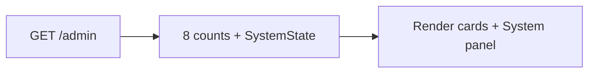

# Dashboard

## Purpose

The admin landing screen: an at-a-glance count of the main records and basic system facts. Every admin-capable
user lands here after sign-in or setup. Read-only.

## Route / Navigation

| Item | Value |
| --- | --- |
| Route | `GET /admin` |
| Navigation entry | Sidebar → **Main** → **Dashboard**; default after login/setup; **Back to admin** on the denied screen |
| Parameters | none |
| Child screens | none (stat cards are not links) |

## Relevant source files

```text
src/DotNetForge.Web/Areas/Admin/Controllers/DashboardController.cs   counts + system state
src/DotNetForge.Web/Areas/Admin/Models/AdminViewModels.cs            DashboardViewModel
src/DotNetForge.Web/Areas/Admin/Views/Dashboard/Index.cshtml         stat grid + system panel
src/DotNetForge.Web/wwwroot/css/admin.css                            .stat-grid, .stat-card, .panel, table.kv
```

## Page layout

```text
Dashboard (_AdminLayout, title "Dashboard")
├── "Admin overview for <APP_NAME>."
├── Stat grid (8 cards): Users · Roles · Pages · Media files · API tokens · Webhooks · Extensions · Audit entries
└── Panel "System"
    ├── CMS version     SystemState.CmsVersion (default "1.0.0")
    ├── Installed       SystemState.InstalledAtUtc ("u" format) or "-"
    └── Operating modes "Traditional · Headless · Hybrid" (static text)
```

## Components

| Card | Query | Tenant-scoped |
| --- | --- | :-: |
| Users | `Users.Count(TenantId)` | ✔ |
| Roles | `Roles.Count(TenantId)` | ✔ |
| Pages | `Pages.Count(TenantId)` (all, not just live) | ✔ |
| Media files | `MediaFiles.Count(TenantId)` | ✔ |
| API tokens | `ApiTokens.Count(TenantId && !Revoked)` (expired tokens still counted) | ✔ |
| Webhooks | `Webhooks.Count(TenantId)` (always 0 today) | ✔ |
| Extensions | `InstalledExtensions.Count()` (always 0 - discovered extensions are not counted) | ✘ |
| Audit entries | `AuditLogs.Count(TenantId == active \|\| TenantId == null)` (tenant-less = failed sign-ins) | ✔ |

## Functionality

Display only - no actions.

## Data used by the page

`DashboardViewModel` built from 8 sequential `CountAsync` queries + one `SystemState` read; `AppEnvironment.AppName`.

## State

None.

## Permissions

`AdminArea` policy: any admin-capable role. All cards are visible to every such role.

## Validation

Not applicable.

## Error handling

DB failures → global error handling.

## Loading behaviour

Server-rendered; 9 queries run one after another on each visit; no caching.

## Empty states

Counts show `0`; "Installed" shows `-` if the date is missing.

## User interactions

None besides the sidebar.

## Dependencies

```text
DashboardController → DotNetForgeDbContext, AppEnvironment, AdminControllerBase.TenantId
```

## Page flow



## Related pages

Receives navigation from [Sign in](login.md), [Setup](setup.md), [Access denied](access-denied.md). Each card
corresponds to a screen: [Users](users.md), [Roles](roles.md), [Content Manager](content-manager.md),
[Media](media.md), [API Tokens](api-tokens.md), webhooks ([placeholder](module-placeholders.md)),
[Plugins](plugins.md), [Audit Logs](audit-logs.md).

## Important implementation details

- `CmsVersion` comes from the database row (seeded default `1.0.0`), not from the assembly version.
- The spec's widgets, activity feed, health and update checks ([planned](#planned-not-implemented)) are not
  implemented; `IWidgetExtension` is not used.

## Known limitations

- The Extensions count is global and ignores on-disk extensions. The Audit entries count is tenant-scoped (same
  filter as [Audit Logs](audit-logs.md)) but includes tenant-less entries (failed sign-ins), which are shared by every
  tenant.
- Cards are not links.

## Planned (not implemented)

Target behaviour from the original product specification. Nothing in this section exists in the code unless marked ✔.

### Requirements

The Dashboard becomes a configurable grid of independent widget cards for the active tenant, extensible by
extensions. It is read-only and part of the admin area (never themed, never reachable by `Public`).

**Built-in widgets**

| Widget | Summarizes | Drill-down target | Today |
| --- | --- | --- | --- |
| Project statistics | totals for the active tenant: pages, content entries, published vs. draft, media items, users, extensions | [Content Manager](content-manager.md), [Settings overview](settings.md#planned-not-implemented) | partly: Users, Pages, Media files, Extensions cards (no published/draft split; Extensions always 0) |
| Content statistics | pages/entries by status (published, draft, scheduled, disabled), recently edited, awaiting review | Content Manager, pre-filtered | ✘ |
| User statistics | total, active vs. disabled, new registrations over a period, users per role | [Users](users.md), [Roles](roles.md) | Users count only |
| Media statistics | total items, storage used, public vs. private, breakdown by file type | [Media](media.md) | Media files count only |
| Recent activity | latest audit entries (sign-ins, content created/updated/deleted, media uploaded, extension installed, role changed) | [Audit Logs](audit-logs.md) | Audit entries count only (tenant-scoped) |
| Installed extensions | count + list with enabled/disabled status and available updates | [Plugins](plugins.md) | Extensions count (always 0) |
| System health | database connectivity and provider, environment, storage availability, background job/queue status, error indicators | [Settings overview](settings.md#planned-not-implemented) | ✘ |
| Update status | current CMS version, available CMS update, extensions with pending updates | [Settings overview](settings.md#planned-not-implemented), [transfer and updates](../features/transfer-and-updates.md) | CMS version only (System panel) |

**Custom widgets** ([extensions](../features/extensions.md#non-admin-extension-types))

- Contributed by extensions of type `widget` and `admin`; described in the manifest (`dotnetforge.extension.json`)
  and loaded through its `entryPoint`. The contract `IWidgetExtension` (`string Render()`) exists ✔ but nothing
  discovers or calls it.
- The manifest `permissions` declare what the widget may read; enforced before the widget is offered or rendered.
- Available only while the parent extension is installed, enabled and manifest-valid.
- Behave exactly like built-in widgets for add/remove/rearrange, permission filtering and loading/empty/error states.

**Layout and personalisation**

- Layout stored per user **and** per tenant: chosen widgets, order, grid position and size. No layout store exists.
- Add from an "Add widget" picker, remove from the card menu, drag to rearrange, drag a handle to resize.
- Changes persist immediately and are restored on the next visit.
- **Reset to default** restores the default layout of the user's most-privileged role.

**Default widgets per role** (re-evaluated against granted permissions, see [authorization](../features/authorization.md))

| Role | Sees Dashboard | Default widgets |
| --- | --- | --- |
| `Super Admin` | yes ✔ | all, including System health, Update status and all tenants |
| `Admin` | yes ✔ | all, within permitted tenant(s); no cross-tenant view unless granted |
| `Editor` | yes ✔ | Content, Media, Recent activity, Project statistics; no User statistics, System health, Update status unless granted |
| `Author` | yes ✔ (limited) | Content statistics scoped to own content, Recent activity scoped to own actions |
| `Authenticated` | no ✔ | none, unless explicitly granted admin permissions |
| `Public` | never ✔ | none |

Widgets render asynchronously - this would be the first client-side data fetching in the admin area (today every
screen is fully server-rendered, see [page architecture](../architecture/pages.md#how-screens-load-data)).

### User flows

| Flow | Steps |
| --- | --- |
| View | resolve roles and active tenant → load saved layout (none → role default) → drop widgets the user may not see (silently) → each widget fetches its data independently with its own loading state → render data, empty state, or error state with **Retry** |
| Add widget | open picker (built-ins + widgets of installed, enabled extensions the user is permitted to see) → select → added at default position/size, layout persisted, widget enters loading state |
| Remove widget | card menu → **Remove** → layout persisted, grid reflows; affects only this user, never disables/uninstalls the extension |
| Rearrange / resize | drag card or resize handle → order and grid coordinates persisted → restored on later visits |
| Drill into a stat | click a stat/count/list item (e.g. "12 drafts") → owning screen pre-filtered (e.g. Content Manager filtered to drafts); target re-checks access and shows access denied if needed |
| Retry | **Retry** on a failed widget → loading state → re-request → data, empty or error |

### Rules and validation

- **Widget identity:** stable, unique id per widget; no two widgets with the same id; custom widget ids derive from
  the extension `id`.
- **Permissions:** checked before a widget is offered in the picker or rendered; unauthorized widgets are omitted,
  not shown disabled. Add/remove/rearrange touch only the acting user's layout.
- **System health** and **Update status** are shown to `Super Admin` and `Admin` only by default (they reveal
  environment and version details). Today the System panel (CMS version) is shown to every admin-capable role.
- **Drill-down** never bypasses module permissions ✔ (every target screen has its own controller-level check).
- **Layout persistence:** references to missing or unavailable widgets are ignored at render and may be pruned on
  save. Positions/sizes stay within grid bounds; overlaps and out-of-bounds coordinates are normalized before saving.
- **Custom widget loading:** only from installed, enabled, manifest-valid extensions; never from invalid, unsafe or
  incompatible ones.
- **Tenant scoping:** every widget query is scoped to the active tenant (today only the Extensions count is global;
  the Audit entries count is scoped ✔ - see [Components](#components)); a widget never shows data from a tenant
  the user cannot access.
- **Read-only:** widgets perform no writes; any action navigates to the owning screen.
- **Freshness:** widgets show when their data was last loaded where relevant; a slow widget never blocks the page.

### Edge cases

| Case | Target behaviour |
| --- | --- |
| Fresh install / no data | Non-error empty state with a call to action (e.g. "No content yet" → "Create your first page"), never a blank card. Recent activity and Installed extensions may be empty right after setup. |
| Widget of a disabled extension | Data not rendered; widget hidden or a non-blocking placeholder with a link to [Plugins](plugins.md) for users who may manage it; reference stays harmless and works again on re-enable. |
| Widget of an uninstalled extension | Disappears from picker and all layouts; dangling references ignored at render, pruned on next save; no error shown. |
| Slow widget | Own loading state, never blocks the Dashboard or admin shell; a timeout moves it to the failed state. |
| Failed widget | Contained error state with **Retry**; sibling widgets unaffected. |
| Misbehaving custom widget (throws, exceeds time budget, reads beyond declared `permissions`) | Isolated to its card and logged ([audit logging](../features/audit-logging.md)); cannot read outside its permitted scope or tenant. |
| Permission revoked while viewing | Widget omitted on next load; layout reference kept inert in case access returns. |
| Health / update check unreachable | Degraded/unknown state with retry - never implies healthy. |
| Same user edits layout in two sessions | Last persisted write wins; saves are atomic (never partially saved). |
| Tenant switch | Reload with that tenant's layout and data; no stale data from the previous tenant. |

### Acceptance criteria

- [ ] A signed-in admin user without a saved layout sees the default layout of their most-privileged role.
- [x] The `Public` role can never reach the Dashboard or the admin area - `AdminArea` policy on
  `AdminControllerBase`; anonymous requests redirect to sign-in.
- [x] An `Authenticated`-only user does not see the Dashboard by default - `AdminArea` policy → `/account/denied`.
- [ ] `Author` users see only content/activity widgets scoped to their own content; no User statistics, System
  health or Update status by default.
- [ ] System health and Update status are visible only to roles with the matching permissions (`Super Admin`/`Admin`
  by default).
- [ ] All eight built-in widgets render.
- [ ] A user can add a widget from the picker, and the picker lists only permitted widgets.
- [ ] A user can remove a widget; it affects only their layout and does not disable or uninstall an extension.
- [ ] A user can drag to rearrange and resize widgets, and the arrangement persists across sessions.
- [ ] Clicking a stat drills into the owning screen with filtering, and the target enforces its own permissions -
  cards are not links today.
- [ ] On a fresh install every widget shows a clear empty state.
- [ ] A widget of a disabled extension does not render its data (placeholder or hidden); re-enabling restores it.
- [ ] Uninstalling an extension removes its widgets from the picker and all layouts without errors.
- [ ] Widgets load asynchronously; a slow widget shows a loading state and never blocks the rest.
- [ ] A failed or timed-out widget shows a contained error state with a working **Retry**; siblings unaffected.
- [ ] A custom widget loads only from an installed, enabled, manifest-valid extension and cannot read beyond its
  declared permissions.
- [ ] Widget data is scoped to the active tenant, layouts are stored per user and tenant, and switching tenant
  reloads the right layout and data.
- [ ] A widget never shows data the user may not view; unauthorized widgets are omitted - today every card is shown
  to every admin-capable role (e.g. Authors see the Users count).

## Extension points

Add a count: property on `DashboardViewModel`, query in `DashboardController.Index` (scope by `TenantId`), card in
the view. For widgets, introduce a view component per widget rather than growing the controller.
