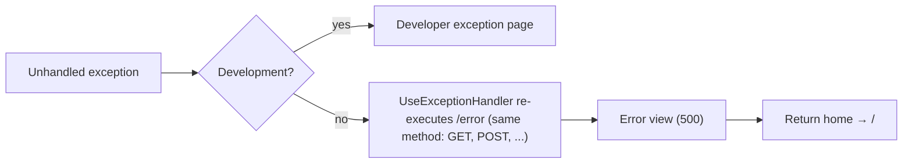

# Error

## Purpose

Generic "Something went wrong" screen for unhandled exceptions outside the Development environment. Error-handling
architecture: [logging and error handling](../features/logging-and-error-handling.md).

## Route / Navigation

| Item | Value |
| --- | --- |
| Route | `/error`, any HTTP method (`[Route("/error")]` on `HomeController.Error`) |
| Reached from | `app.UseExceptionHandler("/error")` (non-Development only) re-executing a failed request; or directly |
| Before install | a direct visit is redirected to `/setup` (the path has no extension) |

## Relevant source files

```text
Program.cs                    UseExceptionHandler("/error") when !IsDevelopment()
Controllers/HomeController.cs Error()
Views/Home/Error.cshtml        hero with message and "Return home"
Views/Shared/_Layout.cshtml   public layout
```

## Page layout

```text
Error (_Layout, title "Error · DotNetForge CMS")
├── Header (brand falls back to "DotNetForge CMS" - AppName is not set)
├── "Something went wrong"
├── "An unexpected error occurred while processing your request."
├── [Return home] → /
└── Footer
```

## Components, functionality, data, state

Static view; no model, no actions, no data, no state. The response status is whatever the exception handler set
(500 when re-executed). The page carries no inline script or style, so it renders under the production
Content-Security-Policy (see [security](../features/security.md)).

## Permissions

Anonymous.

## Validation, loading, empty states, user interactions

Not applicable; one link.

## Error handling

This *is* the error handler. The exception handler re-executes the failed request with its **original method**, so
the action accepts every method: an exception thrown while handling a form POST (e.g. an admin save) renders this
page with status 500, like a failed GET. (Previously the action was GET-only and failed POSTs returned an empty
500.)

## Dependencies

`HomeController` (constructor needs `AppEnvironment`, `DotNetForgeDbContext`, unused here).

## Page flow



## Related pages

[Public home](public-home.md).

## Important implementation details / known limitations

- No request id or correlation id is shown or logged by the application.
- No custom 404 page: `NotFound()` results are empty bodies, not this screen.

## Extension points

To show a request id, use `HttpContext.TraceIdentifier` in `Error()` and pass it to the view. Keep `[Route("/error")]`
method-agnostic; an `[HttpGet]` restriction would bring back empty 500s for failed POSTs.
