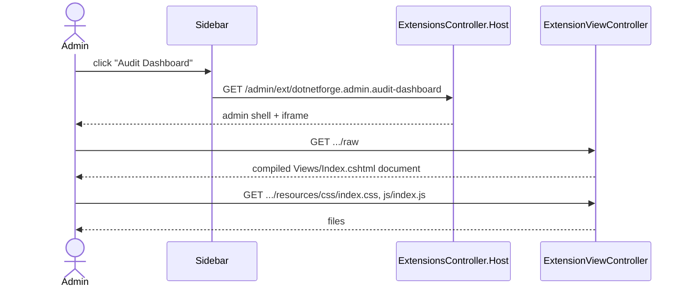

# Admin extension tab (extension host)

## Purpose

Shows an **admin extension** (an extension with manifest `type: "admin"`) as a tab inside the admin area. The admin
shell (sidebar, top bar) stays the CMS's; the extension's own Razor document is rendered in an iframe. The repository
ships one: **Audit Dashboard** (`extensions/admin/audit-dashboard`). Mechanism and security model:
[extensions → Admin extensions](../features/extensions.md#admin-extensions).

## Route / Navigation

| Route | Handler | Returns |
| --- | --- | --- |
| `GET /admin/ext/{id}` | `ExtensionsController.Host` (Admin area) | `_AdminLayout` + iframe |
| `GET /admin/ext/{id}/raw` | `ExtensionViewController.Render` (no area) | the extension's `Views/Index.cshtml` as a full document |
| `GET /admin/ext/{id}/resources/{**path}` | `ExtensionViewController.Resource` | a static file from `Views/Resources/` |

`{id}` is the manifest `id` (case-insensitive), e.g. `/admin/ext/dotnetforge.admin.audit-dashboard`. Navigation
entry: Sidebar → **Extensions** group (rendered by `AdminExtensionsNavViewComponent` only when at least one valid
admin extension exists).

## Relevant source files

```text
src/DotNetForge.Web/Areas/Admin/Controllers/ExtensionsController.cs                         Host
src/DotNetForge.Web/Areas/Admin/Views/Extensions/Host.cshtml                                iframe (.ext-frame)
src/DotNetForge.Web/Areas/Admin/Components/AdminExtensionsNavViewComponent.cs               sidebar group
src/DotNetForge.Web/Areas/Admin/Views/Shared/Components/AdminExtensionsNav/Default.cshtml   sidebar links
src/DotNetForge.Web/Controllers/ExtensionViewController.cs                                  Render, Resource, settings normalization
src/DotNetForge.Web/Startup/DependencyRegistration.cs                                       AddRazorRuntimeCompilation + PhysicalFileProvider(ExtensionViewRoot); IExtensionLoader singleton (root env.ExtensionsPath)
src/DotNetForge.Extensions/ExtensionLoader.cs                           Discover (cached), FindAdminExtension, FileSystemWatcher
src/DotNetForge.Core/Extensions/IExtensionContracts.cs                  IExtensionLoader, DiscoveredExtension
src/DotNetForge.Web/Middleware/SecurityHeadersMiddleware.cs                                 CSP / X-Frame-Options for the shell and the iframe document
src/DotNetForge.Web/DotNetForge.Web.csproj                                                  <None Include="extensions/**" CopyToPublishDirectory="PreserveNewest" />
extensions/admin/audit-dashboard/**                                     the sample extension
```

## Page layout

```text
<Extension name> (_AdminLayout, title = manifest name)
└── iframe.ext-frame src=/admin/ext/{id}/raw
    └── extension document (its own _Layout)
        e.g. Audit Dashboard:
        ├── header "Audit Dashboard" + subtitle
        ├── stats: Recent events · Failed logins (if settings.showFailedLogins != false) · Last activity
        ├── table of the latest 50 audit entries (When, User, Action, Entity, Result, IP)  or "No audit activity yet."
        └── footer "Loaded at <time>" (set by Resources/js/index.js)
```

## Components

| Component | Inputs | Output / behaviour |
| --- | --- | --- |
| `AdminExtensionsNavViewComponent` | `IExtensionLoader.Discover()` (cached) | valid `admin` manifests as `(Id, Name)` ordered by name → links; active when path equals `/admin/ext/{id}` |
| `Host.cshtml` | `ViewData["Title"]`, `ViewData["ExtensionId"]` | iframe |
| `ExtensionViewController.Render` | manifest, `Views/Index.cshtml` path | `ViewData["Settings"]` (manifest settings, `JsonElement` → `bool`/`long`/`double`/`string`, arrays/objects as JSON text), `ViewData["ResourceBase"] = /admin/ext/{id}/resources` |
| `ExtensionViewController.Resource` | `path` | file under `Views/Resources/` with a content type by extension |

## Functionality

### Open an extension tab

1. Click the sidebar entry.
2. `Host` calls `IExtensionLoader.FindAdminExtension(id)` (a **valid** manifest of type `admin` with that id,
   case-insensitive) → renders the shell; `null` → 404.
3. The browser loads `/raw`: `Render` calls `FindAdminExtension(id)` again (served from the loader's cache),
   requires `Views/Index.cshtml`, builds an app-relative path (`~/extensions/...`) and returns `View(path)` -
   compiled in memory on first use by runtime Razor compilation (nothing is written to disk).
4. The extension's layout links `@ViewData["ResourceBase"]/css/index.css` and `.../js/index.js`; `Resource` serves
   them (both requests also use `FindAdminExtension`).

## Data used by the page

Manifest (`id`, `name`, `settings`), files under the extension's `Views/`. Whatever the extension's views inject -
the sample injects `DotNetForgeDbContext` and reads `AuditLogs` (all tenants - unlike the core
[Audit Logs](audit-logs.md) screen, it is not tenant-scoped).

## State

None in the host. Extension-defined state only.

## Permissions

All three endpoints: `AdminArea` policy (any admin-capable role). Manifest `permissions` are not enforced. Iframe
requests carry the same auth cookie (same origin).

## Validation

Only valid manifests (`DiscoveredExtension.IsValid`) of type `admin` are served. `Resource` rejects paths outside
`Views/Resources/` (`Path.GetFullPath` + prefix check) and missing files.

## Error handling

| Case | Result |
| --- | --- |
| Unknown / invalid / non-admin id | 404 (shell or iframe) |
| No `Views/Index.cshtml` | 404 in the iframe (shell still renders) |
| Razor compile or runtime error in the extension | exception → error page / developer page **inside the iframe** |
| Inline `<script>`, inline `<style>` or `style="..."` in the extension's views | blocked by the browser outside Development (CSP `script-src 'self'; style-src 'self'`); in Development only reported (report-only header) |
| Traversal attempt or missing resource | 404 |

## Loading behaviour

Shell renders immediately; the iframe loads separately. First render of an extension view triggers Razor
compilation (slower); later renders reuse it until the file changes.

## Empty states

No admin extensions → no **Extensions** sidebar group. The sample shows "No audit activity yet." when empty.

## User interactions

Inside the iframe, whatever the extension provides (the sample has none).

## Dependencies

```text
ExtensionsController / ExtensionViewController / AdminExtensionsNavViewComponent
├── IExtensionLoader (singleton) → ExtensionLoader(IManifestValidator, env.ExtensionsPath) + FileSystemWatcher
├── IWebHostEnvironment (ContentRootPath; ExtensionViewController only, for the view path)
├── Runtime Razor compilation (PhysicalFileProvider over the content root)
└── SecurityHeadersMiddleware (CSP, X-Frame-Options: SAMEORIGIN)
```

## Page flow



## Related pages

[Plugins](plugins.md) (lists the same manifests), [Audit Logs](audit-logs.md) (the sample's data source).

## Important implementation details

- The URL uses the manifest `id`; the manifest's `routes` array is ignored (the sample declares
  `/admin/ext/audit-dashboard`, which 404s).
- Discovery is cached in the `ExtensionLoader` singleton. A `FileSystemWatcher` on `AppEnvironment.ExtensionsPath`
  (filter `dotnetforge.extension.json`, subdirectories included) clears the cache when a manifest is created,
  changed, renamed or deleted, or when the watcher reports an error; a version counter keeps a scan that overlapped a
  change from being cached. If the watcher cannot be created (missing folder at startup, unsupported file system),
  every call rescans. Changes to view files are picked up by runtime compilation, not by this cache.
- The three endpoints and the sidebar share one lookup, `IExtensionLoader.FindAdminExtension(id)`; the controllers
  no longer build the extensions path themselves.
- `extensions/` is copied to the publish output (`CopyToPublishDirectory="PreserveNewest"` as `None` items, so the
  Razor SDK does not precompile them). The folder is read at runtime and never written - a read-only deployment
  works ([deployment](../guides/deployment.md#read-only-deployment-requirements)).
- Security headers apply to both documents: the shell and the iframe are same-origin, so `X-Frame-Options:
  SAMEORIGIN` and CSP `frame-src 'self'; frame-ancestors 'self'` allow the embedding. The extension document gets
  the same CSP as every response: scripts and styles only from files (`script-src 'self'; style-src 'self'`), no
  inline script or style.
- The iframe document is **not** wrapped by `_AdminLayout` because `ExtensionViewController` is outside the area and
  the extension supplies its own `_ViewStart`/`_Layout`.
- Runtime compilation is enabled in every environment, so production compiles extension views on demand.

## Known limitations

- Extensions run with host privileges; no permission or tenant sandbox (the sample's audit query is unscoped).
- No CSP nonce support: an extension cannot opt into inline script or style.
- No enable/disable: every valid admin manifest is live.
- Supported resource types are limited to the switch in `Resource` (others served as `application/octet-stream`).

## Planned (not implemented)

Target behaviour from the original product specification. Nothing in this section exists in the code unless marked ✔.
The full extension model is in [extensions → Planned](../features/extensions.md#planned-not-implemented).

### Requirements

- Only **installed and enabled** admin extensions get a sidebar entry and are served by the three endpoints; a
  disabled-but-installed extension contributes no routes (today every valid admin manifest is live).
- Extensions must pass validation, dependency, compatibility and safety checks before they are loaded; only the
  manifest validation exists ✔.
- The manifest `permissions` are enforced at runtime through the role/permission model (today the extension's views
  get full DI access - see [Known limitations](#known-limitations)).
- Routes an extension declares in its manifest `routes` are registered when it is enabled (today ignored; the tab URL
  is always `/admin/ext/{id}`).

### Acceptance criteria

- [ ] Invalid, unsafe or incompatible extensions are never loaded (invalid manifests already 404 ✔; no safety or
  compatibility checks exist).
- [ ] Each extension's declared permissions are enforced at runtime via the role/permission model.

## Extension points

- Create a new admin extension: [extension development guide](../guides/extension-development.md) (no inline
  script/style, no runtime file writes) and the
  [admin-extension skill](../../.claude/skills/admin-extension/SKILL.md).
- New resource content types: `ExtensionViewController.Resource`.
- Pass more context to extension views: add `ViewData` entries in `ExtensionViewController.Render` and document them
  in the guide.
