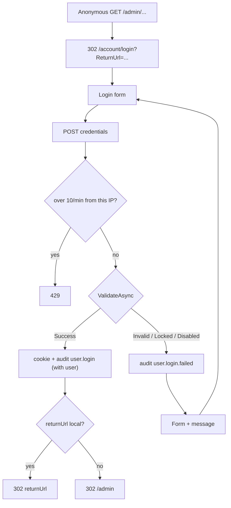

# Sign in

## Purpose

Lets an existing user sign in with email and password to reach the admin area. It is the cookie scheme's login
page, so every anonymous request to a protected admin screen ends up here. Mechanism details:
[authentication](../features/authentication.md).

## Route / Navigation

| Item | Value |
| --- | --- |
| Route | `GET /account/login`, `POST /account/login`; sign-out is `POST /account/logout` |
| Query parameter | `returnUrl` (also accepted as `ReturnUrl`, which the cookie middleware sends) |
| Navigation entry | redirect from any protected admin URL; **Sign out** returns here |
| Parent / children | none |
| On success | `returnUrl` when it is a local URL (`Url.IsLocalUrl`), otherwise `/admin` |
| Rate limit | `POST /account/login`: 10 requests per minute per client IP (policy `credentials`) → `429` |

## Relevant source files

```text
Controllers/AccountController.cs        Login (GET/POST), Logout, Denied
Views/Account/Login.cshtml              form (uses _AuthLayout)
Views/Shared/_AuthLayout.cshtml         layout
Services/AuthService.cs                 ValidateAsync (credentials, lockout, principal), GetDefaultTenantIdAsync, IsActiveAsync
Services/AuditService.cs                user.login / user.login.failed / user.logout (via IAuditService)
Startup/DependencyRegistration.cs       cookie options (paths, lifetime, flags), ValidateSessionAsync, AddRateLimits
src/DotNetForge.Shared/Constants/RateLimitPolicies.cs   policy names (credentials, api)
```

## Page layout

```text
Sign in (_AuthLayout, title "Sign in · <APP_NAME>")
└── Auth card
    ├── <APP_NAME>
    ├── "Sign in"
    ├── Validation summary
    └── Form (POST /account/login?returnUrl=..., antiforgery)
        ├── Email (type=email, autofocus)
        ├── Password
        └── [Sign in]
```

## Components

| Component | Purpose | Inputs | Output |
| --- | --- | --- | --- |
| Login form | credentials | `email`, `password` (simple parameters, no model), `returnUrl` via `asp-route-returnUrl` | `AccountController.Login(email, password, returnUrl)` |
| Validation summary | one error message | `ModelState` | - |

## Functionality

### Sign in

1. **Trigger:** **Sign in**.
2. **Validation:** rate limit (`[EnableRateLimiting(RateLimitPolicies.Credentials)]`, checked before the action);
   browser `required` + `type=email`; server: antiforgery, then `AuthService.ValidateAsync`.
3. **Call:** `AccountController.Login` gets the tenant from `AuthService.GetDefaultTenantIdAsync` (the oldest
   tenant), calls `AuthService.ValidateAsync(email, password, tenantId)`.
4. **Backend:** lockout counters / `LastLoginDate` updated; on success the cookie `dnf.auth` is issued, the
   request's `HttpContext.User` is set to the new principal and `user.login` is audited with that user's `UserId`
   and `TenantId`; on failure `user.login.failed` (`success: false`, no user, typed email as entity display).
5. **Result:** `LocalRedirect(Url.IsLocalUrl(returnUrl) ? returnUrl : "/admin")` - an external or malformed
   `returnUrl` (e.g. `https://evil.example/`) falls back to `/admin`.
6. **Errors:** see below; the email field is **not** re-filled after a failure (no model binding to the view).

### Sign out

`POST /account/logout` from the admin top bar or the denied screen → audit `user.logout` → sign out →
`302 /account/login`.

## Data used by the page

`AppEnvironment.AppName`, `ViewData["ReturnUrl"]`, `Users`, `UserRoles` ⨝ `Roles`, oldest `Tenant`.

## State

`returnUrl` travels in the query string of the form action. Successful sign-in creates the auth cookie `dnf.auth`
(8 h, sliding, `HttpOnly`, `SameSite=Lax`, `Secure` outside Development - `CookieSecurePolicy.Always`; in
Development `SameAsRequest`). `User.FailedLoginCount`/`LockoutEndUtc` persist lockout state. The rate-limit
counters are in memory per instance.

Session validity: on every request with the cookie, `OnValidatePrincipal` (`ValidateSessionAsync`) checks
`AuthService.IsActiveAsync(userId)` (user exists and is `Enabled`), cached 30 s per user in `IMemoryCache`
(`dnf:session:{id}`). A disabled or deleted user is signed out within 30 seconds and redirected here on the next
admin request. Roles are not re-read; they stay as issued at sign-in.

## Permissions

Anonymous. No redirect away when already signed in (a signed-in user can sign in again as someone else).

## Validation

- Email/password presence: browser only (`required`). Empty values reach `AuthService` and fail as invalid
  credentials.
- Email match is exact after trimming (case-sensitive on default collations).
- Lockout: 5 consecutive failures → 15 minutes.
- Rate limit: more than 10 `POST /account/login` per minute from one IP (fixed window, no queue) → `429 Too Many
  Requests` with an empty body, regardless of the credentials. `GET` is not limited.

## Error handling

| Status from `AuthService` | Message |
| --- | --- |
| `InvalidCredentials` (unknown email or wrong password) | `Invalid email or password.` |
| `LockedOut` | `Account is temporarily locked. Try again later.` |
| `Disabled` | `This account is disabled.` |
| (rate limit exceeded, before `AuthService`) | `429` with an empty body (browser's default error display); wait for the 1-minute window |

A non-local `returnUrl` is ignored (redirect to `/admin`); it no longer throws.

## Loading behaviour

Synchronous POST; PBKDF2 verification (~120 000 iterations) adds a small delay. No indicator.

## Empty states

Not applicable.

## User interactions

Enter submits. Email field has `autofocus`, `autocomplete="username"`; password `autocomplete="current-password"`.

## Dependencies

```text
AccountController
├── AuthService → DotNetForgeDbContext, IPasswordHasher, IDateTimeProvider
├── IAuditService → AuditService
└── AppEnvironment
Rate limiter (credentials policy) · cookie OnValidatePrincipal → AuthService.IsActiveAsync + IMemoryCache
```

## Page flow



## Related pages

- Navigates to: [Dashboard](dashboard.md) or the originally requested admin screen.
- Receives navigation from: any protected admin screen, **Sign out**, [Access denied](access-denied.md).
- Shares: `_AuthLayout` with [Setup](setup.md) and [Access denied](access-denied.md).

## Important implementation details

- Roles are captured in the cookie at sign-in; changes need a new sign-in. Only "exists and enabled" is re-checked
  (every 30 s at most per user).
- Behind a TLS-terminating proxy, set `ASPNETCORE_FORWARDEDHEADERS_ENABLED=true`, otherwise every client shares the
  proxy's IP for the rate limit and the `Secure` cookie needs the original scheme - see
  [deployment → behind a reverse proxy](../guides/deployment.md#behind-a-reverse-proxy).
- The tenant is always the oldest one; there is no tenant field.
- Failed-login audit entries record the typed email in `EntityDisplaySnapshot`.

## Known limitations

- No "remember me", password reset, sign-up, email confirmation or external providers.
- Unknown emails are never locked; the per-IP rate limit is the only throttle for them.
- Rate limits are per instance (in memory): several instances multiply the limit.
- Outside Development the cookie is `Secure`-only, so signing in over plain HTTP does not keep the session.

## Planned (not implemented)

Target behaviour from the original product specification. Nothing in this section exists in the code unless marked ✔.
Mechanisms, settings and acceptance criteria: [authentication](../features/authentication.md#planned-not-implemented).

### Requirements

- One sign-in button per **Enabled** social/OAuth provider (defaults and `authentication` extensions); disabled
  providers are not shown.
- The email/password form only while the **Email** provider is enabled (✔ form exists; it is always shown today).
- Entry points to request a password reset and - only when **Enable sign-ups** is on - to register.
- Server-side email format validation (today: browser `type=email` only) and endpoint rate limiting on
  `POST /account/login` (✔ rate limiting: 10/min per IP, `RateLimitPolicies.Credentials`).

### User flows

1. **Social sign-in:** click a provider → redirect to the provider → callback → signed in and redirected to
   `returnUrl` or `/admin`, or the registration sub-flow runs for an unknown email.
2. **Unconfirmed account:** with email confirmation on, a correct password for an unconfirmed account shows a
   "confirm your email" message with a **resend confirmation email** action.

### Edge cases

| Situation | Screen shows |
| --- | --- |
| OAuth sign-in, no matching account, sign-ups disabled | "registration is disabled"; no account is created |
| OAuth email already used by another account, one-account-per-email on | rejection; no second account |
| Provider disabled | its button disappears; existing accounts must use another provider or email/password |
| Too many attempts from one client | throttled by rate limiting, independent of account lockout (✔ `429` after 10/min per IP) |

## Extension points

- Credential rules and lockout: `AuthService` (`MaxFailedAttempts`, `LockoutWindow`).
- Cookie behaviour: `DependencyRegistration` cookie options.
- Additional sign-in methods would add a scheme in `DependencyRegistration` and buttons here; reuse `AuthService`
  to build the principal.
