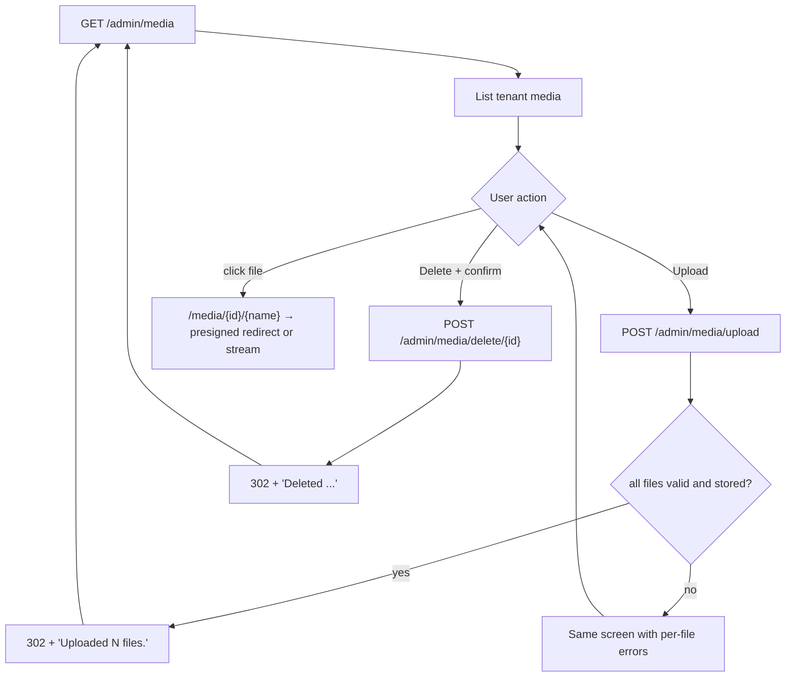

# Media

## Purpose

The media library of the active tenant: upload files, open or share their links, and delete them. Files are stored
in object storage through `IFileStorage` ([media storage](../features/media-storage.md)) - never in the deployment
directory. Used by every admin-capable role; what each role may do differs (see [Permissions](#permissions)).

## Route / Navigation

| Item | Value |
| --- | --- |
| Routes | `GET /admin/media`, `POST /admin/media/upload` (multipart), `POST /admin/media/delete/{id:guid}` |
| Public file URLs | `GET /media/{id}/{fileName}` - served by `MediaFilesController` ([download flow](../features/media-storage.md#download-flow)) |
| Navigation entry | Sidebar → **Main** → **Media** |
| Parameters / children | none |

## Relevant source files

```text
Areas/Admin/Controllers/MediaController.cs     list, upload, delete; permission checks; request size limits
Areas/Admin/Models/AdminViewModels.cs          MediaIndexViewModel (CanUpload, Files), MediaRowViewModel (+ Url, CanDelete)
Areas/Admin/Views/Media/Index.cshtml           upload panel, file table, delete forms (data-confirm)
Services/MediaService.cs                       upload/delete rules, allowed types, size cap, keys, audit
Controllers/MediaFilesController.cs            the /media/{id} links in the table
wwwroot/js/site.js                             data-confirm handler for the Delete button
```

## Page layout

```text
Media (_AdminLayout, title "Media")
├── Flash message                                    after an upload or delete
├── Validation summary                               one line per rejected file / problem
├── panel "Upload"                                   only when CanUpload
│   └── form (POST /admin/media/upload, multipart, antiforgery)
│       ├── Files *            input type=file multiple, accept = allowed extensions
│       ├── hint               "Up to 10 files, 25 MB each. Allowed: .jpg, .jpeg, ..."
│       ├── ☑ Public (anyone with the link)   checked by default
│       └── [Upload]
└── table.data: File (link) · Type · Size · Access · Uploaded · [Delete]      or panel "No media files yet."
```

## Components

| Component | Inputs | Behaviour |
| --- | --- | --- |
| Upload panel | `CanUpload` (`Media/create`), `MediaService.AllowedTypes`, `MaxFilesPerUpload`, `MaxUploadBytes` | posts `files` (1-10) and `isPublic` |
| File table | `MediaIndexViewModel.Files`, newest first | **File** links to `/media/{id}/{name}` (new tab); **Access** badge **Public** (ok) / **Private** (warn); **Size** in KB; **Uploaded** in `"u"` format |
| Delete button | `MediaRowViewModel.CanDelete` | inline POST form with `data-confirm="Delete this file? Links to it will stop working."` |

## Functionality

### Upload files

1. **Trigger:** choose up to 10 files, optionally untick **Public**, **Upload**.
2. **Validation:** `Media/create` permission (else `Forbid` → [Access denied](access-denied.md)); 1-10 files; the
   request limit (25 MB × 10 + 1 MB); per file in `MediaService`: not empty, ≤ 25 MB, extension in `AllowedTypes`.
3. **Service:** `MediaService.UploadAsync` per file: generated storage key, `IFileStorage.SaveAsync`, `MediaFile`
   row, audit `media.uploaded` ([upload flow](../features/media-storage.md#upload-flow)).
4. **Result:** all stored → redirect with "Uploaded N files."; any rejected → the same screen with one message per
   rejected file (accepted files are stored and listed).

### Delete a file

1. **Trigger:** **Delete** → browser confirm (site.js `data-confirm`).
2. **Validation:** file exists in the tenant (else 404); `Media/delete`, or `Media/delete.own` when the user uploaded
   it (else `Forbid`).
3. **Service:** `MediaService.DeleteAsync`: row removed, then the stored object; audit `media.deleted`.
4. **Result:** redirect with "Deleted '<name>'."; the file's link returns 404 from then on.

### Open a file

The **File** link opens `/media/{id}/{name}`: public files for anyone; private files only for admin-capable users of
this tenant. With S3 storage the browser is redirected to a short-lived presigned URL; with local storage the app
streams the file.

## Data used by the page

`MediaFiles` of the active tenant (projected: id, name, type, size, public flag, upload date, uploader); the user's
role claims for `CanUpload`/`CanDelete`; `MediaService` constants for the hint and `accept` list.

## State

Flash message (`TempData["Success"]`); `ModelState` errors after a failed upload; persisted rows and stored objects.

## Permissions

`AdminArea` policy for the screen. Actions use the `Media` permission area ([authorization](../features/authorization.md)):

| Action | Super Admin | Admin | Editor | Author |
| --- | :-: | :-: | :-: | :-: |
| View list | ✔ | ✔ | ✔ | ✔ |
| Upload | ✔ | ✔ | ✔ | ✔ |
| Delete | ✔ | ✔ | ✔ | own uploads only |

Buttons a user can't use are not rendered; the server re-checks on every POST.

## Validation

| Rule | Message |
| --- | --- |
| No file chosen | "Choose at least one file to upload." |
| More than 10 files | "Upload at most 10 files at a time." |
| Empty file | "'name' is empty." |
| Over 25 MB | "'name' is larger than 25 MB." |
| Extension not allowed (HTML, SVG, scripts, unknown) | "'name' has a file type that is not allowed." |
| Storage unavailable | "'name' could not be stored right now. Try again later." |

The content type is taken from the extension map, never from the browser. Requests over the size limit are rejected
by the server before model binding (error page).

## Error handling

| Failure | User sees | Recovery |
| --- | --- | --- |
| Validation | messages in the summary | fix and resubmit |
| Storage outage | per-file message; details in the server log | retry later |
| Missing permission | Access denied screen | - |
| Unknown id on delete | 404 | - |

## Loading behaviour

Server-rendered; the upload is a normal form post (the browser shows its own progress). No client-side upload
progress.

## Empty states

Panel "No media files yet."

## User interactions

File picker (multiple), checkbox, **Upload**, file links (new tab), **Delete** with confirmation.

## Dependencies

```text
MediaController
├── DotNetForgeDbContext
├── MediaService → IFileStorage, DotNetForgeDbContext, IAuditService, ILogger
└── AdminControllerBase (Can / CanModify → IPermissionService)
```

## Page flow



## Related pages

[Dashboard](dashboard.md) (media count), `GET /api/media` ([headless API](../features/headless-api.md)), the
download endpoint ([media storage](../features/media-storage.md#download-flow)).

## Important implementation details

- Storage keys never contain the uploaded file name; the name is only metadata (sanitized, ≤ 200 characters).
- Public/private is chosen at upload time and cannot be changed afterwards yet.
- Large uploads are buffered in the OS temp directory during the request ([deployment](../guides/deployment.md#read-only-deployment-requirements)).

## Known limitations

- No folders, search, tags, image variants, drag-and-drop, or public/private toggle after upload.
- Allowed types and size limit are constants in `MediaService`, not settings.
- No content sniffing or malware scanning (types are decided by extension; active formats are not allowed).
- Private files are visible to every admin-capable user of the tenant (no per-file grants).

## Planned (not implemented)

Target behaviour from the original product specification. Nothing in this section exists in the code unless marked ✔.
Data model, settings, roles and upload rules: [media storage → Planned](../features/media-storage.md#planned-not-implemented).

### Requirements

- Renamed **File Manager** in the sidebar (still under *Main*); a folder/document library for the active tenant.
- Layout (arrangement suggested here; the spec fixes the features, not the arrangement):

  ```text
  File Manager
  ├── toolbar: Upload (file picker, multiple) · New Folder · search box · filters · sort
  ├── breadcrumb: Root / Parent / Current       (every segment clickable)
  ├── drop zone (drag/drop upload into the current folder)
  ├── list/grid: subfolders, then files (name, type, size, tags, public/private, date)
  │   └── row actions: Download · Copy URL · Rename · Move · Public/Private · Access · Delete
  └── per-file upload results (accepted / rejected with reason / duplicate action taken)
  ```

- Image files show variant URLs (small/medium/large) when responsive upload is on.
- Settings for the library are on a separate *Settings → Global Settings → File Manager* screen.

### User flows

- **Browse**: open a folder → breadcrumb `Root / Parent / Current`; clicking a segment goes to that folder; the list
  shows the folder's subfolders and files.
- **Upload**: drag files onto the drop zone or pick files → each file is validated and processed independently →
  accepted files appear in the current folder; rejected files show their reason (type, size, unsafe, duplicate).
- **New folder / rename / move / delete folder**: *New Folder* asks for a name and creates it under the current
  folder; rename edits the name and refreshes breadcrumbs; move by drag or a *Move* action to a target folder;
  delete shows a warning for non-empty folders and lists in-use files first.
- **Public / private and access**: toggle *Public/Private*; when private, an *Access* dialog assigns roles and/or
  users (Super Admin/Admin only).
- **Search, filter, sort**: search term plus filters for name, type/MIME, tag, folder and date range, within the
  current folder scope and the user's access; sort by name, type, size or date, ascending/descending.
- **Delete file**: confirmation dialog; if the file is referenced by pages (type `File`) or content, the dialog lists
  the references and blocks or requires explicit confirmation.
- **Download / copy URL**: download streams the file; copy URL gives the stable file (or variant) URL.

### Rules and validation

- Folder name required and unique among siblings; errors shown inline in the dialog.
- The move dialog does not offer the folder itself or its descendants as targets.
- Authors only see rename/move/delete on files and folders they created; Editors and Authors do not see *Access*;
  Authors do not see *Public/Private* ([roles](../features/media-storage.md#roles)).
- All mutations are `POST` + antiforgery and audited; the screen never shows another tenant's files.

### Edge cases

- Batch upload with some rejected files: the accepted files still appear; rejected ones are listed with reasons ✔
  (`MediaController.Upload` stores the valid files and re-renders with one message per rejected file).
- Concurrent edit conflict on rename/move/delete: the user sees a conflict message and retries.
- Storage unreachable: upload fails with a clear error and the list still renders ✔ (`MediaService.UploadAsync`).

### Acceptance criteria

The screen-level criteria are part of the list in
[media storage → Acceptance criteria](../features/media-storage.md#acceptance-criteria) (upload by drag/drop and
picker, folders, clickable breadcrumbs, search/filter/sort, public/private, access grants, in-use delete warning).

## Extension points

See [media storage → Where to change things](../features/media-storage.md#where-to-change-things). When the screen
becomes the File Manager, update the sidebar label in `Areas/Admin/Views/Shared/_Sidebar.cshtml`,
[pages.md](../architecture/pages.md) and this document.
