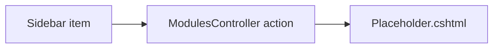

# Module placeholders

## Purpose

Sidebar items whose modules are specified but not built route to one shared placeholder screen, so the navigation
has no dead links. Each placeholder names the module, gives a one-line description and names the document that holds its planned
behaviour.

## Route / Navigation

All handled by `src/DotNetForge.Web/Areas/Admin/Controllers/ModulesController.cs`, rendered with `src/DotNetForge.Web/Areas/Admin/Views/Modules/Placeholder.cshtml`.

| Route | Action | Title | Sidebar location | Planned behaviour |
| --- | --- | --- | --- | --- |
| `/admin/marketplace` | `Marketplace` | Marketplace | Main | [extensions.md](../features/extensions.md#planned-not-implemented) |
| `/admin/content-history` | `ContentHistory` | Content History | Settings · Global Settings | [content-pages-and-routing.md](../features/content-pages-and-routing.md#planned-not-implemented) |
| `/admin/internationalization` | `Internationalization` | Internationalization | Settings · Global Settings | [internationalization.md](../features/internationalization.md#planned-not-implemented) |
| `/admin/transfer` | `Transfer` | Transfer | Settings · Global Settings | [transfer-and-updates.md](../features/transfer-and-updates.md#planned-not-implemented) |
| `/admin/webhooks` | `Webhooks` | Webhooks | Settings · Global Settings | [webhooks.md](../features/webhooks.md#planned-not-implemented) |
| `/admin/email/configuration` | `EmailConfiguration` | Email Configuration | Settings · Email → Configuration | [email.md](../features/email.md#planned-not-implemented) |
| `/admin/email/templates` | `EmailTemplates` | Email Templates | Settings · Email → Templates | [email.md](../features/email.md#planned-not-implemented) |
| `/admin/providers` | `Providers` | Authentication Providers | Settings · Users & Permissions Plugin | [authentication.md](../features/authentication.md#planned-not-implemented) |
| `/admin/advanced-settings` | `AdvancedSettings` | Advanced User Settings | Settings · Users & Permissions Plugin | [authentication.md](../features/authentication.md#planned-not-implemented) |

All are `GET` only, no parameters.

## Relevant source files

```text
src/DotNetForge.Web/Areas/Admin/Controllers/ModulesController.cs        one action per placeholder + Placeholder() helper
src/DotNetForge.Web/Areas/Admin/Models/AdminViewModels.cs               ModulePlaceholderViewModel (Title, DocPath, Description)
src/DotNetForge.Web/Areas/Admin/Views/Modules/Placeholder.cshtml        panel
src/DotNetForge.Web/Areas/Admin/Views/Shared/_Sidebar.cshtml            links
```

## Page layout

```text
<Title> (_AdminLayout)
└── panel
    ├── h2 <Title>
    ├── <Description>
    └── "This module is planned but not built yet. Its planned behaviour is documented in <DocPath> (section \"Planned (not implemented)\")."
```

## Components, functionality, data, state

Static content from `ModulePlaceholderViewModel`; no actions, no database access, no state.

## Permissions

`AdminArea` policy (any admin-capable role).

## Validation, error handling, loading, empty states, user interactions

Not applicable.

## Dependencies

`ModulesController` → `AdminControllerBase` only.

## Page flow



## Related pages

[Implementation status](../implementation-status.md) lists what foundation exists for each module.

## Important implementation details / known limitations

- What foundation exists differs per module: webhooks and auth providers have tables (the `HmacWebhookSigner` class
  exists but is not registered in DI); email has only the `IEmailSender` contract - no implementation is registered
  (the unused `FileSystemEmailSender` was removed); marketplace, content history, i18n and transfer have nothing.
  See [implementation status](../implementation-status.md).

## Extension points

To build one of these modules: delete its action from `ModulesController`, add a real controller following the
[admin-page skill](../../.claude/skills/admin-page/SKILL.md) on the same route, add `.docs/pages/<module>.md`,
and update [implementation-status.md](../implementation-status.md) and this table.
