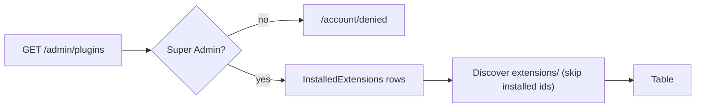

# Plugins

## Purpose

Lists every extension the CMS knows about - rows from the `InstalledExtensions` table plus every manifest
discovered under `extensions/` - with its manifest validity. Super Admin only. Read-only: there is no install,
enable, disable, configure, update or remove. Extension mechanics: [extensions](../features/extensions.md).

## Route / Navigation

| Item | Value |
| --- | --- |
| Route | `GET /admin/plugins` |
| Navigation entry | Sidebar → **Settings · Global Settings** → **Plugins** |
| Parameters / children | none |

## Relevant source files

```text
Areas/Admin/Controllers/AdminListControllers.cs   PluginsController
Areas/Admin/Models/AdminViewModels.cs             PluginRowViewModel
Areas/Admin/Views/Plugins/Index.cshtml            table
src/DotNetForge.Extensions/ExtensionLoader.cs     discovery (cached, FileSystemWatcher invalidation)
src/DotNetForge.Extensions/ManifestValidator.cs   validity
```

## Page layout

```text
Plugins (_AdminLayout, title "Plugins")
├── "Installed extensions and extensions discovered under the extensions/ folder. Invalid manifests are flagged and never loaded."
└── table.data: Name (+ id) · Version · Type · Status · Author · Manifest (valid/invalid) · Source
```

## Components

`PluginRowViewModel { Id, Name, Version, Type, Status, Author, ValidManifest, Source }`.

| Source | Row values |
| --- | --- |
| `installed` (from `InstalledExtensions`) | DB values; `ValidManifest = true` - **never occurs today** (table is never written) |
| `on-disk` (from `IExtensionLoader.Discover()`) | manifest values; `Status` always the literal `"Disabled"`; missing values shown as `(unknown)` / `-`; `Id` falls back to the folder name when the manifest has no id; `ValidManifest = discovered.IsValid` |

On-disk manifests whose id matches an installed row are skipped.

## Functionality

Display only.

## Data used by the page

`InstalledExtensions` (all) and the result of `IExtensionLoader.Discover()` - the loader is a singleton rooted at
`<contentRoot>/extensions` and caches the scan until a manifest file changes (see
[extension host → Important implementation details](extension-host.md#important-implementation-details)).

## State

None.

## Permissions

`AdminArea` + `[Authorize(Roles = "Super Admin")]`. Admins, Editors and Authors → [Access denied](access-denied.md).
(The spec allows Admins on this screen; the code doesn't - see [Planned](#planned-not-implemented).)

## Validation

The **Manifest** column is the result of `ManifestValidator`; the errors themselves are not displayed. To see
them, run the validator in a test or debugger.

## Error handling

Unreadable/invalid JSON is caught by the loader and shown as an **invalid** row with `(unknown)` name. File-system
exceptions other than `JsonException` (e.g. permission denied) propagate to the global error page.

## Loading behaviour

Server-rendered. The first visit after startup or after a manifest change scans the folder recursively and parses
every manifest; later visits reuse the cached result. Without a file watcher (e.g. the folder did not exist at
startup) every visit rescans.

## Empty states

"No extensions found." row when the table and the folder are empty. The repository ships nine samples.

## User interactions

None.

## Dependencies

```text
PluginsController → DotNetForgeDbContext, IExtensionLoader (singleton → IManifestValidator, FileSystemWatcher)
```

## Page flow



## Related pages

[Extension host](extension-host.md) (admin-type extensions as tabs), [Dashboard](dashboard.md) (counts
`InstalledExtensions` only), `GET /api/extensions` ([headless API](../features/headless-api.md)), Marketplace
[placeholder](module-placeholders.md) (planned: [extensions → Marketplace](../features/extensions.md#marketplace)).

## Important implementation details

- "Disabled" for on-disk rows is a literal, not state - admin extensions are shown as tabs regardless.
- Validation errors are computed but discarded by this screen.
- The listed `extensions/` folder is the one next to the running app: it is copied to the publish output
  (`DotNetForge.Web.csproj`, `CopyToPublishDirectory="PreserveNewest"`), so a published or containerized app lists
  the same samples. The folder is read-only at runtime; adding an extension means redeploying (or, in a writable
  development checkout, dropping in a manifest - the cache refreshes automatically).

## Known limitations

No lifecycle actions, no error details, no dependency checks, Super Admin only.

## Planned (not implemented)

Target behaviour from the original product specification. Nothing in this section exists in the code unless marked ✔.
Lifecycle rules, validation and guards: [extensions → Planned](../features/extensions.md#planned-not-implemented).

### Requirements

- Open to **Super Admin and Admin**; Editor, Author, Authenticated and Public denied.
- Lists every **installed** extension (`InstalledExtensions`), including disabled ones. Columns:

| Column | Source | Today |
| --- | --- | --- |
| Name | manifest `name` | ✔ |
| Description | manifest `description` (`InstalledExtension.Description`) | ✘ not shown |
| Version | installed `version` | ✔ |
| Type | manifest `type` | ✔ |
| Status | `Enabled` / `Disabled` (`InstalledExtension.Status`) | partly ✔ - on-disk rows show a literal `Disabled` |
| Author | manifest `author` | ✔ |
| Installed date | `InstalledExtension.InstalledDate` | ✘ |
| Update availability | newer version at the marketplace/update source (`InstalledExtension.UpdateAvailable`) | ✘ |

- An install entry point for a local package (upload or select); marketplace installs start from
  [Marketplace](../features/extensions.md#marketplace).

### User flows

Per-extension actions (each a POST with antiforgery, Super Admin/Admin only, audited):

| Action | Effect | Guard / failure shown to the user |
| --- | --- | --- |
| **Enable** | load and activate via `entryPoint` | missing/disabled dependency is named; incompatible core reports required vs current version |
| **Disable** | unload | refused (or explicit confirmation) while enabled extensions depend on it; warn/block when in use |
| **Configure** | edit the extension's `settings` | field-level validation messages |
| **Update** | apply the available newer version after validation | shown only when an update is available; failure keeps/restores the previous version |
| **Remove** | uninstall from `extensions/` | blocked with an explanation while depended on or in use (active theme, auth provider, connector); requires confirmation |

### Rules and validation

- A rejected install/update shows the specific validation reason (today errors are computed but discarded - see
  [Validation](#validation)).
- Two lifecycle actions on the same extension must not run concurrently.

### Acceptance criteria

- [ ] Lists every installed extension with Name, Description, Version, Type, Status, Author, Installed date and
  Update availability.
- [ ] Exposes Enable, Disable, Configure, Update and Remove actions per extension.
- [ ] Only Super Admin and Admin can open the screen and manage extensions; all other roles are denied (Admin is
  denied today by `PluginsController`).
- [ ] Every install, enable, disable, configure, update and remove action is recorded in the audit log.

## Extension points

- Show validation errors: add `IReadOnlyList<string> Errors` to `PluginRowViewModel` from
  `discovered.Validation.Errors`.
- Lifecycle (install/enable/disable): write `InstalledExtension` rows in a new service, audit with
  `AuditActions.PluginInstalled` / `PluginDisabled`, and make the admin tab list honour `Status`.
