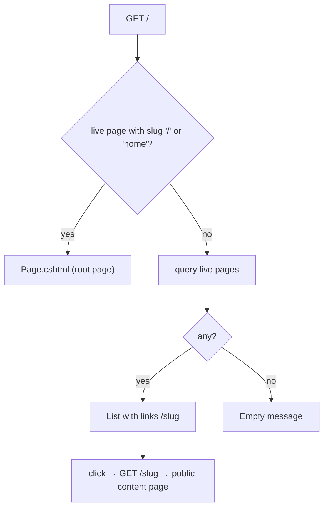

# Public home

## Purpose

The site root for anonymous visitors. If a live **root page** exists (slug `/`, or legacy slug `home`) it is
rendered like any content page; otherwise a fallback list of every live content page is shown. Routing and
liveness rules: [content pages and routing](../features/content-pages-and-routing.md#public-resolution).

## Route / Navigation

| Item | Value |
| --- | --- |
| Route | `GET /` (`[HttpGet("")]` on `HomeController.Index`) |
| Navigation entry | brand link in `_Layout`; "Return home" on the error screen |
| Parameters | none |
| Before install | redirected to `/setup` |

## Relevant source files

```text
src/DotNetForge.Web/Controllers/HomeController.cs     Index(), Live()
src/DotNetForge.Web/Views/Home/Page.cshtml            used when a root page is live (no layout, links src/DotNetForge.Web/wwwroot/css/page.css)
src/DotNetForge.Web/Views/Home/Index.cshtml           fallback list (uses _Layout)
src/DotNetForge.Web/Views/Shared/_Layout.cshtml       public layout: header (brand, Admin link), footer
src/DotNetForge.Web/wwwroot/css/site.css              .hero, .page-list, .public-header, .public-footer
src/DotNetForge.Web/wwwroot/css/page.css              styles of Page.cshtml (variant A)
src/DotNetForge.Web/Middleware/SecurityHeadersMiddleware.cs   CSP and other security headers on every response
```

## Page layout

Variant A - a live root page exists: identical to the [public content page](public-page.md) (styles from
`src/DotNetForge.Web/wwwroot/css/page.css`, no inline `<style>`).

Variant B - fallback list:

```text
Home (_Layout, title "Home · <APP_NAME>")
├── Header: <APP_NAME> (→ /) · Admin (→ /admin)
├── Hero: <APP_NAME>, tagline, "manage content from the admin area" link
├── "Published pages"
│   ├── list: <Title> (→ /<slug>) /<slug>     ordered by SortOrder
│   └── or "No pages have been published yet. Create one from the Content Manager."
└── Footer: "Powered by DotNetForge CMS · built on ASP.NET Core MVC (.NET 10)"
```

## Components

| Component | Inputs | Appears |
| --- | --- | --- |
| Hero | `ViewData["AppName"]` | variant B |
| Published pages list | model `List<(string Title, string Slug)>`, `ViewData["PublishedCount"]` | variant B, when count > 0 |
| Empty message | - | variant B, when no live pages |

## Functionality

### Render the root

1. Query live pages with slug `/` or `home`, ordering `/` first.
2. Found → `View("Page", home)`; `ViewData["AppName"]` is set but `Page.cshtml` doesn't use it.
3. Not found → query all live pages (title, slug) by `SortOrder` → `View(list)`.

No other actions.

## Data used by the page

`Page` rows (all tenants), `AppEnvironment.AppName`, `DateTime.UtcNow` for the liveness window.

## State

None beyond the request.

## Permissions

Anonymous; no permission system on the public site.

## Validation

Not applicable.

## Error handling

Database errors → global error handling. No custom states.

## Loading behaviour

Server-rendered; one or two queries per request; no caching.

## Empty states

Variant B with zero live pages shows "No pages have been published yet. Create one from the Content Manager." On a
fresh install the seeded `Home` page (slug `/`, published) is live, so variant A is shown.

## User interactions

Links only.

## Dependencies

```text
HomeController → DotNetForgeDbContext, AppEnvironment
SecurityHeadersMiddleware (first in the pipeline) → CSP, nosniff, X-Frame-Options, Referrer-Policy, Permissions-Policy
```

## Page flow



## Related pages

- Navigates to: [public content page](public-page.md), `/admin` ([Dashboard](dashboard.md) or [Sign in](login.md)).
- Receives navigation from: the [error screen](error.md), the brand link.
- Content is managed in the [Content Manager](content-manager.md).

## Important implementation details

- Queries ignore `TenantId` - pages of every tenant are candidates (single tenant only today).
- `Index` loads the root page in full with one query; the shape-only tree walk applies to
  [`RenderPage`](public-page.md#resolve-and-render), not to `/`.
- Every response carries the security headers of `SecurityHeadersMiddleware`; the CSP (`script-src 'self';
  style-src 'self'`, report-only in Development) means neither variant may use inline script or style - see
  [security](../features/security.md).
- The root lookup ignores `ParentPageId`: a nested page with slug `home` would be used as the root.
- The fallback list includes nested pages but links them as `/<slug>`, which 404s for anything below the top level
  (e.g. `Team` under `About` should be `/about/team`).

## Known limitations

- No menu (despite `DisplayInMenu`), no theme, no page content.
- Fallback list links are wrong for nested pages (above).

## Planned (not implemented)

Target behaviour from the original product specification. Nothing in this section exists in the code unless marked ✔.

### Requirements

- The root page and the fallback list come from the **active tenant** only, resolved by domain, subdomain or path
  prefix ([multi-tenancy](../features/multi-tenancy.md)).
- The root page follows the same rules as any content page: published builder content, per-page view permissions,
  page type behaviour, preview ([public content page → Planned](public-page.md#planned-not-implemented)).
- Public screens render with the page's theme/layout or the tenant default theme; `_Layout` is replaced by theme
  layouts ([themes](../features/themes.md#planned-not-implemented)).
- Generated menus list `DisplayInMenu` pages.
- With no matching content, the tenant's fallback/404 page is used.

Acceptance criteria: [content pages and routing](../features/content-pages-and-routing.md#acceptance-criteria),
[themes](../features/themes.md#acceptance-criteria).

## Extension points

- Root selection and the list query: `HomeController.Index`. Keep visibility rules in `HomeController.Live`.
- A public menu would read `DisplayInMenu` pages - add it to `_Layout` via a view component, not per view.
