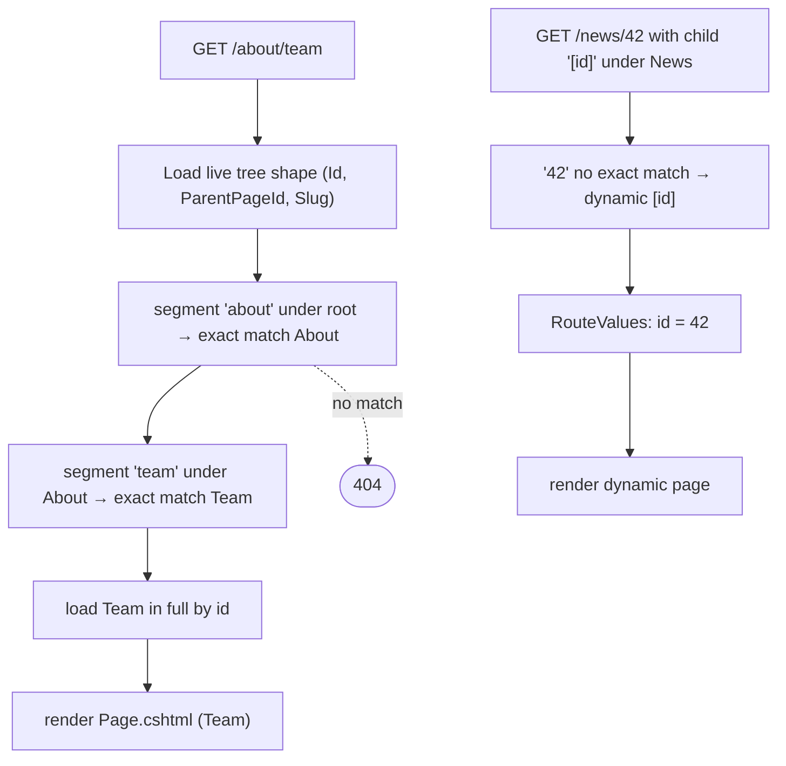

# Public content page

## Purpose

Renders a live content page for anonymous visitors at the URL formed by its slugs (e.g. `/about/team`), including
pages with a dynamic `[param]` segment. It is the frontend half of the [Content Manager](content-manager.md).
Rules: [content pages and routing](../features/content-pages-and-routing.md).

## Route / Navigation

| Item | Value |
| --- | --- |
| Route | fallback `{*path:nonfile}` → `HomeController.RenderPage` (any path without a file extension not matched by another route) |
| Route parameters | the URL segments; values captured by `[name]` slugs appear as `RouteValues` |
| Query parameters | none used |
| Navigation entry | links on the [public home](public-home.md) list; direct URLs |

## Relevant source files

```text
Program.cs                      app.MapFallbackToController("RenderPage", "Home")
src/DotNetForge.Web/Controllers/HomeController.cs   RenderPage(), Live()
src/DotNetForge.Web/Views/Home/Page.cshtml          standalone document (Layout = null), links page.css
src/DotNetForge.Web/wwwroot/css/page.css            styles of the standalone page (moved out of an inline <style>)
src/DotNetForge.Web/Middleware/SecurityHeadersMiddleware.cs   CSP and other security headers on every response
```

## Page layout

```text
<title> MetaTitle or Title
<meta name="description">        only when MetaDescription set
<link rel="canonical">           only when CanonicalUrl set
main
├── h1 Title
├── /<slug>
├── "Dynamic route parameters: name = value, ..."    only when a [param] segment matched
└── note: "This page is published, but it has no builder content yet ... Manage this page in the Content Manager"
```

## Components

The view is self-contained (no layout, no partials). Inputs: model `Page`, `ViewData["RouteValues"]`
(`Dictionary<string,string>`).

## Functionality

### Resolve and render

1. Trim slashes; an empty path redirects to `Index` (`/`).
2. Load the **tree shape only** - `Id`, `ParentPageId`, `Slug` - of all live pages (all tenants), as a projection.
3. Walk segments from the root level: exact slug (case-insensitive) first, else the `[...]` sibling; capture dynamic
   values.
4. Any segment without a match → `404` (empty body).
5. Load the matched (deepest) page in full by id (second query) and render `Page`.

## Data used by the page

`Page` (title, slug, meta title/description, canonical URL), captured route values. `SeoKeywords`, `PageType`,
`TargetUrl`, `FileReference`, `DisplayInMenu` are ignored.

## State

None.

## Permissions

Anonymous. Visibility is governed solely by liveness (`Published && !Disabled` + schedule window). No per-page
permissions.

## Validation

Not applicable (read-only). Slugs were normalized when saved.

## Error handling

| Case | Result |
| --- | --- |
| Unknown path / non-live page / non-live ancestor | `404` with empty body |
| Path with a file extension (e.g. `/about.html`) | not routed to this action - static file or `404` |
| DB failure | global error handling |

## Loading behaviour

Server-rendered; two queries per request: the `(Id, ParentPageId, Slug)` projection of every live page, then the
matched row. No caching.

## Empty states

Not applicable (a page always has a title).

## User interactions

The "Content Manager" link (`/admin/content`).

## Dependencies

`HomeController` → `DotNetForgeDbContext`, `AppEnvironment`. Every response passes `SecurityHeadersMiddleware`
(first in the pipeline).

## Page flow



## Related pages

- Receives navigation from: [public home](public-home.md).
- Links to: [Content Manager](content-manager.md).
- Shares rendering with: [public home](public-home.md) (root page uses the same view).

## Important implementation details

- The fallback is the lowest-priority endpoint: slugs equal to `admin`, `setup`, `account`, `api`, `error`, `health`
  are shadowed by real routes.
- Matching is case-insensitive; slugs are stored lower-case.
- A dynamic page matches **any** value; the value is displayed, not validated or looked up.
- The view links its own stylesheet `src/DotNetForge.Web/wwwroot/css/page.css` and does not use `site.css` or `_Layout`. It carries no
  inline `<style>` or script.
- Security headers on every response (`SecurityHeadersMiddleware`): `Content-Security-Policy` with
  `script-src 'self'; style-src 'self'` (report-only in Development), `X-Content-Type-Options: nosniff`,
  `X-Frame-Options: SAMEORIGIN`, `Referrer-Policy: strict-origin-when-cross-origin`, `Permissions-Policy:
  camera=(), microphone=(), geolocation=()`. `img-src`/`media-src` also allow any `https:` origin (presigned media
  URLs). Full policy: [security](../features/security.md).

## Known limitations

- `UrlRedirect` and `File` page types neither redirect nor serve a file.
- No content body, theme or layout selection; no 404 page.
- Children of the root page (`/`) are unreachable.
- Cross-tenant: pages of every tenant are matched.

## Planned (not implemented)

Target behaviour from the original product specification. Nothing in this section exists in the code unless marked ✔.

Model, rules and acceptance criteria: [content pages and routing → Planned](../features/content-pages-and-routing.md#planned-not-implemented)
(including [dynamic routes](../features/content-pages-and-routing.md#dynamic-routes)); theming:
[themes](../features/themes.md#planned-not-implemented).

### Requirements

| Area | Target | Today |
| --- | --- | --- |
| Tenant | resolve the tenant first (domain, subdomain or path prefix), then match only its content ([multi-tenancy](../features/multi-tenancy.md)) | every tenant's live pages are candidates |
| Resolution order | static content page → dynamic route (priority, sort order, specificity) → extension route → tenant fallback/404 page | tree walk with `[name]` fallback per segment, empty `404` |
| Page types | `UrlRedirect` redirects to `TargetUrl`; `File` serves or links the File Manager asset; `ExistingPage` renders the referenced page | all render `Page.cshtml` |
| Body | the published version's page-builder modules | fixed note |
| Theme | page theme/layout, else the tenant default theme; admin, setup and login never themed | `Layout = null`, fixed `page.css` |
| Access | public pages for everyone; private pages only for the granted roles/users | liveness only |
| SEO | meta title (fallback title ✔), meta description ✔, canonical ✔, keywords; dynamic routes render title/meta/keywords/canonical templates with parameter values, entry-level values override | keywords not rendered |
| Dynamic route values | resolve the target content, module or handler from the extracted parameters | values only displayed |
| Preview | the draft of a page or route renders for authorized users; never for anonymous visitors | ✘ |
| Menu | generated from `DisplayInMenu` pages | ✘ |

### Rules and validation

- A route or page that is disabled is skipped; an unpublished one resolves only in authorized preview, otherwise
  resolution continues to the next stage.
- A URL segment with an empty parameter value never matches.
- Template output is HTML-encoded (XSS-safe); a placeholder without a value renders empty/default, never an error.
- The admin area is never reachable through a public route.

### Edge cases

- Missing or disabled route target → next stage / 404, no exception; the route is flagged broken in the admin.
- Page theme uninstalled, incompatible or with missing assets → render with the tenant default (or built-in default)
  theme and log it ([themes](../features/themes.md#edge-cases)).
- File page whose asset was deleted cannot be published (broken-reference warning in the admin).

### Acceptance criteria

Tracked in [content pages and routing → Acceptance criteria](../features/content-pages-and-routing.md#acceptance-criteria)
and [themes → Acceptance criteria](../features/themes.md#acceptance-criteria).

## Extension points

- Page-type behaviour (redirect, file): branch in `HomeController.RenderPage` after a match, before `View(...)`.
- Rendering/theme: replace the `View("Page", ...)` call with a theme-aware view selection; keep resolution in the
  controller. Theme views must not use inline `<script>`/`<style>` or `style="..."` attributes (blocked by the CSP);
  ship them as files under `wwwroot` or the theme's assets.
- If resolution grows, move it (and `Live`) into a `src/DotNetForge.Web/Services/` class shared with `Index`.
