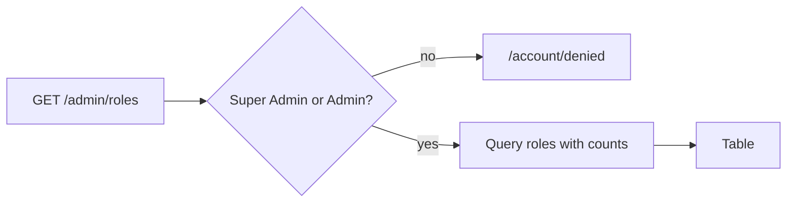

# Roles

## Purpose

Read-only overview of the RBAC roles in the active tenant: name, description, whether built-in, how many users hold
it and how many `(area, action)` grants it has. Used by Super Admins and Admins. Role semantics:
[authorization](../features/authorization.md).

## Route / Navigation

| Item | Value |
| --- | --- |
| Route | `GET /admin/roles` |
| Navigation entries | Sidebar → **Settings · Administration Panel** → **Roles**, and Sidebar → **Settings · Users & Permissions Plugin** → **Roles** (same URL; both highlight together) |
| Parameters / children | none |

## Relevant source files

```text
src/DotNetForge.Web/Areas/Admin/Controllers/AdminListControllers.cs   RolesController + nested RoleListItem record
src/DotNetForge.Web/Areas/Admin/Views/Roles/Index.cshtml              table
src/DotNetForge.Shared/Entities/Role.cs           Role, RolePermission, UserRole
src/DotNetForge.Data/DataSeeder.cs                built-in roles and grants
```

## Page layout

```text
Roles (_AdminLayout, title "Roles")
├── "RBAC roles for the active tenant. Built-in roles cannot be deleted or renamed."
└── table.data: Name · Description · Type (Built-in/Custom) · Users · Permissions
```

## Components

`RoleListItem(Name, Description, IsBuiltIn, Users, Permissions)` rows, ordered built-in first, then by name.
**Permissions** is the number of seeded `RolePermission` rows (e.g. Super Admin: 120 = 12 areas × 10 actions).

## Functionality

Display only - no create, edit, delete or assign actions exist anywhere. (The "cannot be deleted or renamed" note
describes the spec; nothing in the UI can modify any role.)

## Data used by the page

`Roles` of the active tenant with `UserRoles.Count` and `Permissions.Count` (translated to SQL subqueries).

## State

None.

## Permissions

`AdminArea` + `[Authorize(Roles = "Super Admin,Admin")]`. Editors and Authors are sent to
[Access denied](access-denied.md) - even though the sidebar shows them the link twice.

## Validation / error handling / loading

Not applicable / global only / one server-side query.

## Empty states

None handled (the table renders with no rows); in practice the six built-in roles always exist.

## User interactions

None.

## Dependencies

`RolesController` → `DotNetForgeDbContext`.

## Page flow



## Related pages

[Users](users.md) (role names per user), [Dashboard](dashboard.md) (count); spec placeholders
[Providers / Advanced Settings](module-placeholders.md) share the sidebar group.

## Important implementation details

- The **Permissions** count reflects stored rows, which are not used for authorization (see
  [authorization](../features/authorization.md#permission-matrix-reference-data)). Runtime checks that do use
  permissions - the [Content Manager](content-manager.md) and [Media](media.md) via `AdminControllerBase.Can` /
  `CanModify` → `IPermissionService` - evaluate the built-in `PermissionMatrix` for the user's role names.
- Role membership is read into the cookie at sign-in; a role change takes effect at the user's next sign-in.

## Known limitations

No role management (create custom role, edit grants, assign users) - see [Planned](#planned-not-implemented).

## Planned (not implemented)

Target behaviour from the original product specification. Nothing in this section exists in the code unless marked ✔.
Role model, default grants and invariants: [authorization](../features/authorization.md#planned-not-implemented).

### Requirements

- Holders of the **Roles** permission (default `Super Admin`, `Admin`) can: **create** a custom role (name,
  description, grants), **edit** a role (name, description, grants - built-in names are fixed), **duplicate** a role,
  **delete** a custom role, **assign users** to a role, **assign permissions** to a role.
- The list keeps the read-only **number of users** per role ✔.
- A role's **Permissions** tab shows the ten canonical permission areas (`PermissionAreas.Canonical`) with a toggle per
  granular action.
- Delete is not offered for built-in roles; grant editing is not offered for `Super Admin` and `Public`.
- Only a Super Admin may change the `Super Admin` role.
- Authorization must then evaluate stored `RolePermission` rows, not only `PermissionMatrix`, or custom roles have no
  effect.

### User flows

| Flow | Steps |
| --- | --- |
| Create role | **Create role** → Name (unique in tenant), optional Description → choose grants per area → save: validate name uniqueness and a well-formed grant set, persist in the active tenant → appears in the list with 0 users. |
| Duplicate role | **Duplicate** on a row → new role with the source's grants and a derived name (e.g. `Editor (copy)`) → edit name, description, grants → save. |
| Assign permissions | Open a role → **Permissions** tab → toggle actions per area → save. Rejected if it would reduce the actor's own role management below a safe threshold or leave no enabled Super Admin. |
| Delete role | **Delete** on a custom role → blocked while users hold it (prompt to reassign them first) → confirm → removed. |

Every change writes `role.changed` (create, edit, duplicate, delete, assign/unassign) or `permission.changed`
(grants); both constants ✔ exist in `AuditActions` but are never written.

### Rules and validation

- Name required, unique within the tenant (✔ unique index `(TenantId, Name)`); built-in names cannot be changed.
- Description optional; grant set required (may be empty); every grant must be a known `(area, action)`.
- Built-in roles (`IsBuiltIn` ✔) cannot be deleted; `Super Admin` grants cannot be reduced; `Public` cannot gain more
  than read-only public content.

### Edge cases

- **Role still has users:** deletion is blocked and the affected user count is shown; the delete flow may offer bulk
  reassignment.
- **Lowering your own permissions:** changes that strip the actor's own Roles/Users management, when that risks
  leaving the tenant without an administrator, are warned about and blocked. Removing one's own Super Admin role
  follows the last-Super-Admin rule.
- **Last enabled Super Admin:** no grant or assignment change may leave the system without one.
- **Concurrent edits** of the same role: optimistic concurrency, the second save gets a conflict notice and reloads.
- **Multi-tenant:** a role can only be deleted within its own tenant; cross-tenant references are validated first
  ([multi-tenancy](../features/multi-tenancy.md)).

### Acceptance criteria

- [ ] Users with the Roles permission can create, edit, duplicate and delete roles, assign users and assign permissions.
- [ ] Built-in roles cannot be deleted and their names cannot be changed (nothing can modify a role today; no `IsBuiltIn` guard exists).
- [ ] Deleting a role that still has users is blocked until those users are reassigned.
- [ ] Changes that would strip the actor's own role/user management in an unsafe way are blocked or warned.

## Extension points

Add role editing as new POST actions on `RolesController` (antiforgery + `AuditActions.RoleChanged` /
`PermissionChanged`), keep built-in roles immutable (`IsBuiltIn`), and decide whether authorization should then read
`RolePermission` rows (update [authorization](../features/authorization.md)).
