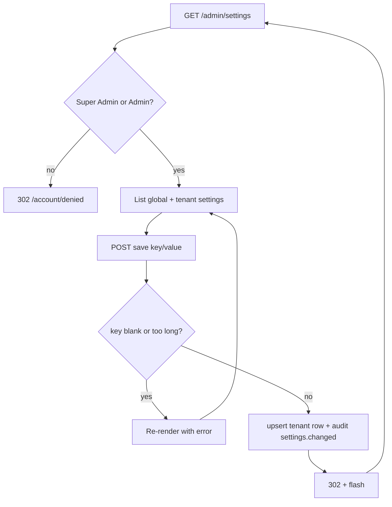

# Settings

## Purpose

A minimal key/value editor. It lists the settings visible to the active tenant (global rows + tenant rows) and lets
a `Super Admin` or `Admin` create or overwrite a **tenant-scoped** setting. No application code reads these settings
yet; they are readable through `GET /api/settings`.

## Route / Navigation

| Item | Value |
| --- | --- |
| Routes | `GET /admin/settings`, `POST /admin/settings/save` |
| Navigation entry | Sidebar → **Settings · Global Settings** → **Settings** |
| Parameters | none |
| Access | `Super Admin`, `Admin` only (the sidebar link is shown to every admin-capable role; others land on [access denied](access-denied.md)) |

## Relevant source files

```text
src/DotNetForge.Web/Areas/Admin/Controllers/SettingsController.cs   Index, Save, BuildAsync, MaxKeyLength / MaxValueLength
src/DotNetForge.Web/Areas/Admin/Models/AdminViewModels.cs           SettingsIndexViewModel
src/DotNetForge.Web/Areas/Admin/Views/Settings/Index.cshtml         table + add/update form
src/DotNetForge.Shared/Entities/SystemState.cs  Setting entity (same file)
src/DotNetForge.Web/Services/AuditService.cs                        settings.changed (via IAuditService)
```

## Page layout

```text
Settings (_AdminLayout, title "Settings")
├── Flash message                         after a save
├── note: "Key/value settings for <APP_NAME>. Global settings (no tenant) are read-only here; ..."
└── .content-layout
    ├── panel: table.data (Key · Value)   or "No settings yet."
    └── aside.panel "Add / update"
        ├── Validation summary
        └── Form (POST /admin/settings/save): Key*, Value, [Save setting]
```

## Components

| Component | Inputs | Behaviour |
| --- | --- | --- |
| Settings table | `SettingsIndexViewModel.Settings` (`(Key, Value)` list ordered by key) | read-only; global and tenant rows are indistinguishable |
| Add / update form | `key`, `value` (simple parameters) | posts to `SettingsController.Save` |

## Functionality

### Add or update a setting

1. **Trigger:** **Save setting**.
2. **Validation:** browser `required` on Key; server: key not blank (`Key is required.`); trimmed key ≤ 200 and
   value ≤ 4000 characters (`Keys are limited to 200 characters and values to 4000.`).
3. **Call:** `SettingsController.Save(key, value)`.
4. **Backend:** trims the key; finds a `Setting` with `TenantId` = active tenant and that key; creates it if missing;
   sets `Value` (untrimmed, may be empty/null); `SaveChangesAsync`; audit `settings.changed` (entity `Setting`, id and
   display = key - the value is not recorded).
5. **Result:** redirect to `/admin/settings`, flash `Saved '<key>'.`.
6. **Errors:** blank or too-long key/value → same screen with the message (the form fields are not re-filled).

There is no delete.

## Data used by the page

`Settings` where `TenantId == null || TenantId == active tenant`; `AppEnvironment.AppName`.

## State

Flash message (`TempData`), `ModelState` on failure. Persisted `Setting` rows.

## Permissions

`[Authorize(Roles = "Super Admin,Admin")]` on `SettingsController`, on top of the `AdminArea` policy. **Breaking
change:** `Editor` and `Author` previously had full access; they are now redirected to `/account/denied` (403
[access denied](access-denied.md)) for both the GET and the POST. Covered by
`SecurityTests.Editors_can_no_longer_change_settings`. The sidebar still shows the **Settings** link to every
admin-capable role.

## Validation

Key required (trimmed). Key ≤ 200 characters (after trimming), value ≤ 4000 characters - the column lengths, checked
before saving so PostgreSQL never rejects the insert. No key format, no duplicate warning.

## Error handling

| Failure | User sees |
| --- | --- |
| Blank key | "Key is required." in the summary |
| Key > 200 or value > 4000 characters | "Keys are limited to 200 characters and values to 4000." in the summary |
| Editor / Author opens or posts | redirect to `/account/denied` (403) |
| Other DB failure | global [error page](error.md) |

## Loading behaviour

Server-rendered; one query.

## Empty states

"No settings yet." - the normal state on a fresh install (nothing seeds settings).

## User interactions

Form submit; Enter submits.

## Dependencies

```text
SettingsController → DotNetForgeDbContext, AppEnvironment, IAuditService (AuditService)
```

## Page flow



## Related pages

[Dashboard](dashboard.md); API `GET /api/settings` ([headless API](../features/headless-api.md)). The other
"Global Settings" sidebar items are separate screens ([API Tokens](api-tokens.md), [Plugins](plugins.md)) or
[placeholders](module-placeholders.md).

## Important implementation details

- Saving a key that exists as a **global** row creates a tenant row with the same key; both then appear in the list
  (global rows cannot be edited here).
- Values are displayed HTML-encoded; there is no secret masking - don't store secrets here.

## Known limitations

- No delete, no typed settings, no grouping, no logo upload or overview diagnostics (see
  [planned](#planned-not-implemented)).
- No consumer of `Setting` rows in the application.

## Planned (not implemented)

Target behaviour from the original product specification. Nothing in this section exists in the code unless marked ✔.

### Requirements

**Global Settings → Overview** is the landing screen of the Global Settings group (today the sidebar entry is
labelled **Settings** and opens this key/value editor - see the
[sidebar differences](../architecture/pages.md#canonical-sidebar-tree-vs-_sidebarcshtml)). It shows read-only
diagnostics, two logo uploads, a **Check for updates** action, a system health indicator and the settings hub table.

**Overview diagnostics (read-only)**

| Field | Type | Spec source | Available in code today |
| --- | --- | --- | --- |
| CMS version | semver string | application assembly | `SystemState.CmsVersion` (DB row, default `1.0.0`) - shown on the [Dashboard](dashboard.md), not from the assembly |
| Available CMS updates | version or "Up to date" | update check service, links to [transfer and updates](../features/transfer-and-updates.md) | ✘ |
| C# language version | string | build/runtime | ✘ |
| ASP.NET Core version | string | runtime | ✘ |
| Database provider | `sqlite` \| `postgresql` | detected from `DATABASE_CONNECTION_STRING` | ✔ `AppEnvironment.Provider` (not displayed) |
| Environment | e.g. `Development`, `Production` | hosting environment | ✔ `IWebHostEnvironment.EnvironmentName` (not displayed) |
| Installed extensions | count (optional list) | extension registry ([extensions](../features/extensions.md)) | `InstalledExtensions` is never written; on-disk discovery is `IExtensionLoader.Discover` |
| System health | `Healthy` \| `Degraded` \| `Unhealthy` + per-check detail | health check service | ✘ (`GET /health` returns a static `ok`) |

Instance-wide facts (versions, provider, environment) are identical for every tenant; tenant-scoped settings and
branding reflect the active tenant only.

**Branding logos (the only editable inputs)**

| Field | Required | Shown on | Cleared → |
| --- | --- | --- | --- |
| Admin menu logo | no | admin sidebar/header (today the text "DotNetForge" in `_AdminLayout` `.admin-logo`) | built-in default |
| Authentication/login logo | no | sign-in and setup screens (`_AuthLayout`, today the app name) | built-in default |

Stored through the media subsystem (✔ uploads exist - `MediaService` + `IFileStorage`,
[upload flow](../features/media-storage.md#upload-flow); logo storage itself is not built), URL generated there,
reference saved in the settings store (`Setting`). The admin logo is the admin-area branding
override; public [themes](../features/themes.md) never affect it.

**Settings hub table** - one row per settings screen, linking to it:

| Screen | Group | Documented in |
| --- | --- | --- |
| Overview | Global Settings | this document |
| API Tokens | Global Settings | [API Tokens](api-tokens.md) |
| Content History | Global Settings | [Content Manager](content-manager.md) (placeholder today) |
| Internationalization | Global Settings | [internationalization](../features/internationalization.md) |
| File Manager | Global Settings | [media storage](../features/media-storage.md) |
| Plugins | Global Settings | [Plugins](plugins.md) |
| Transfer | Global Settings | [transfer and updates](../features/transfer-and-updates.md) |
| Webhooks | Global Settings | [webhooks](../features/webhooks.md) |
| Roles, Users, Audit Logs | Administration Panel | [Roles](roles.md), [Users](users.md), [Audit Logs](audit-logs.md) |
| Configuration, Templates | Email | [email](../features/email.md) |
| Roles, Providers, Advanced Settings | Users & Permissions Plugin | [Roles](roles.md), [authentication](../features/authentication.md) |

Marketplace is not part of the hub; it lives in the sidebar's **Main** group ✔
([extensions](../features/extensions.md)). A hub link is shown only to users holding the target screen's permission
area (e.g. `Webhooks`, `API`, `Media`, `Extensions`, `Users`, `Roles`).

**Permissions** (`Settings` permission area; see [authorization](../features/authorization.md))

| Action | `Super Admin` | `Admin` | `Editor`, `Author`, `Authenticated`, `Public` |
| --- | :-: | :-: | :-: |
| View Overview / Global Settings | ✔ | if granted `Settings` read | ✘ unless granted |
| Upload / change / reset either logo | ✔ | if granted `Settings` write | ✘ unless granted |
| Check for updates | ✔ | if granted `Settings` read | ✘ |
| Apply update / rollback | ✔ | only if explicitly granted | ✘ |
| Open a settings sub-screen | per that screen's permission area | same | same (`Authenticated`/`Public`: never) |

`Super Admin` has full access across all tenants; `Admin` is limited to assigned tenants. Today only `Super Admin`
and `Admin` can open this screen and save tenant settings (fixed role check, not the `Settings` permission area).

### User flows

| Flow | Steps |
| --- | --- |
| View overview | open **Settings → Global Settings → Overview** → resolve active tenant, check `Settings` read → load diagnostics → render read-only fields, current logos (or defaults), hub table, **Check for updates** |
| Upload admin menu logo | pick file → client checks type/size → server re-validates (type, size, safe-upload) → store via media subsystem, generate URL → save reference, audit → sidebar/header shows it immediately; public site unaffected |
| Upload login logo | same validation and storage → audit → sign-in and setup screens show it on next render |
| Remove / reset logo | clear the field and save → reference removed, surface reverts to the default → audit |
| Check for updates | **Check for updates** (or the **Available CMS updates** link) → query update service, compare with installed version → show newer version + link to the update workflow, which backs up first and supports rollback ([transfer and updates](../features/transfer-and-updates.md)) |
| Review degraded health | health shows `Degraded`/`Unhealthy` → expand → list of failing subsystems (database, storage, a failing extension) |

### Rules and validation

- Diagnostic fields are read-only; the two logos are the only inputs.
- Logo uploads: only image types allowed by the media configuration (e.g. PNG, JPEG, WebP - SVG is not on the
  `MediaService` allowlist), within the configured max upload size, passing safe-upload checks (type/size
  validation, scanning/blocking where possible). Validated on client and server; the server check is authoritative.
- Both logos are optional; clearing reverts to the built-in default.
- Never display secrets: show the provider, never `DATABASE_CONNECTION_STRING` ([configuration](../features/configuration.md#secrets)).
- Every successful global settings change (logo upload, logo reset, update action) is audited. Key/value saves are
  already audited ✔ (`settings.changed`).
- Permission checks run on every action on the server, not only in the UI.

### Edge cases

| Case | Target behaviour |
| --- | --- |
| Update available / none | Show the version with a link to the update workflow, or an explicit "Up to date" - never an empty value. |
| Update service unreachable | "Unable to check for updates" state; rest of the screen unaffected. |
| Health `Degraded`/`Unhealthy` | Show which checks failed; never silently report `Healthy`. |
| Oversized logo | Rejected with an error stating the limit; nothing partial stored. |
| Disallowed or unsafe file type | Rejected with a clear error; not stored. |
| Two admins upload a logo at once | Last successful save wins; both audited. |
| Logo reference points to a missing file | Surface falls back to the default logo, no broken image. |
| Active public theme | No effect on the admin logo or admin area. |
| `Settings` permission revoked mid-session | Subsequent saves/update actions denied server-side. |
| Multi-tenant | Instance-wide diagnostics identical across tenants; tenant settings and branding never leak between tenants ([multi-tenancy](../features/multi-tenancy.md#planned-not-implemented)). |

### Acceptance criteria

- [ ] The Overview shows CMS version, available updates, C# version, ASP.NET Core version, database provider,
  environment, installed extensions and system health.
- [ ] All diagnostic fields are read-only.
- [ ] The provider shown matches the configured database, and no connection string or secret is displayed.
- [ ] A user with `Settings` write can upload an admin menu logo, and it appears in the admin sidebar/header.
- [ ] A user with `Settings` write can upload a login logo, and it appears on the sign-in and setup screens.
- [ ] Clearing either logo reverts the surface to the built-in default.
- [ ] Logo uploads with a disallowed type or over the size limit are rejected with a clear message.
- [ ] Server-side validation rejects unsafe uploads even when client validation is bypassed.
- [ ] The hub table links to every settings screen (API Tokens, Content History, Internationalization, File Manager,
  Plugins, Transfer, Webhooks, Email, Administration Panel, Users & Permissions Plugin).
- [x] Marketplace is reachable from the admin **Main** menu - `_Sidebar.cshtml` → `/admin/marketplace`
  (`ModulesController.Marketplace`, placeholder screen).
- [ ] **Check for updates** reports an available version (with link) or "Up to date", and an error state when the
  check fails.
- [ ] System health shows `Healthy`/`Degraded`/`Unhealthy` with failing-subsystem detail.
- [ ] Users without the `Settings` permission cannot view or modify Global Settings - partly: only `Super Admin` and
  `Admin` can (`[Authorize(Roles = ...)]` on `SettingsController`), but by fixed role, not by `Settings` grants.
- [x] `Super Admin` has full access to Global Settings and every sub-screen - passes `AdminArea` and every
  controller `[Authorize(Roles = ...)]` (`AdminListControllers.cs`, `ApiTokensController`).
- [ ] Every successful global settings change (logo upload, logo reset, update action) is audited - only key/value
  saves exist and are audited.
- [ ] The admin menu logo and admin area are unaffected by any active public theme.
- [ ] Tenant context is resolved before rendering and tenant-scoped settings do not leak across tenants.

## Extension points

- A typed setting used by code: read it in a small service that queries `Settings` (tenant row first, then global)
  and register it in `DependencyRegistration`; don't query `Settings` from many controllers.
- Delete: add `POST /admin/settings/delete` with antiforgery and an audit entry.
