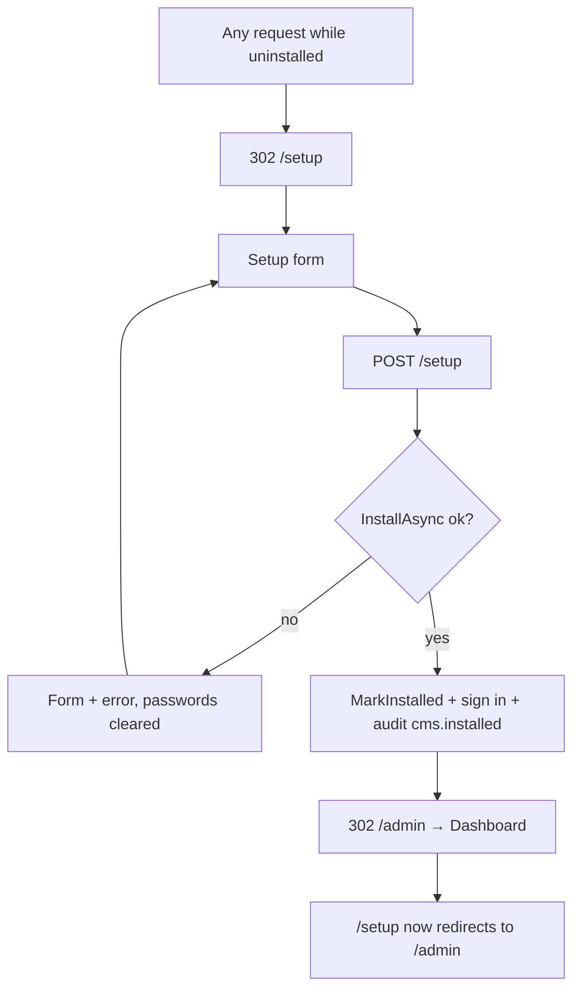

# Setup wizard

## Purpose

The first screen anyone sees on a fresh database. It creates the first administrator - assigned the `Super Admin`
role - marks the CMS **installed**, signs that user in and sends them to the admin. It exists only once: after
installation the route is permanently blocked. Used by whoever deploys the CMS. Feature-level behaviour (gate,
transaction, concurrency) is in [installation](../features/installation.md).

## Route / Navigation

| Item | Value |
| --- | --- |
| Route | `GET /setup`, `POST /setup` |
| Navigation entry | none - `InstallationMiddleware` redirects every non-static request here while uninstalled |
| After install | `/setup*` → `302 /admin` |
| On success | `302 /admin` |
| Query / route parameters | none |
| Rate limit | `POST /setup`: 10 requests per minute per client IP (policy `credentials`, shared with sign-in) → `429` |

## Relevant source files

```text
Controllers/SetupController.cs                   GET/POST actions, sign-in after install, cms.installed audit
Views/Setup/Index.cshtml                         the form (uses _AuthLayout)
Views/Shared/_AuthLayout.cshtml                  centered card layout
src/DotNetForge.Shared/Dtos/SetupRequest.cs      form model
src/DotNetForge.Core/Installation/InstallationService.cs   validation + user creation
src/DotNetForge.Core/Validation/PasswordPolicy.cs, InputValidation.cs (EmailValidator)
src/DotNetForge.Data/InstallationStore.cs        transactional persistence
Services/InstallationStatusCache.cs              flipped to installed after success
Services/AuthService.cs                          GetDefaultTenantIdAsync, signs the new admin in
Services/AuditService.cs                         cms.installed (via IAuditService)
Middleware/InstallationMiddleware.cs             the gate that routes users here
Startup/DependencyRegistration.cs                credentials rate-limit policy
```

## Page layout

```text
Setup (_AuthLayout, title "Setup · <APP_NAME>")
└── Auth card
    ├── <APP_NAME> brand
    ├── "Welcome - let's get set up" + explanation (account becomes Super Admin)
    ├── Validation summary
    └── Form (POST /setup, antiforgery)
        ├── First name · Last name          optional
        ├── Email*                          type=email
        ├── Password*                       + hint "At least 8 characters, including a letter and a number."
        ├── Confirm password*
        └── [Create admin & install]
```

## Components

| Component | Purpose | Inputs / outputs | Behaviour |
| --- | --- | --- | --- |
| Setup form | collect the first admin | binds `SetupRequest` (`FirstName`, `LastName`, `Email`, `Password`, `ConfirmPassword`) | posts to `SetupController.Index(SetupRequest)` |
| Validation summary | show the single failure message | `ModelState` | empty until a failed POST |

## Functionality

### Create the first admin and install

1. **Trigger:** **Create admin & install**.
2. **Validation:** rate limit (10/min per IP, before the action); browser `required`/`type=email`; server
   `InstallationService.InstallAsync` (already installed, email format and ≤ 256 characters, first/last name ≤ 100
   characters each, password policy, confirmation match) - see
   [validation table](../features/installation.md#validation-in-order).
3. **Service:** `IInstallationService.InstallAsync` → `IInstallationStore.InstallFirstAdminAsync`.
4. **Data:** a `User` (trimmed email/names, PBKDF2 hash, `Enabled`, `EmailConfirmed = true`) + `UserRole`
   (`Super Admin`), `SystemState.Installed = true`, `InstalledAtUtc = now` - one transaction.
5. **Then:** `InstallationStatusCache.MarkInstalled()`; `AuthService.GetDefaultTenantIdAsync` +
   `AuthService.ValidateAsync` with the submitted credentials; cookie sign-in (and `HttpContext.User` set) when it
   succeeds; audit `cms.installed` (entity `User`, id = new user's id, display = trimmed email), so the entry carries
   the new Super Admin and the tenant.
6. **UI:** `302 /admin` → [Dashboard](dashboard.md).
7. **Errors:** any failure re-renders the form with the message; **both password fields are cleared**, other fields
   kept.

## Data used by the page

`AppEnvironment.AppName` (`ViewData["AppName"]`), `SetupRequest`, the oldest `Tenant`, the seeded `Super Admin`
role, `SystemState`.

## State

Form values (posted model) and `ModelState` for one request. Persisted: the new user and the installed flag.
In memory: `InstallationStatusCache` becomes `true` for the rest of the process lifetime.

## Permissions

Anonymous. Reachable only while uninstalled; afterwards everyone is redirected to `/admin` (where they must sign
in). No other permission logic.

## Validation

See [installation → Validation](../features/installation.md#validation-in-order). Length limits match the `User`
columns and are checked before saving: email ≤ 256 (`A valid email address is required.`), first and last name
≤ 100 each after trimming (`First and last name must be at most 100 characters.`). Names are optional.

## Error handling

| Failure | User sees | Recovery |
| --- | --- | --- |
| Validation | message in summary, passwords cleared | correct and resubmit |
| More than 10 POSTs per minute from one IP | `429` with an empty body | wait a minute |
| Another setup committed first | "The CMS is already installed." | next request is redirected to `/admin`; sign in |
| Seed missing (no tenant / role) | "The default tenant has not been seeded." / "The Super Admin role has not been seeded." | restart (seeding runs at startup) |
| Sign-in after install fails (should not happen) | redirected to `/admin` → login screen | sign in manually |

## Loading behaviour

Single synchronous POST; PBKDF2 hashing (120 000 iterations) runs twice (hash + verify during sign-in) so the
submit takes noticeably longer than other forms. No indicator.

## Empty states

Not applicable.

## User interactions

Form submit only. Enter submits.

## Dependencies

```text
SetupController
├── IInstallationService → InstallationService
│   ├── IInstallationStore → InstallationStore → DotNetForgeDbContext
│   └── IPasswordHasher → Pbkdf2PasswordHasher
├── InstallationStatusCache
├── AuthService (default tenant, sign-in)
├── IAuditService → AuditService
└── AppEnvironment
```

## Page flow



## Related pages

- Navigates to: [Dashboard](dashboard.md).
- Receives navigation from: every URL while uninstalled (middleware).
- Shares functionality with: [Sign in](login.md) (`AuthService`, `_AuthLayout`).

## Important implementation details

- Installation is audited as `cms.installed` (shown on [Audit Logs](audit-logs.md)).
- The new user belongs to the **oldest** tenant.
- `.env` is not edited here; configuration must already be valid for the process to start. Outside Development
  that means an explicit `DATABASE_CONNECTION_STRING` (SQLite: absolute `Data Source`) and, for local storage, an
  absolute `STORAGE_LOCAL_PATH` - nothing may default to a path inside the read-only deployment directory, otherwise
  the process exits with a `ConfigurationException` before this screen is reachable. See
  [deployment → read-only deployment requirements](../guides/deployment.md#read-only-deployment-requirements) and
  [environment variables](../guides/deployment.md#environment-variables).
- Setup itself writes nothing to the deployment directory (verified by
  `ReadOnlyDeploymentTests.A_full_session_writes_nothing_into_the_content_root`, which POSTs `/setup`).
- Two simultaneous setups with different emails can both commit on PostgreSQL (read-committed transaction, no
  concurrency token on `SystemState`), creating two Super Admins.
- The confirmation comparison is ordinal (case-sensitive); the email is trimmed but not lower-cased - the admin must
  later sign in with the same casing.

## Known limitations

- Single step; no database check, site name or locale fields from the spec
  ([installation → Planned](../features/installation.md#planned-not-implemented)).
- Rate limits are per instance (in memory).

## Extension points

- New setup fields: add to `SetupRequest`, validate in `InstallationService`, persist in
  `InstallationStore.InstallFirstAdminAsync` (inside the transaction), render in `Views/Setup/Index.cshtml`.
