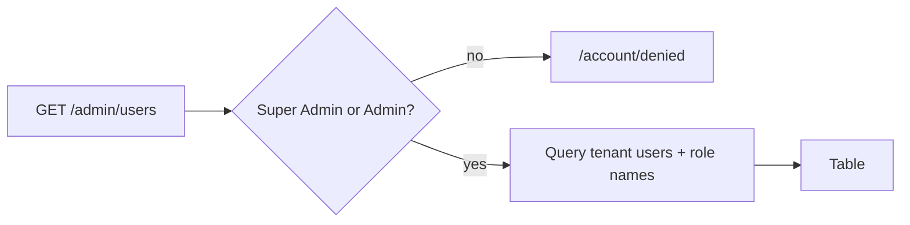

# Users

## Purpose

Read-only list of user accounts in the active tenant with their roles, status and last sign-in. Used by Super
Admins and Admins to see who has access. After a fresh install it contains only the Super Admin created by
[Setup](setup.md).

## Route / Navigation

| Item | Value |
| --- | --- |
| Route | `GET /admin/users` |
| Navigation entry | Sidebar → **Settings · Administration Panel** → **Users** |
| Parameters / children | none |

## Relevant source files

```text
Areas/Admin/Controllers/AdminListControllers.cs   UsersController + nested UserListItem record
Areas/Admin/Views/Users/Index.cshtml              table
src/DotNetForge.Shared/Entities/User.cs           entity
```

## Page layout

```text
Users (_AdminLayout, title "Users")
├── "Users with access to this tenant."
└── table.data: Email · Name · Roles · Status · Last login
```

## Components

`UserListItem(Email, Name, Status, LastLogin, Roles)` rows ordered by email. **Name** = first + last name trimmed
(blank if neither). **Roles** = comma-joined role names. **Status** badge: `Enabled` → ok, otherwise warn.
**Last login** in `"u"` format or "never".

## Functionality

Display only - no invite, create, edit, disable, delete, role assignment or password reset.

## Data used by the page

`Users` of the active tenant with `UserRoles → Role.Name`.

## State

None.

## Permissions

`AdminArea` + `[Authorize(Roles = "Super Admin,Admin")]`; others → [Access denied](access-denied.md).

## Validation / error handling / loading

Not applicable / global only / one server-side query.

## Empty states

None handled; at least the installing admin exists.

## User interactions

None.

## Dependencies

`UsersController` → `DotNetForgeDbContext`.

## Page flow



## Related pages

[Roles](roles.md), [Dashboard](dashboard.md), `GET /api/users` ([headless API](../features/headless-api.md)).

## Important implementation details

- `LastLoginDate` is updated by `AuthService` on each successful sign-in.
- Lockout state (`FailedLoginCount`, `LockoutEndUtc`) is not shown.
- A user whose `Status` is changed to anything but `Enabled` (or whose row is deleted) - today only possible in the
  database - loses their admin session within 30 seconds: the cookie's `OnValidatePrincipal` calls
  `AuthService.IsActiveAsync` (cached 30 s per user) and signs them out ([sign in → State](login.md#state)).
  Role changes still take effect only at the next sign-in.

## Known limitations

No user management at all (see [Planned](#planned-not-implemented)); the only way to add users today is direct
database access or code.

## Planned (not implemented)

Target behaviour from the original product specification. Nothing in this section exists in the code unless marked ✔.
Role model, field rules and invariants: [authorization](../features/authorization.md#planned-not-implemented).

### Requirements

- Holders of the **Users** permission (default `Super Admin`, `Admin`) can: list users with roles, status and last
  login ✔; **create**, **edit**, **disable**, **delete** users; **assign roles**.
- The screen lists every user with access to the admin of the active tenant.
- Only a Super Admin may create, edit, disable or delete a Super Admin user, or assign the `Super Admin` role.
- Effective permissions of a user are the union of its roles; the screen surfaces them when roles are combined.

### User flows

| Flow | Steps |
| --- | --- |
| Create user | **Create user** → First name, Last name (optional), Email (required, unique), Password (`PasswordPolicy`), one or more Roles, Status (default `Enabled`) → save: validate email format/uniqueness and password, hash with `IPasswordHasher`, set `CreatedDate`. |
| Edit user | Open a user → change details and role assignments → save (same validation; password optional). |
| Assign roles | Open a user → add/remove roles → save. Blocked if it removes the last enabled Super Admin or produces a disallowed conflicting assignment. Audited as `role.changed`. |
| Disable user | Set Status to `Disabled` (form or list action) → save. Blocked for the last enabled Super Admin and for the actor's own account. The user can no longer sign in (✔ `AuthService` rejects `Disabled`) and its active sessions end on the next request (✔ within 30 s, `AuthService.IsActiveAsync`). |
| Delete user | **Delete** → confirm. Blocked for the last enabled Super Admin and the actor's own account. Audit entries written by the user are kept (✔ `AuditLogEntry.UserId` has no foreign key; `UserDisplaySnapshot` keeps the name). |

### Rules and validation

- Required: Email, Password (on create), at least one role, Status (`Enabled` / `Disabled`).
- Email: valid format (`EmailValidator`), unique within the tenant (✔ unique index `(TenantId, Email)`).
- Password: `PasswordPolicy`; never displayed, returned or logged.
- Every POST: antiforgery and an audit entry ([audit logging](../features/audit-logging.md#planned-not-implemented)).

### Edge cases

- **Last enabled Super Admin:** disabling, deleting or removing its `Super Admin` role is rejected with a clear error.
- **Own account:** a user cannot disable or delete itself through this screen (prevents self-lockout).
- **Conflicting roles:** effective permissions are the union; semantically conflicting combinations (a restricting
  role plus one granting the same area) are flagged and the resulting effective permissions are shown.
- **Active sessions:** disabling a user invalidates its sessions on the next request (✔ within 30 s -
  `DependencyRegistration.ValidateSessionAsync`; role changes are not re-read). API tokens are separate credentials
  ([API tokens](api-tokens.md)).
- **Duplicate email** on create or edit: validation error, no partial user is written.
- **Concurrent edits** of the same user: optimistic concurrency with a conflict notice
  ([authorization](../features/authorization.md#edge-cases)).

### Acceptance criteria

- [ ] The Users screen lists users and supports create, edit, disable, delete, assign roles, view last login and view account status (list, last login and status ✔ `UsersController`).
- [ ] A user cannot disable or delete their own account.
- [ ] Conflicting multi-role assignments resolve to the union of permissions and display the resulting effective permissions.

## Extension points

User creation belongs in a service (hash with `IPasswordHasher`, validate with `PasswordPolicy`/`EmailValidator`,
respect the `(TenantId, Email)` unique index), called from new POST actions on `UsersController`, audited with new
`AuditActions` constants.
